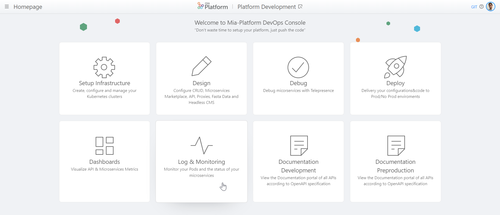

# v5.7.2 (May 26,2020)

## Improvements

* **API Portal**     
    Using the new button *Download Schemas* you will be able to **download your API specification** in *OpenAPI 3* or *Swagger 2* format.

    

* **Console Menu**        
    The **Documentation** menu item will not be displayed in the DevOps Console drawer menu for projects that does not have it.

## Fixed

* **Branch**      
    Resolved an issue affecting **branch loading** when selecting the DevOps Console **Design** area.

* **Console Homepage**     
    **Homepage cards** have been restyled to avoid displaying a cut shadow below the card when hovering with the mouse.

    

* **Resize alignment and reading improvement** of columns in the Pre/Post section of DevOps Console.

## Marketplace
New Examples have been published:

* **springboot-hello-world-example**: example that uses the Mia Platform Custom Plugin Java. [Here](https://github.com/mia-platform-marketplace/springboot-hello-world-example) you can learn more about this example.

* **python-falcon-hello-world-microservice-example**: simple python example using falcon framework. [Here](https://github.com/mia-platform-marketplace/python-falcon-hello-world-microservice-example) you can learn more about this example.

* **python-tornado-hello-world-microservice-example**: simple python example using tornado framework. [Here](https://github.com/mia-platform-marketplace/python-tornado-hello-world-microservice-example) you can learn more about this example.

* **rust-hello-world-example**: simple Hello World application. [Here](https://github.com/mia-platform-marketplace/rust-hello-world-example) you can learn more about this example.

* **cpp-oatpp-hello-world-microservice-example**: simple example of application in C++ that uses Oat++. [Here](https://github.com/mia-platform-marketplace/cpp-oatpp-hello-world-microservice-example) you can learn more about this example.

## How to update your DevOps Console?

In case of on-premise Console, to use these features, you have to update:

 * Console website @1.21.0      
 * Console backend @1.21.0      
 * Infrastructre Website @1.3.1      

Moreover, you have to set the following Feature Toggles to `true`:

 * `FT_ENABLE_CREATE_CONFIG_MAP_CUSTOM_SERVICE`      
 * `FT_ENABLE_CREATE_PROJECT_ON_INFRASTRUCTURE_WEBSITE`     
 * `FT_ENABLE_CRONJOB`     
 * `FT_ENABLE_INFRASTRUCTURE_WEBSITE`     
 * `FT_ENABLE_MICROSERVICE_GATEWAY_SKIP`     
