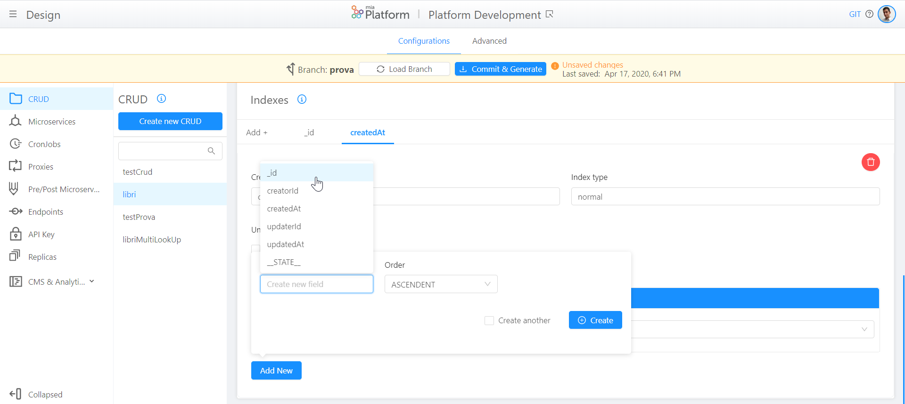
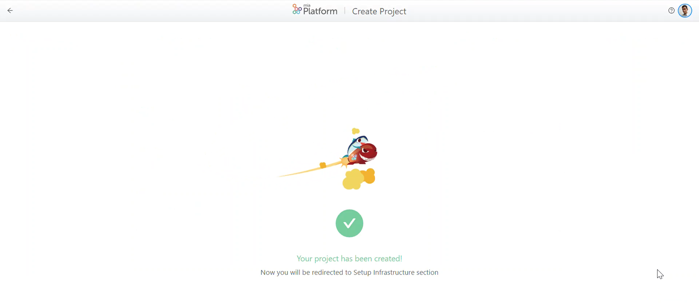
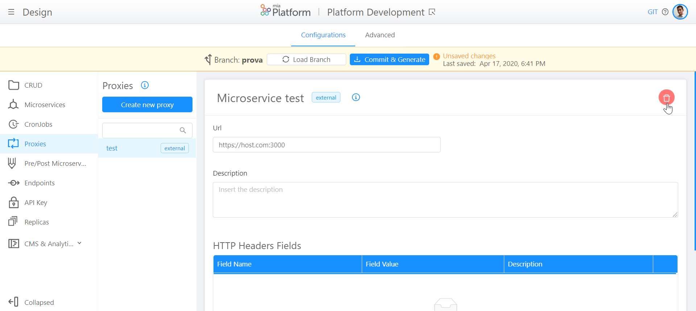
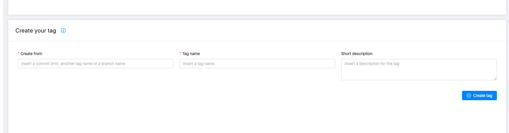
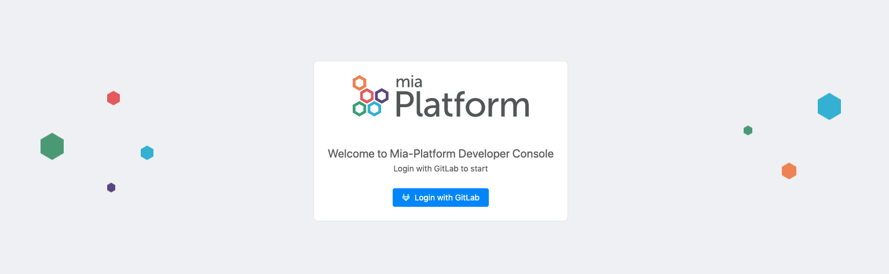

# Platform Release Note

## v5.6.2 (May 12,2020)

**New Features**

**Improvements**

* *Design*       
  **Restyling** of spaces in the Search bar in each section of Design area and the width of the input of each form.

**Fixed**

* *CMS*     
  Now it is possible to **export all the records** from CMS without any limitation of number.

* *CMS*     
  **CRUD-Service does not go in error** if the new property 'groups' of the CRUD 'cmsmenu' does not exist while you are editing a 'cmsmenu' filter based on groups.

* *CMS*     
  **Logout from CMS is enabled** and returns a feedback in case of error.

## v5.6.1 (May 5,2020)

!!! bug

     If you have configured 'cmsmenu' CRUD, due to an error in crud-service the menu items will not be shown in CMS unless you manually add 'groups' property. The bug will be fixed in v5.6.2.

**New Features**

* *Design - CRUD*    
  In the CRUD section, you can add and edit a property of an index by **selecting it from a list of available properties**.
  
  

* *CMS & Analytics*    
  In the CMS section, now it is possible to **filter by groups**, not only the pages attached to a CRUD, but also the micro frontends inserted in the Console.

* *Design - Microservice*       
  In Microservice Configuration section, you can now **manage Log Parser**: you can select which tool will be used by the platform to parse your microservice logs.


**Improvements**

* *Create Project*   
  At the end of project creation, an animation will **celebrate its success**!

    

* **Alignment** of Mia Platform logo position and **restyling** of the collapsed and expanded Launcher menu on the Console.

**Fixed**

* *Design - Proxies*     
  Reinstatement of the 'delete' button in the detail of each Proxy in order to allow you to **delete proxies** from DevOps Console.   

  

!!! warning

     By deleting a Proxy, you are also deleting the associated Endpoints, but not the generated configuration: you will have to manually delete it.

* *Projects*       
  **Filters applied to the projects in the Home section of DevOps Console are cleaned** when, after having selected a project, you go back to the Home section. In this way, it is clear that you have not lost some projects that are not included in the filter.
 
* If the **creation of a tag** is not successful, the error presented is complete and not cut: you will be able to understand the issue.

**How to update your DevOps Console?**

In case of on-premise Console, to use the previous features, you have to update:  

* Console webiste @1.18.0

* Console backend @1.18.1

* Infrastructure website @1.2.2


## v5.6.0 (April 27,2020)

**Project Creation**

This new feature enables you to **create a new project**, which lifecycle can be completely managed through the different areas of DevOps Console.

 With the button 'create project' in the Home section of DevOps Console, you can now **create your project in a few clicks** and in a short amount of time!


!!! warning

    To create a project, you need to have already set up your DevOps Console and have the following prerequisites configured:     
      - Tenant     
      - Template       

You can find more details about project creation at this [link](https://docs.mia-platform.eu/development_suite/set-up-infrastructure/create-project/) of Mia Platform Docs.

## v5.5.3 (April 22,2020)

**Improvements**

* *API Portal*      
  Now API Portal is **OpenAPI v3** compliant: all microservice swaggers are converted to OpenAPI v3 automatically. Moreover, APIExplorer has been integrated by adding support for *anyOf*, *oneOf*, *allOf* and *not* schemas. API-Portal service has been **updated to version 1.9.0**.

* *Home*    
  Now you can **select your favourite projects** by marking them with the new 'star' button!

  

* **Restyling** of the following sections, introducing the card component: Replicas, API Key and CMS & Analytics.

* Improved **padding and scrolling** of cards and grids in order to enhance their correct visualization.

**Fixed**

 * *Branches*    
  Changes, done from two different people on the same branch, are **no more overwritten**. This fix solves the overwrite case in which one person is modifying an advanced file and the other one is modifying a general configuration on the same branch.

 * *API Portal*   
  In the section 'Request' of each method, the message **shows the complete string**, and not only string ID. 

    

* *Branch Selection*     
  During the choice of the Branch, before entering the Design area, the button 'cancel' is **no more selectable with the 'Tab' key** of your keyboard.

* *Design - CRUD*     
  In the detail of each CRUD, the creation of an index with more than one field does **not comprimise anymore CRUD configuration**.

* *CMS*     
  The 'export' functionality allows you to **download all the records**: there is no more a limit to the number of records to download. Moreover, Crud service has been **updated to version 2.1.4**.

**How to update your DevOps Console?**     
In case of on-premise Console, to use the previous features, you have to update:   

 * Console website @1.17.2

 * Console backend @1.17.1

 * Deploy website @1.0.9

 * Infrastructure website @1.2.0

 * Env var service @1.0.1


## v5.5.2 -1 Patch (April 10,2020)

!!! bug
    **Design page of DevOps Console was inaccessible cause by an update of GitLab**

    With GitLab version 12.9.2 file_path beginning with `/` failed. With this problem, the configuration files of the advanced services cannot be downloaded, so the Design area is inaccessible.

**Fixed**

Remove initial `/` to `file_path` on requesting file to gitlab


## v5.5.2 (April 9, 2020)

**Improvements**

* Design - Microservices  
  When a microservice is created using one of Mia-Platform templates or example, **the probes of that service are already compiled** and contactable by Kubernetes.

   

* Restyling of the following section, introducing the card component: Proxies, Create New Endpoint, API Pre/Post

**Fixed**

* **Microservice Gateway Bug in v5.5.1**  
  To resolve it we have updated the following platform components:  

    * cms-backend  v2.0.1 we changed the /client-key response code from 200 to 204;
    * Microservice Gateway v5.1.5 no longer returns status code 500 if a service replies with status code 204. 
  
    !!! WARNING
        It is a breaking change for api returning 200 with an empty content-type when `allowUnknownResponseContentType` in microservice-gateway configuration is set to true.

    * auth-service v1.6.4 returns 204 on API /logout

* Fix to the menu hover with filters that did not make the text readable

##v5.5.1 (April 6,2020)

!!! Bug  
    **Microservice-gateway returns 500** if endpoints return 200 without a response body or 204 with `allowUnknownResponseContentType` to false  
    Fixed in v5.5.2

 
**Improvements**:

* Design - Microservices  
  New you go directly to your git Repository from the DevOps Console selection **"View Repository" button** in microservice detail page.  
  Pay Attention: This button is present only in microservices created from Templates.
       
  At this [link](https://docs.mia-platform.eu/development_suite/api-console/api-design/services/), you can find more details about microservices management.

* Auth0 - CMS  
  For each environment, CMS is able to **manage separated users on Auth0Client**: in other words, "Development" users can be seen only on Development environment and "Pre Production" users can be seen only on Pre Production environment. This feature is deployed with the version v2.3.0 of Auth0Client.

* Log & Monitoring  
  In the detail of each Pod, the user experience beyond the buttons "Refresh Logs" and "Restart Pod" has been improved.     
      
  At this [link](https://docs.mia-platform.eu/development_suite/monitoring/monitoring/), you can find more details about Logs and Pods Monitoring.

* Design - Microservices  
  Restyling of the card of microservice, created from Template or from Docker Image.

**Fixed**:

* Microservice Gateway 5.1.3  
  Now Microservice Gateway is able to manage the **error created when content-type is not correct**.


## v5.5.0 (March 31,2020)

**Improvements**

* Design - Microservices  
  During Microservice creation, **default values for GroupName are created**.  
  The initial selection of GroupName is on "Services", but, if needed, it can be changed.     
        
  At this [link](https://docs.mia-platform.eu/development_suite/api-console/api-design/custom_microservice_get_started/), you can find more details about microservice creation from Template.

* Design - Microservices  
  Now you can **clone code repository directly from DevOps Console** selecting Clone button on Microservice design page. Clone supports both ssh and https.  
  Pay attention: this button is present only in microservices created from DevOps Console.    
      
  At this [link](https://docs.mia-platform.eu/development_suite/api-console/api-design/services/), you can find more details about microservices management.

**Fixed**

 * Design    
   **Titles in the Launcher** are not aligned with the titles of the Console sections. 

 * Design - Microservices    
   **Card and Card's titles** in Microservices Details are not aligned. 

 * Design - CRUD/Microservices/Pre&Post   
   During the typing of a description of a Collection, Microservice or Decorator, an error appears when a "space" is typed. The **description validators are removed**.

 * Design - Crud/Proxies/Endpoints   
   When the user wants to see the field's and type's detail, they seem to be disabled. **Border, cursor, color and background** of the input element are changed.


## v5.4.0 (March 23,2020)
**Transition from Microservice Gateway**

This version allows to handle the transition from Microservice Gateway: in particular, it can be defined, in each endpoint, which route is going to pass through Microservice Gateway.  

You can consult  [here](https://docs.mia-platform.eu/development_suite/api-console/api-design/esponi_api/)  the guidelines about this new feature.

**Manage namespaces**     

Now, it is also possible to manage different namespaces, related to the environment, on the same cluster: on the project of the Console, the field namespace is renamed projectId in order to define a namespace for each environment. 

**Improvements**  
 
 * Monitoring: "Delete POD" button is replaced by "Restart POD" button which relaunches the POD.     

**Fixed**    

 * Design - Endpoints: During the sorting, it is not considered the prefix /v2 of CRUD endpoints.    
 * Design - CMS & Analytics: In the menu of CMS properties, it is not highlighted the selected property.       
 * Design - CMS & Analytics: The v1-adapter service, by converting the property id into the property _id at each level of the object, modifies each occurrency. With this fix, the modification of id is done only at the first level, avoiding to transform other properties that are called id.    


##v5.3.1 Patch (March 11,2020)
This release is a patch that includes only frontend improvements and updates.

**Improvements**  

 * Design: In the configuration of the save page, the infobox is added.    
 * Design - CRUD: CRUD property table can now be displayed in alphabetic order.    
 * Design - Microservices: Change the default exposeSwagger value (from false to true) in Create Custom Microservices from template.      

**Fixed**    

 * Design - Microservices: "Delete" button for microservices is not visible.     
 * Design - Microservices: The change of the docker image name of a microservice, switches also the docker image name of other microservices.   


## v5.3.1 (March 4,2020)

**Remove Breaking Change n v5.3.0 - disabled the skip of the Microservice Gateway**

!!! warning
    With this release, version 5.3.0 is no more breaking since each call (with or without hooks) has to pass through the Microservice Gateway Components and, therefore, not aligned configmaps are not broken.    
    We are working as quickly as possible to make these features available without being breaking.


**Improvements**

  * Design - Endpoints: Routes with or without the final / are both accepted.  
  * Desing - Microservices: restyling of microservices section with card layout
  * Desing - CRUD: restyling of add new crud section with card layout
  * Design - Microservices: repository name gets filled automatically while writing the microservice name (internal Hostname) during microservice creation
  * Desing - Microservices: alert Warning is no more shown in the centre of the page


**Fixed**

  * Console homepage: the console shows only the first 25 projects.    
  * Focus on the menu voice is not correct (for example, the user is on the section CRUD, but CRUD is not the voice of the menu shown as selected)

##v5.3.0 (February 25,2020)

**UN-RELEASED Improve Performance for request without Hook**

!!! warning
    This version is breaking if in the Advanced Section you have configured your custom configmaps not keeping proxyName and proxyUrl aligned (this problem has been fixed with the version 5.4.0).  

    An Example:    
    If the file `maps-proxyName.before.map`and the file `maps-proxyUrl.before.map` does not have the same route configured you cannot update the console.


We have improved the performance of the calls that do not have hooks by not passing them through the [Microservice Gateway Components](/runtime_suite/microservice-gateway/).
Now only routes that have configured hooks will pass through the Microservice Gateway. All others routes will only pass through the API Gateway and then go direct to the microservice.

**CMS - Configure your landing Page**

Implemented landingPage management from cmsConfiguration object, now CMS can be configured to land on a specific service or collection.

[Read here how to configure it - Available from CMS v9.8.0](/business_suite/conf_cms/#set-up-git-to-have-the-cms-config-extensions)

**Improvements**

  * CMS(v9.8.0): Added configuration to hide the Dashboard page
  * CMS(v9.8.0): Allow to set a custom label for Service section.

**Fixed**

* CMS (v9.8.0): If I try to delete a user from CMS, I get 404
* CMS (v9.8.0): In the CMS the modify all does not open the correct modal
* DevOps Console: If the session has expired DevOps Console no longer redirects at login
* DevOps Console: The user, on clicking on an area close to a checkbox, must not enable or disable it

## v5.2.0 (February 18, 2020)

**Zero Downtime**

With zero downtime the platform remains up during the deployment time without downtimes.
This functionality is currently implemented only on some core services. Templates have been updated with this new feature.

**[Internal Rewrite URL](https://docs.mia-platform.eu/development_suite/api-console/api-design/esponi_api/#internal-rewrite-url)**

The developer can decide which basepath is associated to an endpoint by applying an internal rewrite url.

**Improvements**

* Deploy - History: refresh button added for update the list of your deploy

* Design - Crud: restyling of crud section with new card layout

* Session Manager (v4.5.0): expose `GET /sessions/me` for retrieving session info

**Fixes**

* Deploy - History: fix to the filters in the deployment history page

* Deploy - History: fix wrong data order

* Fix 401/403 HTML response body on JSON request

* Fix XSS vulnerability on error

* Log & Monitoring: fix loading pod list


## v5.1.0 (February 7, 2020)

**DevOps Console**

New Section: Debug!

You’ll find in your DevOps Console the new Test & Debug section, that allows you to run a single service locally while connecting that service to a remote Kubernetes cluster. [Read here](https://docs.mia-platform.eu/development_suite/debugging/telepresence/) to discover the full potentiality of this new area.

New functionality: Horizontal Pod Autoscaling

In this new section of the design area I could set the number of replicas for your custom services.


!!! note
    * the feature is active for non-advanced custom services
    * when you choose to generate the replicas they only work for environments that have the isProduction flag set to true
    * to set the values ​​you must set both the minimum and the maximum of cpu to your custom services in the services section.

Create a tag

You can tag your configurations from the console. In the area "Commit and Generate" you will find a new section for tag. Typically people use this functionality to mark release points (v1.0.0, and so on). Tag your configuration when you have a stable version of your platform.



Log&Monitoring

* in the table there is a new column "Component" that show you the name of the services associated to the pods and it's version number.
* added autofocus on search inputs


Backend

Added:

* In each project it's been added a new parameter: pipeline object. For each project you can set what type of pipeline it should trigger. Currently the types are managed: gitlab-ci, jenkins and webhook (for custom pipelines)

* Marketplace configuration:  To add templates, examples or more to your marketplace there is a new parameter to add to each service: the pipeline object.

```JSON
{
  "gitlab-ci": {
    "path": "/projects/yourpath"
  }
}
```

With this object you must indicate the type of pipeline with which to start your service and which path to go to get the pipeline.


**CMS 9.7.1**

* Added: e have enabled the possibility of creating quick links also towards custom front-ends. the desired filter will appear in the parameter queries. Read here how to configure them

* Fixed: the menu occasionally got stuck when switching from the dashboard to another page  

## v5.0.0 (January 10, 2019)

!!! danger  "BREAKING CHANGES"
    * Convert api-gateway configuration to handle new proxy name and remove group expressions from api-gateway  
    * Update api console configuration to handle update of config-extension and set active authorization-service( if session-manager service is active) into project enabledServices   

**Authorization Service and Auth0Client Service**

Mia Platform boost their security and authentication system with 2new microservices.   

* Read [here](https://docs.mia-platform.eu/development_suite/api-console/api-design/how_to_enable_auth0/) how to enable this new authentication and authorization mode.
* [Auth0Client](https://docs.mia-platform.eu/runtime_suite/auth0-client/how_to_use/) : This service handles authentication and user management using auth0 as an identity provider.  
* [Authorization Service](https://docs.mia-platform.eu/runtime_suite/authorization-service/how_to_use/): This service exposes an /auth endpoint that, once that you have provided a configuration, handles the access to a specific combination of route and method.  

**DevOps Console**

General

* You’ll find a new service that sends you alerts, warnings, and notifications about new content.

  

* Show modal for selecting branch: after the choice of a project you can choose a branch.
* New MenuItem style on hover: if your endpoints are too long you can see it on hover.

Fixed:

* Fix deleteArea in Analytics & Collections container  
* Fix word-breaking in service container  
* Fixed alignment dialog box  
* Fixed children menuItem path  
* Removed Marketplace links
* Fixed export service configurations for the openshift orchestrator (exportServiceConf renamed to exportServiceConfig)

Service Area

* Added exposeSwagger switch to Services: if your services expose the route /documentation from the console you can active a flag and show the route of the services direct in the API Portal

  

Endpoint Area

* Changed style in endpoint page - we separate each area with a card  
* Added remove route functionality: now you can delete a subroute custom that you have created.

    

Crud Area

* Field type of *_id* in CRUD can be edited  
* Allow [TTL Indexes](https://docs.mongodb.com/manual/core/index-ttl/)
* Allow [Wildcard Indexes](https://docs.mongodb.com/manual/core/index-wildcard/)
* Fixed: if an index field cannot be deleted, the delete is disabled   
* Change delete button indexComponent  

Upgrades:  

api-portal to 1.7.0  
crud-service to 2.1.2  
v1-adapter to 2.3.0  
cms-backend to 1.4.0  


**API PORTAL v1.7.0**

Added:

* Api-explorer with new form


* Add button to authenticate all routes


* Edit data form using a json

Fixed:

* Remove Menu from the Header  
* Choose type of data field  


**CRUD SERVICE v2.1.2**

* Fix CRUD startup with 0 collections
* Handle ttl index
* support *_id* of type string

**V1-ADAPTER 2.3.0**

* Add export in excel
* Export with columns passed from query params
* Cookie forward on /users/logout;
* Implemented auth-adapter for adapting users-related requests to Auth0Client;
* Using HEADERS_TO_PROXY list into requests towards export service.

**CMS BACKEND 1.4.0**

* Add client-key endpoint to set client-key cookie

**NEW SERVICES: SQL INVOKER**

Sql Invoker is designed to invoke stored procedure and/or stored function.  
In this moment, the service supports only:
Stored procedures that does not return result sets and consequently: performs database side effects get results from INOUT and OUT parameters

**CMS v6.1.0**

* The /count calls are no longer blockers to open a resource  
* Fix to the gallery page and to paging  

**CMS v9.5.0**

Evolution of export functionality.
From now on it is possible to export only some properties of the collection.


**CMS v9.4.0**


With this version we have made it possible to navigate between collections via links.
This allows you to quickly go from one property to another collection while maintaining the reference to the property

[At this link the details on how to configure it](../business_suite/conf_cms.md)

## v4.28.1 (October 28, 2019)

**Login Site**

The login-site has been modified to allow redirects to URLs containing query parameters

**CMS v9.2.0**

1. Add a parameter to the configuration of a collection that enables the fact that every time I perform an action a confirmation message appears for each action

   ```
   confirmBeforeEdit: true

   ```

2. We have resized the page and improve the usability of the scroll
   We made the color of the scrollbar and its size configurable by variable:

   ```
   --scrollbar-height: 6px (default è 6px)
   --scrollbar-width: 6px (default è 6px)
   --scrollbar-color: #000000 (default è rgba(0,0,0,0.2))
   ```

   You should add this value in the custom css file.

## v4.28.0 (October 18, 2019)
**Breaking change v4.28.0**

**Export Service**

This is the only breaking change for the configuration created from the console. Other breaking changes are for the console itself.

The new version of the platform need the [export-service](https://git.tools.mia-platform.eu/platform/core/export-service) to enable the export functionality of the cms.

The `export-service` should be into the `multitenant` namespace.
If you do not have already a multitenant namespace, you could create using [this file](https://git.tools.mia-platform.eu/platform/infrastructure/blob/master/kubernetes/configuration/multitenant.namespace.yml) and a file [.secret](https://git.tools.mia-platform.eu/platform/infrastructure/blob/master/kubernetes/configuration/multitenant.secret.yml) to link to nexus.
To deploy this service, you can use this [deployment file](https://git.tools.mia-platform.eu/platform/infrastructure/blob/master/kubernetes/configuration/export-service.deployment.yml) and this [service file](https://git.tools.mia-platform.eu/platform/infrastructure/blob/master/kubernetes/configuration/export-service.service.yml).
You can deploy this file with `kubectl` cli:
```bash
kubectl apply -f path/to/export-service.deployment.yml
kubectl apply -f path/to/export-service.service.yml
```

Once deployed, you **must** set as enabled into dev-console project on mongodb the `export-service` to true.

e.g.
```json
project:

{
  "name": "Demo",
  ...
  "enabledServices": {
    ...
    "export-service": true
  }
}
```

Create the configuration from the dev-console (from the website, commit the configuration to upgrade all services). This will create an headless service called `export-service` pointing to `multitenant` namespace. To view an example of the created service, [click here](https://git.tools.mia-platform.eu/clients/demo/configuration/blob/test/configuration/export-service.service.yml).

**Custom plugin templates**

This change is already handled for console hosted from mia-platform, but must be handle by self hosted version of the console.

To facilitate subsequent developments and resolve some technical debts, we decided to move `custom-plugin-templates` collection to `services` collection and add other templates info. To enable the marketplace of services section of the console, you should move old templates to this new collection.

This is the [crud configuration](https://git.tools.mia-platform.eu/clients/mia-platform/api-console-configurations/blob/master/config-maps/crud-service/services-services.json), and an example of service:
```json
{
  "name": "Node Template",
  "archiveUrl": "https://git.tools.mia-platform.eu/api/v4/projects/238/repository/archive.tar.gz",
  "description": "This is the best template to start creating a service in node integrated inside the platform",
  "type": "template",
  "supportedBy": "mia-platform",
  "image": [
    {
      "_id": "5db0105743875a0011618815",
      "name": "36e6b6b4-36e1-4737-b65f-d1fb62bb3647.png",
      "file": "f2ca3f95-1556-446f-a098-dbc1ff219dc8.png",
      "size": 1532,
      "location": "/v2/files/download/f2ca3f95-1556-446f-a098-dbc1ff219dc8.png",
      "type": "image/png"
    }
  ],
  "supportedByImage": [
    {
      "_id": "5db0106143875a0011618816",
      "name": "e7c7ced2-e40e-465b-9e79-7d5c710badb2.png",
      "file": "e5ee5be6-e16d-4404-99a6-2f3ed2f91b64.png",
      "size": 139694,
      "location": "/v2/files/download/e5ee5be6-e16d-4404-99a6-2f3ed2f91b64.png",
      "type": "image/png"
    }
  ]
}
```

**API-Console backend configuration**

This change is already handled for console hosted from mia-platform, but must be handle by self hosted version of the console.

To upgrade the api-console backend, you must add this environment variables:

```yaml

- name: MULTITENANT_NAMESPACE
  value: multitenant
- name: SERVICES_CRUD_BASE_PATH
  value: http://crud-service/api/services
```


and you should remove the `TEMPLATES_CRUD_BASE_PATH` variables, unused from this release.

**Fixes**

**Logs timeout**

This change is already handled for console hosted from mia-platform, but must be handle by self hosted version of the console.
This is not a breaking change.

The monitoring logs could run into an issue with the stream timeout.
Logs may not be a continuous data stream, so logs could run into timeout and your monitoring dashboard users should refresh very often the logs view.
To fix this issue, you should remove timeout for this specific endpoint. [Here](https://git.tools.mia-platform.eu/platform/dev-portal/kubernetes-service#what-to-do-if-the-request-of-logs-fails-after-some-minutes) there is a documentation about how to enable a continuous stream of logs in node and nginx services. We handle this into the console `kubernetes-service` and the `api-gateway`, but there could be other infrastructure proxy (e.g. the [client-proxy](https://git.tools.mia-platform.eu/clients/mia-platform/client-proxy/blob/master/config-files/conf.d/api-console.conf)).

**Design Section**

Added:

1. **Marketplace in the Service Section**

    

    In the services area we have introduced the marketplace.
    In this section you can find:

    * Mia templates, or the templates created from your company;
    * Example to create microservices;
    * Mia Plugins to implement some microservices of Mia's ecosystem microservice.


2. **Group expressions for the Backoffice APIs**

    Now is possible to set up group expressions for the Backoffice APIs on the Endpoints Management page.
    This way you can show unique access privileges based on the groups created on the CMS.

    

3. To speed up data loading we have introduced a new default index: createdAt = DESCENDANT

4. When you create an endpoints you can start with **/-**

5. Fullscreen mode when you are writing in the Editor.

**Monitoring**

* We have sanitized the logs

* We have made the refresh me more visible when a pod breaks down

**API Portal v1.6.0**

Added:

* download for file

* possibility to expand all the response and to copy the elements


**Deploy Area**

Added:

* History page now fetch info in polling (2s)

Fixes:

* Add feedback on button click. Now it is not possible to hit multiple times and start multiple deploy

* Fix positive feedback on api error if previous deploy successful

* Fix completedAt data to In progress if pipeline is in running

**Back-and Developers Console**

Added:

* Management of readiness and probeness routes in Google Cloud

* Management of backoffice ACL inheritance for endpoint and routes

* 2 new env variables to interpolate in v1-adapter: EXPORT_SERVICE_URL and EXPORT_SERVICE_NDJSON_URL
  These variables are needed in v1-adapter in order to use new export-service with CMS


Changed:

AC-1220: Change validation regex in Constants / basePath

Updates:

* Dependencies update
* api-portal to 1.6.4
* cms-backend to 1.2.0
* crud-service to 2.0.1
* session-manager to 4.4.0
* v1-adapter to 2.2.0

Fixed:

* Fixed ECONNREFUSED error by expecting the templateId in the request and      contacting the CRUD service to get the template info

* Fixed templateUrl CRUD retrieval using value property


**Core Services**

1. New Export Service:
    This micro-service allows to export a data source to multiple formats.
    Input data source format must be a JSON lines.
    Supported output formats are:

    * JSON
    * CSV
    * HTML
    * XLSX

2.  Session Manager v4.4.0:

    implement check-up route


## v4.27.0 (September 5, 2019)

**Developers Console v1.8.0**

Added:

New navigation flow of the monitoring area

The user will now be faced with the display of all the pods with the essential information to understand the general state of the system.


Once clicked the pod can choose which container to view the logs on.
We have also integrated memory and cpu information.


In this view the last 100 logs are shown.
Morover it is now possible to perform the following operations:

* download of all logs
* filtering of visible logs
* stop of the scroll
* clear of the display

New Import from JSON functionality when you create a new collection

Fixed:

* Design CMS - Checkboxes in the property area do not save values
* The cmslookup interface must appear even if the field is of type objectid

**Headless CMS v9.1.1**

Fixed:

Now you can see in the table the values saved in the lookups and multilookups with the correct formatting

## v4.26.0 (August 8, 2019)

**Developers Console - Design - v1.7.0**

Added:


* New Navigation Flow
     - add fallback page check if loaded project is valid
     - add fallback page check if branchId is valid
     - add default branchId on load design area

* New Projects Container
    - add alphabetical sort for project
    - fix random color

* New Login Page



* Custom replicas of core services.[Read the documentation to discover how to replicate core service](../development_suite/api-console/advanced-section/dev-console-config/replicas.md)
* Added support for dash character in collection fields
* Added support for dash character in collection index

Updates:

* Reactord v1.8.1
* Decorators label and url has been updated to API PRE/POST

Fixed:

* Checkbox in CRUD config table NOT saving information properly

Deleted:

* Removed the `creationTimestamp` annotation from all yaml files generated.  It was redundant with the commit timestamp and was a major problem for the Merge requests in the configuration project.

**API Portal v.1.6.0**

Added:

The following filters have been added:

* by category
* by tag
* by method


The possibility of searching within the API has also been added

Fixed:

* change error handling and fix subswagger URL


**Monitoring & Kubernetes Service v.1.1.0**

Added:

* Add new query params for api /projects/:projectId/environments/:environmentName/pods
/:podName/containers/:containerName/logs

* Now you can set the `accessToken` for a cluster directly within the cluster configurations of the console project. If is not set in the db the value is read from the ENV variables as before.

* Follow Functionality on Monitoring Dashboard - now see only the last 100 logs

* Button for enable/disable autoscroll on new logs


Fixed:

* removed milliseconds from countdown when delete a pod
* corrected typo error when delete a pod

## v4.25.0 (July 24, 2019)

**Developers Console v1.6.0**

Added:

* support for underscore in endpoint basePath and route
* support for collection name with dash


Updates:

* update v1-adapter to 2.1.2
* update swagger-aggregator to 1.3.0

**Swagger Aggregator v1.3.0**

Added

* api `/swagger/subswaggers/` to retrieve the list of available subswaggers

**V1 Adapter 2.1.2**

Fixed

* resolved key override problem when merging objects into `_q` in `crudProxy`.


## v4.24.0 (July 8,2019)

**Breaking Change**

**CRUD Service v2.0.0**

Implement *nullable flag*.
Before this, the nullable flag is ignored. The default behavuoir is to convert null into falsy value for the field type type.
For example, for an integer null value is converted to 0, for a string to '' (empty string).


Added:

Both the handlers of /-/check-up and /-/healthz route check the connection to Mongo.

**DEVELOPERS CONSOLE**

* New Home Page!
We have released the new homepage from which you can easily access the different sections of the developer portal

* From now on it is possible to change the name of an analytic

* It's also possible to set the visibility level of the repository when creating a project


**Doctor Service: new service!**

This microservice allows to check the healthiness of the services within a project.

The API exposed by the doctor service is:

* `GET /`: it respondes with status code `200` if all the services are up; `503` if at least one is down. Furthermore, in the body of the response you can find additional information about the called services.

* `GET /${tag}`: it respondes with status code `200` if all the services tagged with tag are up; `503` if at least one is down. Furthermore, in the body of the response you can find additional information about the called services.

**`/-/check-up` route** it's been added in the following service:

swagger aggregator: 1.2.0
mongodb reader:  1.2.0
crud service: 2.0.0
microservice gateway:  5.1.0
file service:  1.2.0
cms backend: 1.1.0
v1-adapter: 2.1.0
notifications-service: 1.1.0
notifications-manager: 1.0.0

## v4.23.0 (June 27,2019)
**DEVELOPER CONSOLE V1.4.0**


* In the launcher, all different documentation portals for each environment will now be available from the menu. They will appear based on the hostnames configured in the project creation phase.

* added `'is production environment'` flag in creation project phase

**API Portal v1.3.0**

Added:

* updated api-explorer
* shows the body when status code is 401

Restyling:

* response headers are shown in a more readable way

**API Gateway v4.1.0**

Added

* add client-key header support
* add mia_client_key cookie support

Updates

* update nginx to 1.17.0

Deprecations

* deprecate http header secret support, replaced by client-key header or mia_client_key cookie

**Session Manager v4.3.0**

Added:

* set session cookie to secure if `ORIGINAL_PROTOCOL_HEADER` is set to https

**CMS Backend v1.1.0**

Added

* `/-/check-up` handler
* `/-/healthz` handler
* status routes tests
* add hook to set secret cookie, setting secure if `ORIGINAL_PROTOCOL_HEADER` is set to https. Skip hook if `BACKOFFICE_HEADER_KEY` is not set to `'true'`

Dependencies

* Update @mia-platform/lc39 2.1.2 -> 2.2.0
* Update eslint 5.16.0 -> 6.0.0
* Update mongodb 3.2.5 -> 3.2.7
* Update tap 14.1.7 -> 14.2.5

##v4.22.1 (June 26,2019)

**CMS v9.1.0**

Added:

* Following the update of the crud to v1.2.0 a limit of possible choices was introduced in a lookup of 200 instead of the previous 500

* Handle the abscence of makeitapp-baas-secret-cookie

##v4.22.0 (June 25,2019)

**Breaking Change**

Add the env variable: `CRUD_LIMIT_CONSTRAINT_ENABLED` to use the v.1.2.0 of the CRUD Service

**DEVELOPERS CONSOLE V1.3.0**

**NEW DASHBOARD METRICS**

Mia has released the new Metrics dashboard to monitor its applications.
From the new application you will be able to view your configured Kibana dashboards.


To add the dashboards you should go to Mongo and within **projects**, for each **environments** of the desired projects insert the key **"dashboards"** with value an array of objects with keys: "id", "label" and "url"

an example follows

```
"dashboards": [
    {
        "id": "the-id",
        "label": "My Dashboard",
        "url": "https: //kibana.tools.mia-platform.eu / ......"
    },
    ...
]
```

!!! warning
      To add the link follow this procedure : go to Kibana, choose the dashboard, press share - permalink - snapshot - copy url.
      Once the url has been copied, the following parameter must be added:
      **embed = true**

Save to Mongo and you will see your dashboards on the Developer Console

**DESIGN AREA**

Added:

* the possibility of writing the names of the CRUDs in uppercase has also been added
* alert message when write collection with upper case
* alert message when write endpoint route with upper case

**DOCUMENTATION SECTION**

Added:

* Tag "All APIS" in sidebar

**CRUD v1.2.0**

Added:

* Support for the `CRUD_LIMIT_CONSTRAINT_ENABLED` env variables to enable constraints on minimum, maximum and default values. New limits are: maximum 200, minimum 1 and default 25

## v4.21.0 (June 18,2019)
**DEVELOPERS CONSOLE v1.2.0**


Mia has released the first version of the Developers Console. The Developers Console is a tool that allows you to manage the entire life cycle of a software product.

**NEW LAUNCHER!!!**

The launcher allows you to follow your development flow and access the different Developer Console sections.

The sections you can access are the following:

* **Design**: In the Design area you can design your own APIs according to established guidelines. Create Microservices starting from Templates with configurable standards for you: log, security, readiness, probeness and documentation. All generated configurations are GIT centric.

* **Deploy**: In the Deploy area you can release your services with a click that activates the automatic pipelines and you can visualize the history of your releases

* **Monitoring**: In the Monitoring section it is possible to debug and monitor your own microservices.

* **Documentation**: In the Documentation Portal users find all the documentation of their own APIs and microservices centralized and automatically generated.

**NEW SECTION: MONITORING**


The Monitoring Infrastructure section is the Developers Console area dedicated to the control and monitoring of its infrastructure.

The area is divided by the number of environments existing in that specific project. And it is possible to change the environment to be monitored via a tab in the top menu.

Within each individual environment you can view all the available pods with specific logs. In addition to viewing the logs, you can refresh the log by clicking "Refresh" and restart the pod by clicking on the "Delete Pod" button.

When the POD is deleted, it is actually erased and pulled onto a new pod. The user will see the logs of the new pod that are generated.

**NEW SECTION: HISTORY IN DEPLOY**


The History page is the second area of ​​the Deploy section.
In this tab you can view all the deployments that have taken place.

In the history table I see the following information:

* The status: if the deployment was successful or if it failed
* The environment in which the deployment took place
* The deployed version
* The type of deployment
* Who carried out the deployment
* How long did the deployment last?
* How long ago it was done
* The git link to view the past deployment log.

**API Console - RENAME IN DESIGN SECTION**

Fixed:

* If I create a field and create another one, the application splits

* In the delete area I see the correct text to insert

* Disable the ability to change the name of a crud property

* possibility to insert the . in the name of an index

**API PORTAL V1.1.0**

Added:

* The basepaths are no longer shown in the left bar, but the tags
* Multipart management

Fixed:

* The name of the project is dynamic

**RUNTIME SUITE**

**CRUD v1.1.0**

Added:

Support for patching array items. The $set command works properly on both primitive and RawObject item types, by using `array.$.replace` and `array.$.merge` as keys in the `$set` command object.
This feature involves the following CRUD operations:

* Patch by ID
* Patch many
* Patch bulk

`array.$.replace` Replace entirely the query-matching array item with the content passed as value.

`array.$.merge` Edits only the specified fields of the query-matching array item with the content passed as value.

**Swagger Aggregator v1.1.0**

Added:

* The Swagger now manages the conflict between equal routes
    * Throw (default): returns an error in case of conflict - it is used for backward compatibility;
    * First: if I configure it, the first to arrive wins (the swagger aggregator gets an ordered list so files takes precedence over the crud)
* Evolutionary to the feature of the subswagger: `tagName` which if present forces the API with that tag into a single subswagger.

**Files Service v1.1.0**

Added:

* google-storage-api: Add GoogleStorage API as storage
* additional-properties: Add additional properties in order to attach some props on upload
* prefix-or-hostname: Add PATH_PREFIX for relative urls
* swagger-additional-properties: Add swagger definition for additional properties


##v4.20.0 (May 28, 2019)

**DEVELOPMENT SUITE**

**API Console v1.1.0**

This version must be used with backend v1.1.0

Added:

We have released the **new documentation portal**, called API Portal, created entirely by Mia-platform.
To support the new API Portal, each project must activate the api-portal among its services.
To activate, you should set **"api-portal": true** into *enabledServices* object in api-console projects collection into mongo.


!!! warning "Breaking Change"
    Once the new api-portal is activated, it will no longer be possible to reach the old route `/documentations/swagger/`
    The documentation will be available only from the new route: `/documentations/api-portal/`

**New service management**
The service section were divided into two types: services and proxies

The services will no longer be managed using the Git URL and Git Revision, but using the name of the **docker image**.


Furthermore, if it is necessary to write advanced configurations it is possible to write the advanced service and deployment files directly from the API console and add all the necessary configmaps files.


**New type of proxies: cross-projects**

With the introduction of this new service it is possible to link to services created in another project, but present within our infrastructure.
For security reasons it will be possible to link to the namespaces to which you have access.


**Revision table**

We have restyled our table component, improving user experience and interactions with the component. It is more responsive, more compact, more readable, the delete is present on every single line, it is possible to resize the columns, and the addition of the elements has been moved downwards


**Various**

* we added the placeholders to all the empty sections
* In the CMS area the default delete is always active, which allows to delete an element from db from the CMS
* we added in the header the link to the project git
* we added the ability to add a series to an analytic being edited

Fixed:

* The configured lookups did not save the values
* The advanced section did not load the files correctly
* When creating a service, the recommended default name will no longer be the name of the group path, but the name of the namespace. To give an example before the name was: gruph-path/test-name now is: project/test-name.
* Various graphic fixes


**RUNTIME SUITE**

**Updating fo Core Microservices**

In all core microservices the routes of /healthz and /ready have been implemented.
The microservices in node have been updated to version 2 of fastify.

The versions supported by the API console in v.1.1.0 are the following

```
acl-services: 1.0.2
cms-backend: 1.0.2
credential-service: 1.0.0
crud-service: 1.0.4
microservice-gateway: 5.0.3
mongodb-reader: 1.0.0
session manager: 4.2.2
swagger-aggregator: 1.0.5
user-service: 1.0.0
v1-adapter: 2.0.0
files-service: 1.0.2
mail-notification-service: 1.0.2
notifications-service: 1.0.0
token-service: 1.0.8
```

**NEW MICROSERVICES**

**MailChimp Plugin**
This microservices allows to manage the users registration to Mailchimp lists.
It provides methods to get the groups and to get, add, update or delete the users from a specific list as a user or prospect.

**Notification Manager**
This microservice allows to easily and safely set the status (read/unread) of one or more notifications belonging to the requesting user. It also allows to retrive the notifications of a user, hiding the information that relates to the notifications but not to the user (e.g. the list of users who has read a notification).

**V1 Adapter**

Fixed:

* We have fixed the fact that from the export of the CMS if I selected the label the id was exported anyway
* Error handling in export pipes
The "error" event, launched by a pipe in the event of an error, was not handled.
we have created an error handler in exportsHttpInterface, which is passed to crudProxy and associated with the management of the error of got.stream

* Management of objects in the queryString
In the case of objects within the query parameter of getExport, this was passed to got.stream (which makes a call to the crud) was not managed.

**Mongo DB Reader**

Added:

* Added path parameter to format input function

##v4.19.3 (May 22, 2019)
**BUSINESS SUITE**

**CMS v9.0.2**

Fixed:

The export with filters was paginated and exported only the elements present on the first page, with this fix it will be possible to export correctly all the filtered elements.


##v4.19.2 (May 6,2019)

**DEVELOPMENT SUITE**

**API Console v1.0.2**

Fixed:

We have modified the limit of characters that could be inserted in the field **Name** of the table. Previously they were 32 now there are **no character limits.**


##v4.19.1 (May 3,2019)
**BUSINESS SUITE**

**CMS v9.0.1**

Fixed:

With the release of the new version of Google Chrome n.74 the scroll was broken. We quickly restored the correct display of the CMS

##v4.19.0 (April 18, 2019)
**DEVELOPMENT SUITE**

**API Console v1.0.0**

This version must be used with backend v1.0.0

 Breaking Change:

You should add two variables to enable push notifications for the new platform on v1Adapter or to use notification service:

```
NOTIFICATIONS_SERVICE_PATH={{NOTIFICATIONS_SERVICE_PATH}}
NOTIFICATIONS_COLLECTION_ROUTES={{NOTIFICATIONS_COLLECTION_ROUTES}}
```

You can value the variables above even with an empty string if you do not care about the functionality

!!! warning
    Note that if the configuration project among its scripts has one called prepare-envs.sh the variables must be added with a prefix
    MIA_ for all environments and DEV_ PREPROD_ or CLOUD_ for values ​​on a particular environment
    MIA_ is taken as a fallback value

 Added:

 * New Header! You can find a new style in our header.
Now you can view the photo of your user connected to Git and directly access the Mia-Platform Documentation and your Git project in the header.

* New Sub-header.
We have improved the display of the save area. If you have some changes unsaved it's more visible. You can also see when it's done the last commit.

* If you click on your user, you can view your name, a new Info page and the logout section.

* On the Info page you can view the Mia-Platform version number and the list of all the Mia core services version number that you are using.

* In the Project Creation section it is now possible to select which core Mia services to activate.
We have also given the possibility to change the name of the gitlab project or to create a subgroup.

* In the Secret Section we have added the possibility to create random secret and copying them into your table.

* The Custom Java Plugin has been added to Mia's Plugins

* In the Custom Services it is now possible to configure the memory and CPU limits and set the probes

Fix:

* In the Git group drop-down menu you can now view all your paged groups

* In the Creation of the project we made some fixes to the Environment Tab

* We have fixed some particular cases in which the flags inside the endpoint section broke

* We added the multilookup in the interfacetype of the cms linked to an array

* we have fixed the validation of names on Custom Services

**RUNTIME SUITE**

* Mia has developed: [lc39](https://github.com/mia-platform/lc39), a Command line utility that will launch a Fastify instance configured for serving a Node.js service on Mia-Platform.
With this lanucher all the Node.js service will expose two fixed routes for heltinessProbe and for readinessProbe. In addiction is integrated the fastify-swagger module for exposing the service documentation.
This Service has been imported in: ACL Service, CMS Backend, Swagger Aggregator, CRUD Service, Session Manager and Mail Service.
Soon will be implemented in all the Mia services.

* Swagger Aggregator v1.0.2: Swagger is now available with service down. The service down wiil not be shown.

* Notification Service v0.6.1: it is possible to send push notifications by tag (if there is a collection tag with the tags configured)

**BUSINESS SUITE**

**CMS v9.0.0**

Added:

* It is possible to send push notifications from CMS using the new notification service (without legacy baas below) and can send notifications by tag (if there is a collection tag with the tags configured)

Fixed:

* We have updated the dependencies of the project

* Escape of regexes in the search to search for special characters

* We have fixed the permanently delete from CMS


##v4.18.0 (March 11, 2019)
**API Console front-end - v0.16.0**

This version must be used with backend v0.18.x

Added:

* Advanced section where you can edit the configuration extension

Update:

* now interfaceType in cms section are conditioned by crud property type

* migrate route section in endpoint to new layout with antd

Fix:

* various fix in cms page

**API Console Back-end - v0.18.0**

Added:

* advanced file edit plugin

Updates:

* various changes in api-gateway configuration:

* debug mode, enabled with correct header sent, better route security (now query parameter are not matched in proxy name maps)


* api-gateway version set to v4.0.0
minor/patches updates to all services
improved app_dataentry proxy name mapping for better user flow
update LICENSE

Fix:

* increase max path for fastify

**CMS -v8.0.0**

Performance Improved:

To improve performance, on download the resources are cleared of properties field (set to empty array) and all resources are saved into an external object (file src/app/storage.js).
The retrieve of data from storage is cached with an lru to increase further the performance.


**CRUD - v0.21.2**

Fix:
In case of upsert, if the document is not found a new one is inserted on the database. This document did not correctly set the updaterId and the updatedAt

Now invoking /upsert-one on a document not present in the database, a document is inserted with the updaterId and the updatedAt not null

**Custom Plugin Node v0.7.0**
* The `getServiceProxy` and` getDirectServiceProxy` methods are also available on the `Service` instance and not just on the` Request` instance. This implies that it will be possible to use these methods not only in route handlers, but also in the asynchronous function in which plugins are generally registered in fastify.

* The `get`,` post`, `put`,` patch`, `delete` methods used to query the other endpoints of the platform, accept a new field in the` options` object. The name of the field is `allowedStatusCodes`; its value is an array of integers indicating the status codes allowed for the queried endpoint response. If the response status code is not included in the array values, the promise will be rejected by the custom plugin. If the field is omitted, all status codes will be accepted.

* At startup, the custom-plugin verifies that the format of Mia's five headers comply with the RFC format.

##v4.17.0 (Jan 16, 2019)
News:

* We have re-established the service area with **the introduction of the possibility to add custom templates**

* We **resitiate the deployment area** and **the header** of the application

* We have enabled the ability to write **complex queries** to filter the individual **properties in the CMS**


## v4.16.0 (Dec 18, 2018)
* Evolutions in the CMS configuration area:
* you can **highlight fields in the table by setting a query**, background color and text color. This will allow the user of the CMS to highlight the most significant data.
* we have also released the possibility of **configuring notifications in the cms menu**. Just activate the notifications and choose the query on the data you want to view. In this way a badge will appear next to the page where you have activated the notifications that will count the elements present in that collection based on your query.

* We have set **cancellation** of the deductions also as regards the cancellation of the decorators within the **Pre and Post Hook** areas.

* We have restyled the site's header to allow the user a better awareness of the project and of the branch in which he is working.

* you can start **creating a project from the home page**. Thanks to this new feature, a project will be created on empty GitLab and will be added to the API API DB.

**Evolution in the import of CMS. - v7.0.16**

From today, if a file with existing ids is imported, the data are not duplicated but updated.
If the id does not exist, a new data is created instead.

!!! info
    The Import Service works only with string and number.


## v4.15.0 (Nov 14, 2018)
**Breaking change api-console-configuration v0.3.0**

We have released the following updates:

* **new version of api-console-configuration** that has changed from v0.2.0 to v0.3.0.
In this new configuration the following new features have been added:
* we support the **latest version of CRUD** with the addition of two new routes: PATCH / and POST / upsert-one;
* we have made it possible **to edit the name of the category and the page in the CMS**.

* we have also enabled the **cancellation of the analytics** and made a fix on the filters.

## v4.14.0 (Oct 31, 2018)

With version 0.14 we have released two updates:

* **conflict between two people working on the same branch has been resolved**. If two people work on the same branch, the second person trying to commit is now blocked. In fact, he receives an error message to commit. The developer can however in the save page change the branch to be released and create a branch from his commit. In this way he can view his configurations on a new branch.

* Two new interface types ** were created to support objects and arrays in the CMS section:
* rawobject
* rawarray
With these interfaces you can directly edit the object and the array in json format.

**CMS - v7.0.14**

We have released the following features:

* management of **new rawObject and rawArray interfaces**
* **change of labels** in Public and Delete actions
* fix to the management of the **icons**
* **ACL on groups** that can access the CMS. To this [link](https://docs.mia-platform.eu/configurator/conf_cms/#5-controllo-accessi-sui-gruppi-acl-sui-groups) is how to configure this extension of the CMS.

## v4.13.0 (Oct 23, 2018)

In this version we have released the **update to the session manager** and the new acl expression syntax and we have made fixes on the configuration of the analytics.

## v4.12.0 (Oct 10, 2018)
**Analytics Configurations**

With version 0.12.0 it will be possible **to configure the analytics from API Console**.
To this [link](https://docs.mia-platform.eu/configurator/api_console_configanalytics/) the documentation on how you can configure them.

The possibility of setting up an acl for groups accessing the pages of the CMS has also been released. In this way, some pages can only be viewed by some user groups.

**CMS - v7.0.11**

In this version of the CMS you can select the **icons from font-awesome up to version v5.3.1**, which is the latest version supported (here is the [link] (https://fontawesome.com / icons? d = gallery) for the icons).

!!! warning
    If you choose icons that were already used in the previous version, you will continue to display the old icons in the CMS. This is because priority is given to backward compatibility.

## v4.11.0 (Sept 30, 2018)

**CMS v7.0.4**

In this version new CMS customizations have been released.

It will be possible to define the following css variables:

* color brand gradient 1 = allows you to customize the color of the **text in the menu sidebar**
* color badge - bg notification = allows you to customize **color background of notifications badges**
* color badge - text notification = allows you to customize the color of the **notification badge text**

Also from this version the CMS font will be in **Proxima-new**


**CMS v7.0.0 - Breaking Change (for Cards)**
With version 7, 3 important features have been released:

1) **new card structure** with the possibility of configuring different types of widgets and having a fully customizable structure. You can read the Documentation on how to configure the new cards [here] (https://docs.mia-platform.eu/configurator/conf_cms/#1-configurare-le-card).

2) the **highlight** function has evolved. With this version it is possible to highlight the CMS lines by writing a query and the user can also configure the colors to highlight the line (text and background color). To this [link](https://docs.mia-platform.eu/configurator/conf_cms/#3-configurare-gli-highlight) an example of a highlight.

3) the possibility of having **notifications** in the menu has been added. Read to this [link](https://docs.mia-platform.eu/configurator/conf_cms/#2-configurare-le-notifiche) the documentation to see an example.


**CMS v6.1.0**

With version 6.1.0 we have released new features in the CMS export area.
In fact, from this version it will be possible:

1. **Choose whether to export the label or id**: when you export a file you will see a case of your properties with the id in another with the label. This feature allows you to have more readable files if the ids are not clear.
2. **Choose the delimiter**: you can choose whether to export a file with delimiter la, or il; . This feature allows those who use excel to have an immediate conversion from .csv to excel
