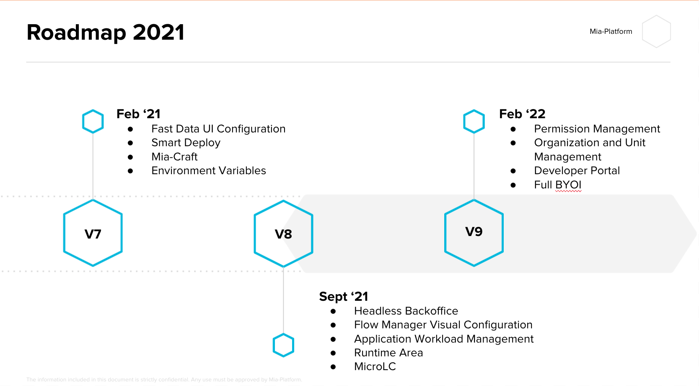

This page details the project’s public roadmap. This is the result obtained with our strategic vision and the collaboration of partners and stakeholders needs.

The goal of the roadmap is:
* Keep people working on the product aligned on upcoming releases
* Planning contributions and support,
* Planning the project's adoption,
* Avoiding duplication of work
* Influence the Roadmap

## Future Work 
Below we tell you about the next features that will be released in the product in the following months.
The following list is not exhaustive, the product is constantly evolving and every week we release new features.
On this page we keep you aligned on the most important issues. 

* NextGen Backoffice: the new back office will allow you to configure increasingly complex content management pages to respond to new business needs. it will also have a new, more modern and intuitive look & feel.

* Permission Management: from the Console you can manage users and groups. And for each of them you can also associate roles and responsibilities.

* Organization and Unit Area: to have more and more control of your organization, licenses, costs and active users on your projects we are creating new control sections

* Full BYOI: our goal is to allow you to connect all your infrastructure tools to the console: repositories, k8s clusters, monitoring tools and registry

* Developer Portal: it will be possible to set up your own developer portal where you can view the documentation and services created within your platform and allow external developers to get keys to use your api. 

## How to influence the roadmap
The roadmap is constantly evolving to quickly respond to market needs.
A roadmap is only useful if it captures real needs. If you have success stories, feedback, or ideas, we want to hear from you! Schedule a metting with us. We are happy to hear from you. 

## Roadmap evolution
Will this roadmap change?
Roadmap are always evolving and ours is no different; you can expect to see this updated roughly every month.
