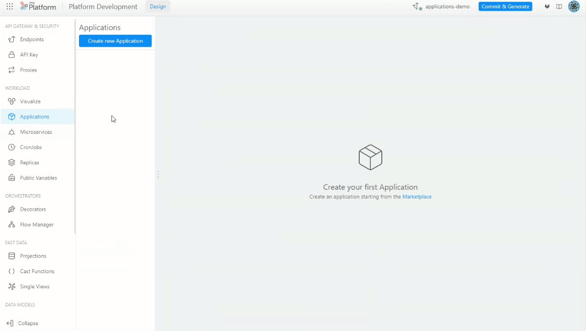
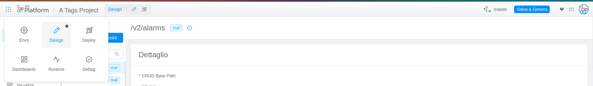

_Month day, year_

### New Features

#### New Application section

In the Design menu, the new Application section is now available.

An **Application** represents a useful way to instantiate and configure in an unified experience a bundle of resources including Plugins, Examples and Templates. Thus, in a few clicks, an Application can offer a working system of resources.

In the Marketplace, it is now available the Dev Portal Application, our first application.

For more info, visit the Application [documentation](../../marketplace/applications/mia_applications.md).

#### A New way to navigate the Console

The user experience of navigation within the Console has been improved, gaining a greater workspace area. Some features have been introduced and some other modified:

- **The main menu** that allows to navigate among Areas now is in a dedicated popover that can be opened through the apposite icon in the top left corner of the Topbar.
The user could also choose a bunch of shortcuts to navigate to favorite Areas that would be displayed in the Topbar. Read the [Console presentation](../../development_suite/overview-dev-suite) for more details.

:::caution
Access to the API Portal documentation no longer occurs through the main menu, but through the relative table in the Envs section of the console. Remember that it is possible to manually customize the various links to be displayed in the table for each different runtime environment, [directly through the CMS](../../development_suite/set-up-infrastructure/runtime-environments).
:::

- **The choice of the runtime environment** has been standardized and it is possible to select it from the dropdown menu in the right corner of the topbar in the sections Deploy, Dashboards, Runtime and Debug. Also, **the "Select Runtime Environment" card** has been renamed in "Latest deployed version", and its appearance has been slightly changed.

- **The branch management** of the Design area is now accessible in the right corner of the topbar. 
    - Click on the branch name to load or create a new one,
    - You can see the last time changes have been saved at the mouseover
    - The circle icon shows you if there are any unsaved changes
    - Use the Commit&Generate button to save your work
More information can be found in the Design [documentation](../../development_suite/api-console/api-design/overview.md)

- **[Visualize](../../development_suite/api-console/api-design/miacraft) and Advanced sections** of the Design area have been moved in the main sidebar, as sub-sections of "Mode" and "Workload" respectively. Please note that these sections have a dedicated button to save changes, hence the Commit&Generate in the top right corner is disabled.

#### Fully manageable API Gateway

The [API Gateway](../../runtime_suite/api-gateway/overview), the core service that is responsible for:

- routing requests to the correct service inside Kubernetes;
- verify the need of authentication and orchestrate the conversation with Auth service;

is now visible in the Microservices area.

You can change CPU and memory request and limit, the number of static replicas, enable [autoscaling](../../development_suite/api-console/api-design/replicas), manage environment variables and [much more](../../development_suite/api-console/api-design/services#manage-microservices).

Configurations defined through the [Advanced](../../development_suite/api-console/advanced-section/dev-console-config/advanced_name_core) section will be inherited. From now on, the update of `api-console-config/core-service.json` for the `api-gateway` will not affect its configuration.

Extensions set from the [API Gateway Advanced files](../../development_suite/api-console/advanced-section/api-gateway/how-to) will keep working even though the service has become a custom service.

If the `API Gateway` service is absent in your project you can now autonomously add it to your branch by creating it from the Marketplace.

Although the `API Gateway` is a custom service, it is not possible to create an endpoint for it.

:::note
Only a single instance of `API Gateway` can exist for each branch. If `API Gateway` is already present among custom services, the marketplace will not show the `API Gateway` plugin.
:::

#### Authorization headers

It is possible to set the environment variable `AUTHORIZATION_HEADERS_TO_PROXY` as a comma separated list of headers which could contain the authorization token used by the user service called by the `USERINFO_URL` and `BACKOFFICE_USERINFO_URL`.

This env variable is not required, and if it is not set the user service is called for every incoming request.
If this env var is set, it brings an enhancement in performance for all APIs called without an authorization header since it avoids calling the user service: user is set as empty.

For more info, visit the [Authorization service documentation](../../runtime_suite/authorization-service/configuration)

### Bug Fix

#### Real-Time Updater v3.1.2

Two new versions of the [Real Time Updater](../../fast_data/real_time_updater/overview) have been released:
- `v3.1.1`: a bug that prevented users to disable projections changes generation has been fixed. Now, if you set the environment variable `PROJECTIONS_CHANGES_ENABLED` to false, projections changes will not be generated when a projection is updated.
- `v3.1.2`:  
    - a bug that caused delete operations to be discarded if no value was found on the database has been fixed. 
    - added support for delta messages in the same bulk operations set

New Systems of Record created with the Console will use Real-Time Updater services at `v3.1.2`. 

:::caution
Real-Time Updater services already created need to be updated by hand in the dedicated detail page of the service.
:::

#### Correct Deploy Outcome when interpolated variable changes version

In Deploy Area, Deploy details card, a bug that caused the Deploy Outcome to be incorrectly set to "No Update" has been fixed. The bug happened when the docker image name was dependant on a Public Variable.

#### Real Time Updater version at Deploy

In Deploy Area, Deploy details card, a bug that caused the `new version` of a real time updater to be incorrect has been fixed. 

#### Ex Core Services configuration

Fixed bugs that caused the incorrect configuration of Api Gateway and Authorization Service in case the Authorization Service, Microservice Gateway, Swagger Aggregator and Api Portal:
- were set as `false` in the `enabled services` property of the project after their conversion to custom services, or
- were added from the Marketplace in an empty project

#### Swagger Aggregator and Api Portal routes

The routes ??? have been added to the Swagger Aggregator and Api Portal endpoints that were lacking them in order to correctly generate the Authorization Service configurations, in case the service was present in the branch.

### Breaking changes

#### lc39 bump to v5.0.0

In lc39 is added the support to OpenAPI 3 (set as default). For further information how to change this default and continue to expose Swagger 2, read the lc39 documentation.
Added some other small fixes.

### Improvements

#### Configmap and Secret Runtime Mount Path

The validation of Runtime Mount Path for configmaps and secrets is now more permissive. It is now possible to specify paths with dots `.` and other special characters.

#### Services choice at project creation

Core services are not chosen during project creation anymore. The ones that have been released as custom services can be added from the Marketplace, while the remaining ones can be activated by setting them to `true` in the `Enabled Services` property of the project through the Console CMS.

### How to update your Console

For on-premise Console installations, please contact your Mia Platform referent to know how to use the `Helm chart version X.X.X`.
