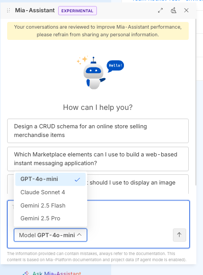

:::info Console v15 users
This page contains general upgrade instructions for all Console versions. If you are upgrading **from v14 to v15**, jump directly to the [Console v15 upgrade section](#console-v15---version-upgrades) below — the Helm chart and authentication model changed significantly in v15.
:::

In order to upgrade Mia-Platform Console, all you need to do is to update the `mia-console` Chart version dependency in your `Chart.yaml` file.

:::tip
When upgrading Mia-Platform Console to a new major release, always remember that updates must be performed one major at a time. Therefore, in order to upgrade from v12 to v14 you must first upgrade to the latest v13 version.

To find out how to upgrade your installation to the latest version of v13.
:::

```yaml title="Chart.yaml" {9} showLineNumbers
apiVersion: v2
name: console
version: "0.0.0"
kubeVersion: ">= 1.20.0"
description: Self Hosted Console Installation Chart
type: application
dependencies:
  - name: mia-console
    version: "X.Y.Z"
    repository: "https://nexus.mia-platform.eu/repository/helm-internal/"
```

When upgrading also make sure to check if any new configuration option is available or if something has been removed.

:::info
The Chart version follows [semver](https://semver.org/) policy so any breaking change with the Chart will always be followed by a Major release. Minor releases may include new configuration options while as a general rule of thumb, patches never holds new configuration options but only internal updates and fixes.
:::

## Console v15 - version upgrades

### Upgrade from last Console v14 to v15.0.0

Console v15 introduces a **breaking change** in the authentication architecture: the OAuth2-based provider configuration is replaced by a direct integration with **Keycloak**. The `authenticationService` is replaced by the new `authtool-bff` service.

Make sure you have a running Keycloak instance configured before upgrading. Refer to the [Authentication Provider documentation](/requirements/installation-guidelines/console/self-hosted/helm-values/25_authentication-provider.md) for details.

#### 1. Replace `authProviders` with `configurations.keycloak`

Remove the entire `configurations.authProviders` array and replace it with the new `configurations.keycloak` block:

```diff
 configurations:
-  authProviders:
-    - name: "<PROVIDER_NAME>"
-      type: "okta"          # or gitlab, github, microsoft, ...
-      baseUrl: "..."
-      clientId: "..."
-      clientSecret: "..."
-      # ... other provider fields
+  keycloak:
+    protocol: "https"
+    host: "<KEYCLOAK_HOST>"
+    realm: "<KEYCLOAK_REALM>"
+    extensibilityRealm: "<KEYCLOAK_EXTENSIBILITY_REALM>"
```

#### 2. Remove `userAccountAuthProvider`

The `configurations.userAccountAuthProvider` block is no longer used. Remove it entirely:

```diff
 configurations:
-  userAccountAuthProvider:
-    tokenPassphrase: "..."
-    jwtTokenPrivateKeyBase64: "..."
-    jwtTokenPrivateKeyPassword: "..."
-    jwtTokenPrivateKeyKid: "..."
```

#### 3. Replace `authenticationService` with `authtoolBff`

The `authenticationService` is replaced by `authtoolBff`. Rename any resource overrides and add the required cryptographic keys:

```diff
-authenticationService:
-  deploy:
-    resources: { ... }
+authtoolBff:
+  keys:
+    privateKey: "<BASE64_PRIVATE_KEY>"
+    cookieSecret: "<COOKIE_SECRET>"
+    redisTokenEncKey: "<REDIS_TOKEN_ENC_KEY>"
+  deploy:
+    resources: { ... }
```

Generate the new secrets with the following commands:

```bash
# RSA private key for authtool-bff (base64 encoded, no passphrase)
ssh-keygen -t rsa -b 4096 -m PEM -f private.key -N "" > /dev/null
authtoolBffPrivateKey=$(base64 < private.key)
rm private.key private.key.pub

cookieSecret=$(openssl rand -hex 64)
redisTokenEncKey=$(openssl rand -hex 32)
```

#### 4. Remove deprecated service configurations

The following top-level service keys are no longer present in the chart and must be removed from your `values.yaml`:

| Removed key | Notes |
|---|---|
| `rateLimitEnvoy` | Rate limiting is now handled differently |
| `apiPortal` | API Portal has been removed |
| `loginSite` | Login site is now managed by Keycloak |
| `notificationProvider` | Notification provider has been removed |

#### 5. Update `configurations.redis.hosts` format

The `configurations.redis.hosts` field changed from a single connection string to an **array of objects** with `ip` and `port` properties:

```diff
 configurations:
   redis:
-    hosts: "redis-host:6379"
+    hosts:
+      - ip: "redis-host"
+        port: 6379
```

---

## Console v14 - version upgrades

### Upgrade from versions prior to v14.5.2 (or later)

When upgrading to Console versions >= v14.5.2, if the Deploy Service has a custom value applied for the `MIA_K8S_SERVICE_PORT` env variable, make sure to replace this variable with the new variable whose name is `K8S_SERVICE_PORT`.

### Upgrade from v14.0.3 to v14.1.0

With Console v14.1.0, the Mia-Assistant evolves and now supports multiple LLM models!  
For this reason few changes are necessary to configure it properly.

#### Multiple LLM configurations

First of all, `configurations.assistant.llm` is now `configurations.assistant.llms` (note the final `s`) and is now accepting a list of llm configurations.  
Update the already configured LLM to be an item in this list

e.g., (before)

```yaml
configurations:
  # ...
  assistant:
    llm:
      type: "azure"
      apiVersion: "..."
      # ...
```

e.g., (after)

```yaml
configurations:
  # ...
  assistant:
    llms: # note the final 's'
      - type: "azure" # note the '-'
        apiVersion: "..." # note the increased indentation
        # ...
```

#### LLM DisplayName

`configurations.assistant.llm` items now require a `displayName` field to be set. This value is shown to the user when selecting the related model on the Mia-Assistant chat panel.



Make sure to include this field in all the configured models.

```diff
configurations:
  # ...
  assistant:
    llms:
      - type: "azure"
        apiVersion: "..."
+       displayName: "GPT-4o Mini"
        # ...
```

#### Assistant Keys

1. `configuration.assistant.keys.embeddings` field has been moved into `configuration.assistant.embeddings.apiKey`

```diff
configurations:
  # ...
  assistant:
    keys:
-     embeddings: "embeddings-apiKey"
    llms:
      # ...
    embeddings:
      type: "azure"
+     apiKey: "embeddings-apiKey"
      # ...
```

2. `configuration.assistant.keys.llm` field is now split to support credentials for multiple providers:

- `configuration.assistant.keys.azureLlmApiKey`
- `configuration.assistant.keys.openaiLlmApiKey`
- `configuration.assistant.keys.vertexAICredentials`

Ensure to move the apiKey used before into the correct field 

Follow the [Assistant documentation](/requirements/installation-guidelines/console/self-hosted/helm-values/75_assistant.md#llm-and-embeddings-model-configuration) to learn more about how to configure it.

#### Specific upgrade for LLM/Embeddings using `vertex` models

If you currently configured Mia-Assistant to use models from VertexAI you should now specify the `configuration.assistant.keys.vertexAICredentials` field.

This field automatically creates a Secret on k8s with specified credentials and mounts it in the mia-assistant container.

### Upgrade from last Console v13 to v14.0.0

No further changes are needed for the upgrade. Enjoy ;)
