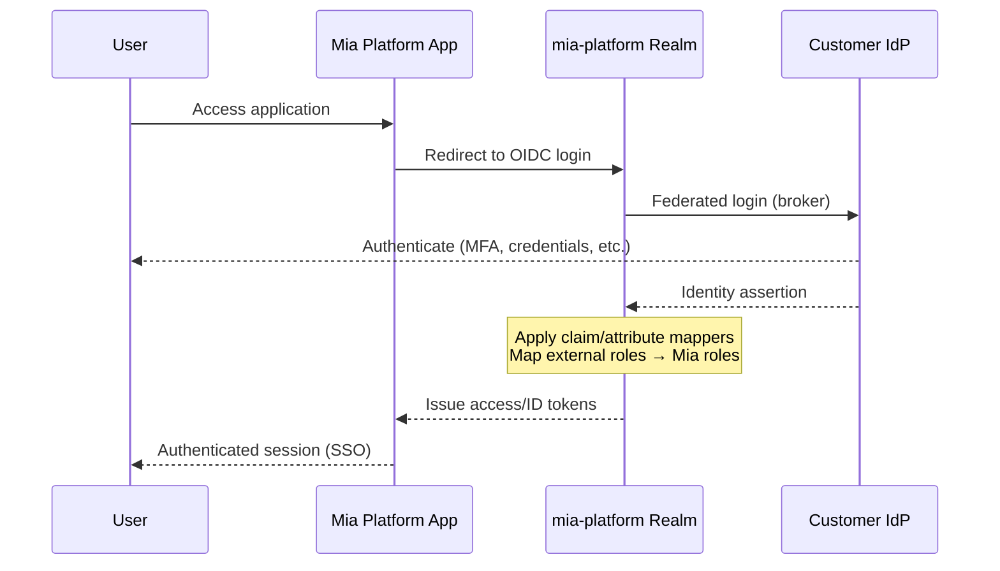

# Authorization & SSO Federation Strategies

## Overview

Mia Platform is a suite of products that requires a unified authentication and authorization layer to guarantee **Single Sign-On (SSO)** across all its components. The platform can be deployed both as **SaaS** and **On-Premises**; this page focuses on **on-prem** deployment models.

All strategies rely on [Keycloak](https://www.keycloak.org/) as the central Identity Broker and leverage its **realm federation** capabilities to cleanly separate Mia Platform's identity concerns from the customer's existing identity infrastructure.

---

## Core Architecture Concepts

### Dual-Realm Model

Every Mia Platform **On-Premises** installation uses **two Keycloak realms** (we use the label `mia-platform` as a placeholder here, the customer can choose any realm name):

| Realm | Purpose |
|---|---|
| **`mia-platform`** | Core product realm. Holds all Mia Platform clients, roles, authorization policies, and protocol mappers. This realm is the OIDC issuer for all Mia Platform services. |
| **`mia-extensions`** | Extensibility realm. Designed for customer-specific integrations, custom clients, and additional identity flows. It is **1:1 federated** with `mia-platform` (i.e., every authentication in `mia-extensions` is brokered through `mia-platform`). |

```
┌────────────────────────────────────────────────────────────────────────┐
│                  Keycloak Instance                                     │
│                                                                        │
│  ┌─────────────────────┐    1:1 Federation     ┌────────────────────┐  │
│  │  mia-platform       │◄───────────────────►  │  mia-extensions    │  │
│  │  (core realm)       │                       │  (extensibility)   │  │
│  │                     │                       │                    │  │
│  │  • Platform clients │                       │  • Custom clients  │  │
│  │  • Roles & policies │                       │  • Custom flows    │  │
│  │  • Protocol mappers │                       │  • Customer apps   │  │
│  └─────────────────────┘                       └────────────────────┘  │
│            ▲                                                           │
│            │  Identity Provider                                        │
│            │  (federation)                                             │
│       ┌────┴─────┐                                                     │
│       │ Customer │                                                     │
│       │   IdP    │                                                     │
│       └──────────┘                                                     │
└────────────────────────────────────────────────────────────────────────┘
```

### Token & Mapping Flow

Regardless of strategy, the authentication flow follows the same logical path:



**Available mappings** from the customer IdP into the `mia-platform` realm include:

- **Attribute mappers**: map external claims/attributes to Mia Platform user attributes.
- **Role mappers**: map external roles or groups to Mia Platform realm/client roles.
- **Hardcoded mappers**: assign default roles or attributes upon first login.
- **Username template mappers**: normalize usernames across identity boundaries.
- **Custom mappers**: Keycloak SPI-based mappers for advanced transformation logic.

---

## On-Prem Federation Strategies

### Strategy 1: Managed Keycloak with Customer IdP Federation

> **When to use:** The customer has an existing Identity Provider (OIDC, LDAP, Active Directory) but does **not** have a pre-existing Keycloak installation, or prefers a fully managed identity layer.

#### Deployment Model

Mia Platform ships a **Helm chart** that deploys:

1. The full Mia Platform product suite.
2. A **managed Keycloak instance** pre-configured with both the `mia-platform` and `mia-extensions` realms.

The customer's existing IdP is then registered as an **Identity Provider** in the `mia-platform` realm.

#### Architecture

```
┌─────────────────────────────────────────────────────────────┐
│                    Customer Infrastructure                  │
│                                                             │
│  ┌────────────────────────────────────────────────────┐     │
│  │         Mia Platform Helm Release                  │     │
│  │                                                    │     │
│  │  ┌───────────────────────────────────────────────┐ │     │
│  │  │           Managed Keycloak                    │ │     │
│  │  │                                               │ │     │
│  │  │  ┌──────────────┐     ┌─────────────────────┐ │ │     │
│  │  │  │ mia-platform │◄─►  │ mia-extensions      │ │ │     │
│  │  │  │    realm     │     │     realm           │ │ │     │
│  │  │  └──────┬───────┘     └─────────────────────┘ │ │     │
│  │  │         │ IdP Federation                      │ │     │
│  │  └─────────┼─────────────────────────────────────┘ │     │
│  │            │                                       │     │
│  │  ┌─────────┴──────────────┐                        │     │
│  │  │   Mia Platform Apps    │                        │     │
│  │  │  (Console, Catalog,    │                        │     │
│  │  │   AI Foundry, ...)     │                        │     │
│  │  └────────────────────────┘                        │     │
│  └────────────────────────────────────────────────────┘     │
│                         │                                   │
│                         ▼                                   │
│              ┌──────────────────────┐                       │
│              │   Customer IdP       │                       │
│              │  (OIDC/LDAP/AD)      │                       │
│              └──────────────────────┘                       │
└─────────────────────────────────────────────────────────────┘
```

#### Responsibilities

| Concern | Owner |
|---|---|
| Keycloak instance lifecycle (deploy, upgrade, backup) | **Mia Platform** (via Helm chart) |
| `mia-platform` realm configuration | **Mia Platform** |
| `mia-extensions` realm configuration | **Mia Platform** (IdP) and **Customer** (everything else) |
| IdP federation setup & claim mappings | **Joint** (Mia Platform provides defaults; customer tunes) |
| Customer IdP availability & configuration | **Customer** |

#### Pros & Cons

| ✅ Pros | ⚠️ Cons |
|---|---|
| Turnkey deployment: single Helm install | Additional infrastructure component to operate |
| Full control over realm configuration | - |
| Clean separation between product and customer identity | - |
| Straightforward upgrade path via Helm | - |

→ **[Installation guide](/requirements/installation-guidelines/shared-services/authn/federation-strategies/managed-keycloak.md)**

---

### Strategy 2: Customer-Owned Keycloak Instance

> **When to use:** The customer already operates a **Keycloak instance** with full admin access and wants to integrate Mia Platform into their existing identity infrastructure.

#### Deployment Model

Mia Platform **does not deploy a Keycloak instance**. Instead:

1. The `mia-platform` and `mia-extensions` realms are **provisioned into the customer's existing Keycloak instance**.
2. The customer's pre-existing realm (or any other IdP) is federated as an Identity Provider in the `mia-platform` realm.
3. Realm configuration is managed and incrementally patched via a **Mia Platform CLI toolset**.
4. The customer's Keycloak instance must run **version 25.0 or later**.

#### Architecture

```
┌────────────────────────────────────────────────────────────────┐
│                    Customer Infrastructure                     │
│                                                                │
│  ┌──────────────────────────────────────────────────────────┐  │
│  │              Customer Keycloak Instance                  │  │
│  │                                                          │  │
│  │  ┌──────────────────┐                                    │  │
│  │  │ customer-realm   │  (pre-existing)                    │  │
│  │  │ • Existing users │                                    │  │
│  │  │ • Existing apps  │                                    │  │
│  │  └────────┬─────────┘                                    │  │
│  │           │                                              │  │
│  │           │  IdP Federation                              │  │
│  │           ▼                                              │  │
│  │  ┌──────────────────┐   1:1      ┌───────────────────┐   │  │
│  │  │  mia-platform    │◄────────►  │  mia-extensions   │   │  │
│  │  │  realm (added)   │            │  realm (added)    │   │  │
│  │  └──────────────────┘            └───────────────────┘   │  │
│  └──────────────────────────────────────────────────────────┘  │
│                                                                │
│  ┌────────────────────────┐   ┌───────────────────────────┐    │
│  │  Mia Platform Apps     │   │   Mia Platform CLI        │    │
│  │  (Helm-deployed)       │   │   (realm management &     │    │
│  │                        │   │    incremental patching)  │    │
│  └────────────────────────┘   └───────────────────────────┘    │
└────────────────────────────────────────────────────────────────┘
```

#### CLI-Based Realm Management

Since Mia Platform does not own the Keycloak lifecycle in this scenario, realm updates are delivered via a **CLI tool** that:

1. **Exports** the desired realm state as declarative JSON/YAML.
2. **Diffs** the desired state against the current state on the target instance.
3. **Applies incremental patches** (new clients, updated mappers, role changes) without disrupting existing configuration.
4. Supports **dry-run mode** for change review before application.

#### Responsibilities

| Concern | Owner |
|---|---|
| Keycloak instance lifecycle (deploy, upgrade, backup, HA) | **Customer** |
| `mia-platform` realm initial setup | **Mia Platform** (via CLI) |
| `mia-platform` realm incremental updates | **Mia Platform** (via CLI, customer approves) |
| `mia-extensions` realm configuration | **Customer** |
| IdP federation setup & claim mappings | **Joint** |
| Keycloak version compatibility | **Joint** (Mia Platform publishes a compatibility matrix) |

#### Pros & Cons

| ✅ Pros | ⚠️ Cons |
|---|---|
| Leverages existing Keycloak investment | Requires coordination on Keycloak version upgrades |
| Customer retains full control of their identity infra | CLI-based patching requires operational discipline |
| No additional Keycloak instance to manage | Potential conflicts if customer modifies Mia-owned realms |
| Easiest federation: customer realm is already co-located | Mia Platform needs service account access to the instance |

→ **[Installation guide](/requirements/installation-guidelines/shared-services/authn/federation-strategies/customer-keycloak-cli.md)**

---

### Strategy 3: Single-Realm Constraint (No Admin Access)

> **When to use:** The customer has a Keycloak instance but **cannot create new realms** (e.g., shared enterprise Keycloak managed by a central IT team, limited RBAC).

This scenario branches into two sub-strategies:

---

#### Strategy 3a: Standalone Managed Keycloak (Recommended)

> **Approach:** Deploy Strategy 1 alongside the customer's existing Keycloak. The customer's constrained realm is used solely as an external IdP.

Since the customer cannot add realms to their own instance, Mia Platform deploys its own **managed Keycloak instance** (identical to Strategy 1). The customer's existing realm is federated as an external Identity Provider into the `mia-platform` realm via standard OIDC protocols.

```
┌─────────────────────────────────────────────────────────────────┐
│                     Customer Infrastructure                     │
│                                                                 │
│  ┌───────────────────────────────────┐                          │
│  │    Customer Keycloak (restricted) │                          │
│  │    ┌─────────────────────┐        │                          │
│  │    │  customer-realm     │        │                          │
│  │    │  (no admin access)  │        │                          │
│  │    └─────────┬───────────┘        │                          │
│  └──────────────┼────────────────────┘                          │
│                 │ OIDC                                          │
│                 ▼                                               │
│  ┌───────────────────────────────────────────────────────────┐  │
│  │          Mia Platform Helm Release                        │  │
│  │                                                           │  │
│  │  ┌─────────────────────────────────────────────────────┐  │  │
│  │  │              Managed Keycloak                       │  │  │
│  │  │  ┌──────────────┐   1:1     ┌───────────────────┐   │  │  │
│  │  │  │ mia-platform │◄───────►  │ mia-extensions    │   │  │  │
│  │  │  │    realm     │           │     realm         │   │  │  │
│  │  │  └──────────────┘           └───────────────────┘   │  │  │
│  │  └─────────────────────────────────────────────────────┘  │  │
│  │                                                           │  │
│  │  ┌─────────────────────┐                                  │  │
│  │  │  Mia Platform Apps  │                                  │  │
│  │  └─────────────────────┘                                  │  │
│  └───────────────────────────────────────────────────────────┘  │
└─────────────────────────────────────────────────────────────────┘
```

This is **functionally identical to Strategy 1**: the only difference is that the "Customer IdP" happens to be a realm on their restricted Keycloak, exposed via OIDC.

**Recommendation:** This is the preferred approach for Strategy 3 as it maintains the clean dual-realm architecture and all operational benefits of a managed instance.

→ **[Installation guide](/requirements/installation-guidelines/shared-services/authn/federation-strategies/managed-keycloak-restricted-idp.md)**

---

#### Strategy 3b: In-Realm Integration (Customer-Managed)

> **Approach:** Embed Mia Platform's identity configuration directly into the customer's existing realm. **The customer fully owns and manages this integration.**

When deploying a separate Keycloak is not feasible or desired, Mia Platform provides **documentation and reference configurations** for the customer to integrate the following resources into their own realm:

- **Clients**: OIDC clients for each Mia Platform application.
- **Client scopes**: Scopes and protocol mappers required by the platform.
- **Roles**: Realm and client roles used for Mia Platform authorization.
- **Authorization policies**: Fine-grained policies attached to Mia Platform clients.

`mia-extensions` are remapped inside the same realm.

```
┌─────────────────────────────────────────────────────────────┐
│                  Customer Infrastructure                    │
│                                                             │
│  ┌────────────────────────────────────────────────────────┐ │
│  │           Customer Keycloak (restricted)               │ │
│  │                                                        │ │
│  │  ┌──────────────────────────────────────────────────┐  │ │
│  │  │              customer-realm                      │  │ │
│  │  │                                                  │  │ │
│  │  │  ┌──────────────────┐  ┌─────────────────────┐   │  │ │
│  │  │  │ Customer's own   │  │ Mia Platform        │   │  │ │
│  │  │  │ clients, roles,  │  │ clients, roles,     │   │  │ │
│  │  │  │ users, flows     │  │ mappers, policies   │   │  │ │
│  │  │  │                  │  │ (embedded)          │   │  │ │
│  │  │  └──────────────────┘  └─────────────────────┘   │  │ │
│  │  └──────────────────────────────────────────────────┘  │ │
│  └────────────────────────────────────────────────────────┘ │
│                                                             │
│  ┌────────────────────────┐                                 │
│  │  Mia Platform Apps     │                                 │
│  │  (Helm-deployed)       │                                 │
│  └────────────────────────┘                                 │
└─────────────────────────────────────────────────────────────┘
```

#### What Mia Platform Provides

| Deliverable | Description |
|---|---|
| **Integration Guide** | **Non-authoritative** documentation detailing Mia Platform resources needed in an existing realm. |
| **Reference Realm Export** | A JSON export of a minimal `mia-platform` realm that the customer can use as a reference. |
| **Upgrade Notes** | Per-release changelog of realm configuration changes the customer must apply manually. |

#### Responsibilities

| Concern | Owner |
|---|---|
| Keycloak instance & realm lifecycle | **Customer** |
| Initial integration of Mia Platform resources | **Customer** (with Mia Platform docs) |
| Ongoing realm updates upon Mia Platform upgrades | **Customer** |
| Conflict resolution with existing realm config | **Customer** |
| Documentation & reference configurations | **Mia Platform** |
| Support for integration issues | **Mia Platform** (best-effort / advisory) |

#### Pros & Cons

| ✅ Pros | ⚠️ Cons |
|---|---|
| No additional Keycloak instance needed | Customer bears full integration & migration burden |
| Works within the strictest infrastructure constraints | High risk of configuration drift across upgrades |
| Maximum flexibility for the customer | No clean separation between Mia and customer resources |
| - | SSO behavior depends on correct customer configuration |
| - | Troubleshooting is harder without realm isolation |

> ⚠️ **Important:** Strategy 3b is a **last-resort** option. It trades operational simplicity for maximum constraint compatibility. Mia Platform **strongly recommends Strategy 3a** whenever possible.

---

## Strategy Comparison Matrix

| Dimension | Strategy 1 | Strategy 2 | Strategy 3a | Strategy 3b |
|---|---|---|---|---|
| **Keycloak Instance** | Managed (Helm) | Customer-owned | Managed (Helm) | Customer-owned |
| **Realm Isolation** | ✅ Full | ✅ Full | ✅ Full | ❌ Shared |
| **Deployment Complexity** | Low | Medium | Low | High |
| **Upgrade Path** | Helm upgrade | CLI patching | Helm upgrade | Manual |
| **Customer Keycloak Admin Required** | No | Yes | No | Partial |
| **SSO Guarantee** | ✅ Built-in | ✅ Built-in | ✅ Built-in | ⚠️ Config-dependent |
| **Mia Platform Operational Control** | High | Medium | High | None |
| **Customer Operational Burden** | Low | Medium | Low | High |
| **IdP Federation Protocol** | OIDC | OIDC | OIDC | N/A (in-realm) |
| **Best For** | Greenfield / no existing KC | Existing KC with admin | Restricted KC | Strict no-new-infra policy |
