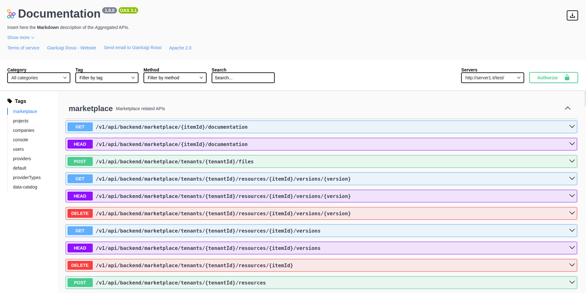

The **API Portal** microservice will present you a graphical interface for your [Open Api specification document](https://swagger.io/resources/open-api/). This service is responsible for contacting an endpoint where your swagger Open Api document should be provided.

This interface will semantically describe the APIs in a readable structure text format and will also allow you to interact and test each of them by clicking on the "Try it out" button.

:::note
The available Open Api document is automatically generated and kept in sync by [Swagger Aggregator](/runtime_suite/swagger-aggregator/10_overview.md).
You can [apply custom configurations directly from the Console](/development_suite/api-console/advanced-section/swagger-aggregator/configuration.md)
:::

The Open Api documentation lets you know exactly how your APIs will work and behave, before integrating your APIs into your code. It lists all the available REST-endpoints and provides detailed information for each of them: description, parameters and schema.  

:::note
API Portal generates the [Documentation Portal](/console/project-configuration/documentation-portal.md) section of the Console where all services and CRUDs routes are shown and can be tested.
:::

## Features

Other than showing your [Open Api specification document](https://swagger.io/resources/open-api/), the **API Portal** allows to filter it. It can be filtered by tags, methods and endpoint name.

It's also possible to change the category which is a map of the [subswaggers](/development_suite/api-console/advanced-section/swagger-aggregator/configuration.md#subswaggers) related to the [Swagger Aggregator](/runtime_suite/swagger-aggregator/10_overview.md) microservice.
