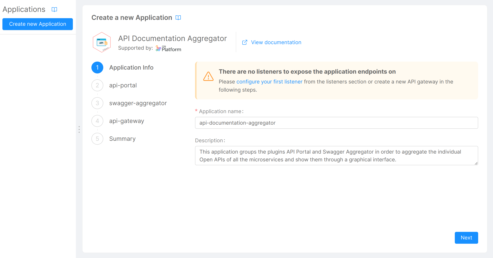
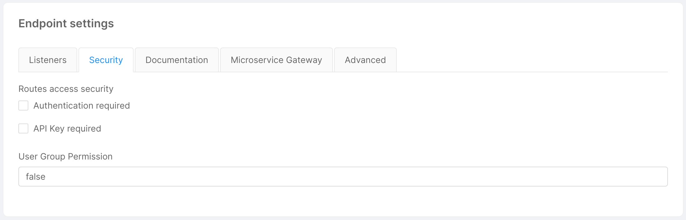
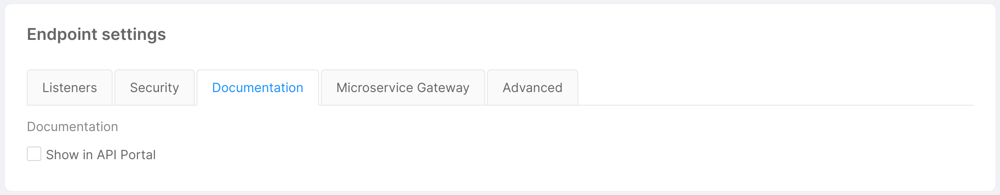
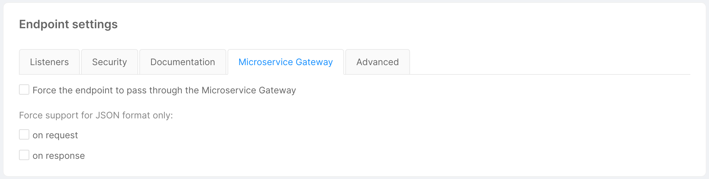
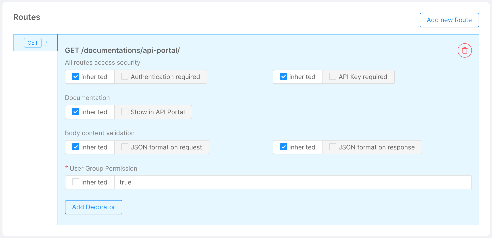
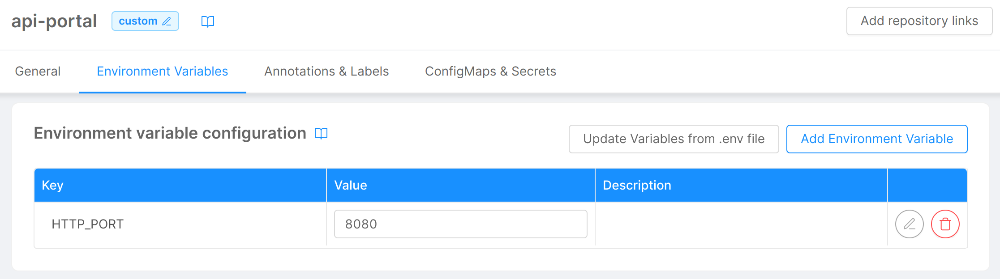

The **API Portal** microservice can be added to your project by visiting Mia-Platform [Marketplace](../../marketplace/overview_marketplace). To configure it properly, there are essentially 2 ways.

## 1. Creating a new API Documentation Aggregator application (recommended)

The easiest and recommended way to add an API Portal to your project is to create a new **API Documentation Aggregator** application.

The creation of the application is divided into several steps, allowing the **Swagger Aggregator** and **API Gateway** services, each with the necessary endpoints, to be added to the project in addition to the API Portal itself (both are needed to make the API Portal work properly: the Swagger Aggregator is responsible for aggregating the individual [Open APIs](https://swagger.io/resources/open-api/) of all the microservices indicated in the configuration, while the API Gateway is needed to manage endpoints).

Once you have finished creating the application, you need to properly configure the endpoint `/documentations/api-portal`, which is needed to access the [Documentation Portal](../../console/project-configuration/documentation-portal):

- In the "Endpoint settings" card:
  * Under the "Security" tab, set the **User Group Permission** to `false`;
  
  * Under the "Documentation" tab, uncheck the **Show in API Portal** checkbox;
  
  * If your project uses the **Microservice Gateway** plugin, under the "Microservice Gateway" tab, uncheck the **on request** and **on response** checkboxes.
  

- In the "Routes" card, create a route with `GET` as http verb and `/` as route path. For this newly created route uncheck the `inherited` checkbox for the **User Group Permission** and set its value to `true`.

:::note
If you want to expose the API Portal on an additional path, you have also to expose the Swagger Aggregator on the correct corresponding path.
For instance, if you expose the API Portal on `/my-api-portal`, then you need to expose the Swagger Aggregator on `/my-api-portal/api`. Otherwise, the API Portal would not be able to get the swagger definitions.
:::

:::warning
Please, be aware that the API Portal is public by default, so the users do not need to perform any login step to view your API Portal.   
You can block unauthorized users to access the API Portal by checking `Authentication required` to the `GET /` route of the endpoint that exposes the API Portal. Doing so, only users with the cookie can access it, but the login page for setting the cookie is not autogenerated, hence you need to configure the login process by yourself.
:::

:::tip
You can set up a login process by using the [Auth0 Client](../../runtime_suite/auth0-client/overview_and_usage) plugin, that you can find in the [Marketplace](../../marketplace/overview_marketplace).
:::

## 2. Step-by-step manual configuration

This procedure allows you to manually add the various services and endpoints needed to make the API Portal work properly, effectively generating the resources that are automatically created when you add an API Documentation Aggregator application to the project.

1. Add the **API Portal** plugin to the project via the "Microservices" section;
2. Add the **Swagger Aggregator** plugin to the project via the "Microservices" section;
3. Add the **API Gateway** plugin to the project via the "Microservices" section;
4. [Create a new endpoint](../../development_suite/api-console/api-design/endpoints) with base path `/documentations/api-portal`, type `Microservice`, and linked to the `api-portal` service via the "Endpoints" section;
5. Configure the newly created endpoint as described in the [configuration procedure](#1-creating-a-new-api-documentation-aggregator-application-recommended) following the creation of the API Documentation Aggregator application.

:::note
Take a look at the "Environment Variables" tab of the API Portal service, and make sure the HTTP_PORT where the web server is exposed is properly set, with value `8080`.

:::
