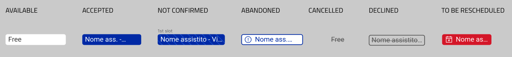

<!--
WARNING: this file was automatically generated by Mia-Platform Doc Aggregator.
DO NOT MODIFY IT BY HAND.
Instead, modify the source file and run the aggregator to regenerate this file.
-->

The web component is based on the external component `react-big-calendar`, [here is the documentation for more information](https://jquense.github.io/react-big-calendar/examples/?path=/story/about-big-calendar--page).

The web component has been created as the front-end counterpart of the [appointment-manager][appointment-manager] microservice to be used in a Microfrontend Composer configuration.

:::caution
The web-component has been implemented to work with the [appointment-manager][appointment-manager] set in [full mode](../../runtime_suite/appointment-manager/configuration). 
:::

## Events type

The calendar is able to represent three kind if events: availabilities, exceptions and appointments.

**Availability**: Availability event represents the range of time in which a resource is available. The availability cannot start and end in different days, but it is possible to create periodic (daily, weekly, monthly) availability.
At the creation of an availability, the user can decide if the availability contains or does not contain slots. If the availability event is created with slots the event is divided in multiple time ranges. Each slot defines the availability's time range that the user can book. 


 If the availability is created without slots, the availability is displayed as a single event on the calendar. An appointment can be booked with any duration inside the start time and end time of the availability.


**Exception**: Exception events represent when the resource is not available. Exceptions can span multiple days, but cannot be periodic


**Appointment**: Appointment are usually represented inside an availability. Appointment events represent the booking of a slot. If exception is created on top of an appointment the appointment event is shown in red in the calendar and must be rescheduled. If the availability containing an appointment is delete or edited to not contain a previous appointment, the appointment will be flagged and shown as an independent event.


For more information regarding the type of events read the [appointment manager documentation][appointment-manager].

## Modes

The components can be utilized in two different modes.

### Availability Mode


The "availability mode" is used to show the availabilities and exceptions of a single resource. The calendar in this configuration will show the events of type availability and exceptions. The appointments are not displayed in this mode.

When the calendar is set in availability mode the events are fetched through the back kit web component [bk-crud-client](/microfrontend-composer/back-kit/60_components/100_crud_client.md).

Even though this calendar mode has been designed to display the events of only one resource, the event filtering is not performed by the component itself. To filter out the events for a specific property is suggested to pass the filtering property as a URL parameter and filter the data received from the backend utilizing the back-kit component [bk-url-parameters](/microfrontend-composer/back-kit/60_components/540_url_parameters_adapter.md).

To improve performance not all the events are loaded in the calendar at the same time. In availability mode, the events are filtered sending [change-query](/microfrontend-composer/back-kit/60_components/300_filters_manager.md). If the calendar view is day or week the calendar loads events ranging from the first day of the previous week to the last day of the next week of the current visualized date. In month view the events from the previous month until the next one are loaded.

Click on an event calendar will trigger the emission of a [select-data](/microfrontend-composer/back-kit/70_events.md#selected-data) event which contains in the payload the data of the event clicked.

This mode is compatible with version 1.x  of the [appointment manager backend][appointment-manager].

Here can be found an example <a download target="_blank" href="/docs_files_to_download/care-kit/availabilities.json">configuration</a>.

### Appointment Mode


The "appointment mode" is used to show the events of multiple resources in the same view. In this mode, it is possible to book an appointment in one of the availabilities created for each resource.

A resource is the entity which time is managed through the calendar.

The resources are displayed in the top row of the calendar. The components accept the property [resourceConfig](#resourceconfig) the contains the main configuration options regarding the resources. In particular, `resourceConfig` contains the property resourcesEndpoint which is where you must configure the endpoint from which the resources are fetched.
It is possible to set the calendar to work with only one resource by setting the property `singleResource` of `resourceConfig` true.
When `singleResource` is set to true the resource header will not be shown. To let the calendar to properly fetch the inforamation regarding the single resource selected its `resourceId` must be in the page href. Ex. http://host/pluginName/`resourceId`. It is possible to specify how to retrieve the resourceId in href through the `resourceConfig`'s `urlMask` property.  If the `resourceConfig` property `currentUser` is also set to true the `resourceId` used will be the one of the logged user.

The resources and the events in the calendar must share a common property used by the calendar to display the events in the correct resource sections. If a event is not associated to any resource it is not displayed in the calendar.

In appointment mode, the events are not fetched using `bk-crud-client` like in availability mode, but they are fetched from the endpoint configured in the property `calendarEndpoint` (this endpoint should coincide with the GET /calendar of the [appointment manager backend][appointment-manager]). Not using the `bk-crud-client` to fetch the events allows us to filter the events using the `bk-filters-manager`. The filtering on the time range of events loaded is executed internally to the component. The web components computes the start and end date of the range as in availability mode and than adds them as query parameter to `calendarEndpoint` call.

Clicking on a slot will make appear a draggable window containing some information about the slot clicked. A slot can be in 3 different states: available, booked, and unavailable. Depending on the state the action button present in the footer allows the user to book an appointment, change or delete an appointment, or visualize the information of the appointment in the selected slot. Unavailable slots and exception are not clickable in this configuration.

All the action buttons present in the appointment detail modal are performed using back-kit events. For this reason, it is needed in the page a `bk-crud-client` configured with the [appointment manager][appointment-manager] appointment endpoint as URL.

This mode is compatible with version 2.x  of the [appointment manager backend][appointment-manager].

It is possible to filter the resource and the events shown by the calendar. The component in "appointment mode" listen to [change-query events](../../microfrontend-composer/back-kit/events#change-query) and applies the filters inside tge change-query event payload to the events and resources displayed by the calendar. Only on the events' properties declared in the `filterProperties` property the filering is applied. The same `filterProperties` property is present inside the `resourceConfig` object and used to declare the resource properties eligible for filtering. 

Here can be found an example <a download target="_blank" href="/docs_files_to_download/care-kit/appointments.json">configuration</a>.

## Extra features


Through the setting button in the top right it is possible to filter out the events based on their type. In other words it is possible to hide the exceptions, the availability, or both types of event.
In the same dropdown menu is present the time zoom option that allows the user to zoom in the calendar. This feature is especially useful when very short events are present. The default zoom is 1 hour. It is possible to zoom in up to 10 minutes.

### Appointment participants

If the appointment manager is configured to support [user participants](../../runtime_suite/appointment-manager/overview#user-participants), appointments slots will have a custom appearance to show the status of the current logged user and the other appointment attendants, as shown in figure:



The status of a slot is inferred from its participants acceptance status, with the following rules:

- The slot is said to be **AVAILABLE** if it has not yet been booked by anyone
- The slot is said to be **BOOKED** if it has been booked from someone and is no longer available to be booked by someone else. 
- The slot is set to **ACCEPTED** if the current logged user has confirmed its participation in the appointment.
- The slot is said to be **DECLINED** if the current logged user has declined its participation in the appointment. 
- The slot is said to be **NOT_CONFIRMED** if the current user has not yet confirmed or declined the appointment. 
- The slot is said to be **ABANDONED** if all participants in the related appointment have declined their participation.
  The slot is said to be **CANCELLED** if an exception overlaps the related availability and the related appointment in inaccessible

Hovering the parent slot displays the appointment status in the tooltip and modal, as well as an option to configure the appointment participation for the logged user.

:::caution
For the participant status to be correctly shown, please ensure the calendar is set to work in [Appointment Mode](#Appointment mode) and the AppointmentConfig _**currentUserFieldName**_ and _**updateParticipantsStatusEndpoint**_ properties are properly configured, as well the Resource config to be set to **_currentUser_**=true.
:::

### Permissions 

If the `permissions` property is set to true in the component configuration, the actions that the user is able to perform interacting with a slot or appointment are limited by the permission indicated respectively in the property `slotPermissions` and `appointmentPermissions`. 
The component reads for each slot the `slotPermissions` property, which should be an array of strings containing the permissions that the user has for that specific slot.
The valid permissions for a slot are the following: 

- **CREATE** &rarr; Permission to create an appointment. If the permission is not granted, in the draggable window the creation button will not be present.

Likewise, the `appointmentPermissions` property of each appointment contains the array of permissions that the user has for that specific appointment.
The valid permissions for an appointment are the following: 

- **VIEW** &rarr; Permission to visualize the appointment's details. If the permission is not granted, in the draggable window the edit button will not be present. 
- **DELETE** &rarr; Permission to delete an appointment.  If the permission is not granted, in the draggable window the delete button will not be present. 
- **EDIT** &rarr; Permission to edit an appointment. If the permission is not granted, the edit button will send the event to open the appointment detail modal in read-only mode. If the VIEW permission is not granted, the EDIT permission will not have any effect since will not be possible to open the detail modal.

:::caution
The `slotPermissions` and `appointmentPermissions` properties are not added to slots and appointments by the [appointment-manager][appointment-manager]. The property should be computed and added to the appointment object by [Rönd][rond] or a middleware service that manipulates the response of the [appointment-manager's][appointment-manager] `GET /calendar/` endpoint.
:::

## Properties & Attributes

| property | type | required | default | description |
|----------|------|----------|---------|-------------|
| `addressProperty` | string | false | address | Name of the event property that contains the location of the event. If present it is shown in the modal detail popover |
| `appointmentConfig` | [AppointmentConfig](#appointmentconfig) | false | - | Object that contains the name of the appointments properties used to populate booked slot and the draggable modal |
| `appointmentMode` | boolean | false | false | Boolean the define which calendar mode is in use. If false the calendar is in availability mode, if true in appointment mode |
| `modalFooterVisible` | boolean | false | true | Boolean the define if the modal with the appointment detail has the footer with the actions buttons |
| `appointmentManagerUrl` | string | false | - | The base path of the [Appointment manager][appointment-manager] |
| `calendarEndpoint` | string | false | - | The endpoint used to fetched the events in appointment mode |
| `updateParticipantsStatusEndpoint` | string | false | - | The endpoint used to set the user's participation status for a certain event |
| `currentUserIdFieldName` | string | false | sub | The userinfo property field name to be matched with to determine the particpation status for any event (**N.B.** this property must be properly set if the  [Appointment Manager][appointment-manager] if configured with the `isParticipantStatusAvailable` flag.) |
| `date` | string | false | new Date() | The date on which the calendar is on load |
| `height` | string | false | '75vh'     | css-height the calendar should occupy in the page as described here: [https://developer.mozilla.org/en-US/docs/Web/CSS/height] |
| `filterProperties` | string[] | false | [] | List of availabilities' properties on which filters can be applied |
| `popoverConfig` | [EventBoxPopoverConfig](#eventboxpopoverconfig) | false | - | Object that contains the name of the properties used to populate the popover that appears when an event is hovered |
| `resourceConfig` | [ResourceConfig](#resourceconfig) | false | - | Object that contains the name of the resource properties used to populate the header containing the resource information and the endpoint from which the resources are fetched |
| `resourceId` | string | false | resourceId | Provides a unique identifier for each resource in the resources array. Each event should have the same property to be shown in its calendar resource column |
| `reminderMilliseconds` | number | false | 90000 | Number of milliseconds before the booked appointment that the reminder is sent |
| `slotConfig` | [SlotConfig](#slotconfig) | - | - | Object that contains the name of the appointments properties used to populate free slot and the draggable modal |
| `view` | 'month' \| 'week' \| 'day' | false | week | The current view value of the calendar. Determines the visible 'view'  |
| `permissions` | boolean | false | false | If set to true, the user interaction with an appointment are delimited by his/her permissions defined in the appointment's `permissions` property  |

## Custom types

### AppointmentConfig

```
{
  titleProperty: string[]
  ownerProperty: string
  additionalProperty?: {property: string; label: Record<string, string> }[]
}
```

| property | description |
|----------|-------------|
| `titleProperty` | Names of the property whose value is shown inside a slot when an appointment is booked |
| `ownerProperty` | Name of the property that contains the identifier of the owner of the slot (ex. customerId) |
| `additionalProperty` | Array of the custom property that is shown in the draggable modal that spawn when clicking an appointment. Each element of the array should contain a field property with the name of the custom property and an object label containing specific translations according to ISO 639-1 code. |

**Example**

```
"appointmentConfig": {
  "titleProperty": ["client", "performance"],
  "ownerProperty": "client",
  "additionalProperty": [
    {
      "property": "performance",
      "label": {
        "it": "Prestazione",
        "en": "Performance"
      }
    }
  ]
}
```

### EventBoxPopoverConfig

```
{
  title:{property: string; value?: Record<string, Record<string, string>> }
  details: { property: string; label: Record<string, string>; value?: Record<string, Record<string, string>> }[]
}
```

| property | description |
|----------|-------------|
| `title` | Names of the property whose value is shown in the header of the popover. If not present the popover will not have a header |
| `details` | Array of the custom properties that are shown in the popover. Each element of the array should contain a field property with the name of the custom property and an object value containing the mapping of the value to the localized translation. |

**Example**

```
"popoverConfig": {
  "details": [
    {
      "property": "status",
      "label": {
        "it": "Stato",
        "en": "Status"
      },
      "value": {
        "AVAILABLE": {
          "it": "Disponibile",
          "en": "Available"
        },
        "BOOKED": {
          "it": "Prenotato",
          "en": "Booked"
        },
        "UNAVAILABLE": {
          "it": "Non disponibile",
          "en": "Unavailable"
        }
      }
    }
  ]
}
```

### ResourceConfig

```
ResourceConfig = {
  resourcesEndpoint: string
  singleResource: boolean
  currentUser: boolean
  filterProperties`: string[]
  details: ResourceDetails[]
  delimiter: string
}

ResourceDetails = {
  property: string[]
  delimiter: string
}
```

| property | type | description |
|----------|------|-------------|
| `resourcesEndpoint` | string | The endpoint from which the resources are fetched. |
| `singleResource` | boolean | If true the calendar in appointment mode handles only one resource. The `resourceId` of the resource is recovered from the URL through the `urlMask`|
|`filterProperties`| string[] | List of availabilities' properties on which filters can be applied |
| `currentUser` | boolean | if true and `singleResource` is also true filters event for the `resourceId` of the current logged user |
| `details` |  ResourceDetails[] |List of the property inside each resource to be shown in the header and popover. Each detail can be the chian of multiple property divided by a specific delimiter. |
| `delimiter` | string |  Character used between details in the popover. |
| `urlMask` | string | Mask used to recover the `resourceId` from the URL in case `singleResource` is `true`. The key must be the same in the `resourceId` property of the calendar |

**Example**

```
"resourceConfig": {
  "resourcesEndpoint": "http://localhost:3456/api/v1/resources",
  "details": [
      "name",
      "specialization"
  ]
}
```

### SlotConfig

```
{
  centeredPopover: boolean
  additionalProperty?: {property: string; label: Record<string, string> }[]
}
```

| property | description |
|----------|-------------|
| `centeredPopover` | Boolean to control the spawning position of the draggable modal. If false the modal will spawn near the clicked event, if false in the center of the page |
| `additionalProperty` |Array of the custom properties that are shown in the draggable modal that spawn when clicking a free slot. Each element of the array should contain a field property with the name of the custom property and an object label containing specific translations according to ISO 639-1 code. |

**Example**

```
"slotConfig": {
  "centeredPopover": false,
  "additionalProperty":[
    {
      "property": "performance",
      "label": {
        "it": "Prestazione",
        "en": "Performance"
      }
    }
  ]
}
```

## Listens to

| event | action | emits | on error |
|-------|--------|-------|----------|
|[display-data](../../microfrontend-composer/back-kit/events#display-data)|receives data to display| - | - |

## Emits

| event | description |
|-------|-------------|
|[change-query](../../microfrontend-composer/back-kit/events#change-query)| used to updated the filters in availability mode|
|[add-new](../../microfrontend-composer/back-kit/events#add-new)| trigger for the opening of the component used to add a new event|
|[add-new-external](../../microfrontend-composer/back-kit/events#add-new-external)| trigger for the opening of the appointment detail modal in read-only mode |
|[deleteData](../../microfrontend-composer/back-kit/events#delete-data)| notifies the request for deletion of event|
|[require-confirm](../../microfrontend-composer/back-kit/events#require-confirm)| trigger for the opening of the confirmation modal before deleting an appointment |
|[selected-data](../../microfrontend-composer/back-kit/events#selected-data)| notifies about the click on an event|
|[update-data](../../microfrontend-composer/back-kit/events#update-data)| trigger for the opening of the component to modify the appointment in the clicked slot|


[appointment-manager]: ../../runtime_suite/appointment-manager/overview
[rond]: https://rond-authz.io/
