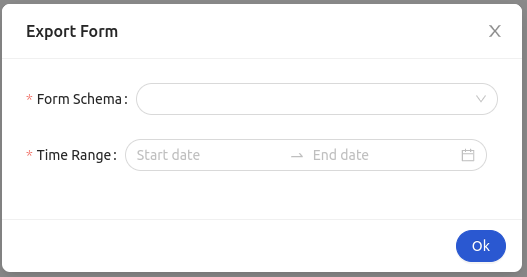

<!--
WARNING: this file was automatically generated by Mia-Platform Doc Aggregator.
DO NOT MODIFY IT BY HAND.
Instead, modify the source file and run the aggregator to regenerate this file.
-->

The `ck-export-form` web component is able to export in CSV format the data of the forms created through the [Form Service Frontend](../runtime_suite/form-service-frontend/overview) and [Form Service Backend](../runtime_suite/form-service-backend/overview).

## Usage



The web component consist in a form inside a modal. The form is composed of two fields, `Form Schema` and `Time Range`, both of which required. The `Form Schema` field is a select whose options are populated through a `GET` request to the endpoint specified in the `formSchemasEndpoint` property in the configuration. The `Time Range` field allows the user to select a period of time between two dates. The values of the form's fields are used to filter the forms that will be exported in the CSV file.

In the form is also present a switch field with title 'File compatible with Excel'. If the user wants to use the CSV file in Microsoft Excel the filed must be checked, if not must be unchecked. it is possible to set the deafault state of this filed with the configuration property `compatibleWithExcel`.

The submission of the form will trigger the download of the CSV file containing the export of the form schemas' data.

In order to open the `ck-export-form` in a Microfrontend Composer, a configuration is needed to configure a button to emit the custom event `export-form`. An example configuration follows: 

```
{
  "$ref": {},
  "content": {
    "attributes": {
      "style": "height: calc(100vh - 64px);"
    },
    "type": "row",
    "content": [
      {
        "type": "element",
        "tag": "bk-button",
        "properties": {
          "content": "Export",
          "clickConfig": {
            "type": "event",
            "actionConfig": {
              "label": "export-form",
              "payload": {}
            }
          }
        }
      },
      {
        "type": "element",
        "tag": "ck-export-form",
        "properties": {
          "formSchemasEndpoint": "/v2/form-schemas/",
          "formDataEnpoint": "/v2/forms-data/",
          "compatibleWithExcel": true
        }
      }
    ]
  }
}
```

## Properties & Attributes

| property | type | required | default | description |
|----------|------|----------|---------|-------------|
|`formSchemasEndpoint`| string | true | '' | Path to the CRUD endpoint that stores the form schemas' data. It is used to populate the `Form Schema` options in the form. |
|`formDataEndpoint`| string | true | '' | Path to the CRUD that stores the forms' data. |
|`compatibleWithExcel`| boolean | false | false | Default value of the compatible with Excel switch |

## Listens to

| event | action | emits | on error |
|-------|--------|-------|----------|
|export-form| Triggers the opening or the closing of the modal. | - | - |

## Emits

| event | description |
|-------|-------------|
|export-form| Custom event, triggers the opening or the closing of the modal. |
