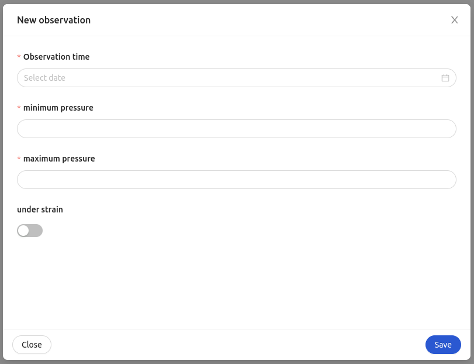

<!--
WARNING: this file was automatically generated by Mia-Platform Doc Aggregator.
DO NOT MODIFY IT BY HAND.
Instead, modify the source file and run the aggregator to regenerate this file.
-->

The `ck-therapy-modal` web component is a modal specialized in adding a new [Therapy and Monitoring Manager detection](../runtime_suite/therapy-and-monitoring-manager/overview).


## Usage

The web component consist in a form inside a modal. The form's fields are dynamically generated starting from a [Therapy and Monitoring Manager prototype](../../therapy-and-monitoring-manager/overview#prototypes). The web-component listens to the `therapy-config` event emitted by the [ck-therapy-select](40_ck-therapy-select.md) component. The event's payload contains the `prototypeId` of the prototype used to generate the form fields. The prototype is fetched using the URL set in the `prototypePath` property. The `prototypePath` should be set to [Therapy and Monitoring Manager GET /prototypes/ endpoint](../runtime_suite/therapy-and-monitoring-manager/overview#prototypes).

The compiled form's values are posted to the endpoint set in the `postEndpoint` property. The `postEndpoint` should be set to [Therapy and Monitoring Manager POST /detections/ endpoint](../runtime_suite/therapy-and-monitoring-manager/usage#post-detections). In the post payload alongside the values are sent the `planType` and `planId` received in the last `therapy-config` event received, the current user `_id` as `doctorId` and the `patientId` recovered from the `window localtion`. In order for the `patientId` to be recovered correctly, the page's path has to follow the following pattern '{hostname}/{plugin_name}/`patientId`' 

In order to open the `ck-therapy-modal` in a Microfrontend Composer, a configuration is needed to configure a button to emit the custom event `therapy-modal`. An example configuration follows: 

```
{
  "$ref": {},
  "content": {
    "attributes": {
      "style": "height: calc(100vh - 64px);"
    },
    "type": "row",
    "content": [
      {
        "type": "element",
        "tag": "bk-button",
        "properties": {
          "content": "New detection",
          "clickConfig": {
            "type": "event",
            "actionConfig": {
              "label": "therapy-modal",
              "payload": {}
            }
          }
        }
      },
      {
        "type": "element",
        "tag": "ck-therapy-modal",
        "properties": {
          "prototypePath": "/ttm/prototypes/",
          "postEndpoint":  "/ttm/detections/"
        }
      }
    ]
  }
}
```


## Properties & Attributes

| property | type | required | default | description |
|----------|------|----------|---------|-------------|
|`prototypePath`| string | true | / | Path to the Therapy and Monitoring Manager GET /prototypes/ endpoint. |
|`postEndpoint`| string | true | / | Path to the Therapy and Monitoring Manager POST /detections/ endpoint. |
|`width`| string | false | 800px | The width of the modal. It must a valid CSS value. |
|`height`| string | false | 500px | The minimum height of the modal. It must a valid CSS value. |

## Listens to

| event | action | emits | on error |
|-------|--------|-------|----------|
|therapy-modal| Triggers the opening or the closing of the modal. | - | - |
|therapy-config| Events that contains the information used by the modal to generate the forms' fields and post body | - | - |

## Emits

| event | description |
|-------|-------------|
|therapy-modal| Custom event, triggers the opening or the closing of the modal. |
