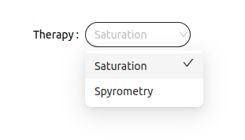

<!--
WARNING: this file was automatically generated by Mia-Platform Doc Aggregator.
DO NOT MODIFY IT BY HAND.
Instead, modify the source file and run the aggregator to regenerate this file.
-->

The `ck-therapy-select` web component is used to select a therapy/monitoring between the ones associated to a specific user. The selection of a option will trigger the emission of `therapy-config` event.

## Usage
The `ck-therapy-select` component recovers the therapies/monitorings associated to a specific user. The data received are used to populate the selectable options. The web-component's `type` property defines if therapies or monitorings are fetched. The property accepts two values `monitoring` and `therapy`.
The other property, `planBasePath`, has to be set to the endpoint that expose the [Therapy and Monitoring Manager service](../../therapy-and-monitoring-manager/overview). 

Properties `urlMask` and `idKey` are used to retrieve the patient id from the url: `idKey` is the dynamic value key mapped in the `urlMask`. For example, if the url is `/dashboard/85fh30?pageSize=25` where `85fh30` is the patient id, the `urlMask` will be `/dashboard/:<yourKey>` and `patientIdKey` will be `<yourKey>`. The `patientId` retrieved is used to filter the select's option.

On initialization, after the options have been retrieved, the first options is selected (if present). Every time an option is selected a `therapy-config` event, containing the information of the selected value, is sent. Alongside the `therapy-config` event, selecting an options also triggers the emitting of the events [change-query](../../../microfrontend-composer/back-kit/events#change-query) and `chart-filters` both containt in the payload a `Filter` object having as property `planId`, operator `equal` and as value the `planId` of the selected option.

 If no options are presents the select will be disabled. 

## Properties & Attributes

| property | type | required | default | description |
|----------|------|----------|---------|-------------|
|`planBasePath`| string | true | / | Path the expose the Therapy and Monitoring Manager service. The path must not have the trailing slash. |
|`type`| measurement \| therapy| true | measurement | Defines if the monitorings or therapies are fetched. |
| `urlMask` |`string` | false |  | url mask to apply to the current path to extract patientId dynamically |
| `idKey` | `string` | false | patientId | patientId key in urlMask | 

## Listens to

| event | action | emits | on error |
|-------|--------|-------|----------|
|   -   |    -   |   -   |     -    |

## Emits

| event | description |
|-------|-------------|
|therapy-config| Custom event that contains the information of the selected options. |
|[change-query](../../../microfrontend-composer/back-kit/events#change-query)| used to updated the filters with the `planId` selected|
|chart-filters| Custom event that contains the filters for the ck-chart component |
