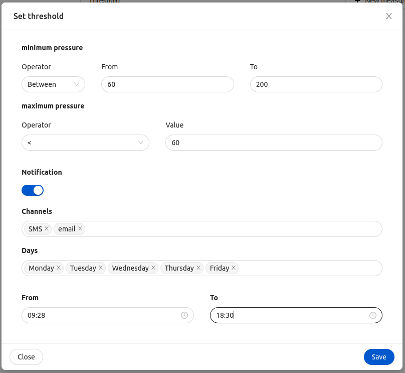

<!--
WARNING: this file was automatically generated by Mia-Platform Doc Aggregator.
DO NOT MODIFY IT BY HAND.
Instead, modify the source file and run the aggregator to regenerate this file.
-->

The `ck-threshold-modal` web component is a modal specialized in adding/modify a threshold to an already existing[Therapy and Monitoring Manager](../runtime_suite/therapy-and-monitoring-manager/overview) therapy/monitoring.


## Usage

The web component consists of a form inside a modal with dynamically generated fields based on a [Therapy and Monitoring Manager prototype](../runtime_suite/therapy-and-monitoring-manager/overview#prototypes). The component listens to the  [`therapy-config` event](../30_events.md#therapyconfig) emitted by [`ck-therapy-select` component](40_ck-therapy-select.md), which payload contains the `prototypeId`, the `planId`, and the `planType`. 

To fetch the prototype that defines which fields are shown in the modal, the `prototypeId` is used. The fetching is done using the URL set in the `prototypePath` property. The `prototypePath` should be set to [Therapy and Monitoring Manager GET /prototypes/ endpoint](../../therapy-and-monitoring-manager/usage#get-prototypes). 
Each [therapy/monitoring](../runtime_suite/therapy-and-monitoring-manager/overview#therapies) contains the relative thresholds. To retrive the thresholds the `planId` and the `planType` received in the `therapy-config`event payload are combined with the `planBasePath` property to generate the endpoint used to fetch the right plan. The `planBasePath` should be set to [Therapy and Monitoring Manager](../runtime_suite/therapy-and-monitoring-manager/overview) base path.

In addition to the form, the `ck-threshold-modal` also includes a section where users can set notification preferences for new detections that do not comply with the set threshold. Notification settings are retrieved from the endpoint specified in the `notificationPath` property. If `notificationEnabled` is set to false, the notification section is not present.

Once the form is submitted, the threshold fields are used to patch the relative therapy/monitoring threshold sections.

In order to open the `ck-threshold-modal` in a Microfrontend Composer, a configuration is needed to configure a button to emit the custom event `threshold-modal`. An example configuration follows: 

```
{
  "$ref": {},
  "content": {
    "attributes": {
      "style": "height: calc(100vh - 64px);"
    },
    "type": "row",
    "content": [
      {
        "type": "element",
        "tag": "bk-button",
        "properties": {
          "content": "New detection",
          "clickConfig": {
            "type": "event",
            "actionConfig": {
              "label": "threshold-modal",
              "payload": {}
            }
          }
        }
      },
      {
        "type": "element",
        "tag": "ck-threshold-modal",
        "properties": {
          "prototypePath": "tmm/prototypes/",
          "planBasePath": "tmm",
          "notificationPath": "tmm/notifications"
        }
      }
    ]
  }
}
```

## Properties & Attributes

| property | type | required | default | description |
|----------|------|----------|---------|-------------|
|`prototypePath`| string | true | / | Path to the Therapy and Monitoring Manager GET /prototypes/ endpoint. |
|`planBasePath`| string | true | / | Base path to the Therapy and Monitoring Manager. |
|`notificationPath`| string | true | / | Path used for fetch/update the notification settings. |
|`notificationEnabled`| boolean | false | true | If to show the notifications sections in modal |
|`width`| string | false | 800px | The width of the modal. It must a valid CSS value. |
|`height`| string | false | 500px | The minimum height of the modal. It must a valid CSS value. |

## Listens to

| event | action | emits | on error |
|-------|--------|-------|----------|
|threshold-modal| Triggers the opening or the closing of the modal. | - | - |
|therapy-config| Events that contains the information used by the modal to generate the forms' fields and post body | - | - |

## Emits

| event | description |
|-------|-------------|
|threshold-modal| Custom event, triggers the opening or the closing of the modal. |
