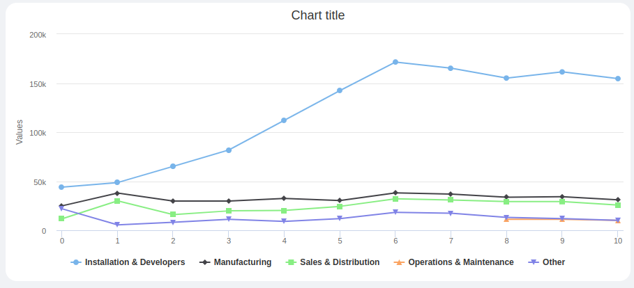

The `ck-chart` web component is a web-component able to display a chart. The component at its core uses the [Highcharts](https://www.highcharts.com/) library. 

## Usage



The `ck-chart` web-component is a web-component able to display Highcharts charts.

Highcharts, along side the default type `chart`, offers different type of charts: 
- [stock charts](https://www.highcharts.com/docs/stock/getting-started-stock)
- [map chart](https://www.highcharts.com/docs/maps/getting-started)
- [gantt chart](https://www.highcharts.com/docs/gantt/getting-started-gantt) 

It is possible to select the type of chart through the `constructorType` property. The accepted values are `chart`, `stockChart`, `mapChart`, and `ganttChart` where `chart` is the default value.

Through the `options` property, it is possible to customize the chart. As `options` you can use any valid [highcharts options](https://api.highcharts.com/highcharts/).

To handle the language of the chart, use the `labelOptions` property, where each language is identified by its unique ID (detected by the browser), and within each language, provide the translated labels. For example:

```json
"labelOptions": {
  "it": {
    "title": {
      "text": "Tasso di cambio USD-EUR nel tempo",
      "align": "left"
    },
    "subtitle": {
      "text": "Fare clic e trascinare nell'area del grafico per eseguire lo zoom",
      "align": "left"
    }
  },
  // Add more languages as needed
}
```

When a language is explicitly setted through the `options` parameter, it works as a fallback. For example:

```json
"options": {
  "title": {
    "text": "USD to EUR exchange rate over time",
    "align": "left"
  },
  "subtitle": {
    "text": "Click and drag in the plot area to zoom in",
    "align": "left"
  },
}
```

The data of the chart are retrieved from the endpoint set in the `dataEndpoint` property. 

:::info
The response of the endpoint is used to populate the `series` property of the highcharts options. So this field can be omitted in `options` property. 
:::


It is possible to filter the data shown in the chart, since the `ck-chart` web-component listens to the [change-query](/microfrontend-composer/back-kit/70_events.md#change-query) event. The `filters` property of every `change-query` event and `chart-filters` event is stringified and attached to the data endpoint as the `filters` query parameter. It is up to the backend service to parse the filters and return the filtered data.

Properties `urlMask` and `idKeys` are used to retrieve paramters from the URL. `idKeys` is the array of dynamic value keys mapped in the `urlMask`. For example, if the URL is `/dashboard/14alGw/example/JJ09nr` where `14alGw` and `JJ09nr` are the paramters to be extracted for the URL, the `urlMask` will be `/dashboard/:<key1>/example/:<key2>` and `idKeys` will be `[<key1>, <key2>]`. The parameters extracted from the URL are added to the query parameters with the associated key. 

:::info
If the URL as multiple dynamic parameters, but only a subset is needed inside the query parameters, you have to associate to each URL dynamic part a key in the `urlMask` and put inside the `idKeys` array only the useful one.
:::

An example configuration follows: 

```json
{
  "type": "element",
  "tag": "ck-chart",
  "properties": {
    "dataEndpoint": "api/v1/chartdata",
    "urlMask": "/dashboard/:userId/",
    "idKeys" : ["userId"],
    "options": {
      "chart": {
        "type": "line"
      }
    }
  }
}
```

## Properties & Attributes

| property | type | required | default | description |
|----------|------|----------|---------|-------------|
|`dataEndpoint`| string | true | '/' | Endpoint used to retrieve the data displayed on the chart. |
|`options`| object | true | {} | Object that contains the Highchart chart options. |
|`labelOptions`| object | true | {} | Object that contains the labels translations. |
|`constructorType`| string | false | 'chart' |String for chart constructor method. Valid values are `chart`, `stockChart`, `mapChart`, `ganttChart`|
|`urlMask`| string | false |`/:id` | url mask to apply to the current path to extract id dynamically. |
|`idKeys`| string[] | false |`['id']` | id keys in urlMask. |
|`interactiveTooltip`| boolean | false | if set to true a point tooltip is shown upon click, insted of the standard hover | 


## Listens to

| event | action | emits | on error |
|-------|--------|-------|----------|
|`change-query`| Triggers the fetching of the data with filters applied. | - | - |
|`chart-filters`| Triggers the fetching of the data with filters applied. | - | - |

## Emits

This component emits no event.
