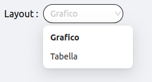

<!--
WARNING: this file was automatically generated by Mia-Platform Doc Aggregator.
DO NOT MODIFY IT BY HAND.
Instead, modify the source file and run the aggregator to regenerate this file.
-->

The `ck-layout-select` web component is used to switch between layouts.


## Usage
The `ck-layout-select` component accepts in its layout property the list of layouts that will be shown in the select options. A layouts is a object with two properties: `key` and `label`. The `key` property is a string and it must containt the key that identifies the layout. The `label` property is of type [LocalizedText](../../microfrontend-composer/back-kit/core_concepts#localization-and-i18n) and contatins the label that is used to display the layout in the select.

The select of an options emits a `change/layout` event containing the `key` of the selected layout.

An example configuration follows: 

```
{
  "$ref": {},
  "content": {
    "attributes": {
      "style": "height: calc(100vh - 64px);"
    },
    "type": "row",
    "content": [
      {
        "type": "element",
        "tag": "ck-layout-select",
        "properties": {
          "layouts": [
            {
              "key": "graph",
              "label": {
                "en": "Chart",
                "it": "Grafico"
              }
            },
            {
              "key": "table",
              "label": {
                "en": "Table",
                "it": "Tabella"
              }
            }
          ]
        }
      },
    ]
  }
}
```

## Properties & Attributes

| property | type | required | default | description |
|----------|------|----------|---------|-------------|
|`layouts`| [Layout](#layout) | true | [] | Array contating the layout list |


## Custom types

### Layout

```
Layout = {
  key: string
  label: LocalizedText
}
```

| property | type | description |
|----------|------|-------------|
| `key` | string | The identifier of the string. |
| `label` | [LocalizedText](../../microfrontend-composer/back-kit/core_concepts#localization-and-i18n) | The label displayed in the select|


**Example**

```
"layouts": [
  {
    "key": "graph",
    "label": {
      "en": "Chart",
      "it": "Grafico"
    }
  },
  {
    "key": "table",
    "label": {
      "en": "Table",
      "it": "Tabella"
    }
  }
]
```


## Listens to

| event | action | emits | on error |
|-------|--------|-------|----------|
|   -   |    -   |   -   |     -    |


## Emits

| event | description |
|-------|-------------|
|change/layout| Event that trigger the change of layout |
