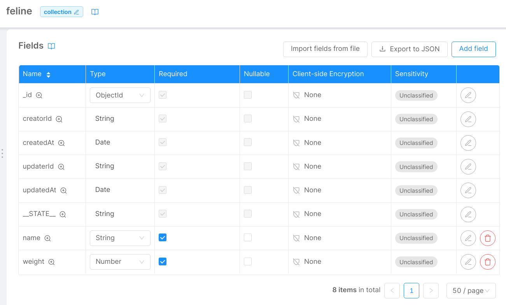
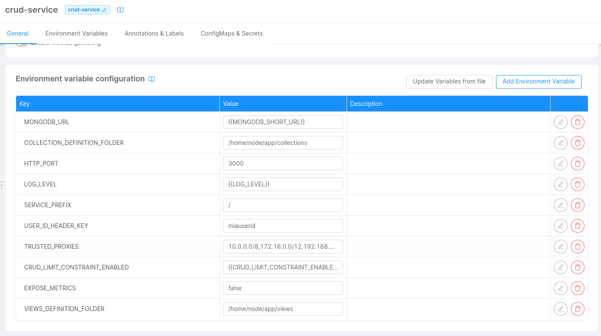
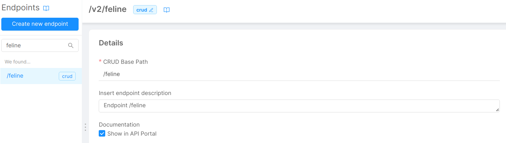

Here is a brief guide on how to use the CRUD Service in order to generate Mongo views that are reachable both internally (cms) and externally (with an external endpoint for the view)

## Quick guide for the creation of a view

* In the section `MongoDB CRUD` create the collection (that will become the view) with the same procedure used to create a traditional collection.
* Add to the `crud-service` the following environment variable:
    * **Key**: `VIEWS_DEFINITION_FOLDER`
    * **Value**: `/home/node/app/views` (any other value is valid)
* Add a new configmap to the `crud-service`:
    * **Configuration name**: `crud-service-views` (any other value is valid)
    * **Runtime Mount Path**: `/home/node/app/views` this must be equals to the value of the variable `VIEWS_DEFINITION_FOLDER`
* Add a file for each view that has to be created, inside the configmap just created:
    * **Name**: `<file_name>.json`
* Each file must be a json and defining the following properties:
    * `name`: name of the view, must be equals to the name of the CRUD created earlier
    * `source`: source collection from which to start with the mongo aggregation and the generation of the view
    * `type`: specifies the type, must be set to `view`
    * `pipeline`: array of objects containing the operations of aggregation to be executed on the source collection in order to obtain the view. The documents generated by the aggregation must follow the structure defined in the creation of the view related CRUD

**Example of file for a view**

```json
{
  "name": "feline",
  "source": "animals",
  "type": "view",
  "pipeline": [
    {
      "$match": {
        "family": "feline"
      }
    },
    {
      "$project": {
        "_id": 1,
        "name": 1,
        "updaterId": 1,
        "updatedAt": 1,
        "creatorId": 1,
        "createdAt": 1,
        "weight": 1,
        "__STATE__": 1
      }
    }
  ]
}
```

* *Optional*: expose the view with an external endpoint, with the same procedure of a common CRUD
* *Optional*: create a CMS page relative to the view, with the same procedure adopted to add a page bonded to an internal endpoint of a CRUD
* Save and deploy

## Practical example

This example will further define and detail the procedure of the creation of a MongoDB view.

### Description of the use case

For this example we will create a collection of animals: `animals`, with the following properties:

* `name`: string
* `weight`: number
* `family`: string (e.g.: *canine*, *feline*...)
* `specie`: string (e.g.: dog, cat, wolf, lion...)
* every default field of a collection (`__STATE__`, `_id`, `creatorId`, `createdAt`, `updaterId`, `updatedAt`)

This will be the source collection from which we will create a view, `feline`, which will show only `name`, `weight` and the default properties of an animal that belongs to the `feline` family. The fields will be the following: 

* `name`: string
* `weight`: number
* every default field of a collection (`__STATE__`, `_id`, `creatorId`, `createdAt`, `updaterId`, `updatedAt`)

The Mongo aggregation pipeline to obtain this view is the following: 

```json
 [
    {
      "$match": {
        "family": "feline"
      }
    },
    {
      "$project": {
        "_id": 1,
        "name": 1,
        "updaterId": 1,
        "updatedAt": 1,
        "creatorId": 1,
        "createdAt": 1,
        "weight": 1,
        "__STATE__": 1
      }
    }
  ]
```

Now the necessary steps for the proper creation of the `feline` view from console will be described (assuming that the `animals` collection has already been created with the traditional procedure of CRUD creation from console).

### Step 1

In the section `MongoDB CRUD` create the collection (that will become the view) with the same procedure used to create a traditional collection.

* Name: `feline`
* Internal Endpoint: `/feline`

Then add the fields inside the table `Fields`:

* `name`: string - required
* `weight`: number - required



It is not possible to define/create indexes for a view,in fact the view uses automatically the ones of the source collection. Those added by default will be ignored, likewise the other indexes added from the user.

Remember to change the `Default state` of the internal endpoint of the collection (`/feline`) to `PUBLIC` if the objective is to visualize the documents without specifying the query parameter `_st` inside the query string. Also the default state of the collections `animals` and `views`, unless there are some particular aggregations, should be equal (both `PUBLIC` or `DRAFT`).


### Step 2

In the `Microservices` section, go to the `crud-service` and move to the card `Environment variable configuration`. Once there, add the following environment variable:

* Key: `VIEWS_DEFINITION_FOLDER`
* Value Type: Plain Text
* Value: `/home/node/app/views` (This value can be changed according to the needs)



### Step 3

In the same microservice move to the section `Configmaps & Secrets`, under the readonly configmap `crud-service-collections` create a new configmap.

* Configuration name: `crud-service-views` (every other value is valid)
* Runtime Mount Path: `/home/node/app/views` this must be equal to the value of the variable `VIEWS_DEFINITION_FOLDER` defined at step 2
* It is not necessary to set to `true` the checkbox `Preserve files...`

Once done, create inside this new configmap a file that contains the definition of the `feline` view.

* Name: `feline-feline.json` 

This file will be filled with the following content that will define the fundamental properties for the generation of the view.

```json
{
  "name": "feline",
  "source": "animals",
  "type": "view",
  "pipeline": [
    {
      "$match": {
        "family": "feline"
      }
    },
    {
      "$project": {
        "_id": 1,
        "name": 1,
        "updaterId": 1,
        "updatedAt": 1,
        "creatorId": 1,
        "createdAt": 1,
        "weight": 1,
        "__STATE__": 1
      }
    }
  ]
}
```

* `name`: name of the view, must be equal to the CRUD name created in step 1
* `source`: source collection (`animals` in this case) from which to start with the mongo aggregation and the view generation
* `type`: specifies the type, must be set to `view` in order for the CRUD service to generate the collection defined in step 1, like a view
* `pipeline`: array of objects that contains the operations of aggregation to be executed on the source collection in order to obtain the view. The documents generated by the aggregation must follow the structure defined for the view in step 1

:::caution
It is suggested that the aggregation should generate documents with the default properties (`_id`, `creatorId`, `updatedAt`, `__STATE__`, ecc…). In particular `__STATE__` is necessary since when a `GET` request is performed to the internal endpoint, the query parameter for `__STATE__` will be automatically set to `PUBLIC`. A document without the `__STATE__` property would be filtered and not returned by the request.
:::


### Step 4 (Optional)

If desired, it is possible to expose the view (likewise the source collection) with externals endpoints in order to make it reachable and visible inside the API Portal. To do this just go to the section `Endpoints` and create a new one with the same procedure followed to create an endpoint for a normal CRUD.

:::info
Being a view, only GET requests will be permitted on its documents.
:::



### Step 5 (Optional)

If desired, it is possible to show the view documents inside the cms.
Visit the `CMS` section and create a new page (and a category if none is existing) that will connect to the internal endpoint of the view created as CRUD at step 1 (in this case `feline`).

:::info
Being a view, only GET requests will be permitted on its documents. For this reason, even if the CMS interface may result misleading in believing that the documents can be edited, no edit attempt on these documents will have a positive outcome.
:::

### Step 6 

Save the changes and deploy the project.
