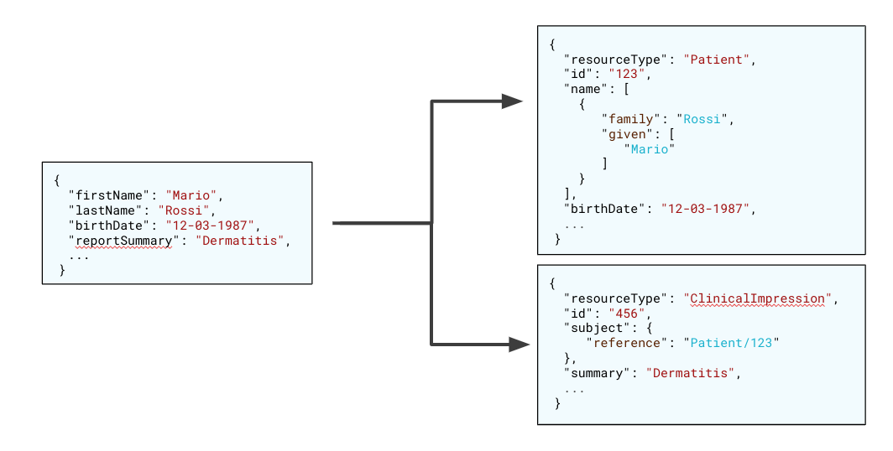

<!--
WARNING: this file was automatically generated by Mia-Platform Doc Aggregator.
DO NOT MODIFY IT BY HAND.
Instead, modify the source file and run the aggregator to regenerate this file.
-->

The FHIR Adapter is a microservice that is able to translate a JSON payload, with a non-standard and generic JSON Schema, into a JSON payload that satisfies the FHIR standard and store it in a FHIR server. Moreover, it is able to retrieve FHIR resources from a FHIR server and return them following a custom JSON Schema.

The goal of the FHIR Adapter is to enable the interoperability between systems which implement the FHIR standard and systems which do not. In this way, FHIR standard can be introduced in your ecosystem, without the need to update legacy systems.

The FHIR Adapter has to work with a FHIR Server. In the Mia-Platform [Marketplace](../../marketplace/overview_marketplace) there is a ready to use server, called Mia FHIR Server, that can be associate with the FHIR Adapter. However, any server that implements the FHIR standard can couple with the FHIR Adapter.

:::info
The following documentation is intended for users who have minimal knowledge of the FHIR standard. Therefore, it is kindly recommended to consult the [official FHIR documentation](http://hl7.org/fhir/).
:::

## Overview

The FHIR Adapter allows you to save and retrieve FHIR data from a FHIR Server using non-standard JSON payloads, exploiting a configuration to map the fields from a non-standard JSON to the fields of a standard FHIR JSON and vice versa.

In the following image, you can find an example of mapping. Let us suppose to have a JSON representing a clinical impression in a non-standard format. In the example, the custom clinical impression is composed by some information related to the patient, such as `firstName`, `lastName` and `birthDate`, and some information strictly related to the clinical impression. When switching to a FHIR context, this results in two separate entities with different field names and nesting.

Therefore, the FHIR Adapter is able to perform two main operations:

* Map a non-standard JSON to one or more JSON objects which follow the FHIR standard.
* Save the FHIR objects to the server and, in case of two or more FHIR JSON objects saved, manage the references between those objects.



## Usage

Despite the translation and saving logic inherent and configured in the plugin, it can be used as a service dedicated to the data storage, such as the *CRUD Service*.

The FHIR Adapter exposes APIs which allow to:

* read a collection and filter results
* find elements of a collection
* count number of elements in a collection
* create one or more elements in one or more collections
* update one or more elements in one or more collections
* delete one or more elements in one or more collections
* read the history of an element in a collection
* read the version of an element in a collection
* count number of versions of an element in a collection

### Conventions

We will use the following naming conventions:

* **collection**: a set of FHIR resources in the FHIR Server
* **entity**: an item in the context of the FHIR Adapter
* **resource** or **FHIR resource**: an item in the context of the FHIR Server, that be belongs to a FHIR Server collection
* **property**: a field of a resource
* **value**: the value of a property
* **query string**: the filter set in the url query
* **body**: the JSON data passed in a request

:::warning
There is a difference between the concept of item in the FHIR Adapter context and in the FHIR Server context. As exposed by the example schema above, a custom JSON object (**entity**) can be mapped to one or more FHIR JSON objects (**resource** or **FHIR resource**). Thus, in the following sections, we will refer to **entities** when referring to FHIR Adapter APIs and context.
:::

## FHIR Adapter Security

FHIR Adapter APIs must not be exposed directly to the Internet, but they must always be protected by the API Gateway or a BFF.

### API Key

If FHIR Adapter APIs are exposed under an API Key you have to pass the key into the request header with the name `client-key`.

**Example**

```bash
curl --request GET \
  --url 'https://your-url/v2/your-collection-name/' \
  --header 'accept: */*' \
  --header 'client-key: your-client-key'
```

## FHIR Adapter Endpoints

APIs configured with Mia-Platform can be consumed with any technology that supports HTTP protocol. For tests during development we recommend one of the following tools:

* [curl](https://curl.haxx.se/)
* [insomnia](https://insomnia.rest/)
* [postman](https://www.getpostman.com/)

In the examples for brevity we will use curl. The following are the typical operations that can be done with an APIRestful FHIR Adapter created with Mia-Platform.

All examples are sent to <https://your-url> Mia-Platfrom instance. We assume that the endpoints are only protected by API Key.

```json
client-key: client-key
```

If your endpoints are also protected by authentication and authorization you need to pass the access token to the curl command.

### Create

It is possible to create one or more resources in one or more collections. The number of created resources depends on the FHIR Adapter configuration.

To create one or more resources use *POST* request and pass, in the body of the request, the JSON representation of the new resource(s).
For example, if you want to add a patient object, you need to perform the following request:

```bash
curl --request POST \
  --url https://your-url/v2/patient/ \
  --header 'accept: application/json' \
  --header 'content-type: application/json' \
  --header 'client-key: client-key' \
  --data '{"firstName":"Mario","lastName":"Rossi","birthDate":"12-03-1987"}'
```

in response, you will get a JSON object like this:

```json
{
 "_id":"1234"
}
```

where **_id** is the unique identifier of the new resource inserted.

### Read

In this section you will see how to query a collection.

#### Get a list of resources

To list a collection, simply call the endpoint with a **GET**

```bash
curl -X GET https://your-url/v2/patient/ \
-H  "accept: application/json"  \
-H  "content-type: application/json" \
-H  "client-key: client-key"
```

In response of this request you will get a JSON array that contains all the resources of the collection. The sorting is by insertion.

```json
[
  {
    "_id": "1234",
    "firstName": "Mario",
    "lastName": "Rossi",
    "birthDate": "12-03-1987"
  },
  {
    "_id": "5678",
    "firstName": "Giovanni",
    "lastName": "Bianchi",
    "birthDate": "27-09-1998"
  }
]
```

#### Get a single entity by _id

To get just one entity, simply pass the *_id* of the document as path param.

To get just one document read only one element, simply pass the *_id* of the document as path param.

```bash
curl -X GET https://your-url/v2/patient/1234 \
-H  "accept: application/json"  \
-H  "content-type: application/json" \
-H  "client-key: client-key"
```

In response to this request you get a JSON Object like the following.

```json
{
  "_id": "1234",
  "firstName": "Mario",
  "lastName": "Rossi",
  "birthDate": "12-03-1987"
}
```

#### Sort

It is possible to sort the list of entities returned by a `GET` passing to the query string the **_s** parameter. The value of the parameter is:

```bash
[-|empty]<property name>
```

By default the sort id ascending, using - for descending. The following sort patient by firstname in alphabetical order.

```bash
curl --request GET \
  --url 'https://your-url/v2/patient/?_s=firstName' \
  --header 'accept: application/json' \
  --header 'client-key: client-key'
```

#### Paginate

By default GET returns a limited number of entities. You can use pagination to return more entities. Pagination accepts filters and sorts parameters.

To paginate you must use the following query parameters:

* **_l**: limits the number of documents returned. Minimum value 1. Maximum value is 500. If you pass such limit, the FHIR Adapter truncates to 500 the result.
* **_sk**: skip the specified number of documents. Minimum value 0. Maximum value is bigint.

This is an example of request that get *two documents per page* and you ask for the *third page* (skip 4 documents).

```bash
curl --request GET \
  --url 'https://your-url/v2/patient/?_l=2&_sk=4' \
  --header 'accept: application/json' \
  --header 'client-key: client-key'
```

Combining **_l** and **_sk** you can paginate the request. If you want to visualize the number of pages in your UI you need also count with a request the number of documents.

#### Count

It may be helpful to know how many documents contains a list of documents. For this purpose it is sufficient to invoke a GET on the /count of the resource

```bash
curl --request GET \
  --url https://your-url/v2/patient/count 
  --header "accept: application/json"
  --header "content-type: application/json"
  --header "client-key: client-key"
```

returns

```json
3
```

**Note**: filters can be applied to the count.

### Update

You can update an entity, that means updating one or more resources in one or more collections. The operations of the update are made by using a **PATCH** request, passing the *_id* of the entity as path param. In the body you have to pass a JSON with the `$set` operator. You can specify only the field you want to modify, without including all the entity properties.

**Example**

```bash
curl --request PATCH \
  --url https://your-url/v2/patient/1234 \
  --header 'Content-Type: application/json' \
  --data-raw '{
    "$set": {
      "firstName": "Giacomo",
    }
  }'
```

### Delete

You can delete an entity, that means deleting one ore more resources in one or more collections. To delete an entity use a DELETE request passing the *_id* as path param.

**Example**

```bash
curl --request DELETE https://your-url/v2/patient/1234
```

### History

You can retrieve the history of a FHIR resource. The operations of the update are made by using a **GET** request, passing the *_id* of the entity as path param and the adding the *_history* keyword at the end of the URL.

**Example**

```bash
curl --request GET \
  --url https://your-url/v2/patient/1234/_history
  --header "accept: application/json"
  --header "content-type: application/json"
  --header "client-key: client-key"
```

The endpoint accepts the query parameters **_sk** and **_l**, with the same behavior and constraints as for the read operations.

The response is an array where each contained object represents a version of the FHIR resource. This endpoint does not take into consideration the composition of the **entity** and returns the translation only for the main resource. For further info, please refer to the [Configuration section](configuration#translation).
In addition to the fields contained in the translation configuration, the FHIR Adapter, for each version item, add some metadata fields:

* **lastUpdate**: the datetime of the last update.
* **versionId**: the version referred to the version item.
* **currentVersion**: if the version item represents the current and last version.

The following JSON snippet represents an example of history:

```json
[
  {
    "_id": "1234",
    "firstName": "Mario",
    "lastName": "Rossi",
    "birthDate": "12-03-1987",
    "versionId": "2",
    "lastUpdate": "2022-01-01T00:00:00.000",
    "currentVersion": true
  },
  {
    "_id": "1234",
    "firstName": "Giovanni",
    "lastName": "Rossi",
    "birthDate": "12-03-1987",
    "versionId": "1",
    "lastUpdate": "2021-06-15T00:00:00.000",
    "currentVersion": false
  }
]
```
