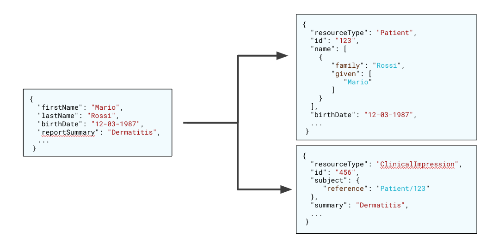
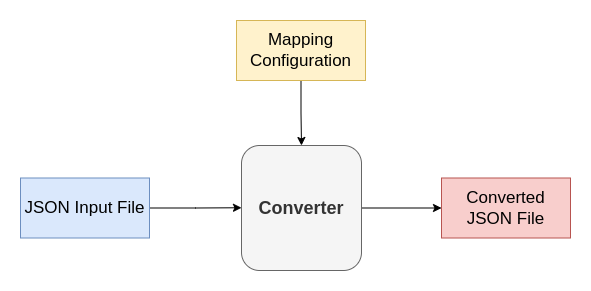

<!--
WARNING: this file was automatically generated by Mia-Platform Doc Aggregator.
DO NOT MODIFY IT BY HAND.
Instead, modify the source file and run the aggregator to regenerate this file.
-->

In order to work properly, the FHIR Adapter needs the setup of several configurations.

:::warning
The following documentation assumes a prior knowledge about the FHIR standard. For this reason, it is kindly recommend to read the [official FHIR documentation](http://hl7.org/fhir/) before configuring the service.
:::

## Environment variables

* **LOG_LEVEL** (default: `info`): level of the log. It could be trace, debug, info, warn, error, fatal.
* **CONFIG_PATH**: the path of the configuration file with the translation configuration.
* **FHIR_SERVER_BASE_PATH**: the base path of the FHIR Server related to the FHIR Adapter. The path must include the protocol. Example: `http://fhir-server/fhir/api`.
* **FHIR_ENCRYPTION_KEY**: the key used for the encryption. It must be composed by 32 characters.
* **FHIR_ENCRYPTION_IV**: the init vector used for the encryption. It must be composed by 16 characters.
* **FILE_DOWNLOAD_BASE_PATH**: the relative path as file location prefix.

## Translation

The configuration for the translation is expressed through a JSON file. The file is divided into 2 main sections: the definition of the FHIR references which compose an entity and the definition of the mappings.

In order to describe the translation configuration, we will use the following example:

```json
{
  "resource": "ClinicalImpression",
  "composition": [
    {
      "entityName": "Patient",
      "referencedByMainEntity": true,
      "refPropName": "subject.reference",
      "toSave": true,
    }
  ],
  "generic2FHIR": [
    ...
  ],
  "FHIR2generic": [
    ...
  ]
}
```

The configuration file is composed by 4 different main fields:

* **resource**: it is the name of the FHIR resource the mapping refers to. The name must be one of the available FHIR resources, since it used by the FHIR Adapter to contact the FHIR Server to save the resource. [Here](https://www.hl7.org/fhir/resourcelist.html) you can find the list of the available FHIR resources.

  :::warning Please note that the resource list must take into consideration the FHIR version the Server is using. :::

* **composition**: it is the list of the FHIR resources composing the entity. The entity you want to save via FHIR Adapter may be composed by several FHIR resources. The **composition** object field describes which are the FHIR resources which compose the entity, excluding the one defined as main resource.

  Thus, looking at the above example, you can see that the clinical impression entity has information that must be stored in two different FHIR resources: `Patient` and `ClinicalImpression`. Since `ClinicalImpression` is set as main resource of the configuration record, you only need to add `Patient` in the **composition** field object.

  The meaning of the fields in a composition object is defined below.

* **generic2FHIR**: it is the list of the mapping rules used to map a custom JSON to a FHIR standard JSON. In other words, is used in all those endpoint called with verbs `POST`, `PATCH` and `PUT`.

* **FHIR2generic**: it is the list of the mapping rules used to map a FHIR standard JSON to a custom JSON. In other words, it is used in all those endpoint called with `GET` verb.

:::note
Please note that the **generic2FHIR** and the **FHIR2generic** mappings may differ, since they can be configured independently.
:::

### Composition

A composition object is a JSON object that represents a dependency of the entity you want to save or retrieve from a FHIR Server. In order to better understand the configuration of the **composition** object field, let us recall the example used in the [Overview section](overview_and_usage#overview).



It is composed by the following fields:

* **entityName**: it is the name of the FHIR resource which compose the entity.
* **referencedByMainEntity**: it is a boolean value and it shows whether the child FHIR resource is referenced in the main resource or not. In the running example, we can see that the object `ClinicalImpression`, that is the main resource, refers to `Patient` in the JSON, in the field `subject.reference`. Thus, the value is `true`.

  On the contrary, in the case where child resource `Patient` references the main resource `ClinicalImpression`, the value should be `false`.

  :::info
  Please note that the user that configures the translation must know the JSON schemas for the resources defined in the FHIR standard.
  :::
* **refPropName**: it is the property where the reference to the child resource is contained. In the running example, it can be seen that the information about the `Patient` is contained in the nested field `subject.reference`.
* **toSave**: it is a boolean and it represents if the child resource must be saved in the FHIR Server. In the running example, the `Patient` information must be saved in the FHIR Server, so the value is `true`.

  On the opposite, there may be cases in which the child resource information is included in the input custom JSON but they do not need to be saved. An example is the case in which that child resource, i.e. `Patient` in the example, already exists. In such a case the value should be `false` and a further field called `entityId` must be specified in the configuration.
* **entityId**: it is the property name in the input payload that represents the identifier of the child resource. As said in the previous point, you can decide to not save a child resource if it has been already inserted. However, it is necessary to include a property in the input payload with the identifier of the child resource, to allow the FHIR Adapter to add the reference to the already existing resource.

  In the running example, let us suppose that the `Patient` child resource is not saved when adding a new `ClinicalImpression` resource. In such a case, the configuration for the child resource `Patient` will be:

  ```json
  {
    "entityName": "Patient",
    "referencedByMainEntity": true,
    "refPropName": "subject.reference",
    "toSave": false,
    "entityId": "subject"
  }
  ```

  In the input body you will then specify the identifier of the existing resource in the `subject` field. For instance, a possible JSON body could be:

  ```json
  {
    "subject": "123",
    "reportSummary": "summary",
    ...
  }
  ```

### Mapping rules

The mapping of the JSON fields between a custom and FHIR standard format, and vice versa, is defined, respectively, in the objects `generic2FHIR` and `FHIR2generic`, which are array that contains several JSON objects, each one representing a mapping rule.

The mapping procedure is schematized in the following picture:



The mapping rule schema is the following:

```json
{
  "title": "Mapping Configuration",
  "description": "A Mapping Configuration",
  "type": "array",
  "items": {
    "$ref": "#/$defs/mapInstance"
  },
  "$defs": {
    "mapInstance": {
      "type": "object",
      "required": [ "sources", "destination"],
      "properties": {
        "sources": {
          "type": "object",
          "description": "The name of source properties.",
          "properties": {
              "props": {
                "type": "array",
                "description": "The name of the source properties."
              },
              "value": {
                "type": "string",
                "description": "The value of the source."
              },
              "concatString": {
                "type": "string",
                "description": "The string used for property concatenation. Default: 'whitespace'."
              },
              "defaultValue": {
                "type": "string",
                "description": "The value assigned to the property in case the source is 'undefined'."
              }
          },
          "oneOf": [
            { "required": ["props"] },
            { "required": ["value"] }
          ]
        },
        "destination": {
          "type": "string",
          "description": "The name of destination property."
        },
        "outputFormat": {
          "type": "object",
          "description": "The output format",
          "required": ["type"],
          "properties": {
            "type": {
              "type": "string",
              "description": "The output format type"
            },
            "valueMap": {
              "type": "array",
              "description": "The value map rules",
              "items": {
                "$ref": "#/$defs/valueMapInstance"
              }
            }
          }
        }
      }
    },
    "valueMapInstance": {
      "type": "object",
      "required": [ "from", "to"],
      "properties": {
        "from": {
          "type": "string",
          "description": "The source value"
        },
        "to": {
          "type": "string",
          "description": "The destination value"
        }
      }
    }
  }
}
```

To facilitate understanding, the translation operations that can be performed using the mapping rules are shown below:

* Map between a property from the input file to the output file *(1:1 mapping)*

  ```json
  {
    "sources": {
      "props": ["FirstProp"],
    },
    "destination": "OutputProp"
  }
  ```

* Map between a set of properties from the input file to the output file *(N:1 mapping)*. The properties are concatenated in string format. In this case a `concatString` property is used to define the string to use in the concatenation. If not set the default is `whitespace`. If `props` has only one element, `concatString` will be ignored.

  ```json
  {
    "sources": {
      "props": ["FirstProp", "SecondProp"],
      "concatString": " ",
    },
    "destination": "OutputProp"
  }
  ```

* Create a property in the output file with a specific file with no mapping from the input file.

  ```json
  {
    "sources": {
      "value": "Value",
    },
    "destination": "OutputProp"
  }
  ```

* Map a value from a nested property from the input file to another nested property to the output file. Consequently, the mapping must be able to assign a value from a property in the input file to an array item in the output file, and viceversa.

  ```json
  {
    "sources": {
      "props": ["inputProperty"],
    },
    "destination": "obj.array.0.prop"
  }
  ```

* Define a default value for the destination value in case the input value is `undefined`. The format can be defined for 1:1 mapping rules, i.e. where `props` array has length equal to 1. The available `outputFormat` types are `string` and `object`.

  ```json
  {
    "sources": {
      "props": ["inputProperty"],
      "defaultValue": "Default Value"
    },
    "destination": "obj.array.0.prop"
  }
  ```

* Define a format for the destination value. The format can be defined for 1:1 mapping rules, i.e. where `props` array has length equal to 1. The available `outputFormat` types are `string` and `object`.

  ```json
  {
    "sources": {
      "props": ["inputProperty"],
    },
    "destination": "obj.array.0.prop",
    "outputFormat": {
      "type": "string"
    }
  }
  ```

  :::info The output format type `object` converts a string input that represents a valid JSON. :::

* Define a value mapping for the destination value. The value mapping can be defined for 1:1 mapping rules, i.e. where `props` array has length equal to 1. The value mapping can be defined if the output format type is `string`. If value mapping does not exist for a specific input value, the output will be the input value as-is.

  ```json
  {
    "sources": {
      "props": ["status"],
    },
    "destination": "__STATE__",
    "outputFormat": {
      "type": "string",
      "valueMap": [
        {
          "from": "ACTIVE",
          "to": "PUBLIC"
        },
        ...
      ]
    }
  }
  ```

  :::info Properties in the input file which do not have a corresponding mapping will be ignored by the converter without log any warn or error about it. Thus, the properties which are not mapped will be lost. Every property that must be present in the output file must have one (or more) related mapping rules :::

* Map between a property from the input file contained in array object to the output file, preserving the array format.

  ```json
  {
    "sources": {
      "props": ["data.$.key"],
    },
    "destination": "output.$.key",
  }
  ```

:::warning
In the **FHIR2generic** mappings, in the `destination` field the first nested level must be the name of the target resource.
The same hold for the **generic2FHIR**. In this case the source resource must be defined in the first nested level of the `props` values.
For further information, please refer to the following running example.
:::

## Running Example

To better understand the translation configuration, let us take an overview on a real-case scenario configuration.

In the following JSON snippet you can find the full configuration for the `ClinicalImpression` example used in the documentation. The translate configuration is defined for the `ClinicalImpression` FHIR resource, that contains also information about the `Patient`, defined in the **composition** section.

In the **generic2FHIR** section you can find the mapping rules for the running example for the translation from a custom format to the FHIR format.

:::info
Please note that the `resourceType` is defined as constant value for both `Patient` and `ClinicalImpression` resource, because the FHIR JSON object need to explicitly define the resource type.
:::

In the **FHIR2generic** section you can find the mapping rules for the running example for the translation from FHIR format to custom format.
From the example you can see that the **FHIR2generic** translation differs from the **generic2FHIR** one. Indeed, in the **FHIR2generic** we collect the name and surname in a unique field, and the summary is represented by a field with another property name.

```json
{
  "config": [
    {
      "resource": "ClinicalImpression",
      "composition": [
        {
          "entityName": "Patient",
          "referencedByMainEntity": true,
          "refPropName": "subject.reference",
          "toSave": true,
        }
      ],
      "generic2FHIR": [
        {
          "sources": {
            "value": "Patient",
          },
          "destination": "Patient.resourceType"
        },
        {
          "sources": {
            "props": ["firstName"],
          },
          "destination": "Patient.name.0.given.0"
        },
        {
          "sources": {
            "props": ["lastName"]
          },
          "destination": "Patient.name.0.family"
        },
        {
          "sources": {
            "props": ["birthdate"]
          },
          "destination": "Patient.birthDate"
        },
        {
          "sources": {
            "value": "ClinicalImpression"
          },
          "destination": "ClinicalImpression.resourceType",
        },
        {
          "sources": {
            "props": ["reportSummary"]
          },
          "destination": "ClinicalImpression.summary"
        }
      ],
      "FHIR2generic": [
        {
          "sources": {
            "props": ["Patient.name.0.given.0", "Patient.name.0.family"],
          },
          "destination": "name"
        },
        {
          "sources": {
            "props": ["Patient.birthDate"]
          },
          "destination": "birthdate"
        },
        {
          "sources": {
            "props": ["ClinicalImpression.summary"]
          },
          "destination": "summary"
        }
      ]
    },
    ...
  ]
}
```
