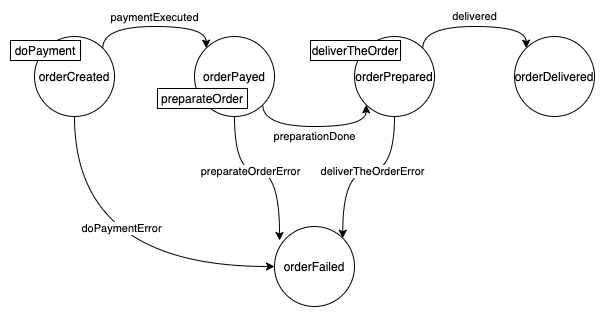

# How it works

In this page will be explained the how the _Flow Manager_ works.

Following the core concepts of the _Flow Manager_:

- [Finite State Machine](#the-finite-state-machine)
- [commands/events approach](#commands-events-approach)
- [service metadata](#service-metadata)
- [data persistency and consistency](#data-persistency-and-consistency)

## The finite state machine

As mentioned in the [service introduction](../#introduction), the _Flow Manager_ is based on a _Finite State Machine_.

More precisely it receives a finite state machine in a configuration file (in a section of it) and, thanks to it, can handle the Saga flow how described into the machine.

!!! warning
    The _Flow Manager_ is not capable to understand if a finite state machine is a valid one, if there are loops and so on, it just configures itself and follows the configured flow.

Every state of the machine can have its properties, for example:

- the command to send when the saga lands on the state and the channel to be used for it
- the expected events and, for each one, the destination state
- other details

Look at the [machine definition](../configuration/#machine-definition) configuration section for more technical details on how to configure your _Finite State Machine_.

### Business states

The _Flow Manager_ has the concept of **Business States**, useful to discern the internal states (of the _Finite State Machine_) to the states that matter for the business.

Each business state can contain one or more states of the machine.

"States that matter for the business" means that a business state represents a state of the _Saga_ that is not "Intermediate", that symbolizes what is the whole saga status.

Let's explain it with an example based on the usual _Finite State Machine_:

The image above contains all the internal states of the _Saga_, but not all states could be important for the business. For example, the business could care about:

- the order is created &rarr; **0**
- the order is payed &rarr; **1**
- the order is delivered &rarr; **2**
- the order is failed &rarr; **3**

When an order is payed, the _businessState_ will be **1** and, when the preparation is done, the _businessState_ will be **1** again, because is not an information that matter.

The one above is just a very simple example that just excludes one _Finite State Machine_ from the business states, but in real cases with we worked the business states are less than half of the _Final State Machine_ ones.

!!! note
    The **business states** are a superset of the machine that represents the states of the saga that matter for its business.

## Commands events approach

The _Flow Manager_, to correctly handle the saga flow, needs the support of other actors, or, microservices that execute the tasks to move forward the saga.

To do this, the service uses the _command/event_ approach, or:

- every time that the saga goes in a new state, the _Flow Manager_ sends a **command** (if expected into the current state) through the specified channel
- another service listens the command, executes it and replies with a **event** into the expected channel
- the _Flow Manager_ listens the event from the channel and, if is a expected event in the current state, goes to the next state, related to the event

!!! warning
    **NB.** if an event is unexpected in the current state, the _Flow Manager_ will log an error and will ignore it.

Usually the following are the best practices for events and commands:

- **commands** should be imperative, as:
    - doPayment
    - prepareOrder
    - shipTheOrder

- **events** should be to the past:
    - paymentDone
    - orderPreparated

- **error events** should be like the command, with the _Error_ suffix:
    - doPaymentError
    - prepareOrderError

### Sample flows

Followind some sample flow based on the following finite state machine, in which the rectangles indicate the commands of each state:

#### Happy flow

- _Flow Manager_:
    - creates the saga (the order)
    - moves the order in **orderCreated** state
    - sends the **doPayment** command
- a _Payment Service_:
    - successfully elaborates the payment
    - sends the **paymentExecuted** event
- _Flow Manager_:
    - listens the **paymentExecuted** event
    - moves the order in **orderPayed** state
    - sends the **preparateOrder** command
- ... and so on

#### Error flow

- _Flow Manager_:
    - creates the saga (the order)
    - moves the order in **orderCreated** state
    - sends the **doPayment** command
- a _Payment Service_:
    - listens the **doPayment** command
    - successfully elaborates the payment
    - sends the **paymentExecuted** event
- _Flow Manager_:
    - listens the **paymentExecuted** event
    - moves the order in **orderPayed** state
    - sends the **preparateOrder** command
- a _Preparation Service_:
    - listens the **preparateOrder** command
    - throws a error during the order preparation
    - sends the **preparateOrderError** event
- _Flow Manager_:
    - listens the **preparateOrderError** event
    - moves the order in **orderFailed** state

#### Flow with unexpected event

- _Flow Manager_:
    - creates the saga (the order)
    - moves the order in **orderCreated** state
    - sends the **doPayment** command
    - listens a **preparationDone** event
    - logs an error for the unexpected event and ignores it

## Service metadata

The _Flow Manager_ is a platform core service and this implies that it must be generic and configurable with each _Saga_ flow.

To do this, it cannot know the nature of the data behind a saga, it cannot know if the _Saga_ represents a _Food delivery order_, a _Ecommerce order_ or other.

For this reason the service is agnostic and does not know anithing about the data related to the saga, but how can it handle it so?

It handles the saga data with the concept of **metadata**.

The **metadata** are all the data strictly related to the specific saga, different for each _Saga_ flow, e.g:

- the food delivery order metadata could contain:
    - the list of ordered plates
    - the total price
    - the address
    - ... and so on

- the alarm reporting from IoT sensors in a house could contain instead:
    - the alarm types
    - the channels used to notify the user
    - the alarms timestamps
    - the current alarms states
    - ... and so on

### Saga data structure

The saga data is splitted, to allow the _Flow Manager_ to be generic, in a static part and in a dynamic part.

The static part is the common _Saga_ data, or, data that all sagas have:

- the **Saga ID** (generated by the _Flow Manager_ when the saga is created)
- the **current state** of the saga
- an **associated entity ID**, that is the ID of the core entity related to the saga, e.g:
    - for a _Food Delivery order_ it could be the order ID
    - for a _Payment flow_ it could be the ID of the title to pay
- the **business state ID** (see [business states](#business-states))
- the **business state description** (see [business states](#business-states))
- the **history** of the saga (a list with the events and the related timestamp)
    - **NB.** the _history_ is not handled by the _Flow Manager_ right now, but from the [_Persistency Manager_](#the-persistency-manager)
- the **isFinal** flag, that indicates if the current state is a final one (**deprecated**)

!!! note
    All the fields above are common filds of the saga and are not related to the specific case

### Metadata handling

As mentioned above, the saga has a static part and a dynamic one. The dynamic one is represented by the **metadata**, that are all the data strictly related to the specific _Saga_ flow and depends by the saga nature.

The **metadata** is just a [JSON Object](https://www.w3schools.com/js/js_json_objects.asp) with all the data useful for the _Saga_ flow. The content of this field is completely unknown to the _Flow Manager_.

In the [data persistency and consistency](#data-persistency-and-consistency) section will be explained how the _Flow Manager_ handles the **metadata**.

## Data persistency and consistency

The purpose of the _Flow Manager_ is to guarantee the data consistency.

To do this, the service should be the only one to manipulate the _Saga_'s data and [**metadata**](#service-metadata).

Actually the service can be the only one to read the data too, because it makes sure to provide all **metadata** to other services.

Specifically the service does the following steps to ensure the data consistency:

- when the _Flow Manager_ sends a **command**, it puts into the command payload all the _Saga_'s metadata, to allow the service that will handle the command to know all about the saga without read from the database

- when the _Flow Manager_ listens a **event**, it does the following actions:
    - takes the **metadata** from the event payload (that should be only the new metadata, added during the command handling by the specific service)
    - takes the current _Saga_'s metadata from the database
    - merges the current metadata with the new metadata
    - saves the merged metadata into the database
    - if a command must be sent, it puts the merged metadata into the payload

With the behavior explained above, the _Flow Manager_ can guarantee:

- to be the only one to edit the _Saga_'s data
- to provide all metadata to the "side services" that will listen to the commands, so that the "side services" don't need to read it from the database

Obviusly some other service could need to read from the _Saga_'s database, it's not a problem, the important thing is that **the _Flow Manager_ should be the only one to write on it**.

### The persistency manager

The _Flow Manager_ has not a direct link to the database, because it does not know the kind of the database and so on.

To read/write data it needs another actor, the **Persistency Manager** ([configured into the configurations file](../configuration/#persistency-manager)).

The tasks of the **Persistency Manager** are to:

- provide a method to [**upsert**](https://en.wiktionary.org/wiki/upsert) a saga by receiving all its data (it sould handle the _history_ too, until it is not handled by the _Flow Manager_ directly)

- provide a method to **get** a saga, that must return:
    - the _current state_
    - the _Saga_'s _metadata_
