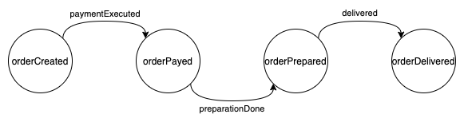
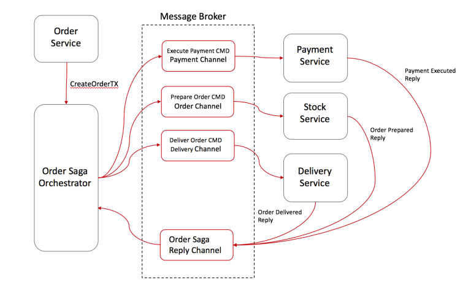

# Flow Manager

The _Flow Manager_ is a saga orchestrator, capable to manage flows structured by using the Architectural pattern named [**Saga Pattern**](https://blog.couchbase.com/saga-pattern-implement-business-transactions-using-microservices-part/) and, in particular, the [Command/Orchestration approach](https://blog.couchbase.com/saga-pattern-implement-business-transactions-using-microservices-part-2/).

## Introduction

The _Flow Manager_ receives a [_Finite State Machine_](https://brilliant.org/wiki/finite-state-machines/) through a configuration file and is capable to orchestrate the saga flow based on the received machine.

To handle the flow it needs other "actors", or, services that listen the _Flow Manager_ commands and reply with events (later will be explained the commands/events approach) through a common channel, usually a [_Message Broker_](https://www.ibm.com/cloud/learn/message-brokers).

Let's explain with an example of a well-known flow, the _Ecommerce_ one.

The following schema contains a simple _Ecommerce_ finite state machine (for simplicity, error flows are omitted):

The _Flow Manager_, with this _Finite State Machine_, can orchestrate the saga flow through the states above, working like in the following image (the _Flow Manager_ is the _Order Saga Orchestrator_):

As you can see in the flow above, every step is managed by the _Flow Manager_, named _Order Saga Orchestrator_ in the example above, so the flow could be the following:

- the user creates the order
- the _Order Service_ forwards a creation request to the _Flow Manager_
- the _Flow Manager_ sends the `executePayment` _command_ to the _Message Broker_
- the _Payment Service_, unknown to the _Flow Manager_, handles the command and replies with a `paymentExecuted` event
- the _Flow Manager_ listens the `paymentExecuted` event, handles it and replies with the `prepareOrder` command
- the _Stock Service_ handles the command and replies with a `orderPrepared` event
- the _Flow Manager_ listens the `orderPrepared`, handles it and replies with the `deliverOrder` command
- the _Delivery Service_ handles the command and replies with a `orderDelivered` event
- the flow is complete

As in the example above, the _Flow Manager_ is the core of the _Saga_, contains all the _business logic_ and orchestrates the flow.

More of the information above are about the _Saga Pattern_, _Command/Orchestration_ approach, go ahead into the documentation to know the details about the _Flow Manager_.

## Simple Flow Manager based architecture

To make the _Flow Manager_ architecture clearer, following some diagram of a "_Flow Manager_ based" microservices architecture.

In the example there are the following components (microservices):

- **flow-manager**: the _Flow Manager_ microservice
- **persistency-manager**: the _Persistency Manager_ microservice (see the dedicated documentation [here](./how-it-works/#the-persistency-manager))
- **order-service**: a sample microservice that starts the saga
- **microservice-n**: some microservice that collaborate to continue the saga

The architecture above is simply feasible with the dev console, as showed in the following image:

Following two architectures diagrams, based on differents communication protocols (see the dedicated documentation [here](./configuration/#communication-protocols)):

**Flow Manager architecture with message broker**

 

**Flow Manager architecture with REST protocol**

## Further details

Follow the pages below for more about the _Flow Manager_:

- [_Flow Manager_ - how it works](./how-it-works.md)

- [_Flow Manager_ configuration](./configuration.md)
