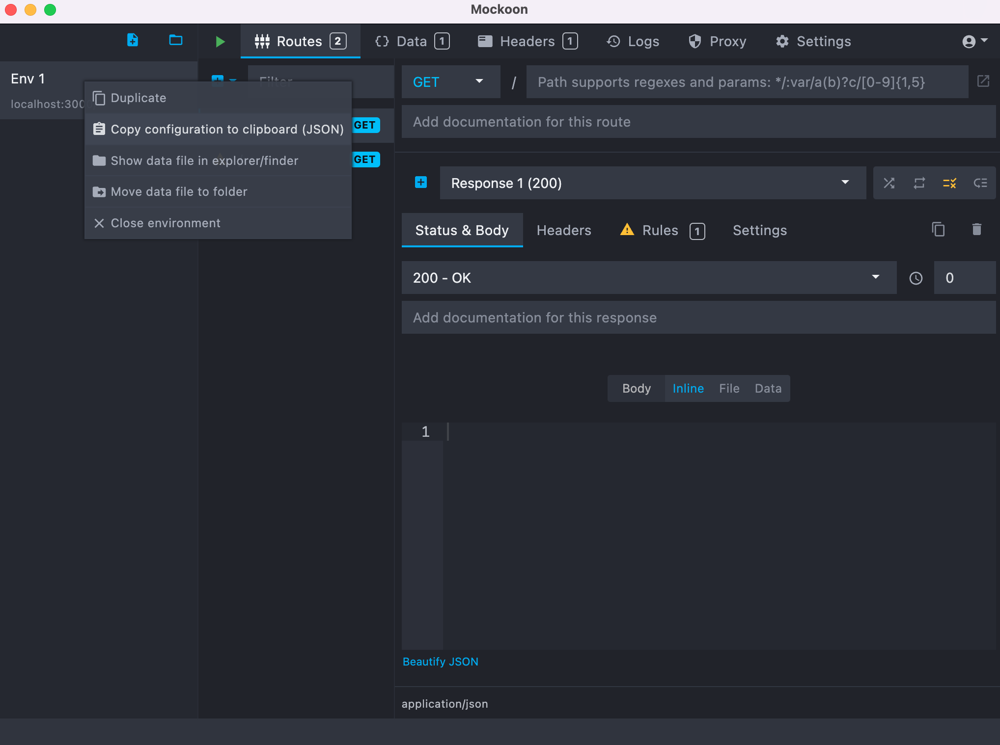

In the simplest case, the Mockoon Mock Service plugin requires just a JSON file to be configured. the JSON files defines the interface of the mock server as well as its behavior.

This JSON file can be produced manually or, more conveniently, by means of the [Mockoon Desktop App](https://mockoon.com/download/), as shown in the following image.

:::warning
The default configuration of the plugin expects the mock server to answer on port `3000`. You can set the port of your mock server within the [Mockoon Desktop App](https://mockoon.com/download/). If you want your mock server to answer on a different port, remember to update the configuration of the plugin.
:::
