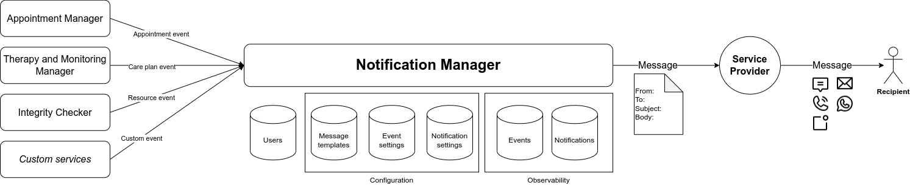
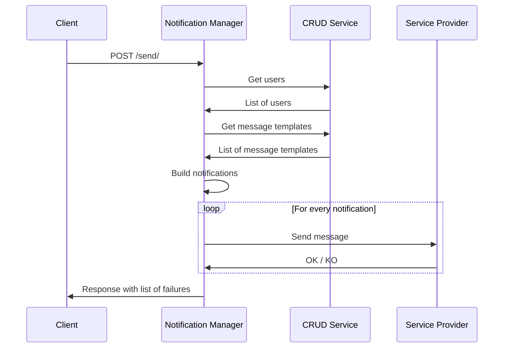
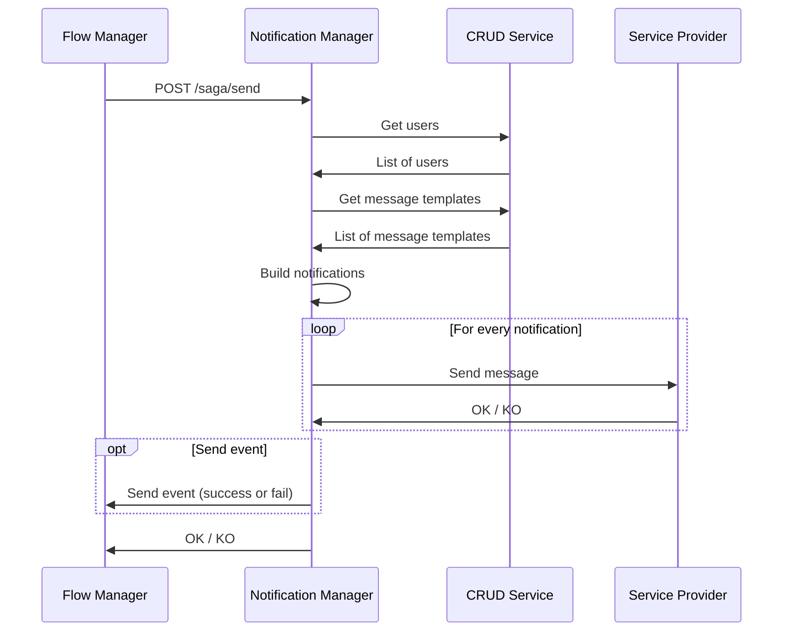
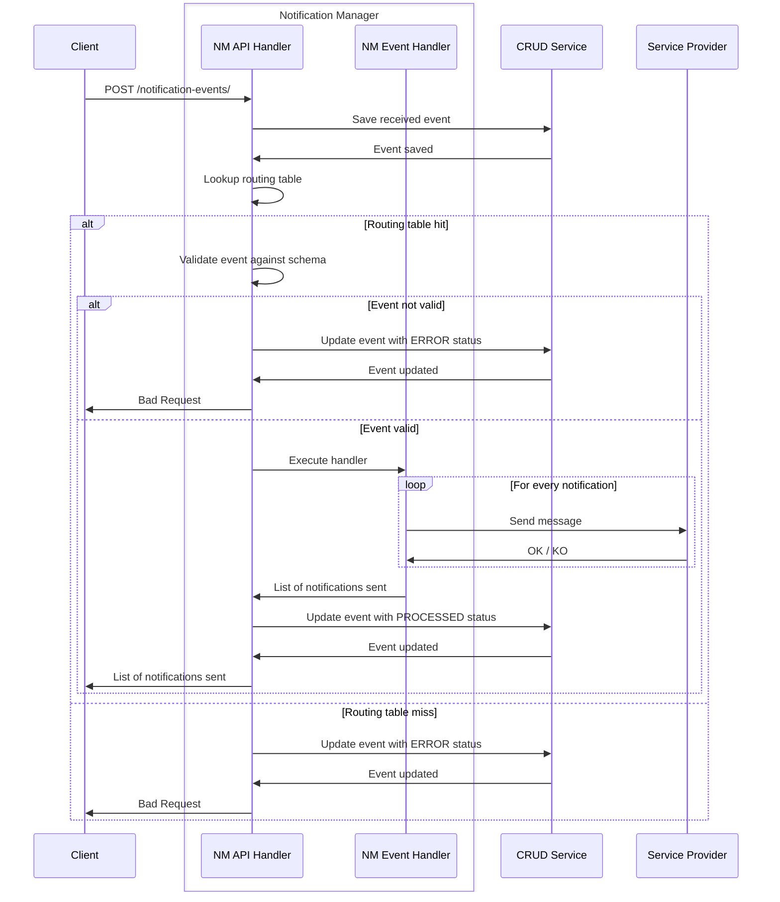
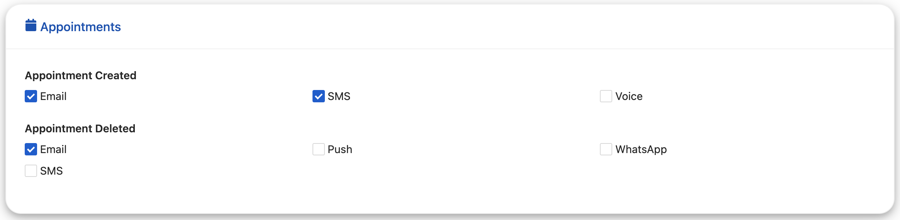

<!--
WARNING: this file was automatically generated by Mia-Platform Doc Aggregator.
DO NOT MODIFY IT BY HAND.
Instead, modify the source file and run the aggregator to regenerate this file.
-->

The Notification Manager provides an HTTP interface to send notifications to users through various channels, namely **email**, **SMS**, **push notification**, **voice** and **whatsapp**.

The following image provides an overview of the system architecture:



You can send notifications in three different ways:

- manually, sending a request to the `POST /send` endpoint, passing the channels, recipients, template, … in the request body;



- manually, sending a [Flow Manager][flow-manager] command to the `POST /saga/send` endpoint (see the [configuration][configuration-flow-manager] section for more information);



- automatically, when specific events occur: configure one or more notification settings telling the Notification Manager which notifications to send when a certain event occurs and notify when an event occurs by calling `POST /notification-events/`.



:::caution

In order to send a message through a particular channel, you need to deploy the corresponding plugin.
This is not needed for the **whatsapp** and **voice** channels, for which there is a direct interaction with Kaleyra APIs.

:::

:::caution

When using the HTTP interface, the request headers are not forwarded to the external services, including the four plugins mentioned above and the CRUD Service.
If you need to customize the requests sent to the external services, you should write a custom handler, as explained in the [*Configuration* sections][custom-handlers].

:::

## Channels

Each channel has external dependencies, including other Mia-Platform plugins, service providers accounts and specific fields on the message templates and users CRUD collections.

### Email

To send emails, you need to configure the [SES Mail Notification Service][ses-mail-notification] and set the [`MAIL_SERVICE_URL` environment variable][environment-variables] with its internal URL.

If you are going to send attachments, you also need to configure the [Files Service][files-service] and set the [`FILE_SERVICE_URL` environment variable][environment-variables] with its internal URL.

In the [service configuration][service-configuration], you must set the following fields:

- `activeChannels` must include the `email` value;
- `sender.email` must provide the email address that will appear as the sender of emails;
- `userFields.emailAddress` should specify the custom name of the `emailAddress` field of the [*users* CRUD collection][crud-users].

Message templates need the following fields in the [*templates* CRUD collection][crud-templates]:

- `emailTitle`: the email subject;
- `emailMessage` or `emailHtmlMessage`: the content of the email (as HTML or plain text, HTML is used by default if both are set);
- `emailAttachments` (only if you send attachments): list of files to send as attachments.

Email recipients need the following fields in the [*users* CRUD collection][crud-users]:

- `emailAddress`: if the field has a different name in your collection, remember to set the custom name in the [service configuration][service-configuration] `userFields.emailAddress` field.

### SMS

To send SMS messages, you need to configure the [SMS Service][sms-service] and set the [`SMS_SERVICE_URL` environment variable][environment-variables] with its internal URL.

In the [service configuration][service-configuration], you must set the following fields:

- `activeChannels` must include the `sms` value;
- `sender.sms` must provide the phone number or alphanumeric ID that will appear as the sender of SMS messages;
- `userFields.phoneNumber` should specify the custom name of the `phoneNumber` field of the [*users* CRUD collection][crud-users].

Message templates need the following fields in the [*templates* CRUD collection][crud-templates]:

- `smsMessage`: the body of the SMS message.

SMS message recipients need the following fields in the [*users* CRUD collection][crud-users]:

- `phoneNumber`: if the field has a different name in your collection, remember to set the custom name in the [service configuration][service-configuration] `userFields.phoneNumber` field.

### Push notifications

To send push notifications, you need to configure a Kafka cluster and the [Kafka2Firebase Service][kafka2firebase] and set all the [`KAFKA_*` environment variables][environment-variables] accordingly.

In the [service configuration][service-configuration], you must set the following fields:

- `activeChannels` must include the `push` value;
- `userFields.deviceToken` should specify the custom name of the `deviceToken` field of the [*users* CRUD collection][crud-users].

Message templates need the following fields in the [*templates* CRUD collection][crud-templates]:

- `pushTitle`: the notification title;
- `pushSubtitle`: the notification subtitle;
- `pushMessage`: the notification message;

or, as an alternative, just one:

- `pushData`: the full notification payload, which overrides the `pushTitle`, `pushSubtitle` and `pushMessage` fields.

Push notification recipients need the following fields in the [*users* CRUD collection][crud-users]:

- `deviceToken`: if the field has a different name in your collection, remember to set the custom name in the [service configuration][service-configuration] `userFields.deviceToken` field.

### Voice calls

To send voice calls, you need to create a [Kaleyra account][kaleyra-account] and set the [`KALEYRA_API_BASE_URL`, `KALEYRA_API_KEY` and `KALEYRA_API_SID` environment variables][environment-variables] with the Kaleyra base URL, API key and SID respectively.

In the [service configuration][service-configuration], you must set the following fields:

- `activeChannels` must include the `voice` value;
- `sender.voice`: the phone number of the caller registered in the [Kaleyra console][kalyera-manage-numbers];
- `userFields.phoneNumber`: the custom name of the `phoneNumber` field of the [*users* CRUD collection][crud-users];
- `voice.retryCount`: the number of call attempts that will be tried if the user doesn't pick up;
- `voice.speechSpeed`: the speed of the text-to-speech;
- `voice.speechLanguage`: the language of the text-to-speech.

Message templates need the following fields in the [*templates* CRUD collection][crud-templates]:

- `voiceMessage`: the voice message.

The recipients need the following fields in the [*users* CRUD collection][crud-users]:

- `phoneNumber`: if the field has a different name in your collection, remember to set the custom name in the [service configuration][service-configuration] `userFields.phoneNumber` field.

### WhatsApp messages

To send voice calls, you need a [Kaleyra account][kaleyra-account], enable the WhatsApp channel and set the [`KALEYRA_API_BASE_URL`, `KALEYRA_API_KEY` and `KALEYRA_API_SID` environment variables][environment-variables] with the Kaleyra base URL, [API key and SID][kaleyra-api-key-sid] respectively.

In addition, you need to create a separate [WhatsApp Business account][whatsapp-business-account], linked to your [Kaleyra account][kaleyra-whatsapp], and a valid [WhatsApp phone number][whatsapp-phone-number].

In the [service configuration][service-configuration], you must set the following fields:

- `activeChannels` must include the `whatsapp` value;
- `sender.whatsappPhoneNumberId`: the [WhatsApp phone number][whatsapp-phone-number];
- `userFields.phoneNumber`: the custom name of the `phoneNumber` field of the [*users* CRUD collection][crud-users];

Message templates need the following fields in the [*templates* CRUD collection][crud-templates]:

- `whatsappTemplateName`: the name of the WhatsApp template;
- `whatsappTemplateParameters`: the [parameters][kaleyra-template-params] of the WhatsApp template.

The recipients need the following fields in the [*users* CRUD collection][crud-users]:

- `phoneNumber`: if the field has a different name in your collection, remember to set the custom name in the [service configuration][service-configuration] `userFields.phoneNumber` field.

### Reminders

To schedule reminders, you need to configure the [Timer Service][timer-service] and set the [`TIMER_SERVICE_URL` environment variable][environment-variables] with its internal URL.

## Send messages

If you simply need to send notifications, you can use the `POST /send` endpoint, which has the exact same interface and behavior as in the [Messaging Service][messaging-service] and provides a low-level API, which leaves to the client the responsability and ownership of the notification business logic.

So, to send an email to a couple of recipients you can send a request with a body like this:

```json
{
  "channels": ["email"],
  "recipients": ["auth0|mark.greene", "jean.white"],
  "templateId": "6589e6e5-e919-4146-88ea-fb15eea69780",
  "data": {
    "startDate": "2024-01-15T09:30:00Z",
    "endDate": "2024-01-15T10:00:00Z"
  }
}
```

:::info

The [`POST /send`][post-send] endpoint still requires the template ID, while you can reference a template by name only in the notification settings, which are used when processing an event sent to the [`POST /notification-events/`][post-notification-events] endpoint.

:::

## Events

The Notification Manager allows you to send notifications in response to an event generated by another microservice and according to settings applying to one or more users according to their properties (ID, roles, groups and clusters).

Any microservice can notify the Notification Manager that an event occurred by calling the `POST /notification-events/` passing the event details in the request body.

An event should have the following properties:

- an `id`, which uniquely identifies the event in the system (can be generated by the client or by the Notification Manager itself);
- a `key`, which identifies the main resource associated to the event (for example an order ID);
- a `name`, which identifies the type of the event (for example `ACME/OrderCreated/v1`) and enables the routing to the appropriate event handler;
- a `payload`, which contains the actual details about the event (for example the order details);
- additional `metadata`, which carry additional information for the event handler to process the events.

```json
{
  "id": "06efe38d-0e46-4863-9bb4-4c11ff63c912",
  "key": "order-12345",
  "name": "ACME/OrderCreated/v1",
  "metadata": {},
  "payload": {
    "orderId": "order12345",
    "customerId": "2023-02-01T09:30:00Z",
    "products": ["product-1", "product-2"],
    "amount": 123.45,
    "status": "PROCESSING",
    "billingAddress": "...",
    "shippingAddress": "..."
  }
}
```

If the Notification Manager receives an unknown event, i.e. an event for which there is no handler registered to process it, an error will be returned if you sent an HTTP request to `POST /notification-events/` and the error details are saved into the [events CRUD][crud-events].

### Default events

The Notification Manager provides out-of-the-box support for the following events:

- `AM/AppointmentCreated/v1`: a new appointment is created in the Appointment Manager;
- `AM/AppointmentDeleted/v1`: an appointment is deleted in the Appointment Manager;
- `AM/AppointmentUpdated/v1`: an appointment is updated in the Appointment Manager;
- `AM/AppointmentReminder/v1`: an appointment reminder is expired;
- `IC/ResourceForbiddenEvent/v1`: a resource integrity violation has been detected by the Integrity Checker;
- `TMM/MonitoringCreated/v1`: a new monitoring is created in the Therapy and Monitoring Manager;
- `TMM/MonitoringDeleted/v1`: a monitoring is deleted in the Therapy and Monitoring Manager;
- `TMM/MonitoringUpdated/v1`: a monitoring is updated in the Therapy and Monitoring Manager;
- `TMM/MonitoringReminder/v1`: a patient reminder to perform the tasks assigned by the doctor in the monitoring plan;
- `TMM/TherapyCreated/v1`: a new therapy is created in the Therapy and Monitoring Manager;
- `TMM/TherapyDeleted/v1`: a therapy is deleted in the Therapy and Monitoring Manager;
- `TMM/TherapyUpdated/v1`: a therapy is updated in the Therapy and Monitoring Manager;
- `TMM/TherapyReminder/v1`: a patient reminder to perform the tasks assigned by the doctor in the therapy plan;
- `TMM/ThresholdExceeded/v1`: a detection submitted by a patient in the Therapy and Monitoring Manager exceeds one or more thresholds.

For additional information about the behavior of the default event handlers, take a look at the [Usage section][usage-event-handlers].

If you register a custom handler for one of the events listed above, this handler will override the default one, since there always must be one handler for each event. The custom handler can implement any custom business logic, for example to infer the participants from the event payload or metadata.

### Custom events

If you need to manage arbitrary events generated by custom systems or process default events in a different way, for example to include additional recipients, you can use custom handlers.

A custom handler is a JavaScript module with a well defined API, that you can register to handle events and is loaded into the service routing table at bootstrap.

You can find more details on how to register a custom handler in the [*Configuration* section][custom-handlers].

## Notification settings

If you want the Notification Manager to automatically send notifications when a certain event occurs, you must configure one or more notification settings.

Each notification setting should provide the following information:

- the event that triggers the sending of the notifications;
- the emitters that trigger the sending of the notifications;
- the user, group, cluster or role that can receive the notification messages;
- the time frames when the Notification Manager can send notifications to the recipients;
- the channels over which the messages can be sent;
- the name of the template to use for creating messages.

Each notification setting is uniquely identified by the event and the participants. You can configure multiple notification settings for the same event, as long as they target different recipients. A participant is identified by a combination of user, role, group and/or cluster.

Consequently, you can define broader notification settings for groups or clusters and then each user can personalize his or her notification preferences, for example enabling or disabling channels or changing the time frame.

The Notification Manager sorts recursively the notification settings for a given user according to the following criteria: 

- settings targeting a role have precedence over settings targeting groups;
- settings targeting a cluster have precedence over settings targeting roles;
- settings targeting a user have precedence over settings targeting clusters;

So, if you have four notification settings targeting respectively:

- a single doctor (`user`);
- all doctors (`group`);
- all personnel from an hospital (`cluster`);
- all people who can sign a discharge (`role`).

They would be sorted as follows:

1. a single doctor (`user`);
2. all personnel from an hospital (`cluster`);
3. all people who can sign a discharge (`role`);
4. all doctors (`group`).

Let's see an example and imagine we have some notification settings targeting:

- a single doctor (`user`);
- a single doctor (`user`) from a hospital (`cluster`);
- all doctors (`group`) from a hospital (`cluster`);
- all doctors  (`group`) that can sign patient's discharge (`role`);
- all doctors (`group`).

They would be sorted as follows:

1. a single doctor (`user`) in a hospital (`cluster`);
2. a single doctor (`user`);
3. all doctors (`group`) in a hospital (`cluster`);
4. all doctors  (`group`) that can sign patient's discharge (`role`);
5. all doctors (`group`).

As you can see, the rules targeting a user are sorted looking at the precedence based on the other fields, so the rules targeting a cluster is more specific and therefore has a higher precedence than the rule simply targeting a user. In this context, you can think of precedence as a synonym for specificity.

### Notification settings UI

The Notification Setting Cards component allows for the configuration of notification settings. By giving the list of required topics, it is possible to set up a notification setting card. Every list has the ability to contain several clusters, with the ability to include necessary events on each cluster.

The `notification setting card` web component is used to select desirable notification between the available channel.


## Notifications

The Notification Manager stores information about every notification sent across all channels so that administrators can easily monitor the current or past behavior of the system and detect and investigate anomalies, like errors sending notifications on specific channels or to certain recipients.

For more details about the information stored about the user notifications, please take a look at the [CRUD notifications schema][crud-notifications].

## Users and recipients

In order to send messages to one or more users, the service supports different levels of users clustering:

- user: a single user;
- cluster: a custom set of users (for example doctors working in a certain ward or hospital);
- role: a role assigned to users;
- group: a group of users (for example `administrators` or `doctors`).

Each user in your [users CRUD][crud-users] may belong to one or more groups and clusters and have one or more roles, saved in different properties of the CRUD, for example `groups`, `clusters` and `roles`; the properties can be named however you want, as explained in the [dedicated section][crud-users].

If you are sending the messages manually, by calling the `POST /send` endpoint, you can set the `clusters` and `groups` parameters to specify the clusters and groups that should receive the messages. The service will send notifications to all the users that belongs to *at least* one of those clusters. In addition, you can provide a list of `recipients` that will receive the messages regardless of the clusters and groups they belong to.

If you are sending the messages automatically based on events, you need to configure the configuration setting to specify the user, cluster, role and/or group that should receive the notifications. If the notification event specifies any recipient, the Notification Manager will filter the settings matching those recipients. Custom handlers can implement arbitrary business logic to determine the participants to send notifications to, according to the event metadata and payload.

:::tip

When sending messages manually, if a user belongs to a cluster listed in the `clusters` parameter and its identifier is listed in the `recipients`, he/she will receive the messages only one time.

When sending messages automatically on events, a user may receive more than one notifications if there are different notification settings targeting two or more groups or clusters the user belongs to. For example, if for an event we have two notification settings, targeting `doctors` and `admins` groups, and a recipient belongs to both groups, he/she will receive two separate notifications, each one potentially sending multiple messages over different channels.

:::

## Messages templates

To standardize the messages you send to your users, you can create and save a template on [the CRUD][crud-templates] messages templates.

These are pre-defined messages for the various channels that can be referenced using:

- the `templateId` parameter in the body of the [`POST /send`][post-send] or [`POST /saga/send`][post-saga-send];
- the `templateName` field in the [notification settings][crud-notification-settings].

:::tip
Templates supports [message interpolation][message-interpolation].
:::

### Whatsapp

When using **whatsapp** instant messages, to standardize the messages you send to your users, you can manually create messages template from the [WhatsApp channel management section on Kaleyra platform][kaleyra-message-templates].
Once you have created your template you can submit it for approval. It can take up to 24 hours for an approval decision to be made.
Once a template has been approved, you can use the template saving its name on [an appropriate CRUD][crud-templates] messages templates, and referencing the template using:

- the `templateId` parameter in the body of the [`POST /send`][post-send];
- the `templateName` field in the [notification settings][crud-notification-settings].

:::info
Messages via whatsapp can only be sent via template, hence a template must be provided.
:::

:::warning
WhatsApp supports templates localization, meaning that every template can have messages in different languages. Since the Notification Manager does not currently allow clients to specify a language in the request, we only support the `en` language code. If you need to handle localization, you have to create different templates on [Whatsapp channel management section on Kaleyra platform][kaleyra-message-templates]. This may change in the future.
:::

## Messages interpolation

Whether you use a template or you provide a message in the [body of the send request][usage-body], you can use
interpolation to insert in the text some dynamic information.

The syntax to be used is the [Handlebars][handlebars]. A Handlebars expression 
is a `{{`, some contents, followed by a `}}`. When the text is compiled, these expressions are replaced with values from 
an input object. 

The inputs object that can be used in the Notification Manager are:
- the **user** object (i.e., the data of the user to which you are sending the message)
- the **data** object of the [body of the send request][usage-body]
- the [Handlebars][handlebars] helper `(dateNow)` that provides the `now` date string at execution time
- the [Handlebars][handlebars] helper `dateFormat`using the following syntax: (dateFormat `date` format='DD/MM/YYYY' tz='Europe/Rome')

| Property | Type     | Values                                                                 | Default        |
|----------|----------|------------------------------------------------------------------------|----------------|
| format   | `string` | Any format supported by [Dayjs][dayjs]                                 | ISO8601 format |
| tz       | `string` | Any timezone supported by [ECMAScript2020][ecmascript2020] section 6.4 | UTC            |

For example, given the following `user` object

```json
{
  "name": "Mario",
  "surname": "Rossi"
}
```

and the following `data` object in the body of the send request

```json
{
  "appointmentDate": "01/01/2021"
}
```

this message

```
'Hello, {{user.name}}! Your appointment is dated {{data.appointmentDate}}'
```

will be compiled in

```
'Hello, Mario! Your appointment is dated 01/01/2021'
```

### Handlebars helpers

:::info

**v1.3.0**. Advanced interpolation is available only since version `1.3.0`.

:::

You can use the functions provided by the [handlebars-helpers][handlebars-helpers] library to perform advanced interpolation of the messages.

In the following example, `firstName` and `lastName` are fields of the `data` object that are displayed only if the `type` field is set to `patients`.

```
{{#if (eq data.type "patients")}}{{data.firstName}} {{data.lastName}}{{/if}}
```

In this case the `eq` function is provided by the [handlebars-helpers][handlebars-helpers] library.

## Functional test

A collection of tests for the `POST /notification-events` endpoint has been implemented in Postman. The test suite and its environment variables can be downloaded from the following links: <a download target="_blank" href="/docs_files_to_download/notification-manager-service/functional_tests.postman_collection.json">test suite</a>, <a download target="_blank" href="/docs_files_to_download/notification-manager-service/functional_tests.postman_environment.json">environment</a>.

### Configuration

In order to run the whole test suite sequentially without rate limit errors, and without adding a delay, the following variables values must be set in the [Sms-service][sms-service]:

- **RATE_LIMIT_MAX_REQUESTS** = 30;
- **RATE_LIMIT_TIME_WINDOW** = 1 minute;

The users targeted by these tests all share the same phone number, and therefore the **exponential delay** security measure is triggered when sending consecutive messages in the tests. Updating the users phone numbers it is possible to mitigate the effect on the test suite running time (must be valid and real phone numbers).


[kaleyra]: https://www.kaleyra.com/
[kaleyra-account]: https://developers.kaleyra.io/docs/kcloud-getting-started
[kaleyra-api-key-sid]: https://developers.kaleyra.io/docs/view-api-key-and-sid
[kalyera-manage-numbers]: https://eu.kaleyra.io/numbers/manage
[kaleyra-message-templates]: https://developers.kaleyra.io/docs/message-templates
[kaleyra-template-params]: https://developers.kaleyra.io/docs/send-a-text-template-message-through-whatsapp
[whatsapp-business-account]: https://developers.facebook.com/docs/whatsapp/cloud-api/get-started#set-up-developer-assets
[whatsapp-phone-number]: https://developers.facebook.com/docs/whatsapp/cloud-api/get-started/add-a-phone-number
[kaleyra-whatsapp]: https://developers.kaleyra.io/docs/whatsapp-api
[dayjs]: https://day.js.org/docs/en/display/format
[ecmascript2020]: https://www.ecma-international.org/wp-content/uploads/ECMA-402_7th_edition_june_2020.pdf
[handlebars]: https://handlebarsjs.com/guide/#what-is-handlebars
[handlebars-helpers]: https://github.com/helpers/handlebars-helpers

[sms-service]: /runtime_suite/sms-service/20_configuration.md
[ses-mail-notification]: /runtime_suite/ses-mail-notification-service/configuration.md
[kafka2firebase]: /runtime_suite/kafka2firebase/20_configuration.md
[flow-manager]: /runtime_suite/flow-manager-service/overview.md
[timer-service]: /runtime_suite/timer-service/overview.md
[notification-card-settings]: /runtime_suite/care-kit/20_components/90_ck-notification-card.md
[files-service]: /runtime_suite/files-service/configuration.mdx
[messaging-service]: /runtime_suite/messaging-service/10_overview.md

[message-interpolation]: #messages-interpolation

[crud-notifications]: 20_configuration.md#notifications-crud
[crud-notification-settings]: 20_configuration.md#notification-settings-crud
[crud-templates]: ./20_configuration.md#templates-crud
[crud-users]: ./20_configuration.md#users-crud-required
[crud-events]: 20_configuration.md#events-crud
[configuration-flow-manager]: ./20_configuration.md#service-configuration
[custom-handlers]: ./20_configuration.md#custom-event-handlers
[environment-variables]: ./20_configuration.md#environment-variables
[service-configuration]: 20_configuration.md#service-configuration

[usage-event-handlers]: 30_usage.md#event-handlers
[usage-body]: ./30_usage.md#body
[post-saga-send]: ./30_usage.md#post-sagasend
[post-send]: 30_usage.md#post-send
[post-notification-events]: 30_usage.md#post-notification-events
