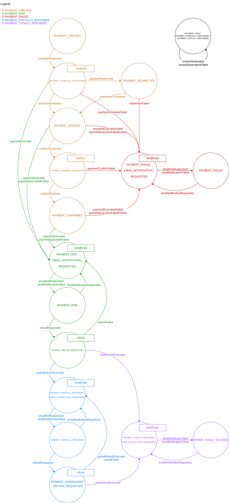

<!--
WARNING: this file was automatically generated by Mia-Platform Doc Aggregator.
DO NOT MODIFY IT BY HAND.
Instead, modify the source file and run the aggregator to regenerate this file.
-->

This service is able to communicate with the Flow Manager service via REST APIs. The communication with the Flow Manager
can be enabled setting the **FLOW_MANAGER_URL** environment variable and therefore **SAGA_CRUD_URL** too.

## Features

The PGM can both send events to Flow Manager and also process commands using the following APIs:
- `/saga/pay`: executes the payment process just like `/{provider}/{payment-method}/pay` API
- `/saga/confirm`: provides the confirm feature as `/{provider}/{payment-method}/confirm` API
- `/saga/refund`: performs the refund action as `/{provider}/{payment-method}/refund` API

Moreover, the PGM has **read** access to the CRUD collection containing the payment sagas.

## Flow Manager's Machine Definition

In order to work properly, the machine definition provided to the Flow Manager has to comply with the following image.

