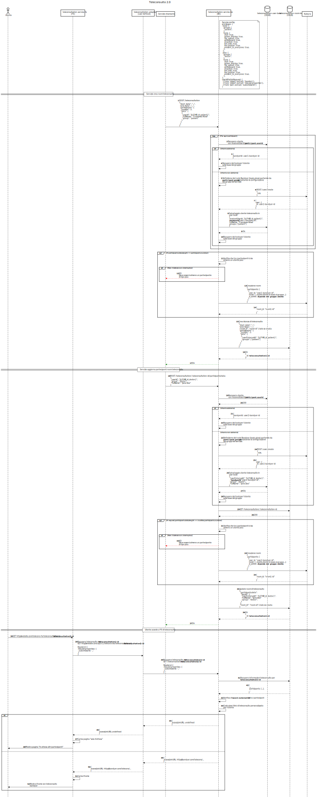

<!--
WARNING: this file was automatically generated by Mia-Platform Doc Aggregator.
DO NOT MODIFY IT BY HAND.
Instead, modify the source file and run the aggregator to regenerate this file.
-->

## Teleconsultation Service Backend

The following sections explain the details about the endpoints exposed from the **Teleconsultation Service Backend**.

This service has been develop based on the assumption that the user authentication method uses **auth0** as auth provider and the platform service [*auth0 Client*](../../runtime_suite/auth0-client/overview_and_usage).

In Kaleyra there's the concept of _duration_ for a Room.
If a Room has a duration, then after the duration expires, the Room is unavailable.
The **Teleconsultation Service Backend** accepts, as body parameters for some routes, a **start_date** and an **end_date** to calculate the max duration of a teleconsultation.

:::note
If the `UNLIMITED_TELECONSULTATION` variable is set to `true` in the service configuration, the room has unlimited duration. Otherwise, the duration is calculated as previously described.
:::

## Flow example
The following sequence diagram show the usage of the service when:
- Participants data are not a priori known
- An auth0 dependency is not wanted



### POST /teleconsultation

Adds a new teleconsultation in the CRUD teleconsultations collection, and possibly creates a new room on Kaleyra.

:::note
The service will create a kaleyra room only if all participants' data is specified in the request.
:::

#### Body parameters

##### participants (required) 
**Type**: `array of string` (only accepted if the service is configured to interact with auth0) or `object`
**Description**: The list of participants to the call. If a list of string is provided, each element of the array needs to be an auth0's user id of the participant. If an object is provided, you must specify:
- the expected `number` of participants;
- an array of participants' `data`, containing, for each participant:
  - a `userExternalId` to be used in GET requests to retrieve the correct link for a given user, if interaction with auth0 is enabled, it must be the auth0 id of the participant,
  - the `groups` (required if auth0 dependency is enabled, not supported otherwise) to be assigned to the user (one of those listed in any of the `privileges.$.groups` array of the service configuration file),
  - the `fullName` (required if auth0 dependency is enabled, not supported otherwise) to be show by the frontend,
  - the `language` to be used by the frontend.

Kaleyra needs to know the list of the users which are going to join the call in order to create a Room. For this reason, if the length of the participant data array is less than expected number of participants (i.e. some participants' data is still unknown), the room on Kaleyra is not created, otherwise, if all participants are known, it is created. In order to create a room, **Teleconsultation Service Backend** is going to translate each external user id into a Kaleyra's user id. This operation is done as soon as the external user id is provide. If the user is still unknown (i.e. it has never been a participant of previous teleconsultation instances), the service creates a new user on Kaleyra.

:::note
If a user has multiple roles, the higher role will be selected automatically.
:::

Example: ```['user1_auth0_id', 'user2_auth0_id', ...]```

##### start_date (required)
Type: `Date`
Description: The starting date of an appointment.
This date is used in combination with the end_date in order to calculate the duration of a teleconsultation.
The date follow the **ISO 8601** format: YYYY-MM-DDTHH:mm:ss.sssZ

Example: ```2022-02-22T15:30:00.000Z```

##### end_date (required)
Type: `Date`
Description: The starting date of an appointment.
This date is used in combination with the start_date in order to calculate the duration of a teleconsultation.
The date follow the **ISO 8601** format: YYYY-MM-DDTHH:mm:ss.sssZ

Example: ```2022-02-22T16:30:00.000Z```

<br />

**POST Request Examples**

With auth0 dependency and all a priori known participants:
```
curl -X POST "https://my_project_url/teleconsultation" \
     -d '{
         "participants": ['user1_auth0_id', 'user2_auth0_id', 'user3_auth0_id'],
         "start_date": "2022-02-22T15:30:00.000Z",
         "end_date": "2022-02-22T16:30:00.000Z"
     }'
```

With auth0 dependency and all a priori known participants:
```
curl -X POST "https://my_project_url/teleconsultation" \
     -d '{
         "participants": {
           "number": 3,
           "data": [
              {
                "userExternalId": "user1_auth0_id",
                "language": "it"
              },
              {
                "userExternalId": "user2_auth0_id",
                "language": "it"
              },
              {
                "userExternalId": "user3_auth0_id",
                "language": "it"
              }
            ]
         "start_date": "2022-02-22T15:30:00.000Z",
         "end_date": "2022-02-22T16:30:00.000Z"
     }'
```

With auth0 dependency and some a priori unknown participants:
```
curl -X POST "https://my_project_url/teleconsultation" \
     -d '{
         "participants": {
           "number": 3,
           "data": [
              {
                "userExternalId": "user1_auth0_id",
                "language": "it"
              },
              {
                "userExternalId": "user2_auth0_id",
                "language": "it"
              }
            ]
         "start_date": "2022-02-22T15:30:00.000Z",
         "end_date": "2022-02-22T16:30:00.000Z"
     }'
```


Without auth0 dependency and some a priori unknown participants:
```
curl -X POST "https://my_project_url/teleconsultation" \
     -d '{
         "participants": {
           "number": 3,
           "data": [
              {
                "userExternalId": "user1_external_id",
                "groups": ["doctor"],
                "fullName": "Joe Smith",
                "language": "it"
              }
              {
                "userExternalId": "user3_external_id",
                "groups": ["patient"],
                "fullName": "Jane Doe,
                "language": "it"
              }
            ]
         "start_date": "2022-02-22T15:30:00.000Z",
         "end_date": "2022-02-22T16:30:00.000Z"
     }'
```

#### Response

In case a teleconsultation is successfully created, a status code of 201 will be returned alongside an object with a field **roomId**, which contains the **_id** field of the teleconsultation on the CRUD just created.
The **roomId** will be used from the **Teleconsultation Service Frontend**, in order to request all the data from the **Teleconsultation Service Backend** to initialize the teleconsultation UI (using iFrame) and start the call. In reality the **roomId**, is the CRUD _id field of that teleconsultation.

Example Response:
```
201: { roomId: room_xyz }
```

In case of error (4xx or 5xx status codes), the response has the same interface of a CRUD service POST / request.

If no one of the participants is a `plus` user the service returns the following response:
```
400: { "error": "Failed POST /teleconsultation: no plus user in room" }
```

<br/>

### PATCH /teleconsultation/:roomId

Updates a teleconsultation whose id is equal to roomId.
**roomId** is the **_id** field returned by the CRUD of a specific teleconsultation.

:::note
Kaleyra does not support the possibility to make changes existing rooms. 

For this reason, the Kaleyra room is created only if all participants data is provided. If the Kaleyra room has already been created and a change having effects on its features is requested, the existing Kaleyra room is deleted and a new one is created. If all participants' data has been provided, starting from [`IMMUTABLE_PERIOD_MS`](./20_configuration.md#environment-variables) milliseconds before the starting time of the call, the service will refuse all the change requests to the teleconsultation instance. See [`GET /teleconsultation/:roomId`](#get-teleconsultationroomid) documentation to understand how the service grants that participants cannot access a Kaleyra room as long as it could be replaced by a new one. 
:::

#### Body parameters

Same body parameters of the POST request are allowed, but only the ones to be modified are required to be provided.

**PATCH Request Examples**

With auth0 dependency and all a priori known participants:
```
curl -X PATCH "https://my_project_url/teleconsultation/room_xyz" \
     -d '{
         "participants": ['user1_auth0_id', 'user2_auth0_id', 'user3_auth0_id'],
         "start_date": "2022-02-22T15:30:00.000Z",
         "end_date": "2022-02-22T16:30:00.000Z"
     }'
```

With auth0 dependency and all a priori known participants:
```
curl -X PATCH "https://my_project_url/teleconsultation/room_xyz" \
     -d '{
         "participants": {
           "number": 3,
           "data": [
              {
                "userExternalId": "user1_auth0_id",
                "language": "it"
              },
              {
                "userExternalId": "user2_auth0_id",
                "language": "it"
              },
              {
                "userExternalId": "user3_auth0_id",
                "language": "it"
              }
            ]
         "start_date": "2022-02-22T15:30:00.000Z",
         "end_date": "2022-02-22T16:30:00.000Z"
     }'
```

With auth0 dependency and some a priori unknown participants:
```
curl -X PATCH "https://my_project_url/teleconsultation/room_xyz" \
     -d '{
         "participants": {
           "number": 3,
           "data": [
              {
                "userExternalId": "user1_auth0_id",
                "language": "it"
              },
              {
                "userExternalId": "user2_auth0_id",
                "language": "it"
              }
            ]
         "start_date": "2022-02-22T15:30:00.000Z",
         "end_date": "2022-02-22T16:30:00.000Z"
     }'
```


Without auth0 dependency and some a priori unknown participants:
```
curl -X PATCH "https://my_project_url/teleconsultation/room_xyz" \
     -d '{
         "participants": {
           "number": 3,
           "data": [
              {
                "userExternalId": "user1_external_id",
                "groups": ["doctor"],
                "fullName": "Joe Smith",
                "language": "it"
              }
              {
                "userExternalId": "user3_external_id",
                "groups": ["patient"],
                "fullName": "Jane Doe,
                "language": "it"
              }
            ]
         "start_date": "2022-02-22T15:30:00.000Z",
         "end_date": "2022-02-22T16:30:00.000Z"
     }'
```
### POST /teleconsultation/:roomId/participants/data

Pushes a new teleconsultation participant in the `participants.data` array of the teleconsultation instance having id equal to roomId.
**roomId** is the **_id** field returned by the CRUD of a specific teleconsultation.

:::note
Kaleyra does not support the possibility to make changes existing rooms. For this reason, the Kaleyra room is created only when all participants data is known. If all participants' data has been provided, starting from [`IMMUTABLE_PERIOD_MS`](./20_configuration.md#environment-variables) milliseconds before the starting time of the call, the service will refuse all the change requests to the teleconsultation instance. See the [`GET /teleconsultation/:roomId`](#get-teleconsultationroomid) documentation to understand how the service ensures that participants cannot access a Kaleyra room as long as such room can be replaced by a new one.
:::

#### Body parameters

The data of the participant to be added, that is:
  - a `userExternalId` to be used in GET requests to retrieve the correct link for a given user, if interaction with auth0 is enabled, it must be the auth0 id of the participant,
  - the `group` (required if auth0 dependency is enabled, not supported otherwise) to be assigned to the user (one of those listed in any of the `privileges.$.groups` array of the service configuration file),
  - the `fullName` (required if auth0 dependency is enabled, not supported otherwise) to be show by the frontend,
  - the `language` to be used by the frontend.


**POST Request Examples**

With auth0 dependency and all a priori known participants:
```
curl -X POST "https://my_project_url/teleconsultation/room_xyz/participants/data" \
     -d '{
          "userExternalId": "user3_auth0_id",
          "language": "it"
     }'
```


Without auth0 dependency:
```
curl -X POST "https://my_project_url/teleconsultation/room_xyz/participants/data" \
     -d '{
          "userExternalId": "user1_external_id",
          "groups": ["doctor"],
          "fullName": "Joe Smith",
          "language": "it"
     }'
```

#### Response

In case the participant is successfully added, a 201 status code will be returned.

Example Response:
```
201:
```

In case of error (4xx or 5xx status codes), the response has the same interface of a CRUD service POST / request.

If you are requesting to add the last participant and no one of the participants (not the ones previously added neither the one who is requested to be inserted) is a `plus` user, the service returns the following response:
```
400: { "error": "Failed POST /teleconsultation/room_xyz/participants/data: no plus user in room" }
```

<br/>

#### Response

In case a teleconsultation is successfully updated, a status code of 204 will be returned without content. The **_id** field of the teleconsultation will remain the same.

Example Response:
```
204:
```

In case of error (4xx or 5xx status codes), the response has the same interface of a CRUD service PATCH /:id request.


If no one of the participants is a `plus` user the service returns the following response:
```
400: { "error": "Failed PATCH /teleconsultation: no plus user in room" }
```

<br/>

### GET /teleconsultation/:roomId

Retrieves the custom teleconsultation url for the requesting user.

**Request**
```
curl -X GET "https://my_project_url/teleconsultation/room_xyz"
```

**Response**

In case there is no reference to the teleconsultation recorded on the CRUD you will receive the following error:

```
404: { "error": "Room with id room_xyz not found on CRUD" } 
```

In case the request comes from a user not involved in the teleconsultation you will receive the following error:

```
401: { "error": "Unauthorized user" } 
```

if no errors occur, you will get a response like this:

```
200: { 
  "bandyerUserId": "creatorId1",
  "accessLinkURL": "https://your-company-name.bandyer.com/eu/direct-rest-call-handler/random-code-123",
  "participantsBandyerCall": [
    {
      "bandyerUserId": "userId1",
      "fullName": "Mario Rossi"
    },
    {
      "bandyerUserId": "userId2",
      "fullName": "Luigi Bianchi"
    },
    ...
  ]
} 
```

<br/>

### DELETE /teleconsultation/:roomId

Deletes a teleconsultation on Kaleyra and set the state of that teleconsultation on CRUD to TRASH.
**roomId** is the **_id** field returned by the CRUD of a specific teleconsultation.

**Example DELETE Request:**
```
curl -X DELETE "https://my_project_url/teleconsultation/room_xyz"
```

#### Response

In case a teleconsultation is successfully deleted, a status code of 204 will be returned without content.

Example Response:
```
204:
```

In case of error (4xx or 5xx status codes), the response has the same interface of a CRUD service DELETE /:id request.

### DELETE /teleconsultation/:roomId/uploads

:::info

This endpoint is available only since version 1.5.0.

:::

Delete all files uploaded by the participants during a teleconsultation if and only if the [`TELECONSULTATION_DELETE_UPLOADS` environment variable][environment-variables] is set to `true`.

**Example DELETE Request:**
```
curl -X DELETE "https://my_project_url/teleconsultation/room_xyz/uploads"
```

#### Response

If the [`TELECONSULTATION_DELETE_UPLOADS` environment variable][environment-variables] is set to `false`, a status code 204 will be returned. 

In case a teleconsultation is successfully deleted, a status code of 200 will be returned and a payload looking like this.

```json
{
  "total": 2,
  "deleted": 2
}
```

where `total` represents the total number of files associated to the teleconsultation room, while `deleted` is the number of files correctly deleted.

If the two values are different, it means some files were not correctly deleted. If this is due to a temporary issue with the Kaleyra services, you can try again later sending the same request. 

In case of error (4xx or 5xx status codes), the response has the same interface of a CRUD service `DELETE /` request.

### POST /credentials

:::note
Available from version 1.4.0
:::

:::note
For this endpoint to work, it's necessary for the service to use [auth0-client](../../runtime_suite/auth0-client/overview_and_usage) as authentication method, so be sure you properly set the AUTH_SERVICE environment variable.
:::

Generate an access token and the Kaleyra id for the currently logged user accordingly to the [request authentication headers](../../runtime_suite/authorization-service/usage#headers-set-by-auth).
If no Kaleyra user is associated to the logged user, a new Kaleyra user is created alongside the corresponding record in the [teleconsultations_users](./20_configuration.md#user-id-map-crud) collection.

This endpoint is mainly used to integrate with the [Kaleyra Video React Native Module](https://github.com/KaleyraVideo/VideoReactNativeModule).

#### Body parameters

##### expiresIn (optional)

**Type**: `integer`
**Description**: Seconds after that the token expires. Default is 3600.


**Example POST Request:**
```
curl -X POST "https://my_project_url/credentials" -d '{"expiresIn": 3600}'
```

#### Response

In case the operation is successful, a 201 status code will be returned alongside with an object containing the following fields: 

Example Response:
```
201: {     
  "accessToken": "valid jwt for the user",
  "expiresAt": "2022-01-10T11:41:19.000Z",
  "bandyerUserId": "user_xxx"
}
```

In case the service is not able to get user authentication from the request headers, a 401 response will be returned.

```
401: { "error": "Unauthorized user" } 
```


[environment-variables]: ./20_configuration.md#environment-variables
