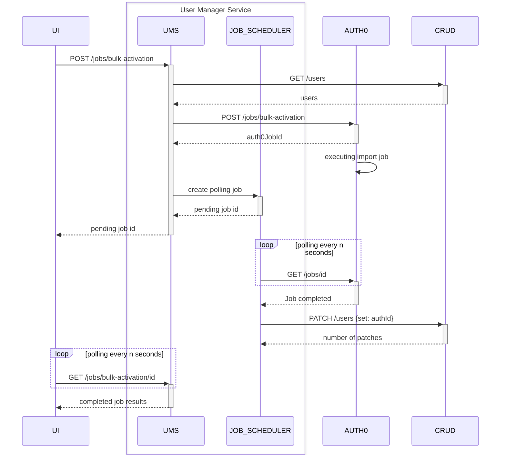

<!--
WARNING: this file was automatically generated by Mia-Platform Doc Aggregator.
DO NOT MODIFY IT BY HAND.
Instead, modify the source file and run the aggregator to regenerate this file.
-->

The User Manager needs some configuration in order to be used effectively.
More precisely, it requires two CRUD collections (one for the users, another one for configurations)
and a set of environment variables.

## User CRUD collection

The User Manager Service requires a CRUD collection to store users.
The collection can have any name you want, as long as you specify the correct name in the 
`USERS_CRUD_ENDPOINT` [environment variable][environment-variables].

The users collection needs the following service-specific fields.

- **userGroup (required)** - `string`: group associated to the user (e.g. customer, doctor, backoffice_operator, etc.).
- **authUserId** - `string`: authentication service user id associated to the user.
- **username** - `string`: the user username in the authentication service.
- **email** - `string`: the user email address (also used in the authentication service).
- **blocked** - `boolean`: it corresponds to the 'blocked' property in the authentication service.
- **expirationDate** - `Date`: the expiration date/time of the user account.
- **expirationId** - `string`: the ID of the job scheduled on the Timer Service to block the user on the expiration date/time.

:::caution

Since v1.4.0 the UMS relies on the Timer Service to automatically block the user on expiration,
so you must set the [`TIMER_SERVICE` env var][environment-variables] to get the user automatically blocked.

:::

:::tip
On top of the aforementioned fields, you can add any field you want to this CRUD collection.
Please remember that all the properties in every user schema must be included in the collection above.
:::

:::warning

To prevent the insertion of duplicated users in the database is necessary to define a [unique index][mongo-unique-index] on the `email` and `username` fields.

:::

## User Manager Configuration CRUD collection

The User Manager Service requires a CRUD collection to store user group schemas and other group properties.
This collection can be managed directly from the [Microfrontend Composer][microfrontend-composer], allowing also users that do not have access to the console
to configure the user Manager Service.
The collection can have any name you want, as long as you specify the correct name in the
`UMS_CONFIG_CRUD_ENDPOINT` [environment variable][environment-variables].

The configuration collection needs the following service-specific fields.

- **userGroup (required)** - `string`: unique group type for users (eg. admin, secretary, etc.).
- **crudSchema (required)** - `object`: the JSON schema of the CRUD that stores the user data for the specific group.
- **label (required)** - `string`: label displayed in the [Microfrontend Composer][microfrontend-composer] lookup.
- **authUserCreationDisabled** - `boolean`: if `true`, it disables the user creation in the authentication service for the given group (the user is only created in the CRUD).

## Auth0 Users Imports Jobs CRUD collection

The User Manager Service automatically creates a MongoDB collection to store the jobs that handle the asynchronous bulk import of users in Auth0. The jobs collection is handled by a [job scheduler][agenda-package], and can have any name you want, as long as you specify the correct name in the `JOBS_COLLECTION_NAME` [environment variable][environment-variables].

The job collection has the following fields:

- **name** - `string`: unique name of the job.
- **data** - `object`: data passed to the job:
  - **jobId** - `string`: id of the job.
  - **auth0JobId** - `string`: id of the Auth0 job.
- **result** - `object`: result of the job:
  - **status** - `string`: status of the Auth0 job.
  - **summary** - `object`: summary of the Auth0 job results, containing the number of inserted, updated users and failed operations.
  - **failures** - `array`: list of failures of the Auth0 job, with details about users and errors.

## Rönd Integration

The User Manager Service requires that the Rönd Service is deployed and configured as a `STANDALONE` service.
It is mandatory to specify the `MONGODB_URL` in order to create the Roles and Bindings collections and to add the array field `roles` when creating the **crudSchema** as specified in the previous paragraph. 
For more information on how to correctly setup Rönd visit the following [page][rond-config].

:::note
The integration with Rönd is not mandatory and can be enabled or disabled through the `ROND_ENABLED` environment variable.
:::

## Environment variables

The User Manager Service accepts the following environment variables.

| Name                                      | Required | Default        | Description                                                                                                                                   |
|-------------------------------------------|----------|----------------|-----------------------------------------------------------------------------------------------------------------------------------------------|
| **AUTH_MODULE**                           | No       | `auth0Client`  | The module used for the authentication (at this time only Auth0 is available, so it defaults to `auth0Client` if not set).                    |
| **AUTH_SERVICE**                          | Yes      | -              | The name of the authentication microservice (the name of the Auth0 Client microservice if `auth0Client` is used as authentication module). |
| **AUTH_CONNECTION**                       | Yes      | -              | Name of the auth service database (e.g. for Auth0 can be `Username-Password-Authentication`).                                                 |
| **AUTH0_BULK_CHANGE_PASSWORD_RATE_LIMIT_PER_SECOND**                    | No       | 10              | The maximum number of requests sent in one second by the bulk change password job to Auth0. An high value reduce the job execution time, but it also increases the resources consumption on the UMS and Authentication services.                      |
| **AUTH0_JOB_POLLING_INTERVAL**            | No       | `2 minutes`    | The interval used to check the status of Auth0 jobs to bulk import users. It can be expressed via cron or human readable syntax.              |
|**AUTH0_BULK_CHANGE_PASSWORD_RATE_LIMIT_PER_SECOND**            | No       | 2             | The maximum number of HTTP requests per seconds to trigger change-password events that can be sent to Auth0.                                                                    |
| **CRUD_SERVICE**                          | No       | `crud-service` | Name of the CRUD service.                                                                                                                     |
| **UMS_CONFIG_CRUD_ENDPOINT**              | Yes      | -              | The endpoint of the CRUD containing the UMS configuration, e.g. `/ums/config`.                                                                |
| **USERS_CRUD_ENDPOINT**                   | Yes      | -              | The endpoint of CRUD containing the users, e.g. `/users`.                                                                                     |
| **JOBS_COLLECTION_NAME** | Yes      | `userManagerJobs`              | MongoDB collection name to persist asynchronous jobs.                                                 |
| **MONGODB_URL**                           | Yes      | -              | The connection string to connect to MongoDB database.                                                                                         |
| **USER_IMPORT_BATCH_SIZE**                | No       | 250            | The size of the batch to process the csv when importing users                                                                                 |
| **RANDOM_PWD_GEN**                        | No       | `true`         | Enable the random password generation if set to `true`.                                                                                       |
| **RANDOM_PWD_LENGTH**                     | No       | 8              | Length of the random generated password                                                                                                       |
| **AUTH_HARD_DELETE**                      | No       | `true`         | Perform user delete on auth service if `true`, blocks the user otherwise.                                                                     |
| **CUSTOM_USER_ID_KEY**                    | No       | `sub`          | The user id key that identifies the user and is returned as one of the `/userinfo` properties                                                 |
| **CONFIG_PATH**                           | No       | -              | The path to the config file (not required, the service starts also without the config file).                                                  |
| **USERINFO_ADDITIONAL_PROPERTIES**        | No       | -              | A comma-separated string, representing the CRUD user properties that must be returned with the `/userinfo` endpoint.                          |
| **ROND_ENABLED**                          | No       | `false`        | If `true` allows the UMS to integrate with Rönd.                                                                                              |
| **ROND_SERVICE**                          | No       | `rond-service` | The name of the Rönd service.                                                                                                                 |
| **ROLES_CRUD_ENDPOINT**                   | No       | -              | The CRUD endpoint that stores the roles that can be assigned to users in the `roles` string array.                                            |
| **TIMER_SERVICE**                         | No       | -              | The name of the Timer Service. **Required** if you want to block users automatically on expiration.                                           |
| **TIMER_SERVICE_HEADERS**                 | No       | -              | A comma-separated list of headers from the incoming request that the Timer Service will send when blocking the user on expiration.            |
| **CONFIGURATION_PATH**                    | No       | -              | The path of a configuration file used by the service to add properties to the users, getting the information from Auth0.                      |

:::info

When the `ROLES_CRUD_ENDPOINT` environment variable is set and the `permissions` property is added to the `USERINFO_ADDITIONAL_PROPERTIES` env var,
the `/userinfo` endpoint will return also the user's `permissions`.

:::

:::info

The roles CRUD should have the minimum required properties of the role object described in the `RBAC Data model` of the [Rönd documentation][rond-policy-integration]. This is required because the user's permissions are resolved using the roleIds in the roles array. Roles with matching `roleId` are retrieved and user's permissions are merged in a single array.

:::

:::caution

Be careful: with `AUTH_HARD_DELETE` set to `false` and Auth0 as authentication service,
it is not possible to create again a user with the same email, since the user still exists on Auth0
(and for Auth0 the email is unique for a user).

:::

The User Manager Service also inherits the custom-plugin-library standard environment variables.
The `ADDITIONAL_HEADERS_TO_PROXY` environment variable must contain `cookie` in order to make the `/userinfo`
endpoint forward the cookie when calling the Auth Client.

## Configuration File

Information related to the users and present on auth0 can be added to the users properties when calling GET /users/ endpoint. In order to do so, a configuration file must be added and its path configured through the `CONFIGURATION_PATH` variable. 
The configuration file will be validated through the following schema:
````
{
    "type": "object",
    "required": [
        "user_id",
        "additionalProperties"
    ],
    "properties": {
        "additionalProperties": {
            "type": "array",
            "items": {
                "type": "string"
            }
        },
        "user_id": {
            "type": "string"
        }
    },
    "additionalProperties": false
}

````

When no file is provided, no additional properties will be added. 

## Console Endpoint

In order to use the User Manager Service with [Microfrontend Composer][microfrontend-composer], you must [configure the API Gateway][api-gateway] and [create an endpoint][console-endpoint] to expose the service routes.

## Job Scheduler

The User Manager Service leverages the [Agenda][agenda-package] job scheduling library to handle asyncrhonous job processes. In order to use the job scheduler the **MONGODB_URL** configuration variable must be set.

### Auth0 users bulk import job

The bulk import of users in Auth0 is handled as shown in this sequence diagram.




[agenda-package]: https://www.npmjs.com/package/agenda "Agenda package documentation"
[api-gateway]: /runtime_suite/api-gateway/10_overview.md
[console-endpoint]: /development_suite/api-console/api-design/endpoints.md
[microfrontend-composer]: /microfrontend-composer/overview.md
[rond-config]: https://rond-authz.io/docs/configuration
[rond-policy-integration]: https://rond-authz.io/docs/policy-integration

[environment-variables]: #environment-variables
