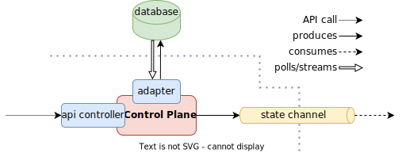

# Control Plane

_Control Plane_ is a microservice designed to manage a _Fast Data_ runtime deployment. It allows to alter, store, and reset a runtime state of a k8s deployment,
specifically the state of microservices composing Mia-Platform _Fast Data_ solution.

## Overview

_Control Plane_ is made of two parts:

1. an **HTTP controller**
2. a **state adapter**

The **HTTP controller** is a webserver exposing a [json-rpc 2.0](https://www.jsonrpc.org/specification) compliant API to instruct the runtime to reach a desired state required by the API client.
For instance, _Fast Data_ microservices spawn _Kafka_ consumers: a desired state of such services could be `pausing` or, subsequently `restarting`,
the consumption of messages by such consumers on a given _Kafka_ consumer.

_Control Plane_ persists the current runtime state of a _Fast Data_ deployment via the **state adapter**.

The **state adapter**:

1. listens to commands invoked by the client through the `json-rpc` interface,
2. compares the parameters provided in the call with the latest state available from the persistence source,
3. patches the current persistence state with the next desired state, and
4. stores it back to the persistence service

Meanwhile, **in another thread**, polls or streams the persistence source and
sends updates to the `state channel` pub/sub channel.

Streaming the currently desidered state is a task completely independent from storing the desired state.

Using multitenant resources to publish changes and persist state, _Control Plane_ is suitable to control microservices within its deployment namespace but also deployed in other namespaces.