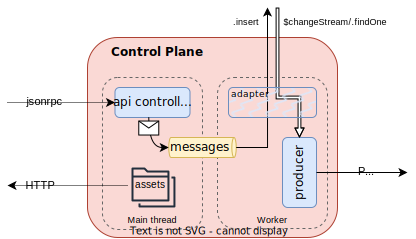

# Configuration

_Control Plane_ requires a minimal configuration to start: a ConfigMap and a couple of environment variables.

## Environment Variables

The environment variables allow to control basic functionalities:

- HTTP_PORT (default: 3000): tcp port where the **HTTP controller** binds its listener
- LOG_LEVEL (default: `info`): centralized application log level, can be one of: `debug`, `error`, `fatal`, `info`, `silent`, `trace`, `warn`
- FD_CONTROL_PLANE_CONFIGURATION_FILEPATH (default: `~/.fd/control-plane/configuration.json`): location of the configuration file.

## Config Map

The Config Map is `json` file which must be compliant with the relative schema. Below a description of the schema and an example.

<details><summary>ConfigMap Schema</summary>
<p>
```
code here
```
</p>
</details>

<details><summary>Example of ConfigMap</summary>
<p>
```
code here
```
</p>
</details>

### Persistence

Configures the layer of runtime state [persistence]
docs/schema/control-plane.schema.md#2-property-controlplaneconfig--persistence

It must be a `MongoDB` collection available in a [`replicaSet` enabled database](https://www.mongodb.com/docs/manual/replication/).

Available interfaces are:

- `MongoDB` client

### Runtimes

For each deployed runtime, it configures the [communication channel]
_Control Plane_ uses to dispatch the next desired state.

Available interfaces are:

- `Kakfa` producer

### Settings

_Control Plane_ overall setup is tuned in [settings]

It allows to tune **HTTP controller** routes:

- apis
  - fast-data control endpoint
  - metrics
  - probes
- frontend/website

## architecture

_Control Plane_ is currently implemented in `nodejs` 20.x. Multi-threading is recovered using
the [Worker API](https://nodejs.org/docs/latest-v20.x/api/worker_threads.html).

The main thread runs the HTTP server that exposes:

- control jsonrpc interface
- frontend endpoint
- metrics
- probes

while the worker implements:

- database client (MongoDB)
- pub/sub producer (Kafka)

The hard-boundary communication is realized via the [PostChannel](src/lib/post-channel.ts)
class.



For further details and future internal improvements:

<!-- - an adapter must extend [FastDataBaseAdapter](src/adapters/base.ts)
- a state channel producer must implement [SendChannel](src/channels/state/types.ts)
- messages in PostChannel must be [WorkerMessages](src/types/index.d.ts) -->

External clients/provider can refer to [json schema draft07](http://json-schema.org/draft-07/schema)
compliant data schemas for:

- [jsonrpc requests] schemas/jsonrpc-request-2.0.schema.json
  - [`pause` command] schemas/pause-resume-request-params.schema.json
  - [`resume` command] schemas/pause-resume-request-params.schema.json
- [API discovery] schemas/frontend-configuration.schema.json
- [state model] schemas/fast-data-state.schema.json on database or sent through the state channel

As previously mentioned, the runtime configuration of _Control Plane_ **MUST** verify
the relative [configuration schema] schemas/control-plane.schema.json

### Compatibility matrix

Here's a compatibility matrix for external services. At startup only the persistence layer is
required to be available, since configured runtimes can be zero.

| Control Plane | MongoDB | Kafka |
|:-------------:|:-------:|:-----:|
|      0.x      |  >=5    | >=3.5 |

#### Runtime communication

Communications from/to runtimes is realized as:

- kafka topic