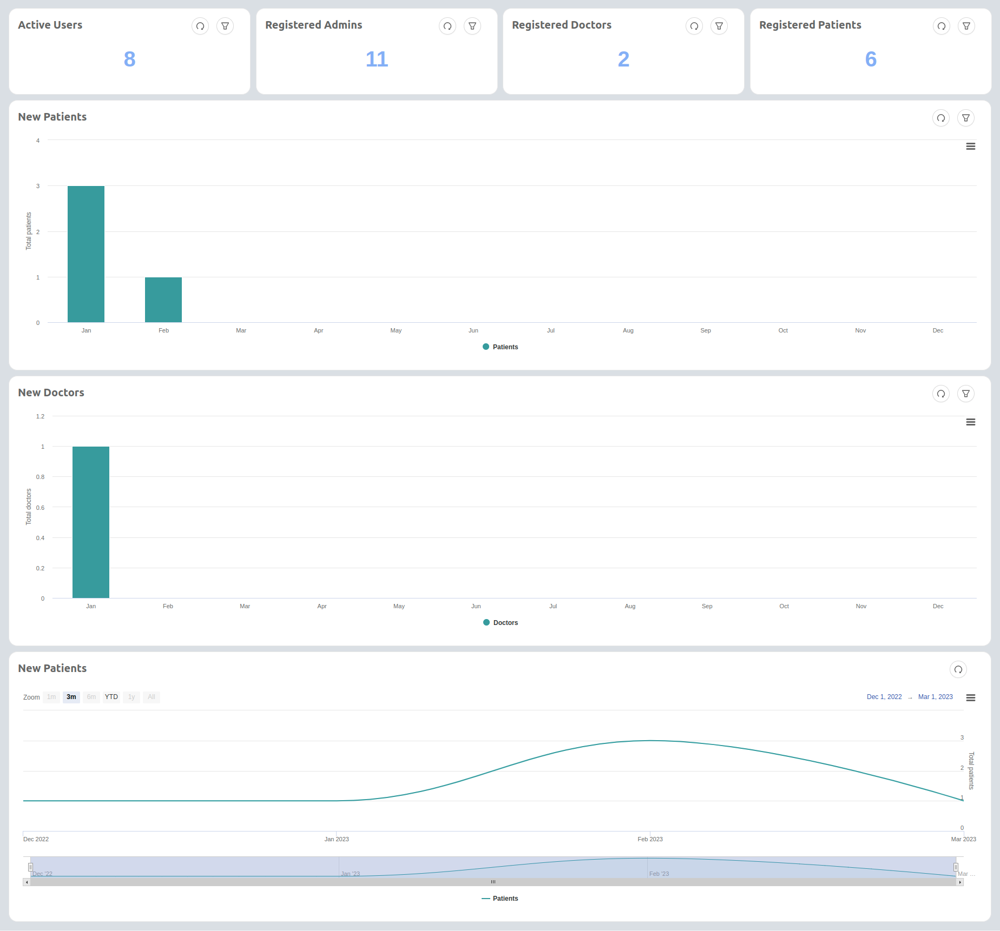
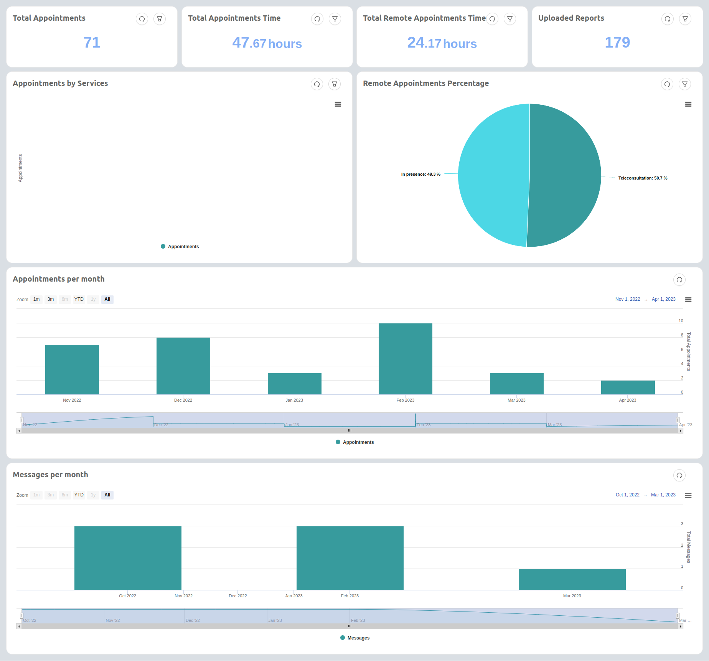

<!--
WARNING: this file was automatically generated by Mia-Platform Doc Aggregator.
DO NOT MODIFY IT BY HAND.
Instead, modify the source file and run the aggregator to regenerate this file.
-->

The data analytics application has a focus on the healthcare world of Mia Care.
It provides two dashboards, `Users` and `Services`, that can immediately give feedback about the active users of the platform and details about the offered services.

## Included Microservices

It’s based on the following services:

- `Charts-service`: It is used to assemble dashboards with different charts.
For more details, please refer to this [documentation](business_suite/data-visualization).

- `Data-visualization`: It is required to display dashboards on the Backoffice application. For more details, please refer to this [documentation](business_suite/data-visualization).

- `MongoDB-reader`: This microservice is used to retrieve the necessary data from mongoDB to feed the different charts. For more details, please refer to this [documentation](runtime_suite/mongodb-reader/configuration).

- `Active User Updater`:  This service is created specifically for obtaining KPI of active users.
It retrieves, at regular intervals, the list of active users from the [auth0-client](runtime_suite/auth0-client/overview_and_usage) and saves it to the appropriate CRUD.
In case the record already exists, the list of users is updated by adding the missing ones.

Moreover, a `Backoffice` application must already be present in the project, since it is required to view dashboards. For more details, please refer to this [documentation](business_suite/backoffice/overview).

## CRUD Collections

The application creates the following CRUD:

- `active_users`:  This crud is created by the application and contains the list of daily active users. It is filled by the `Active User Updater` microservice and it is used to calculate the number of active users.

It also requires the following CRUDs to be already present:

- `users`: It contains the information about the user; it requires a `userGroup` field to be present. This field indicates the group to which the user belongs and is used to populate almost all graphs in the `Users` dashboard.

- `appointments`: It contains the appointment information; it requires a `visitTypeId` field to be present and the related CRUD containing the visit types. This field is used to populate the [`Appointments by service`](#services-dashboard) chart.

- `reports`: It contains the information of various documents; it requires a `documentTypeId` field to be present and the related CRUD containing the document types. This field is used to populate the [`Number of documents by types`](#services-dashboard) chart.

The names of these collections can change according to your project needs. If you want to use different names, please remember to specify them in the following public variables (created by the application): `USERS_CRUD`, `APPOINTMENTS_CRUD`, `REPORTS_CRUD`.

## Endpoints

The application also creates the following endpoints:

- `/data-visualization`: it exposes the `data-visualization-frontend` microservice.

- `/api/charts/dashboards`: it exposes the `Charts-service` microservice.

- `/mongodb-reader`: it exposes the `mondoDB-reader` microservice .

- `/active-users`: it exposes the `active_users` CRUD collection. 

# Final Result

## Users Dashboard

This dashboard contains these KPIs

- **Active Users**: Total number of unique active users on the platform in a certain period of time. By default, it shows 
unique active users since the beginning of the project. 

- **Registered Admins**: Total number of registered admins in a certain period of time.

- **Registered Doctors**: Total number of registered doctors in a certain period of time.

- **Registered Patients**: Total number of registered patients in a certain period of time.

- **New Patients monthly**: Total number of new patients per month.

- **New doctors monthly**: Total number of new doctors per month.

- **Total patients per month - cumulative**: The running total of the new patients grouped by month.

## Services Dashboard

 

This dashboard contains these KPIs

- **Total appointments**: Total number of appointments in a given time period. Filterable by visit type or by doctor.

- **Total appointments time**: Total number of hours of in-person appointments. Filterable by doctor.

- **Total remote appointments time**: Total number of hours of remote appointments. Filterable by doctor.

- **Uploaded reports**: Total number of reports uploaded in a given time period.

- **Appointments by service**: Total number of appointments by visit types. Filterable by doctor.

- **Appointments percentage**: Ratio of in-person and remote appointments.

- **Monthly appointments**: Total number of appointments grouped monthly.

- **Monthly communications**: Total number of communications grouped monthly.
