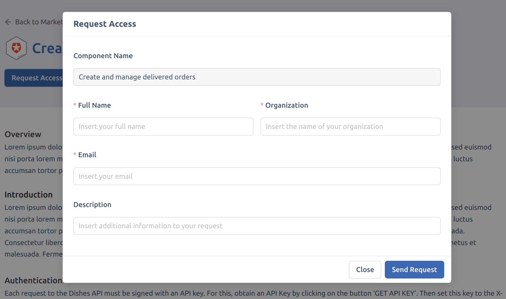
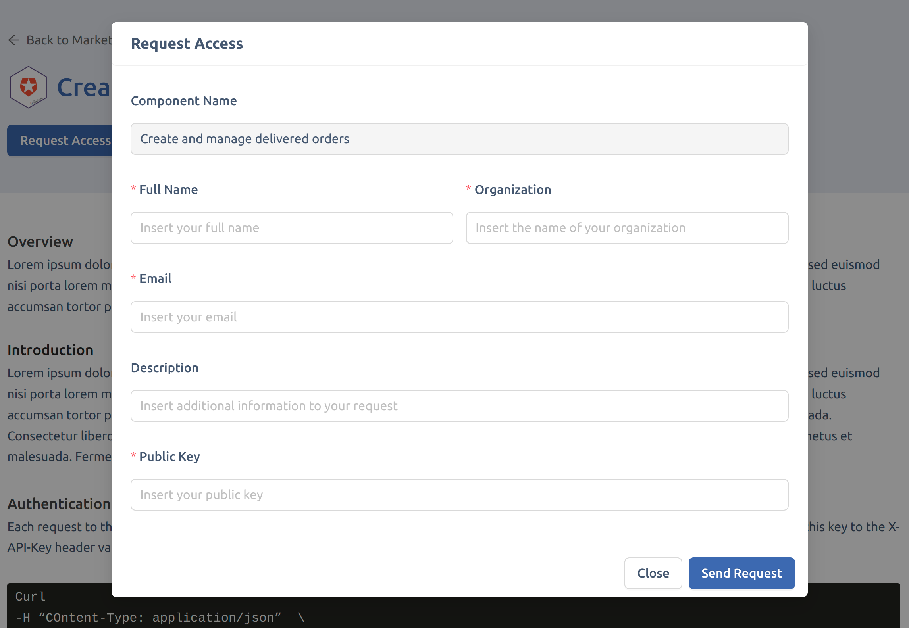

Once you successfully create the Dev Portal application, you should be able to send requests from any API or event on the marketplace and receive them in the backoffice section. 

However, depending on your needs, the CRUD data model required for these requests may vary significantly. 

For instance, in certain scenarios it may be necessary to ask users requesting the API to include their own RSA public key, while others may not require this type of information.

:::info
Different applications of the dev portal may lead to different requests data models, hence different requests form implementations.
::: 

## Request Form Types

For the aforementioned reasons, we propose two out of the box solutions to implement your requests:
- **Base Form**;
- **Client Credentials Form**.

By default, requests are configured to implement the **client credentials form**. 

### Base Form 

The base form includes all the basic information needed to specify a request:

- Email;
- Name;
- Status;
- Organization;
- Requested Component.

Please note this data model is a subset of the one specified in the [backoffice section](/dev_portal/requests_management.md) documentation.

Here is a preview of how this type of form will look like:



### Client Credentials Form

This type of form takes its name from the microservice handling the corresponding data model. You can have further details regarding the client credentials in the dedicated documentation [section](/runtime_suite/client-credentials/10_configuration.md)

It includes all the basic information specified in the base form while adding the public key additional property:

- Email;
- Name;
- Status;
- Organization;
- Requested Component;
- Public Key.

This data model matches the one specified in the [backoffice section](/dev_portal/requests_management.md) documentation.

Here is a preview on how this type of form will look like:



## Switch Form Configuration

As mentioned before, the client credentials form will be considered as the default implementation in the dev portal application. 

In case you need to change this default behavior, you can disable the use of the public key by editing the `dev-portal-micro-lc-backend` configuration. Move to the `configuration.json` file and search for the **marketplace** plugin:

```json
 {
  "id": "marketplace-dev-portal",
  "label": "Marketplace",
  "icon": "fas fa-search-dollar",
  "order": 2,
  "integrationMode": "qiankun",
  "pluginRoute": "/marketplace/",
  "pluginUrl": "/dev-portal-marketplace/",
  "props": {
    "formKind": "clientCredentials"
  }
}
```

Inside the `props` object update the `formKind` field with one of these options: 

- **base**;
- **clientCredentials**.

Type _base_ if you wish to switch to the base form and vice versa.
