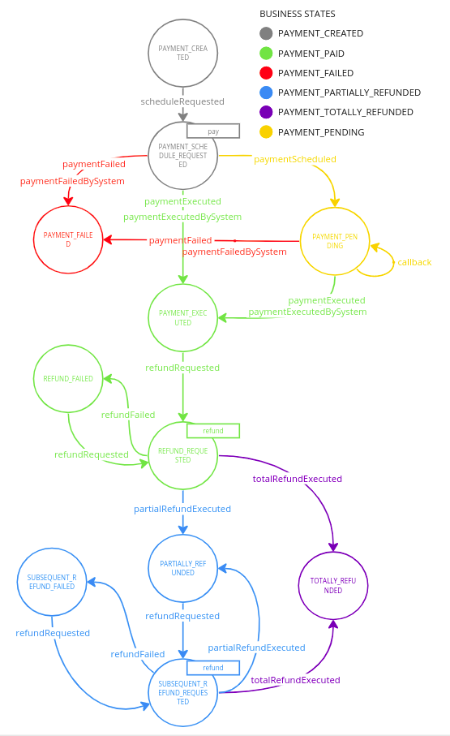

The Payment Integration Hub application builds a single interface to connect multiple payment gateways with only a few clicks and allows you to manage quickly and easily **payments** and **refunds**, guarantee transaction **consistency** and possible remediation in a **secure** and **compliant** way, in fact it does not save any data related to the payment method.

It is also available a white label front-end with **adaptive checkout** and a ready to use [backoffice](../../business_suite/backoffice/overview) to perform **actions** on the transactions and customizable **dashboards** for monitoring all payments KPI. 

## Application Architecture

### Microservices

The Payment Integration Hub is composed by:
1. [Payment Gateway Manager](../../runtime_suite/payment-gateway-manager/how_it_works) exposes an unique interface for all the payment methods enabled by different providers and implements all the payment related functionalities.
2. A set of microservices that implement some functionality to support the payment process:
    - the [Invoice Service](../../runtime_suite/invoice-service/overview) generates an invoice of a payment in pdf format;
    - the [Mail Notification Service](../../runtime_suite/ses-mail-notification-service/usage) used to notify the user about the outcome of payment;
    - the **Frullino Service** handle payment pending by periodically checking their status of through the provider and updates the payment state accordingly;
    - the **payment front end** provides a UI to accompany the end user to complete the payment with the chosen method with the related **back end for front end**;
    - the [Backoffice](../../business_suite/backoffice/overview) allows to perform actions on payments.
3. The **payment saga** is used to orchestrate the above services; it is implemented with the [Flow Manager Service](../../runtime_suite/flow-manager-service/overview) and it is fully customizable. 

Other platform plugins are included in order to enable some side functionalities.

### Endpoints

The following endpoints are exposed by default:
- **/payment** exposes the frontend
- **/pgm-bff** exposes the backend for frontend functionalities

## Payment Saga

The main actor in the saga is the [Payment Gateway Manager](../../runtime_suite/payment-gateway-manager/how_it_works), which is responsible for sending the events necessary for the saga to continue. 
Other microservices can interact with the saga, namely: 
1. the [Frullino Service](../../runtime_suite/ses-mail-notification-service/usage) triggers the events of `paymentExecutedByTheSystem` and `paymentFailedByTheSystem`
2. the mail service can be activated directly by any state of the saga to send the notification automatically.
3. the **back end for front end** send the `scheduleRequested` event.

Other services can be integrated and the saga itself can be modified to implement a new payment flow or adapt to specific needs.

The default defined payment saga consists of the following states:

## CRUD Collection

A *transactions_saga* collection will be included in the project and by default is used as database reference use to retrieve payments information.
The application can use any MongoDB collection to retrieve payments information: for further details on how to configure the application refer to the dedicated [section](./30_configuration.md)
The following schema is used in the collection, designed to be compatible with [payment gateway manager](../../runtime_suite/payment-gateway-manager/overview):
- **sagaId**: the unique saga id of payment flow
- **isFinal**: boolean to indicate if a state is final or not
- **metadata**: object with information related to the payment
    - **shopTransactionID**: the unique id of your transaction
    - **amount**: amount of the transaction
    - **paymentMethod**: payment method used
    - **provider**: provider used for the payment
    - **isRecurrent**: boolean to identify recurrent payments
    - **recurrenceDetails**: object with information related to the recurrence of the payment
    - **buyer**:  object with buyer information
    - **paymentID**: payment transaction id as returned by the provider
    - **sessionToken**
    - **additionalData**: optional object to store data related to the payment
    - **refundDetails**: object with the data related the refunded payment
    - **payRequestData**: object with the data related to the payment request
    - **refundRequestData**: object with the data related to the refund request
- **currentState**: state of the payment
- **latestEvent**: latest event emitted by the flow manager
- **associatedEntityId**: an entity identifier connected with the flow manager
- **events**: array with the history of events emitted
- **history**: object that contains the history of the payment (states and events)
- **businessStateId**: identifier of the business state
- **businessStateDescription**: description of the current business state

An *invoices* collection will be included in the project and by default is used as database reference use to retrieve and store the invoices generated.
The following schema is used in the collection, designed to be compatible with [files-service](../../runtime_suite/files-service/configuration):
- **name**: original file name
- **file**: unique name of the file that should be used to retrieve it
- **size**:  size in bytes of the invoice
- **location**: the URL that can be used to download the invoice
- **sagaId**: the transaction saga id related to the invoice
