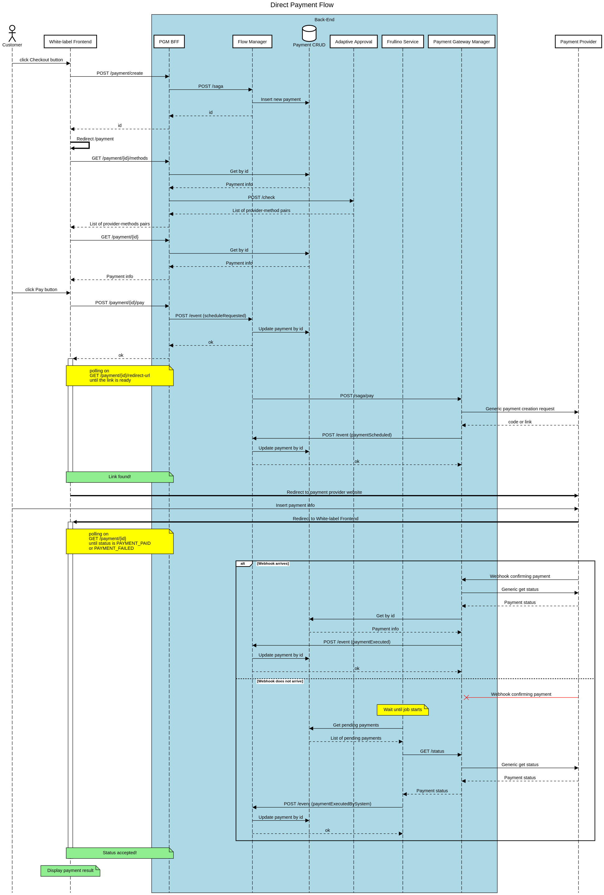
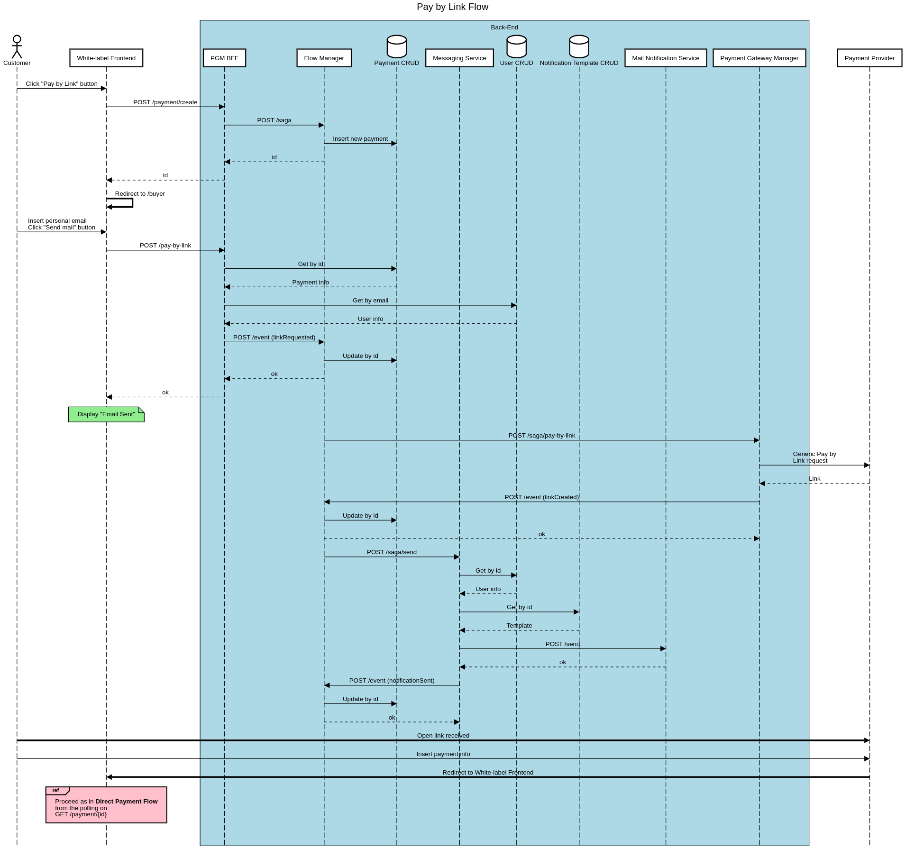
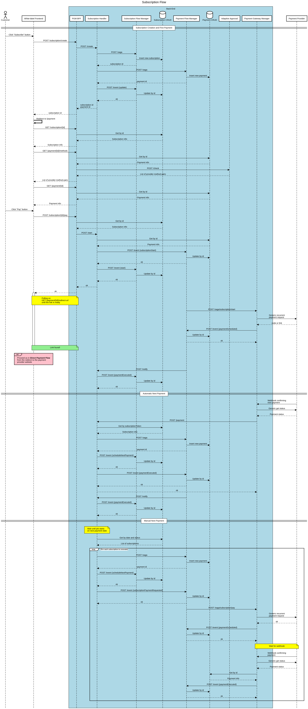
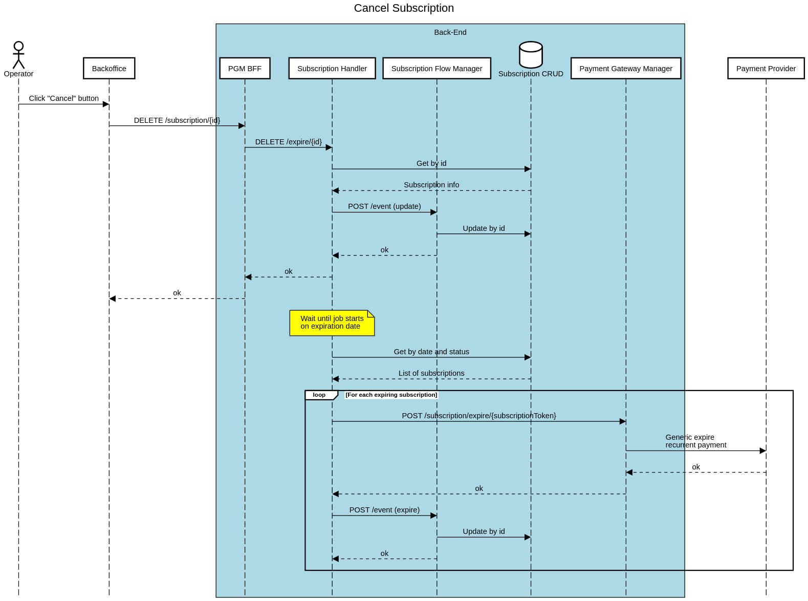
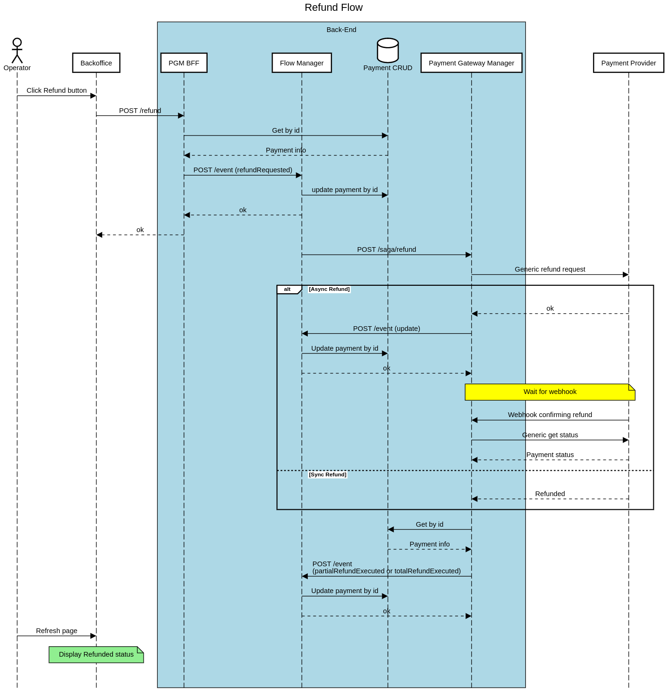
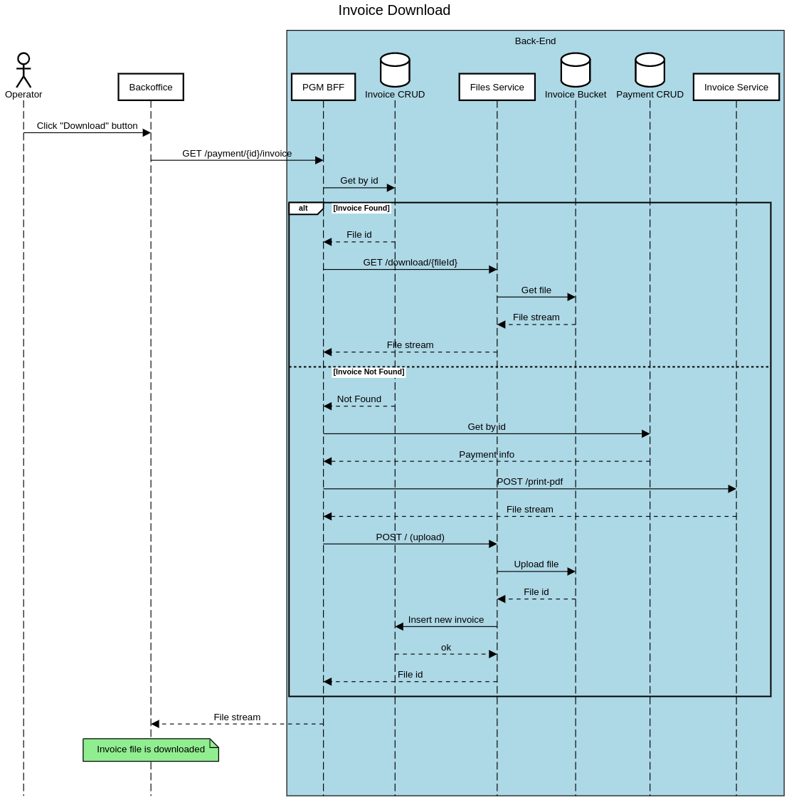

<!--
WARNING: this file was automatically generated by Mia-Platform Doc Aggregator.
DO NOT MODIFY IT BY HAND.
Instead, modify the source file and run the aggregator to regenerate this file.
-->

In this page you will find out how the Payment Integration Hub works thanks to some sequence diagrams.

## Actors

The main actors that interact with the Payment Integration Hub are the following:
- **customer**: it performs the payment using the white-label Frontend
  - perform a **direct** payment
  - create a **subscription** and perform first payment
  - perform a **Pay by Link** payment
- **backoffice operator**: it can perform many business-level actions using the Backoffice
  - **visualize** payment and subscription details
  - **visualize** payment analytics (aggregated data)
  - **export** payment and subscription details
  - **refund** payments
  - **cancel** subscriptions
  - **download invoice** related to a payment
  - **send notification** to the customer via different channels
  - **configure** the adaptive checkout rules

## Action Flows

In this section some of the actions described previously are technically explained.

### Direct Payment Flow

In this flow the customer performs the following actions:
- starts the checkout session clicking the *Checkout* button on the white-label Frontend
- chooses a payment method, accepts the terms and conditions and triggers the payment process clicking the *Pay* button on the white-label Frontend
- is redirected to the provider's website and inserts payment information
- is redirected to the white-label Frontend where it visualizes the payment result

The following sequence diagram shows how it works.

### Pay by Link Flow

In this flow the customer performs the following actions:
- starts the Pay by Link session clicking the *Pay by Link* button on the white-label Frontend
- inserts its email address or phone number, then clicks the button to proceed
- opens the link received by email or SMS landing on provider's website and inserts payment information
- is redirected to the white-label Frontend where it visualizes the payment result

The following sequence diagram shows how the email flow works.

### Subscription Flow

In this flow the customer performs the following actions:
- starts the subscription clicking the *Subscribe* button on the white-label Frontend
- performs the first payment as described in [Direct Payment Flow](#direct-payment-flow) section.

We differentiate *Automatic* and *Manual* subscriptions depending on the client starting the subsequent payment flows:
- Payment provider (automatic)
- Subscription Handler (manual)

The following sequence diagram shows how the subscription creation and the automatic/manual flows work.

### Cancel Subscription Flow

In this flow the backoffice operator performs the following actions:
- clicks the *Cancel* button for a subscription
- clicks the *Yes* button on the confirmation modal

The subscription cancellation is delayed, in particular it is performed on the subscription renewal day, in order to keep the ACTIVE status on the subscription.

The following sequence diagram shows how it works.

### Refund Flow

In this flow the backoffice operator performs the following actions:
- clicks the *Refund* button for a payment
- inserts the amount to be refunded in the pop-up modal and confirms

The refund action is asynchronous, thus the backoffice operator is notified about the request being accepted.

The following sequence diagram shows how it works.

### Invoice Download Flow

In this flow the backoffice operator performs the following actions:
- clicks the *Download Invoice* button for a payment

The following sequence diagram shows how it works.

