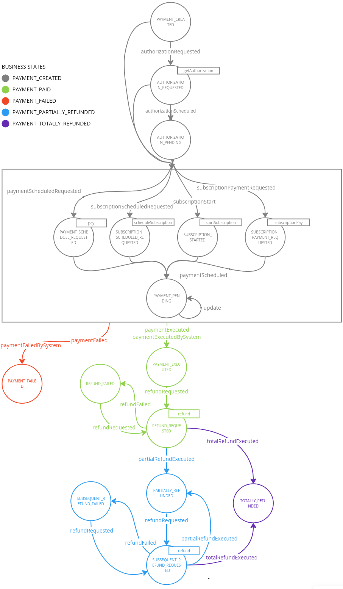

The Payment Integration Hub application includes a [Flow Manager Service](../../runtime_suite/flow-manager-service/overview) in order to manage the **payment** life-cycle. 

Leveraging the flexibility of the Flow Manager the application provides a ready to use saga with all the states and commands needed in order to successfully perform a payment and eventually any refund related to that. This saga can be modified as desired to meet specific requirements. 

## Default Configuration
The default configuration of the payment saga is described in the image below:

### Business State
The business state of the saga describe the overall state of the payment, ignoring the technical status of the system:
- **PAYMENT_CREATED**: the payment is created and he system is still collecting payment-related information (e.g., the payment method to be used) or is waiting for the provider's response.
- **PAYMENT_PAID**: the payment was paid and was completed by the provider
- **PAYMENT_FAILED**: the payment failed
- **PAYMENT_PARTIALLY_REFUNDED**: the payment was partially refunded
- **PAYMENT_TOTALLY_REFUNDED**: the payment was totally refunded

### Technical State
The technical state of the saga describe all the necessary steps to perform payment-related actions:
- **PAYMENT_CREATED**: the payment was created but some information are missing
- **AUTHORIZATION_REQUESTED**: some authorization is needed from the user
- **PAYMENT_SCHEDULED_REQUESTED**: a request was sent to the provider in order to create a new payment
- **PAYMENT_RECURRENT_SCHEDULED**: a request was sent to the provider in order to create the first payment for a fully managed subscription
- **PAYMENT_RECURRENT_STARTED**: a request was sent to the provider in order to create the first payment for a subscription
- **PAYMENT_RECURRENT_REQUESTED**: a request was sent to the provider in order to create a subsequent payment for subscription
- **PAYMENT_PENDING**: the payment was created by the provider but some actions are needed from the final user or the system is simply waiting for a callback
- **PAYMENT_EXECUTED**: the payment was paid successfully
- **REFUND_REQUESTED**: a refund was requested and no other refunds were performed previously
- **REFUND_FAILED**: the refund request failed
- **PARTIALLY_REFUNDED**: a partial refund was performed on the payment
- **SUBSEQUENT_REFUND_REQUESTED**: a refund was requested
- **SUBSEQUENT_REFUND_REQUESTED**: the refund request failed
- **TOTALLY_REFUNDED**: the payment was totally refunded

### Actors
The microservices that interact with the payment saga are the following:
- **Payment Gateway Manager**: receive all the commands needed to perform relevant actions and sent events regarding the outcome of the payment
- **Subscription Handler**: sent request for the creation of new payment related to a subscription
- **Payment BFF**: create a new payment requested from a frontend application
- [**Frullino Service**](../../runtime_suite/ses-mail-notification-service/usage) triggers the events of `paymentExecutedByTheSystem` and `paymentFailedByTheSystem` and automatically update payment status

## CRUD Collection

A *transactions_saga* collection will be included in the project and by default is used as database reference use to retrieve payments information.
The application can use any MongoDB collection to retrieve payments information: for further details on how to configure the application refer to the dedicated [section](./50_configuration.md)
The following schema is used in the collection, designed to be compatible with [payment gateway manager](../../runtime_suite/payment-gateway-manager/overview):
- **sagaId**: the unique saga id of payment flow
- **isFinal**: boolean to indicate if a state is final or not
- **metadata**: object with information related to the payment
    - **shopTransactionId**: the unique id of your transaction
    - **subscriptionId**: the unique id of your subscription
    - **amount**: amount of the transaction
    - **paymentMethod**: payment method used
    - **provider**: provider used for the payment
    - **recurrenceDetails**: object with information related to the recurrence of the payment
    - **buyer**:  object with buyer information
    - **paymentId**: payment transaction id as returned by the provider
    - **additionalData**: optional object to store data related to the payment
    - **refundDetails**: object with the data related the refunded payment
    - **payRequestData**: object with the data related to the payment request
    - **refundRequestData**: object with the data related to the refund request
- **currentState**: state of the payment
- **latestEvent**: latest event emitted by the flow manager
- **associatedEntityId**: an entity identifier connected with the flow manager
- **events**: array with the history of events emitted
- **history**: object that contains the history of the payment (states and events)
- **businessStateId**: identifier of the business state
- **businessStateDescription**: description of the current business state
