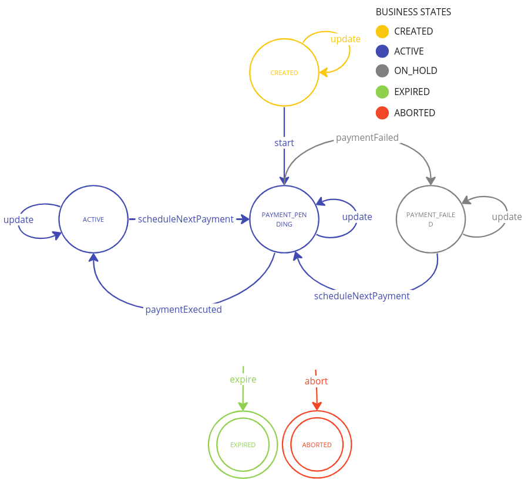

<!--
WARNING: this file was automatically generated by Mia-Platform Doc Aggregator.
DO NOT MODIFY IT BY HAND.
Instead, modify the source file and run the aggregator to regenerate this file.
-->

The Payment Integration Hub application includes a [Flow Manager Service](/runtime_suite/flow-manager-service/overview) in order to manage the **subscription** life-cycle. 

Leveraging the flexibility of the Flow Manager the application provides a ready to use saga with all the states and commands needed in order to successfully manage a subscription. This saga can be modified as desired to meet specific requirements. 

## Default Configuration
The default configuration of the subscription saga is described in the image below:

### Business States
The business states of the saga describe the overall state of the subscription, ignoring the technical status of the system:
- **CREATED**: the subscription is created and he system is still collecting information (e.g., the payment method to be used).
- **ACTIVE**: the subscription is active and recurrent payments are performing periodically
- **ON_HOLD**: the subscription is on hold because the last payment was failed
- **EXPIRED**: the subscription was expired
- **ABORTED**: the subscription was aborted due to recurrent errors

### Technical States
The technical states of the saga describe all the necessary steps to describe the subscription life-cycle:
- **CREATED**: the subscription is created and he system is still collecting information (e.g., the payment method to be used)
- **PAYMENT_PENDING**: the subscription is active and a recurrent payment is being performed right now
- **ACTIVE**: the subscription is active and recurrent payments are performing periodically
- **PAYMENT_FAILED**: the subscription is on hold because the last payment was failed
- **EXPIRED**: the subscription was expired
- **ABORTED**: the subscription was aborted due to recurrent errors

### Actors
**Subscription Handler** is the only microservice that interacts with the subscription saga in order to update related information and keep track of the payments related to each subscription.

## CRUD Collection

A *subscription_saga* collection will be included in the project and by default is used as database reference use to retrieve subscription information:
- **sagaId**: the unique saga id of subscription flow
- **isFinal**: boolean to indicate if a state is final or not
- **metadata**: object with information related to the payment
    - **shopSubscriptionId**: the unique id of your subscription
    - **transactions**: list with all the transactions identifiers related to the current subscription
    - **amount**: amount, as an integer, to charge the user at each payment
    - **currency**: currency of the payment in [ISO 4217](https://en.wikipedia.org/wiki/ISO_4217)
    - **paymentMethod**: payment method used
    - **provider**: provider used for the payment
    - **interval**: time unit used to schedule payments. It can be either *MONTH* or *DAY*
    - **intervalCount**: number of time unit to wait before schedule the next payment
    - **nextPaymentDate**: date of the next payment scheduled
    - **expirationDate**: last date of validity of the subscription
    - **additionalData**: optional object to store data related to the payment
- **currentState**: state of the payment
- **latestEvent**: latest event emitted by the flow manager
- **associatedEntityId**: an entity identifier connected with the flow manager
- **events**: array with the history of events emitted
- **history**: object that contains the history of the payment (states and events)
- **businessStateId**: identifier of the business state
- **businessStateDescription**: description of the current business state
