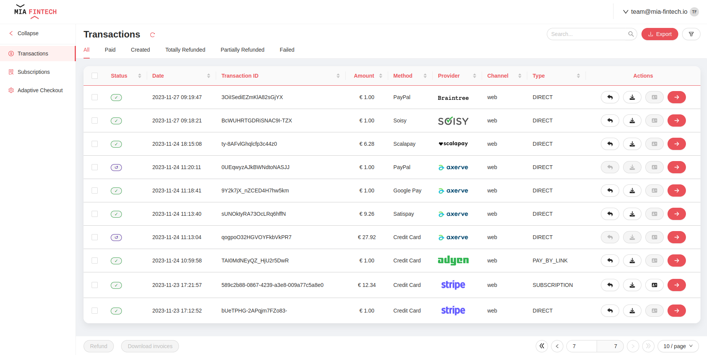
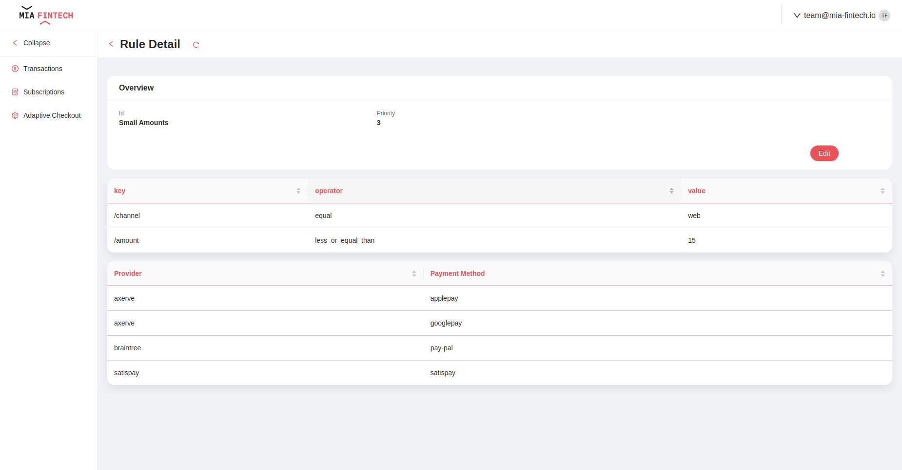

<!--
WARNING: this file was automatically generated by Mia-Platform Doc Aggregator.
DO NOT MODIFY IT BY HAND.
Instead, modify the source file and run the aggregator to regenerate this file.
-->

The Payment Integration Hub provides already configured pages that allow to perform actions on payments and includes customizable dashboards to monitor custom payment KPIs.

The pages are fully customizable, and they can be modified to implement new functionalities and adapt to specific needs; for more details on how to configure the pages you can refer to [Microfrontend Composer documentation](../../microfrontend-composer/back-kit/overview).

The complete configuration of all pages is available on [GitHub](https://github.com/Mia-FinTech/payment-backoffice#--backoffice-templates---payment).
It is also possible to define them as templates in your own project following this [guide](../../microfrontend-composer/composer/configurator_settings#template-sources), the URL to insert is `https://raw.githubusercontent.com/Mia-FinTech/payment-backoffice/main/`.

:::note
The Backoffice is not included by default in the Payment Integration Hub Application.
:::

:::note
A set of ready to use configuration for MongoDB View, that make your data available to the backoffice, are available in the [configuration section](./50_configuration.md#view).
:::

## Transactions

### Transactions Overview

On the **Transactions page** a table with all the transactions stored on the database is shown. For each transaction the following information are available:
- **Status**: current status of the payment (e.g. *Created*, *Paid*, *Partially Refunded*, *Totally Refunded*, *Failed*)
- **Date**: creation date of the payment
- **Transaction ID**: unique ID of the payment set by the merchant
- **Amount**: amount of the payment
- **Method**: method of the payment
- **Channel**: channel used for the payment

The list of transactions can be filtered by status, date, amount, method and/or type. Moreover, a search bar allows to find a transaction via its ID.

For each transaction the following actions are available:
- **refund** the payment (partially or totally)
- **download** invoice of the payment
- go to **subscription** (enabled only if it is a recurrent payment)
- go to **detail**

:::note
The **refund** and **download** actions are available also as bulk actions
:::

In addition, it is possible to export payments information in CSV or Excel format.

### Transaction Detail

It is available a dedicated view for each payment by clicking the dedicated button that redirects the user to a page with the following information:
- **Overview section**
  - Transaction ID
  - Transaction date
  - Current status
- **User section**
  - User ID
  - User name
  - User email
  - User phone number
  - Notification channels
- **Payment section**
  - Amount
  - Payment provider
  - Payment method
  - Type (Direct, Subscription, Pay by link)
  - Channel used for payment
  - Total refunded amount
- **History section**
  - Date
  - Status
  - Event
  - Refunded amount (optional)

The following actions are available:
- **refund** the payment (partially or totally)
- **download** invoice of the payment
- **send notification** about the payment to the customer (at the moment only emails are supported)

## Subscriptions

### Subscriptions Overview

The subscription section shows an overview of all the subscriptions stored in the database. For each subscription the following information are available:

- **Status**: current status of the subscription (e.g. **Created**, **Active**, **Not Active**)
- **Date**: creation date of the subscription
- **Subscription ID**: unique ID of the subscription
- **Amount**: amount of each subscription payment
- **Method**: method of the subscription payments
- **Provider**: provider chosen for the subscription payments

The list of subscriptions can be filtered by status, date, amount and/or provider. Moreover, a search bar allows to find a subscription via its ID.

In addition, it is possible to export subscriptions information in CSV or Excel format.

### Subscription Detail

The subscription detail page shows a dedicated view for each subscription, it is reachable clicking the arrow button next to each subscription in the overview page.

This page provides the following information:

- **Overview section**
  - subscription ID
  - subscription date
  - status
  - provider
  - method
- **Recurrence information section**
  - amount
  - currency
  - recurrence period
  - interval
  - next payment date
  - expiration date
- **History section**
  - date
  - transaction ID
  - amount
  - status

The following actions are available:
- **cancel** the subscription
- go to each **payment detail** page (using the arrow button next to each payment in the history section).

## Adaptive Checkout Configurator

On the **Adaptive Checkout** page the user can quickly manage the configuration of the adaptive checkout and add, change or remove rules.
Two pages are available:
1. an overview page where you can monitor all active rules and where you can create new rules or remove existing ones

2. a detail page where you can view the detail of the individual rule, specifically: enabled provider-payment method pairs and custom rules.

## Analytics Page

On **Analytics page** are shown the following plots and KPIs:
- **Daily payments**: stock chart that shows the amount of the payments over days; the plot can be filtered both with temporal filters (e.g. YTD, MTD or custom time frame).
- **Percentage** of payments on each status (e.g. _Payment Created_, _Payment Paid_, _Payment Partially Refunded_, _Payment Totally Refunded_, _Payment Failed_).
- **Payments Amount by Method**: stock chart that shows the amount of payments grouped by payment method; the plot can be filtered with temporal filters.
- **Payments Amount by Channel**: stock chart that shows the amount of payments grouped by payment channel; the plot can be filtered with temporal filters.

:::note
A preconfigured dashboard page is available as an iFrame at **/data-visualization/#/transactions-analytics**
:::
