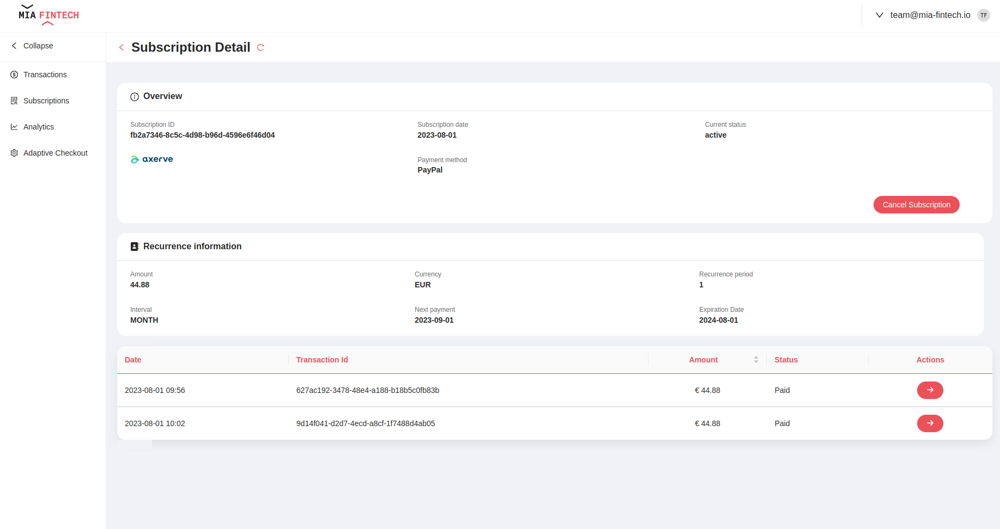

The Payment Integration Hub provides already configured pages that allow to perform actions on payments and includes customizable dashboards to monitor custom payment KPIs.

The pages are fully customizable and they can be modified to implement a new functionalities and adapt to specific needs; for more details on how to configure the pages you can refer to [backoffice documentation](../../microfrontend-composer/overview.md).

:::note
The Backoffice is not included by default in the Payment Integration Hub Application.
:::

:::note
A set of ready to use configuration for Mongo View, that make your data available to the backoffice, are available in the [configuration section](./50_configuration.md).
:::

## Transactions

### Payments Overview


On the **Transactions page** is shown a table with all the transactions stored on the database. For each transaction the following information are available:
- **Status**: current status of the payment (e.g. **Created**, **Paid**, **Partially Refunded**, **Totally Refunded**)
- **Date**: creation date of the payment
- **Transaction ID**: unique ID of the payment set by the merchant
- **Amount**: amount of the payment
- **Method**: method of the payment
- **Channel**: channel used for the payment

The list of transactions can be filtered by status, date and/or amount. Moreover a search bar allows to find a transaction via its ID.

For each transaction the following actions are available:
- **refund** the payment (partially or totally)
- **download** invoice of the payment
- **send notification** about the payment to the customer (at the moment only emails are supported)

:::note
The **refund** and **download** actions are available also as bulk actions
:::

In addition it is possible to export payments information in CSV or Excel format.

:::note
Here is available the configuration for this page.

 <details>
      <summary>Overview Page</summary>

```json
{
  "definitions": {
    "dataSchema": {
      "type": "object",
      "properties": {
        "_id": {
          "label": "ID",
          "type": "string",
          "visualizationOptions": {
            "hidden": true
          },
          "formOptions": {
            "hidden": true
          },
          "filtersOptions": {
            "hidden": true
          }
        },
        "__STATE__": {
          "label": {
            "en": "State",
            "it": "Stato"
          },
          "type": "string",
          "enum": [
            "PUBLIC",
            "DRAFT"
          ],
          "default": "PUBLIC",
          "visualizationOptions": {
            "iconMap": {
              "PUBLIC": {
                "shape": "roundedSquare",
                "color": "#52C41A"
              },
              "DRAFT": {
                "shape": "roundedSquare",
                "color": "#CDCDCE"
              }
            },
            "hidden": true
          },
          "formOptions": {
            "hiddenOnUpdate": true
          },
          "filtersOptions": {
            "hidden": true
          }
        },
        "currentStatus": {
          "label": {
            "en": "Status",
            "it": "Stato"
          },
          "type": "string",
          "filtersOptions": {
            "hidden": true
          },
          "excludeFromSearch": true,
          "enum": [
            "Failed",
            "Totally Refunded",
            "Partially Refunded",
            "Paid",
            "Created"
          ],
          "visualizationOptions": {
            "tag": "bk-chip",
            "properties": {
              "value": "{{args.[0]}}",
              "title": "{{args.[0]}}",
              "valueMap": {
                "Paid": {
                  "label": {
                    "en": "✓",
                    "it": "✓"
                  },
                  "color": "#349E47"
                },
                "Failed": {
                  "label": {
                    "en": "✘",
                    "it": "✘"
                  },
                  "color": "#F03838"
                },
                "Totally Refunded": {
                  "label": {
                    "en": "↺",
                    "it": "↺"
                  },
                  "color": "#542C9E"
                },
                "Partially Refunded": {
                  "label": {
                    "en": "↺",
                    "it": "↺"
                  },
                  "color": "#D574F2"
                },
                "Created": {
                  "label": {
                    "en": "∞",
                    "it": "∞"
                  },
                  "color": "#FA6B02"
                }
              }
            }
          }
        },
        "date": {
          "label": {
            "en": "Date",
            "it": "Data"
          },
          "type": "string",
          "format": "date-time",
          "dateOptions": {
            "displayFormat": "YYYY-MM-DD"
          }
        },
        "shopTransactionId": {
          "label": {
            "en": "Transaction ID",
            "it": "ID Transazione"
          },
          "type": "string",
          "filtersOptions": {
            "hidden": true
          }
        },
        "amount": {
          "label": {
            "en": "Amount",
            "it": "Importo"
          },
          "type": "number",
          "format": "currency",
          "formOptions": {
            "template": {
              "en": "€ {{nFormat '2.,' value}}",
              "it": "{{nFormat '2.,' value}} €"
            }
          },
          "visualizationOptions": {
            "template": {
              "en": "€ {{nFormat '2.,' args.[0]}}",
              "it": "{{nFormat '2.,' args.[0]}} €"
            }
          }
        },
        "paymentMethod": {
          "label": {
            "en": "Method",
            "it": "Metodo di pagamento"
          },
          "type": "string",
          "filtersOptions": {
            "hidden": true
          }
        },
        "paymentMethodId": {
          "label": {
            "en": "Method",
            "it": "Metodo di pagamento"
          },
          "type": "string",
          "filtersOptions": {
            "hidden": true
          },
          "visualizationOptions": {
            "hidden": true
          }
        },
        "providerId": {
          "label": {
            "en": "Provider",
            "it": "Provider"
          },
          "type": "string",
          "filtersOptions": {
            "hidden": true
          },
          "visualizationOptions": {
            "tag": "img",
            "properties": {
              "src": {
                "template": "{{args.[0]}}",
                "configMap": {
                  "axerve": "https://miafintech-demo-fintech.test.azure.mia-fintech.io/logo/download/6454abf54d9d4411e5edddaf.png",
                  "satispay": "https://miafintech-demo-fintech.test.azure.mia-fintech.io/logo/download/6454acb04d9d4411e5edddb7.png",
                  "braintree": "https://miafintech-demo-fintech.test.azure.mia-fintech.io/logo/download/6454ac0e4d9d4411e5edddb1.png",
                  "soisy": "https://miafintech-demo-fintech.test.azure.mia-fintech.io/logo/download/6454ac2a4d9d4411e5edddb3.png",
                  "stripe": "https://miafintech-demo-fintech.test.azure.mia-fintech.io/logo/download/6454ac404d9d4411e5edddb5.png",
                  "adyen": "https://miafintech-demo-fintech.test.azure.mia-fintech.io/logo/download/6454abde4d9d4411e5edddad.png",
                  "scalapay": "https://miafintech-demo-fintech.test.azure.mia-fintech.io/logo/download/6454abc14d9d4411e5edddab.png",
                  "$default": ""
                }
              },
              "width": "80"
            }
          }
        },
        "channel": {
          "label": {
            "en": "Channel",
            "it": "Canale"
          },
          "filtersOptions": {
            "hidden": true
          },
          "type": "string"
        },
        "paymentID": {
          "type": "string",
          "filtersOptions": {
            "hidden": true
          },
          "visualizationOptions": {
            "hidden": true
          }
        },
        "sagaId": {
          "type": "string",
          "filtersOptions": {
            "hidden": true
          },
          "visualizationOptions": {
            "hidden": true
          }
        },
        "remainingAmount": {
          "type": "number",
          "filtersOptions": {
            "hidden": true
          },
          "visualizationOptions": {
            "hidden": true
          }
        },
        "currency": {
          "type": "string",
          "filtersOptions": {
            "hidden": true
          },
          "visualizationOptions": {
            "hidden": true
          }
        },
        "type": {
          "label": {
            "en": "Type",
            "it": "Tipo"
          },
          "type": "string",
          "filtersOptions": {
            "hidden": true
          },
          "visualizationOptions": {
            "hidden": false
          }
        },
        "subscriptionId": {
          "type": "string",
          "filtersOptions": {
            "hidden": true
          },
          "visualizationOptions": {
            "hidden": true
          }
        }
      }
    }
  },
  "content": {
    "content": [
      {
        "content": [
          {
            "tag": "div",
            "content": [
              {
                "properties": {
                  "content": {
                    "en": "Transactions",
                    "it": "Transazioni"
                  }
                },
                "tag": "bk-title"
              },
              {
                "tag": "bk-refresh-button",
                "attributes": {
                  "style": "margin-left: 14px; align-self: end;"
                }
              },
              {
                "tag": "div",
                "attributes": {
                  "style": "flex-grow: 1;"
                }
              },
              {
                "properties": {
                  "placeholder": "Search..."
                },
                "tag": "bk-search-bar"
              },
              {
                "properties": {
                  "iconId": "DownloadOutlined",
                  "content": "Export",
                  "loadingOnAction": true,
                  "action": {
                    "type": "event",
                    "config": {
                      "events": {
                        "label": "export-data",
                        "payload": {}
                      }
                    }
                  }
                },
                "tag": "bk-button"
              },
              {
                "properties": {
                  "content": "",
                  "clickConfig": {
                    "type": "event",
                    "actionConfig": {
                      "label": "filter",
                      "payload": {}
                    }
                  },
                  "type": "outlined",
                  "iconId": "FunnelPlotOutlined"
                },
                "tag": "bk-button"
              }
            ],
            "attributes": {
              "style": "display: flex; flex-direction: row; gap: 10px; padding: 0 20px;"
            }
          },
          {
            "tag": "div",
            "attributes": {
              "style": "width: 100%; display: flex; justify-content: space-between;"
            },
            "content": [
              {
                "attributes": {
                  "style": "flex-grow: 1;"
                },
                "properties": {
                  "tabs": [
                    {
                      "key": "all",
                      "title": {
                        "en": "All",
                        "it": "Tutte"
                      }
                    },
                    {
                      "title": {
                        "en": "Paid",
                        "it": "Pagato"
                      },
                      "key": "paid",
                      "filters": [
                        {
                          "property": "currentStatus",
                          "value": "Paid",
                          "operator": "equal"
                        }
                      ]
                    },
                    {
                      "title": {
                        "en": "Created",
                        "it": "Creato"
                      },
                      "key": "created",
                      "filters": [
                        {
                          "property": "currentStatus",
                          "value": "Created",
                          "operator": "equal"
                        }
                      ]
                    },
                    {
                      "title": {
                        "en": "Totally Refunded",
                        "it": "Totalmente Stornato"
                      },
                      "key": "totally refunded",
                      "filters": [
                        {
                          "property": "currentStatus",
                          "value": "Totally Refunded",
                          "operator": "equal"
                        }
                      ]
                    },
                    {
                      "title": {
                        "en": "Partially Refunded",
                        "it": "Parzialmente Stornato"
                      },
                      "key": "partially refunded",
                      "filters": [
                        {
                          "property": "currentStatus",
                          "value": "Partially Refunded",
                          "operator": "equal"
                        }
                      ]
                    },
                    {
                      "title": {
                        "en": "Failed",
                        "it": "Fallito"
                      },
                      "key": "failed",
                      "filters": [
                        {
                          "property": "currentStatus",
                          "value": "Failed",
                          "operator": "equal"
                        }
                      ]
                    }
                  ]
                },
                "tag": "bk-tabs"
              },
              {
                "attributes": {
                  "style": "margin-right: 4px"
                },
                "properties": {
                  "dataSchema": {
                    "$ref": "#/definitions/dataSchema"
                  },
                  "filters": []
                },
                "tag": "bk-filters-manager"
              }
            ]
          }
        ],
        "tag": "header",
        "attributes": {
          "style": "display: flex; flex-direction: column; padding-top: 10px; background-color: white;"
        }
      },
      {
        "content": [
          {
            "properties": {
              "dataSchema": {
                "$ref": "#/definitions/dataSchema"
              },
              "maxLines": 10,
              "rowActions": {
                "kind": "icons",
                "actions": []
              },
              "disableRowClick": true,
              "initialSortDirection": "descend",
              "initialSortProperty": "createdAt",
              "customActions": [
                {
                  "tag": "bk-button",
                  "properties": {
                    "content": "",
                    "type": "secondary",
                    "title": "Refund",
                    "disabled": {
                      "template": "{{args.[1].currentStatus}}",
                      "configMap": {
                        "Paid": false,
                        "Partially Refunded": false,
                        "$default": true
                      }
                    },
                    "iconId": "fas fa-reply",
                    "iconPlacement": "right",
                    "action": {
                      "type": "event",
                      "config": {
                        "events": {
                          "label": "add-new-external",
                          "payload": "{{rawObject args.[1]}}"
                        }
                      }
                    }
                  }
                },
                {
                  "tag": "bk-button",
                  "properties": {
                    "content": "",
                    "type": "secondary",
                    "title": "Download",
                    "disabled": {
                      "template": "{{args.[1].currentStatus}}",
                      "configMap": {
                        "Paid": false,
                        "$default": true
                      }
                    },
                    "iconId": "fas fa-download",
                    "iconPlacement": "right",
                    "loadingOnAction": true,
                    "disableOnAction": true,
                    "action": {
                      "type": "http",
                      "config": {
                        "label": "download-file",
                        "url": "/pgm-bff/invoice-download",
                        "method": "GET",
                        "triggeredBy": "download-invoice-button",
                        "config": {
                          "downloadAsFile": true,
                          "params": {
                            "sagaId": "{{args.[1].sagaId}}"
                          }
                        }
                      }
                    }
                  }
                },
                {
                  "tag": "bk-button",
                  "properties": {
                    "content": "",
                    "type": "secondary",
                    "disabled": {
                      "template": "{{args.[1].type}}",
                      "configMap": {
                        "SUBSCRIPTION": false,
                        "$default": true
                      }
                    },
                    "title": "Go to Subscription",
                    "iconId": "fas fa-address-card",
                    "iconPlacement": "right",
                    "clickConfig": {
                      "type": "push",
                      "actionConfig": {
                        "url": "./subscription-details/{{args.[1].subscriptionId}}"
                      }
                    }
                  }
                },
                {
                  "tag": "bk-button",
                  "properties": {
                    "content": "",
                    "title": "Go to Detail",
                    "iconId": "fas fa-arrow-right",
                    "iconPlacement": "right",
                    "clickConfig": {
                      "type": "push",
                      "actionConfig": {
                        "url": "./transaction-detail/{{args.[1]._id}}"
                      }
                    }
                  }
                }
              ]
            },
            "tag": "bk-table"
          },
          {
            "tag": "bk-form-modal",
            "properties": {
              "dataSchema": {
                "type": "object",
                "properties": {
                  "remainingAmount": {
                    "type": "number",
                    "format": "currency",
                    "minimum": 0,
                    "label": {
                      "en": "Amount",
                      "it": "Importo"
                    },
                    "formOptions": {
                      "template": {
                        "en": "€ {{nFormat '2.,' value}}",
                        "it": "{{nFormat '2.,' value}} €"
                      }
                    }
                  },
                  "sagaId": {
                    "type": "string",
                    "formOptions": {
                      "hidden": true
                    }
                  },
                  "currency": {
                    "type": "string",
                    "formOptions": {
                      "hidden": true
                    }
                  }
                }
              },
              "extraEndpoint": "/pgm-bff/refund",
              "customLabels": {
                "create": {
                  "ctaLabel": {
                    "en": "Refund",
                    "it": "Stornare"
                  },
                  "title": {
                    "en": "Insert the amount to refund",
                    "it": "Inserisci l'importo da stornare"
                  }
                }
              },
              "height": "10vh",
              "width": "35vw"
            }
          },
          {
            "tag": "bk-confirmation-modal"
          },
          {
            "properties": {
              "rootElementSelectors": "main.micro-lc-layout-content",
              "successEventMap": {
                "create-data": {
                  "title": "Success",
                  "content": "Data successfully created",
                  "type": "success"
                },
                "update-data": {
                  "title": "Success",
                  "content": "Data successfully updated",
                  "type": "success"
                },
                "delete-data": {
                  "title": "Success",
                  "content": "Data successfully deleted",
                  "type": "success"
                }
              },
              "errorEventMap": {
                "create-data": {
                  "title": "Error",
                  "content": "An error occurred during order creation",
                  "type": "error"
                },
                "update-data": {
                  "title": "Error",
                  "content": "An error occurred during order updated",
                  "type": "error"
                },
                "delete-data": {
                  "title": "Error",
                  "content": "An error occurred during order deletion",
                  "type": "error"
                }
              }
            },
            "tag": "bk-notifications",
            "attributes": {}
          }
        ],
        "tag": "main",
        "attributes": {
          "style": "flex-grow: 1; background-color: #f0f2f5; padding: 20px; overflow-y: auto;"
        }
      },
      {
        "content": [
          {
            "properties": {
              "dataSchema": {
                "$ref": "#/definitions/dataSchema"
              },
              "width": "40vw"
            },
            "tag": "bk-filter-drawer"
          }
        ],
        "tag": "aside"
      },
      {
        "content": [
          {
            "tag": "bk-button",
            "attributes": {
              "style": "margin-right: .5vw;"
            },
            "properties": {
              "type": "secondary",
              "content": {
                "en": "Refund",
                "it": "Storna"
              },
              "bulkButton": true,
              "loadingOnAction": true,
              "action": {
                "type": "event",
                "config": {
                  "events": {
                    "label": "require-confirm",
                    "payload": {
                      "title": {
                        "en": "Refund transactions?",
                        "it": "Stornare transazioni?"
                      },
                      "content": {
                        "en": "Are you sure you want to totally refund selected transactions?",
                        "it": "Sei sicuro di voler stornare totalmente le transazioni selezionate?"
                      },
                      "configCancel": {
                        "tag": "bk-button",
                        "properties": {
                          "content": {
                            "en": "No",
                            "it": "No"
                          },
                          "type": "ghost",
                          "action": {
                            "type": "event",
                            "config": {
                              "events": {
                                "label": "change-query",
                                "payload": {}
                              }
                            }
                          }
                        }
                      },
                      "configOk": {
                        "tag": "bk-button",
                        "properties": {
                          "content": {
                            "en": "Yes",
                            "it": "Sì"
                          },
                          "action": {
                            "type": "http",
                            "config": {
                              "url": "/pgm-bff/refund/bulk",
                              "method": "POST",
                              "triggeredBy": "bk-form-modal-extra-endpoint",
                              "body": "{{rawObject selectedData}}"
                            },
                            "hooks": {
                              "onSuccess": {
                                "type": "event",
                                "config": {
                                  "events": {
                                    "label": "change-query",
                                    "payload": {}
                                  }
                                }
                              },
                              "onError": {
                                "type": "event",
                                "config": {
                                  "events": {
                                    "label": "change-query",
                                    "payload": {}
                                  }
                                }
                              }
                            }
                          }
                        }
                      }
                    }
                  }
                },
                "hooks": {
                  "onSuccess": {
                    "type": "event",
                    "config": {
                      "events": {
                        "label": "change-query",
                        "payload": {}
                      }
                    }
                  },
                  "onError": {
                    "type": "event",
                    "config": {
                      "events": {
                        "label": "change-query",
                        "payload": {}
                      }
                    }
                  }
                }
              }
            }
          },
          {
            "tag": "bk-button",
            "attributes": {
              "style": "margin-right: .5vw;"
            },
            "properties": {
              "type": "secondary",
              "content": {
                "en": "Download invoices",
                "it": "Scarica ricevute"
              },
              "bulkButton": true,
              "loadingOnAction": true,
              "action": {
                "type": "http",
                "config": {
                  "url": "/pgm-bff/invoice-download/bulk",
                  "method": "POST",
                  "triggeredBy": "download-invoice-button",
                  "body": "{{rawObject selectedData}}",
                  "config": {
                    "downloadAsFile": true
                  }
                },
                "hooks": {
                  "onSuccess": {
                    "type": "event",
                    "config": {
                      "events": {
                        "label": "change-query",
                        "payload": {}
                      }
                    }
                  },
                  "onError": {
                    "type": "event",
                    "config": {
                      "events": {
                        "label": "change-query",
                        "payload": {}
                      }
                    }
                  }
                }
              }
            }
          },
          {
            "tag": "div",
            "attributes": {
              "style": "flex-grow: 1;"
            }
          },
          {
            "tag": "bk-pagination",
            "properties": {
              "pageSize": 10
            }
          }
        ],
        "tag": "footer",
        "attributes": {
          "style": "display: flex; flex-direction: row; flex-wrap: wrap; padding: 10px 20px; background-color: white; gap: 10px; position: sticky; bottom: 0; z-index: 10"
        }
      },
      {
        "properties": {
          "basePath": "/fm-transactions-view",
          "dataSchema": {
            "$ref": "#/definitions/dataSchema"
          }
        },
        "tag": "bk-crud-client"
      },
      {
        "tag": "bk-export-modal"
      },
      {
        "properties": {
          "basePath": "/v2/file"
        },
        "tag": "bk-file-client"
      },
      {
        "tag": "bk-file-manager"
      },
      {
        "tag": "bk-export-client",
        "properties": {
          "basePath": "/export",
          "exportInternalUrl": "http://crud-service/fm-transactions-view/export",
          "dataSchema": {
            "type": "object",
            "properties": {
              "_id": {
                "label": "ID",
                "type": "string",
                "visualizationOptions": {
                  "hidden": true
                },
                "formOptions": {
                  "hidden": true
                },
                "filtersOptions": {
                  "hidden": true
                }
              },
              "currentStatus": {
                "label": {
                  "en": "Status",
                  "it": "Stato"
                },
                "type": "string"
              },
              "date": {
                "label": {
                  "en": "Date",
                  "it": "Data"
                },
                "type": "string"
              },
              "shopTransactionId": {
                "label": {
                  "en": "Transaction ID",
                  "it": "ID Transazione"
                },
                "type": "string"
              },
              "amount": {
                "label": {
                  "en": "Amount",
                  "it": "Importo"
                },
                "type": "number"
              },
              "totalRefundedAmount": {
                "label": {
                  "en": "Refunded amount",
                  "it": "Importo stornato"
                },
                "type": "number"
              },
              "paymentMethod": {
                "label": {
                  "en": "Method",
                  "it": "Metodo di pagamento"
                },
                "type": "string"
              },
              "provider": {
                "label": {
                  "en": "Provider",
                  "it": "Provider"
                },
                "type": "string"
              },
              "channel": {
                "label": {
                  "en": "Channel",
                  "it": "Canale"
                },
                "type": "string"
              },
              "buyerName": {
                "label": {
                  "en": "Name",
                  "it": "Nome"
                },
                "type": "string"
              },
              "buyerEmail": {
                "label": {
                  "en": "Email",
                  "it": "Email"
                },
                "type": "string"
              }
            }
          }
        }
      },
      {
        "tag": "bk-notifications",
        "properties": {
          "rootElementSelectors": "main.micro-lc-layout-content",
          "successEventMap": {
            "create-data": {
              "title": {
                "en": "Success",
                "it": "Successo"
              },
              "content": {
                "en": "Item successfully created",
                "it": "L'elemento è stato creato correttamente"
              },
              "type": "success"
            },
            "update-data": {
              "title": {
                "en": "Success",
                "it": "Successo"
              },
              "content": {
                "en": "Item successfully updated",
                "it": "L'elemento è stato aggiornato correttamente"
              },
              "type": "success"
            },
            "delete-data": {
              "title": {
                "en": "Success",
                "it": "Successo"
              },
              "content": {
                "en": "Item successfully deleted",
                "it": "L'elemento è stato eliminato correttamente"
              },
              "type": "success"
            },
            "post-http-generic-button": {
              "title": {
                "en": "Success",
                "it": "Successo"
              },
              "content": {
                "en": "Requested action executed successfully",
                "it": "L'azione richiesta è stata eseguita con successo"
              },
              "type": "success"
            },
            "get-http-generic-button": {
              "title": {
                "en": "Success",
                "it": "Successo"
              },
              "content": {
                "en": "Requested action executed successfully",
                "it": "L'azione richiesta è stata eseguita con successo"
              },
              "type": "success"
            },
            "bk-form-modal-extra-endpoint": {
              "title": {
                "en": "Success",
                "it": "Successo"
              },
              "content": {
                "en": "Payment refund request accepted, it will be processed",
                "it": "La richiesta di storno è stata presa in carico"
              },
              "type": "success"
            },
            "download-invoice-button": {
              "title": {
                "en": "Success",
                "it": "Successo"
              },
              "content": {
                "en": "Invoice downloaded successfully",
                "it": "Ricevuta scaricata con successo"
              },
              "type": "success"
            },
            "export-data": {
              "title": {
                "en": "Success",
                "it": "Successo"
              },
              "content": {
                "en": "Export downloaded successfully",
                "it": "Export scaricato con successo"
              },
              "type": "success"
            },
            "success": {
              "title": {
                "en": "Success",
                "it": "Successo"
              },
              "content": {
                "en": "Requested action executed successfully",
                "it": "L'azione richiesta è stata eseguita con successo"
              },
              "type": "success"
            }
          },
          "errorEventMap": {
            "create-data": {
              "title": {
                "en": "Error",
                "it": "Errore"
              },
              "content": {
                "en": "An error occurred during item creation",
                "it": "C'è stato un errore durante la creazione dell'elemento"
              },
              "type": "error"
            },
            "update-data": {
              "title": {
                "en": "Error",
                "it": "Errore"
              },
              "content": {
                "en": "An error occurred during item update",
                "it": "C'è stato un errore durante l'aggiornamento dell'elemento"
              },
              "type": "error"
            },
            "delete-data": {
              "title": {
                "en": "Error",
                "it": "Errore"
              },
              "content": {
                "en": "An error occurred during item deletion",
                "it": "C'è stato un errore durante l'eliminazione dell'elemento"
              },
              "type": "error"
            },
            "export-data": {
              "title": {
                "en": "Error",
                "it": "Errore"
              },
              "content": {
                "en": "An error occurred while exporting data",
                "it": "Si è verificato un errore durante l'export dei dati"
              },
              "type": "error"
            },
            "post-http-generic-button": {
              "title": {
                "en": "Error",
                "it": "Errore"
              },
              "content": {
                "en": "Requested action failed",
                "it": "L'azione richiesta è fallita"
              },
              "type": "error"
            },
            "get-http-generic-button": {
              "title": {
                "en": "Error",
                "it": "Errore"
              },
              "content": {
                "en": "Requested action failed",
                "it": "L'azione richiesta è fallita"
              },
              "type": "error"
            },
            "download-invoice-button": {
              "title": {
                "en": "Error",
                "it": "Errore"
              },
              "content": {
                "en": "Failed to download invoice",
                "it": "Download della ricevuta fallito"
              },
              "type": "error"
            },
            "bk-form-modal-extra-endpoint": {
              "title": {
                "en": "Error",
                "it": "Errore"
              },
              "content": {
                "en": "Refund failed",
                "it": "Storno fallita"
              },
              "type": "error"
            },
            "error": {
              "title": {
                "en": "Error",
                "it": "Errore"
              },
              "content": {
                "en": "Requested action failed",
                "it": "L'azione richiesta è fallita"
              },
              "type": "error"
            }
          }
        }
      }
    ],
    "tag": "div",
    "attributes": {
      "style": "width: 100%; height: 100%; display: flex; flex-direction: column; position: relative;"
    }
  },
  "sources": [
    "https://cdn.jsdelivr.net/npm/@micro-lc/bk-web-components@latest/dist/bk-web-components.esm.js"
  ]
}
            
```
 </details>
:::

### Payment Detail


It is available a dedicated view for each payment by clicking the dedicated button that redirects the user to a page with the following information:
- **Overview section**
    - Transaction ID
    - Transaction date
    - Current status
- **User section**
    - User ID
    - User name
    - User email
- **Payment section**
    - Amount
    - Payment provider
    - Payment method
    - Channel used for payment
    - Total refunded amount
- **History section**
    - Date
    - Status
    - Event
    - Refunded amount (optional)

:::note
Here is available the configuration for this page.

 <details>
      <summary>Payment Details Page</summary>

```json

{
  "definitions": {
    "dataSchema": {
      "type": "object",
      "properties": {
        "_id": {
          "label": "ID",
          "type": "string",
          "visualizationOptions": {
            "hidden": true
          },
          "formOptions": {
            "hidden": true
          },
          "filtersOptions": {
            "hidden": true
          }
        },
        "__STATE__": {
          "label": {
            "en": "State",
            "it": "Stato"
          },
          "type": "string",
          "enum": [
            "PUBLIC",
            "DRAFT"
          ],
          "default": "PUBLIC",
          "visualizationOptions": {
            "iconMap": {
              "PUBLIC": {
                "shape": "roundedSquare",
                "color": "#52C41A"
              },
              "DRAFT": {
                "shape": "roundedSquare",
                "color": "#CDCDCE"
              }
            },
            "hidden": true
          },
          "formOptions": {
            "hiddenOnUpdate": true
          },
          "filtersOptions": {
            "hidden": true
          }
        },
        "currentStatus": {
          "label": {
            "en": "Status",
            "it": "Stato"
          },
          "type": "string",
          "filtersOptions": {
            "hidden": true
          },
          "excludeFromSearch": true,
          "enum": [
            "Failed",
            "Totally Refunded",
            "Partially Refunded",
            "Paid",
            "Created"
          ],
          "visualizationOptions": {
            "tag": "bk-chip",
            "properties": {
              "value": "{{args.[0]}}",
              "title": "{{args.[0]}}",
              "valueMap": {
                "Paid": {
                  "label": {
                    "en": "✓",
                    "it": "✓"
                  },
                  "color": "#349E47"
                },
                "Failed": {
                  "label": {
                    "en": "✘",
                    "it": "✘"
                  },
                  "color": "#F03838"
                },
                "Totally Refunded": {
                  "label": {
                    "en": "↺",
                    "it": "↺"
                  },
                  "color": "#542C9E"
                },
                "Partially Refunded": {
                  "label": {
                    "en": "↺",
                    "it": "↺"
                  },
                  "color": "#D574F2"
                },
                "Created": {
                  "label": {
                    "en": "∞",
                    "it": "∞"
                  },
                  "color": "#FA6B02"
                }
              }
            }
          }
        },
        "date": {
          "label": {
            "en": "Date",
            "it": "Data"
          },
          "type": "string",
          "format": "date-time",
          "dateOptions": {
            "displayFormat": "YYYY-MM-DD"
          }
        },
        "shopTransactionId": {
          "label": {
            "en": "Transaction ID",
            "it": "ID Transazione"
          },
          "type": "string",
          "filtersOptions": {
            "hidden": true
          }
        },
        "paymentID": {
          "type": "string",
          "filtersOptions": {
            "hidden": true
          }
        },
        "amount": {
          "label": {
            "en": "Amount",
            "it": "Importo"
          },
          "type": "number",
          "format": "currency",
          "formOptions": {
            "template": {
              "en": "€ {{nFormat '2.,' value}}",
              "it": "{{nFormat '2.,' value}} €"
            }
          },
          "visualizationOptions": {
            "template": {
              "en": "€ {{nFormat '2.,' args.[0]}}",
              "it": "{{nFormat '2.,' args.[0]}} €"
            }
          }
        },
        "paymentMethod": {
          "label": {
            "en": "Method",
            "it": "Metodo di pagamento"
          },
          "type": "string",
          "filtersOptions": {
            "hidden": true
          }
        },
        "provider": {
          "label": {
            "en": "Payment provider",
            "it": "Fornitore di pagamento"
          },
          "visualizationOptions": {
            "hidden": true
          },
          "filtersOptions": {
            "hidden": true
          },
          "type": "string"
        },
        "paymentMethodId": {
          "label": {
            "en": "Method",
            "it": "Metodo di pagamento"
          },
          "type": "string",
          "filtersOptions": {
            "hidden": true
          },
          "visualizationOptions": {
            "hidden": true
          }
        },
        "providerId": {
          "label": {
            "en": "Provider",
            "it": "Provider"
          },
          "type": "string",
          "filtersOptions": {
            "hidden": true
          },
          "visualizationOptions": {
            "hidden": true
          }
        },
        "channel": {
          "label": {
            "en": "Channel",
            "it": "Canale"
          },
          "filtersOptions": {
            "hidden": true
          },
          "type": "string"
        },
        "type": {
          "label": {
            "en": "Type",
            "it": "Tipo"
          },
          "filtersOptions": {
            "hidden": true
          },
          "type": "string"
        },
        "creatorId": {
          "label": {
            "en": "User ID",
            "it": "User ID"
          },
          "filtersOptions": {
            "hidden": true
          },
          "type": "string"
        },
        "buyerName": {
          "label": {
            "en": "Name",
            "it": "Nome"
          },
          "filtersOptions": {
            "hidden": true
          },
          "type": "string"
        },
        "buyerEmail": {
          "label": {
            "en": "Email",
            "it": "Email"
          },
          "filtersOptions": {
            "hidden": true
          },
          "type": "string"
        },
        "history": {
          "label": {
            "en": "History",
            "it": "Storico"
          },
          "type": "array"
        },
        "sagaId": {
          "type": "string",
          "filtersOptions": {
            "hidden": true
          },
          "visualizationOptions": {
            "hidden": true
          }
        },
        "totalRefundedAmount": {
          "type": "number",
          "format": "currency",
          "filtersOptions": {
            "hidden": true
          }
        },
        "remainingAmount": {
          "type": "number"
        },
        "currency": {
          "type": "string",
          "filtersOptions": {
            "hidden": true
          },
          "visualizationOptions": {
            "hidden": true
          }
        }
      }
    }
  },
  "content": {
    "content": [
      {
        "content": [
          {
            "properties": {
              "content": "",
              "type": "link",
              "iconId": "LeftOutlined",
              "clickConfig": {
                "type": "go-back"
              }
            },
            "tag": "bk-button"
          },
          {
            "properties": {
              "content": {
                "en": "Transaction Detail",
                "it": "Dettaglio Transazione"
              }
            },
            "tag": "bk-title"
          },
          {
            "tag": "bk-refresh-button",
            "attributes": {
              "style": "margin: 0 1vw 0 0;"
            }
          }
        ],
        "tag": "header",
        "attributes": {
          "style": "display: flex; flex-direction: row; align-items: center; gap: 10px; padding: 10px 20px; background-color: white;"
        }
      },
      {
        "content": [
          {
            "tag": "bk-card",
            "properties": {
              "customMessageOnAbsentDatum": "-",
              "customMessageOnAbsentLookup": "Not Found",
              "cardSchema": {
                "header": {
                  "icon": "InfoCircleOutlined",
                  "title": {
                    "it": "Overview",
                    "en": "Overview"
                  }
                },
                "main": {
                  "dataSchema": {
                    "type": "object",
                    "properties": {
                      "shopTransactionId": {
                        "label": {
                          "it": "ID transazione",
                          "en": "Transaction ID"
                        },
                        "type": "string"
                      },
                      "date": {
                        "label": {
                          "it": "Data transazione",
                          "en": "Transaction date"
                        },
                        "type": "string",
                        "format": "date-time",
                        "dateOptions": {
                          "displayFormat": "YYYY-MM-DD"
                        }
                      },
                      "currentStatus": {
                        "label": {
                          "it": "Stato attuale",
                          "en": "Current status"
                        },
                        "type": "string"
                      }
                    }
                  }
                },
                "footer": {
                  "buttons": {
                    "tag": "bk-button",
                    "content": {
                      "en": "Download Invoice",
                      "it": "Scarica Ricevuta"
                    },
                    "loadingOnAction": true,
                    "action": {
                      "type": "http",
                      "config": {
                        "label": "download-file",
                        "url": "/pgm-bff/invoice-download?sagaId={{data.sagaId}}",
                        "method": "GET",
                        "triggeredBy": "download-invoice-button",
                        "config": {
                          "downloadAsFile": true
                        }
                      }
                    },
                    "disabled": {
                      "template": "{{data.currentStatus}}",
                      "configMap": {
                        "Paid": false,
                        "$default": true
                      }
                    }
                  }
                }
              }
            },
            "attributes": {
              "style": " padding: 2em 4em 0; flex-grow: 1; position:relative; overflow:hidden; width: 100%"
            }
          },
          {
            "content": [
              {
                "tag": "bk-card",
                "properties": {
                  "customMessageOnAbsentDatum": "-",
                  "customMessageOnAbsentLookup": "Not Found",
                  "cardSchema": {
                    "header": {
                      "icon": "fas fa-address-book",
                      "title": {
                        "it": "Utente",
                        "en": "User"
                      }
                    },
                    "main": {
                      "dataSchema": {
                        "type": "object",
                        "properties": {
                          "creatorId": {
                            "label": {
                              "it": "ID utente",
                              "en": "User ID"
                            },
                            "type": "string"
                          },
                          "buyerName": {
                            "label": {
                              "it": "Nome",
                              "en": "Name"
                            },
                            "type": "string"
                          },
                          "buyerEmail": {
                            "label": {
                              "it": "Email",
                              "en": "Email ID"
                            },
                            "type": "string"
                          }
                        }
                      }
                    },
                    "footer": {
                      "buttons": {
                        "tag": "bk-button",
                        "content": {
                          "en": "Send Email",
                          "it": "Invia Email"
                        },
                        "loadingOnAction": true,
                        "action": {
                          "type": "http",
                          "config": {
                            "url": "/pgm-bff/send-email?sagaId={{data.sagaId}}",
                            "method": "GET",
                            "triggeredBy": "send-email-button"
                          }
                        },
                        "disabled": {
                          "template": "{{data.currentStatus}}",
                          "configMap": {
                            "Created": true,
                            "$default": false
                          }
                        }
                      }
                    }
                  }
                },
                "attributes": {
                  "style": "background-color: #f0f2f5; padding: 0 1em 0 0; width: 100%"
                }
              },
              {
                "tag": "bk-card",
                "properties": {
                  "customMessageOnAbsentDatum": "-",
                  "customMessageOnAbsentLookup": "Not Found",
                  "cardSchema": {
                    "header": {
                      "icon": "fas fa-university",
                      "title": {
                        "it": "Pagamento",
                        "en": "Payment"
                      }
                    },
                    "main": {
                      "dataSchema": {
                        "type": "object",
                        "properties": {
                          "providerId": {
                            "label": {
                              "it": "Provider di pagamento",
                              "en": "Payment provider"
                            },
                            "type": "string",
                            "visualizationOptions": {
                              "tag": "img",
                              "properties": {
                                "src": {
                                  "template": "{{args.[0]}}",
                                  "configMap": {
                                    "axerve": "https://miafintech-demo-fintech.test.azure.mia-fintech.io/logo/download/6454abf54d9d4411e5edddaf.png",
                                    "satispay": "https://miafintech-demo-fintech.test.azure.mia-fintech.io/logo/download/6454acb04d9d4411e5edddb7.png",
                                    "braintree": "https://miafintech-demo-fintech.test.azure.mia-fintech.io/logo/download/6454ac0e4d9d4411e5edddb1.png",
                                    "soisy": "https://miafintech-demo-fintech.test.azure.mia-fintech.io/logo/download/6454ac2a4d9d4411e5edddb3.png",
                                    "stripe": "https://miafintech-demo-fintech.test.azure.mia-fintech.io/logo/download/6454ac404d9d4411e5edddb5.png",
                                    "adyen": "https://miafintech-demo-fintech.test.azure.mia-fintech.io/logo/download/6454abde4d9d4411e5edddad.png",
                                    "scalapay": "https://miafintech-demo-fintech.test.azure.mia-fintech.io/logo/download/6454abc14d9d4411e5edddab.png",
                                    "$default": ""
                                  }
                                },
                                "width": "80"
                              }
                            }
                          },
                          "amount": {
                            "label": {
                              "it": "Importo",
                              "en": "Amount"
                            },
                            "type": "number",
                            "visualizationOptions": {
                              "template": {
                                "en": "€ {{nFormat '2.,' args.[0]}}",
                                "it": "{{nFormat '2.,' args.[0]}} €"
                              }
                            }
                          },
                          "paymentMethod": {
                            "label": {
                              "it": "Metodo di pagamento",
                              "en": "Payment method"
                            },
                            "type": "string"
                          },
                          "type": {
                            "label": {
                              "it": "Tipo",
                              "en": "Type"
                            },
                            "type": "string"
                          },
                          "channel": {
                            "label": {
                              "it": "Canale",
                              "en": "Channel"
                            },
                            "type": "string"
                          },
                          "totalRefundedAmount": {
                            "label": {
                              "it": "Totale importo stornato",
                              "en": "Total refunded amount"
                            },
                            "type": "number",
                            "format": "currency",
                            "visualizationOptions": {
                              "template": {
                                "en": "€ {{nFormat '2.,' args.[0]}}",
                                "it": "{{nFormat '2.,' args.[0]}} €"
                              }
                            }
                          }
                        }
                      }
                    },
                    "footer": {
                      "buttons": {
                        "tag": "bk-button",
                        "content": {
                          "en": "Refund",
                          "it": "Storna"
                        },
                        "loadingOnAction": true,
                        "action": {
                          "type": "event",
                          "config": {
                            "events": {
                              "label": "add-new-external",
                              "payload": "{{rawObject data}}"
                            }
                          },
                          "hooks": {
                            "onSuccess": {
                              "type": "event",
                              "config": {
                                "events": {
                                  "label": "change-query",
                                  "payload": {}
                                }
                              }
                            },
                            "onError": {
                              "type": "event",
                              "config": {
                                "events": {
                                  "label": "change-query",
                                  "payload": {}
                                }
                              }
                            }
                          }
                        },
                        "disabled": {
                          "template": "{{data.currentStatus}}",
                          "configMap": {
                            "Paid": false,
                            "Partially Refunded": false,
                            "$default": true
                          }
                        }
                      }
                    }
                  }
                },
                "attributes": {
                  "style": "background-color: #f0f2f5; padding: 0 0 1em 0; width: 100%"
                }
              },
              {
                "tag": "bk-form-modal",
                "properties": {
                  "dataSchema": {
                    "type": "object",
                    "properties": {
                      "remainingAmount": {
                        "type": "number",
                        "format": "currency",
                        "minimum": 0,
                        "label": {
                          "en": "Amount",
                          "it": "Importo"
                        },
                        "formOptions": {
                          "template": {
                            "en": "€ {{nFormat '2.,' value}}",
                            "it": "{{nFormat '2.,' value}} €"
                          }
                        }
                      },
                      "sagaId": {
                        "type": "string",
                        "formOptions": {
                          "hidden": true
                        }
                      },
                      "currency": {
                        "type": "string",
                        "visualizationOptions": {
                          "hidden": true
                        }
                      }
                    }
                  },
                  "extraEndpoint": "/pgm-bff/refund",
                  "customLabels": {
                    "create": {
                      "ctaLabel": {
                        "en": "Refund",
                        "it": "Stornare"
                      },
                      "title": {
                        "en": "Insert the amount to refund",
                        "it": "Inserisci l'importo da stornare"
                      }
                    }
                  },
                  "height": "10vh",
                  "width": "35vw"
                }
              }
            ],
            "tag": "main",
            "attributes": {
              "style": "display: flex; flex-direction: row; align-items: start; background-color: #f0f2f5;  flex-grow: 1; position:relative; overflow:hidden;"
            }
          },
          {
            "tag": "bk-table",
            "properties": {
              "displayedDataPath": "data.[0].history",
              "disableRowClick": true,
              "disableRowSelection": true,
              "dataSchema": {
                "type": "object",
                "properties": {
                  "date": {
                    "type": "string",
                    "label": {
                      "en": "Date",
                      "it": "Data"
                    },
                    "format": "date-time",
                    "dateOptions": {
                      "displayFormat": "YYYY-MM-DD HH:mm:ss"
                    },
                    "visualizationOptions": {
                      "sortable": false
                    }
                  },
                  "status": {
                    "type": "string",
                    "label": {
                      "en": "Status",
                      "it": "Stato"
                    },
                    "visualizationOptions": {
                      "sortable": false
                    }
                  },
                  "event": {
                    "type": "string",
                    "label": {
                      "en": "Event",
                      "it": "Evento"
                    },
                    "visualizationOptions": {
                      "sortable": false
                    }
                  },
                  "refundedAmount": {
                    "type": "number",
                    "label": {
                      "en": "Refunded amount",
                      "it": "Importo stornato"
                    },
                    "format": "currency",
                    "visualizationOptions": {
                      "sortable": false,
                      "template": {
                        "en": "€ {{nFormat '2.,' args.[0]}}",
                        "it": "{{nFormat '2.,' args.[0]}} €"
                      }
                    }
                  }
                }
              }
            },
            "attributes": {
              "style": "background-color: #f0f2f5; padding: 2em 4em 0; flex-grow: 1; position:relative; overflow:hidden;"
            }
          }
        ],
        "tag": "main",
        "attributes": {
          "style": "flex-grow: 1; background-color: #f0f2f5; padding: 20px; overflow-y: auto;"
        }
      },
      {
        "tag": "bk-state-adapter",
        "attributes": {
          "style": "display: none;"
        }
      },
      {
        "tag": "bk-url-parameters",
        "properties": {
          "urlMask": "/backoffice/transaction-detail/:_id"
        }
      },
      {
        "properties": {
          "basePath": "/fm-transactions-view",
          "dataSchema": {
            "$ref": "#/definitions/dataSchema"
          }
        },
        "tag": "bk-crud-client"
      },
      {
        "properties": {
          "basePath": "/v2/file"
        },
        "tag": "bk-file-client"
      },
      {
        "tag": "bk-file-manager"
      },
      {
        "tag": "bk-confirmation-modal"
      },
      {
        "tag": "bk-notifications",
        "properties": {
          "rootElementSelectors": "main.micro-lc-layout-content",
          "successEventMap": {
            "create-data": {
              "title": {
                "en": "Success",
                "it": "Successo"
              },
              "content": {
                "en": "Item successfully created",
                "it": "L'elemento è stato creato correttamente"
              },
              "type": "success"
            },
            "update-data": {
              "title": {
                "en": "Success",
                "it": "Successo"
              },
              "content": {
                "en": "Item successfully updated",
                "it": "L'elemento è stato aggiornato correttamente"
              },
              "type": "success"
            },
            "delete-data": {
              "title": {
                "en": "Success",
                "it": "Successo"
              },
              "content": {
                "en": "Item successfully deleted",
                "it": "L'elemento è stato eliminato correttamente"
              },
              "type": "success"
            },
            "post-http-generic-button": {
              "title": {
                "en": "Success",
                "it": "Successo"
              },
              "content": {
                "en": "Requested action executed successfully",
                "it": "L'azione richiesta è stata eseguita con successo"
              },
              "type": "success"
            },
            "get-http-generic-button": {
              "title": {
                "en": "Success",
                "it": "Successo"
              },
              "content": {
                "en": "Requested action executed successfully",
                "it": "L'azione richiesta è stata eseguita con successo"
              },
              "type": "success"
            },
            "download-invoice-button": {
              "title": {
                "en": "Success",
                "it": "Successo"
              },
              "content": {
                "en": "Invoice downloaded successfully",
                "it": "Ricevuta scaricata con successo"
              },
              "type": "success"
            },
            "send-email-button": {
              "title": {
                "en": "Success",
                "it": "Successo"
              },
              "content": {
                "en": "Email sent successfully",
                "it": "Email inviata con successo"
              },
              "type": "success"
            },
            "refund-button": {
              "title": {
                "en": "Success",
                "it": "Successo"
              },
              "content": {
                "en": "Payment refund request accepted, it will be processed",
                "it": "La richiesta di storno è stata presa in carico"
              },
              "type": "success"
            },
            "bk-form-modal-extra-endpoint": {
              "title": {
                "en": "Success",
                "it": "Successo"
              },
              "content": {
                "en": "Payment refund request accepted, it will be processed",
                "it": "La richiesta di storno è stata presa in carico"
              },
              "type": "success"
            },
            "success": {
              "title": {
                "en": "Success",
                "it": "Successo"
              },
              "content": {
                "en": "Requested action executed successfully",
                "it": "L'azione richiesta è stata eseguita con successo"
              },
              "type": "success"
            }
          },
          "errorEventMap": {
            "create-data": {
              "title": {
                "en": "Error",
                "it": "Errore"
              },
              "content": {
                "en": "An error occurred during item creation",
                "it": "C'è stato un errore durante la creazione dell'elemento"
              },
              "type": "error"
            },
            "update-data": {
              "title": {
                "en": "Error",
                "it": "Errore"
              },
              "content": {
                "en": "An error occurred during item update",
                "it": "C'è stato un errore durante l'aggiornamento dell'elemento"
              },
              "type": "error"
            },
            "delete-data": {
              "title": {
                "en": "Error",
                "it": "Errore"
              },
              "content": {
                "en": "An error occurred during item deletion",
                "it": "C'è stato un errore durante l'eliminazione dell'elemento"
              },
              "type": "error"
            },
            "post-http-generic-button": {
              "title": {
                "en": "Error",
                "it": "Errore"
              },
              "content": {
                "en": "Requested action failed",
                "it": "L'azione richiesta è fallita"
              },
              "type": "error"
            },
            "get-http-generic-button": {
              "title": {
                "en": "Error",
                "it": "Errore"
              },
              "content": {
                "en": "Requested action failed",
                "it": "L'azione richiesta è fallita"
              },
              "type": "error"
            },
            "download-invoice-button": {
              "title": {
                "en": "Error",
                "it": "Errore"
              },
              "content": {
                "en": "Failed to download invoice",
                "it": "Download della ricevuta fallito"
              },
              "type": "error"
            },
            "send-email-button": {
              "title": {
                "en": "Error",
                "it": "Errore"
              },
              "content": {
                "en": "Failed to send email",
                "it": "Invio della email fallito"
              },
              "type": "error"
            },
            "refund-button": {
              "title": {
                "en": "Error",
                "it": "Errore"
              },
              "content": {
                "en": "Failed to refund payment",
                "it": "Storno fallito"
              },
              "type": "error"
            },
            "bk-form-modal-extra-endpoint": {
              "title": {
                "en": "Error",
                "it": "Errore"
              },
              "content": {
                "en": "Refund failed",
                "it": "Storno fallito"
              },
              "type": "error"
            },
            "error": {
              "title": {
                "en": "Error",
                "it": "Errore"
              },
              "content": {
                "en": "Requested action failed",
                "it": "L'azione richiesta è fallita"
              },
              "type": "error"
            }
          }
        }
      }
    ],
    "tag": "div",
    "attributes": {
      "style": "width: 100%; height: 100%; display: flex; flex-direction: column; position: relative;"
    }
  },
  "sources": [
    "https://cdn.jsdelivr.net/npm/@micro-lc/bk-web-components@latest/dist/bk-web-components.esm.js"
  ]
}
    
```
 </details>
:::

## Subscriptions

### Subscriptions Overview


The subscription section shows an overview of all the subscriptions stored in the database. For each subscription the following information are available:

- **Status**: current status of the subscription (e.g. **Created**, **Active**, **Not Active**)
- **Date**: creation date of the subscription
- **Subscription ID**: unique ID of the subscription
- **Amount**: amount of each subscription payment
- **Method**: method of the subscription payments
- **Provider**: provider chosen for the subscription payments

The list of subscriptions can be filtered by status, date, amount and/or provider. Moreover a search bar allows to find a subscription via its ID.

In addition it is possible to export payments information in CSV or Excel format.

:::note
Here is available the configuration for this page

<details>
  <summary>Subscription Overview Page</summary>

```json
{
  "definitions": {
    "dataSchema": {
      "type": "object",
      "properties": {
        "_id": {
          "label": "ID",
          "type": "string",
          "visualizationOptions": {
            "hidden": true
          },
          "formOptions": {
            "hidden": true
          },
          "filtersOptions": {
            "hidden": true
          }
        },
        "__STATE__": {
          "label": {
            "en": "State",
            "it": "Stato"
          },
          "type": "string",
          "enum": [
            "PUBLIC",
            "DRAFT"
          ],
          "default": "PUBLIC",
          "visualizationOptions": {
            "iconMap": {
              "PUBLIC": {
                "shape": "roundedSquare",
                "color": "#52C41A"
              },
              "DRAFT": {
                "shape": "roundedSquare",
                "color": "#CDCDCE"
              }
            },
            "hidden": true
          },
          "formOptions": {
            "hiddenOnUpdate": true
          },
          "filtersOptions": {
            "hidden": true
          }
        },
        "status": {
          "label": {
            "en": "Status",
            "it": "Stato"
          },
          "type": "string",
          "filtersOptions": {
            "hidden": true
          },
          "excludeFromSearch": true,
          "enum": [
            "Active",
            "Not active"
          ],
          "visualizationOptions": {
            "tag": "bk-chip",
            "properties": {
              "value": "{{args.[0]}}",
              "title": "{{args.[0]}}",
              "valueMap": {
                "active": {
                  "label": {
                    "en": "active",
                    "it": "attivo"
                  },
                  "color": "#349E47"
                },
                "Not active": {
                  "label": {
                    "en": "not active",
                    "it": "non attivo"
                  },
                  "color": "#F03838"
                }
              }
            }
          }
        },
        "createdAt": {
          "label": {
            "en": "Date",
            "it": "Data"
          },
          "type": "string",
          "format": "date-time",
          "dateOptions": {
            "displayFormat": "YYYY-MM-DD"
          }
        },
        "shopSubscriptionId": {
          "label": {
            "en": "Subscription ID",
            "it": "ID Abbonamento"
          },
          "type": "string",
          "filtersOptions": {
            "hidden": true
          }
        },
        "amount": {
          "label": {
            "en": "Amount",
            "it": "Importo"
          },
          "type": "number",
          "format": "currency",
          "formOptions": {
            "template": {
              "en": "€ {{nFormat '2.,' value}}",
              "it": "{{nFormat '2.,' value}} €"
            }
          },
          "visualizationOptions": {
            "template": {
              "en": "€ {{nFormat '2.,' args.[0]}}",
              "it": "{{nFormat '2.,' args.[0]}} €"
            }
          }
        },
        "paymentMethod": {
          "label": {
            "en": "Method",
            "it": "Metodo di pagamento"
          },
          "type": "string",
          "filtersOptions": {
            "hidden": true
          }
        },
        "providerId": {
          "label": {
            "en": "Provider",
            "it": "Provider"
          },
          "type": "string",
          "filtersOptions": {
            "hidden": false
          },
          "visualizationOptions": {
            "tag": "img",
            "properties": {
              "src": {
                "template": "{{args.[0]}}",
                "configMap": {
                  "axerve": "https://miafintech-demo-fintech.test.azure.mia-fintech.io/logo/download/6454abf54d9d4411e5edddaf.png",
                  "satispay": "https://miafintech-demo-fintech.test.azure.mia-fintech.io/logo/download/6454acb04d9d4411e5edddb7.png",
                  "braintree": "https://miafintech-demo-fintech.test.azure.mia-fintech.io/logo/download/6454ac0e4d9d4411e5edddb1.png",
                  "soisy": "https://miafintech-demo-fintech.test.azure.mia-fintech.io/logo/download/6454ac2a4d9d4411e5edddb3.png",
                  "stripe": "https://miafintech-demo-fintech.test.azure.mia-fintech.io/logo/download/6454ac404d9d4411e5edddb5.png",
                  "adyen": "https://miafintech-demo-fintech.test.azure.mia-fintech.io/logo/download/6454abde4d9d4411e5edddad.png",
                  "scalapay": "https://miafintech-demo-fintech.test.azure.mia-fintech.io/logo/download/6454abc14d9d4411e5edddab.png",
                  "$default": ""
                }
              },
              "width": "80"
            }
          }
        },
        "currency": {
          "type": "string",
          "filtersOptions": {
            "hidden": true
          },
          "visualizationOptions": {
            "hidden": true
          }
        }
      }
    }
  },
  "content": {
    "content": [
      {
        "content": [
          {
            "tag": "div",
            "content": [
              {
                "properties": {
                  "content": {
                    "en": "Subscriptions",
                    "it": "Abbonamenti"
                  }
                },
                "tag": "bk-title"
              },
              {
                "tag": "bk-refresh-button",
                "attributes": {
                  "style": "margin-left: 14px; align-self: end;"
                }
              },
              {
                "tag": "div",
                "attributes": {
                  "style": "flex-grow: 1;"
                }
              },
              {
                "properties": {
                  "placeholder": "Search..."
                },
                "tag": "bk-search-bar"
              },
              {
                "properties": {
                  "iconId": "DownloadOutlined",
                  "content": "Export",
                  "loadingOnAction": true,
                  "action": {
                    "type": "event",
                    "config": {
                      "events": {
                        "label": "export-data",
                        "payload": {}
                      }
                    }
                  }
                },
                "tag": "bk-button"
              },
              {
                "properties": {
                  "content": "",
                  "clickConfig": {
                    "type": "event",
                    "actionConfig": {
                      "label": "filter",
                      "payload": {}
                    }
                  },
                  "type": "outlined",
                  "iconId": "FunnelPlotOutlined"
                },
                "tag": "bk-button"
              }
            ],
            "attributes": {
              "style": "display: flex; flex-direction: row; gap: 10px; padding: 0 20px;"
            }
          },
          {
            "tag": "div",
            "attributes": {
              "style": "width: 100%; display: flex; justify-content: space-between;"
            },
            "content": [
              {
                "attributes": {
                  "style": "flex-grow: 1;"
                },
                "properties": {
                  "tabs": [
                    {
                      "key": "all",
                      "title": {
                        "en": "All",
                        "it": "Tutte"
                      }
                    },
                    {
                      "key": "active",
                      "title": {
                        "en": "Active",
                        "it": "Attivi"
                      },
                      "filters": [
                        {
                          "property": "status",
                          "value": "active",
                          "operator": "equal"
                        }
                      ]
                    },
                    {
                      "key": "not active",
                      "title": {
                        "en": "Not active",
                        "it": "Non attivi"
                      },
                      "filters": [
                        {
                          "property": "status",
                          "value": "not active",
                          "operator": "equal"
                        }
                      ]
                    }
                  ]
                },
                "tag": "bk-tabs"
              },
              {
                "attributes": {
                  "style": "margin-right: 4px"
                },
                "properties": {
                  "dataSchema": {
                    "$ref": "#/definitions/dataSchema"
                  },
                  "filters": []
                },
                "tag": "bk-filters-manager"
              }
            ]
          }
        ],
        "tag": "header",
        "attributes": {
          "style": "display: flex; flex-direction: column; padding-top: 10px; background-color: white;"
        }
      },
      {
        "content": [
          {
            "properties": {
              "dataSchema": {
                "$ref": "#/definitions/dataSchema"
              },
              "maxLines": 10,
              "rowActions": {
                "kind": "icons",
                "actions": []
              },
              "disableRowClick": true,
              "initialSortDirection": "descend",
              "initialSortProperty": "createdAt",
              "customActions": [
                {
                  "tag": "bk-button",
                  "properties": {
                    "content": "",
                    "title": "Go to Detail",
                    "iconId": "fas fa-arrow-right",
                    "iconPlacement": "right",
                    "clickConfig": {
                      "type": "push",
                      "actionConfig": {
                        "url": "./subscription-details/{{args.[1]._id}}"
                      }
                    }
                  }
                }
              ]
            },
            "tag": "bk-table"
          },
          {
            "tag": "bk-confirmation-modal"
          },
          {
            "properties": {
              "rootElementSelectors": "main.micro-lc-layout-content",
              "successEventMap": {
                "create-data": {
                  "title": "Success",
                  "content": "Data successfully created",
                  "type": "success"
                },
                "update-data": {
                  "title": "Success",
                  "content": "Data successfully updated",
                  "type": "success"
                },
                "delete-data": {
                  "title": "Success",
                  "content": "Data successfully deleted",
                  "type": "success"
                }
              },
              "errorEventMap": {
                "create-data": {
                  "title": "Error",
                  "content": "An error occurred during order creation",
                  "type": "error"
                },
                "update-data": {
                  "title": "Error",
                  "content": "An error occurred during order updated",
                  "type": "error"
                },
                "delete-data": {
                  "title": "Error",
                  "content": "An error occurred during order deletion",
                  "type": "error"
                }
              }
            },
            "tag": "bk-notifications",
            "attributes": {}
          }
        ],
        "tag": "main",
        "attributes": {
          "style": "flex-grow: 1; background-color: #f0f2f5; padding: 20px; overflow-y: auto;"
        }
      },
      {
        "content": [
          {
            "properties": {
              "dataSchema": {
                "$ref": "#/definitions/dataSchema"
              },
              "width": "40vw"
            },
            "tag": "bk-filter-drawer"
          }
        ],
        "tag": "aside"
      },
      {
        "properties": {
          "basePath": "/subscriptions-view",
          "dataSchema": {
            "$ref": "#/definitions/dataSchema"
          }
        },
        "tag": "bk-crud-client"
      },
      {
        "tag": "bk-export-modal"
      },
      {
        "properties": {
          "basePath": "/v2/file"
        },
        "tag": "bk-file-client"
      },
      {
        "tag": "bk-file-manager"
      },
      {
        "tag": "bk-export-client",
        "properties": {
          "basePath": "/export",
          "exportInternalUrl": "http://crud-service/fm-transactions-view/export",
          "dataSchema": {
            "type": "object",
            "properties": {
              "_id": {
                "label": "ID",
                "type": "string",
                "visualizationOptions": {
                  "hidden": true
                },
                "formOptions": {
                  "hidden": true
                },
                "filtersOptions": {
                  "hidden": true
                }
              },
              "currentStatus": {
                "label": {
                  "en": "Status",
                  "it": "Stato"
                },
                "type": "string"
              },
              "date": {
                "label": {
                  "en": "Date",
                  "it": "Data"
                },
                "type": "string"
              },
              "shopTransactionId": {
                "label": {
                  "en": "Transaction ID",
                  "it": "ID Transazione"
                },
                "type": "string"
              },
              "amount": {
                "label": {
                  "en": "Amount",
                  "it": "Importo"
                },
                "type": "number"
              },
              "totalRefundedAmount": {
                "label": {
                  "en": "Refunded amount",
                  "it": "Importo stornato"
                },
                "type": "number"
              },
              "paymentMethod": {
                "label": {
                  "en": "Method",
                  "it": "Metodo di pagamento"
                },
                "type": "string"
              },
              "provider": {
                "label": {
                  "en": "Provider",
                  "it": "Provider"
                },
                "type": "string"
              },
              "channel": {
                "label": {
                  "en": "Channel",
                  "it": "Canale"
                },
                "type": "string"
              },
              "buyerName": {
                "label": {
                  "en": "Name",
                  "it": "Nome"
                },
                "type": "string"
              },
              "buyerEmail": {
                "label": {
                  "en": "Email",
                  "it": "Email"
                },
                "type": "string"
              }
            }
          }
        }
      },
      {
        "tag": "bk-notifications",
        "properties": {
          "rootElementSelectors": "main.micro-lc-layout-content",
          "successEventMap": {
            "create-data": {
              "title": {
                "en": "Success",
                "it": "Successo"
              },
              "content": {
                "en": "Item successfully created",
                "it": "L'elemento è stato creato correttamente"
              },
              "type": "success"
            },
            "update-data": {
              "title": {
                "en": "Success",
                "it": "Successo"
              },
              "content": {
                "en": "Item successfully updated",
                "it": "L'elemento è stato aggiornato correttamente"
              },
              "type": "success"
            },
            "delete-data": {
              "title": {
                "en": "Success",
                "it": "Successo"
              },
              "content": {
                "en": "Item successfully deleted",
                "it": "L'elemento è stato eliminato correttamente"
              },
              "type": "success"
            },
            "post-http-generic-button": {
              "title": {
                "en": "Success",
                "it": "Successo"
              },
              "content": {
                "en": "Requested action executed successfully",
                "it": "L'azione richiesta è stata eseguita con successo"
              },
              "type": "success"
            },
            "get-http-generic-button": {
              "title": {
                "en": "Success",
                "it": "Successo"
              },
              "content": {
                "en": "Requested action executed successfully",
                "it": "L'azione richiesta è stata eseguita con successo"
              },
              "type": "success"
            },
            "bk-form-modal-extra-endpoint": {
              "title": {
                "en": "Success",
                "it": "Successo"
              },
              "content": {
                "en": "Refund executed successfully",
                "it": "Storno eseguito con successo"
              },
              "type": "success"
            },
            "download-invoice-button": {
              "title": {
                "en": "Success",
                "it": "Successo"
              },
              "content": {
                "en": "Invoice downloaded successfully",
                "it": "Ricevuta scaricata con successo"
              },
              "type": "success"
            },
            "export-data": {
              "title": {
                "en": "Success",
                "it": "Successo"
              },
              "content": {
                "en": "Export downloaded successfully",
                "it": "Export scaricato con successo"
              },
              "type": "success"
            },
            "success": {
              "title": {
                "en": "Success",
                "it": "Successo"
              },
              "content": {
                "en": "Requested action executed successfully",
                "it": "L'azione richiesta è stata eseguita con successo"
              },
              "type": "success"
            }
          },
          "errorEventMap": {
            "create-data": {
              "title": {
                "en": "Error",
                "it": "Errore"
              },
              "content": {
                "en": "An error occurred during item creation",
                "it": "C'è stato un errore durante la creazione dell'elemento"
              },
              "type": "error"
            },
            "update-data": {
              "title": {
                "en": "Error",
                "it": "Errore"
              },
              "content": {
                "en": "An error occurred during item update",
                "it": "C'è stato un errore durante l'aggiornamento dell'elemento"
              },
              "type": "error"
            },
            "delete-data": {
              "title": {
                "en": "Error",
                "it": "Errore"
              },
              "content": {
                "en": "An error occurred during item deletion",
                "it": "C'è stato un errore durante l'eliminazione dell'elemento"
              },
              "type": "error"
            },
            "export-data": {
              "title": {
                "en": "Error",
                "it": "Errore"
              },
              "content": {
                "en": "An error occurred while exporting data",
                "it": "Si è verificato un errore durante l'export dei dati"
              },
              "type": "error"
            },
            "post-http-generic-button": {
              "title": {
                "en": "Error",
                "it": "Errore"
              },
              "content": {
                "en": "Requested action failed",
                "it": "L'azione richiesta è fallita"
              },
              "type": "error"
            },
            "get-http-generic-button": {
              "title": {
                "en": "Error",
                "it": "Errore"
              },
              "content": {
                "en": "Requested action failed",
                "it": "L'azione richiesta è fallita"
              },
              "type": "error"
            },
            "download-invoice-button": {
              "title": {
                "en": "Error",
                "it": "Errore"
              },
              "content": {
                "en": "Failed to download invoice",
                "it": "Download della ricevuta fallito"
              },
              "type": "error"
            },
            "bk-form-modal-extra-endpoint": {
              "title": {
                "en": "Error",
                "it": "Errore"
              },
              "content": {
                "en": "Refund failed",
                "it": "Storno fallita"
              },
              "type": "error"
            },
            "error": {
              "title": {
                "en": "Error",
                "it": "Errore"
              },
              "content": {
                "en": "Requested action failed",
                "it": "L'azione richiesta è fallita"
              },
              "type": "error"
            }
          }
        }
      }
    ],
    "tag": "div",
    "attributes": {
      "style": "width: 100%; height: 100%; display: flex; flex-direction: column; position: relative;"
    }
  },
  "sources": [
    "https://cdn.jsdelivr.net/npm/@micro-lc/bk-web-components@latest/dist/bk-web-components.esm.js"
  ]
}
```
</details>
:::

### Subscription Detail



The subscription detail page shows a dedicated view for each subscription, it is reachable clicking the arrow button next to each subscription in the overview page.

This page provides the following information:

- **Overview section**
  - subscription ID
  - subscription date
  - status
  - provider
  - method
- **Recurrence information section**
  - amount
  - currency
  - recurrence period
  - interval
  - next payment date
  - expiration date
- **History section**
  - date
  - transaction ID
  - amount
  - status

Moreover the user can quickly navigate to the detail page of a subscription payment using the arrow button next to each payment in the history section.

:::note
Here is available the configuration for this page

<details>
  <summary>Subscription Detail Page</summary>

```json
{
  "definitions": {
    "dataSchema": {
      "type": "object",
      "properties": {
        "_id": {
          "label": "ID",
          "type": "string",
          "visualizationOptions": {
            "hidden": true
          },
          "formOptions": {
            "hidden": true
          },
          "filtersOptions": {
            "hidden": true
          }
        },
        "__STATE__": {
          "label": {
            "en": "State",
            "it": "Stato"
          },
          "type": "string",
          "enum": [
            "PUBLIC",
            "DRAFT"
          ],
          "default": "PUBLIC",
          "visualizationOptions": {
            "iconMap": {
              "PUBLIC": {
                "shape": "roundedSquare",
                "color": "#52C41A"
              },
              "DRAFT": {
                "shape": "roundedSquare",
                "color": "#CDCDCE"
              }
            },
            "hidden": true
          },
          "formOptions": {
            "hiddenOnUpdate": true
          },
          "filtersOptions": {
            "hidden": true
          }
        },
        "status": {
          "label": {
            "en": "Status",
            "it": "Stato"
          },
          "type": "string",
          "filtersOptions": {
            "hidden": false
          },
          "excludeFromSearch": true,
          "enum": [
            "Active",
            "Not active"
          ],
          "visualizationOptions": {
            "tag": "bk-chip",
            "properties": {
              "value": "{{args.[0]}}",
              "title": "{{args.[0]}}",
              "valueMap": {
                "active": {
                  "label": {
                    "en": "active",
                    "it": "attivo"
                  },
                  "color": "#349E47"
                },
                "Not active": {
                  "label": {
                    "en": "not active",
                    "it": "non attivo"
                  },
                  "color": "#F03838"
                }
              }
            }
          }
        },
        "createdAt": {
          "label": {
            "en": "Date",
            "it": "Data"
          },
          "type": "string",
          "format": "date-time",
          "dateOptions": {
            "displayFormat": "YYYY-MM-DD"
          }
        },
        "shopSubscriptionId": {
          "label": {
            "en": "Subscription ID",
            "it": "ID Abbonamento"
          },
          "type": "string",
          "filtersOptions": {
            "hidden": false
          }
        },
        "transactions": {
          "label": {
            "en": "Transazioni",
            "it": "Transactions"
          },
          "type": "string",
          "filtersOptions": {
            "hidden": false
          }
        },
        "amount": {
          "label": {
            "en": "Amount",
            "it": "Importo"
          },
          "type": "number",
          "format": "currency",
          "formOptions": {
            "template": {
              "en": "€ {{nFormat '2.,' value}}",
              "it": "{{nFormat '2.,' value}} €"
            }
          },
          "visualizationOptions": {
            "template": {
              "en": "€ {{nFormat '2.,' args.[0]}}",
              "it": "{{nFormat '2.,' args.[0]}} €"
            }
          }
        },
        "paymentMethod": {
          "label": {
            "en": "Method",
            "it": "Metodo di pagamento"
          },
          "type": "string",
          "filtersOptions": {
            "hidden": false
          }
        },
        "providerId": {
          "label": {
            "en": "Provider",
            "it": "Provider"
          },
          "type": "string",
          "filtersOptions": {
            "hidden": false
          },
          "visualizationOptions": {
            "tag": "img",
            "properties": {
              "src": {
                "template": "{{args.[0]}}",
                "configMap": {
                  "axerve": "https://miafintech-demo-fintech.test.azure.mia-fintech.io/logo/download/6454abf54d9d4411e5edddaf.png",
                  "satispay": "https://miafintech-demo-fintech.test.azure.mia-fintech.io/logo/download/6454acb04d9d4411e5edddb7.png",
                  "braintree": "https://miafintech-demo-fintech.test.azure.mia-fintech.io/logo/download/6454ac0e4d9d4411e5edddb1.png",
                  "soisy": "https://miafintech-demo-fintech.test.azure.mia-fintech.io/logo/download/6454ac2a4d9d4411e5edddb3.png",
                  "stripe": "https://miafintech-demo-fintech.test.azure.mia-fintech.io/logo/download/6454ac404d9d4411e5edddb5.png",
                  "adyen": "https://miafintech-demo-fintech.test.azure.mia-fintech.io/logo/download/6454abde4d9d4411e5edddad.png",
                  "scalapay": "https://miafintech-demo-fintech.test.azure.mia-fintech.io/logo/download/6454abc14d9d4411e5edddab.png",
                  "$default": ""
                }
              },
              "width": "80"
            }
          }
        },
        "currency": {
          "type": "string",
          "filtersOptions": {
            "hidden": false
          },
          "visualizationOptions": {
            "hidden": true
          }
        },
        "intervalCount": {
          "type": "string",
          "filtersOptions": {
            "hidden": false
          },
          "visualizationOptions": {
            "hidden": true
          }
        },
        "interval": {
          "type": "string",
          "filtersOptions": {
            "hidden": false
          },
          "visualizationOptions": {
            "hidden": true
          }
        },
        "nextPaymentDate": {
          "type": "string",
          "filtersOptions": {
            "hidden": false
          },
          "visualizationOptions": {
            "hidden": true
          }
        },
        "expirationDate": {
          "type": "string",
          "filtersOptions": {
            "hidden": false
          },
          "visualizationOptions": {
            "hidden": true
          }
        },
        "sagaId": {
          "type": "string"
        },
        "expireRequested": {
          "type": "boolean",
          "filtersOptions": {
            "hidden": true
          },
          "visualizationOptions": {
            "hidden": true
          }
        }
      }
    }
  },
  "content": {
    "content": [
      {
        "content": [
          {
            "properties": {
              "content": "",
              "type": "link",
              "iconId": "LeftOutlined",
              "clickConfig": {
                "type": "go-back"
              }
            },
            "tag": "bk-button"
          },
          {
            "properties": {
              "content": {
                "en": "Subscription Detail",
                "it": "Dettaglio Abbonamento"
              }
            },
            "tag": "bk-title"
          },
          {
            "tag": "bk-refresh-button",
            "attributes": {
              "style": "margin: 0 1vw 0 0;"
            }
          }
        ],
        "tag": "header",
        "attributes": {
          "style": "display: flex; flex-direction: row; align-items: center; gap: 10px; padding: 10px 20px; background-color: white;"
        }
      },
      {
        "content": [
          {
            "tag": "bk-card",
            "properties": {
              "customMessageOnAbsentDatum": "-",
              "customMessageOnAbsentLookup": "Not Found",
              "cardSchema": {
                "header": {
                  "icon": "InfoCircleOutlined",
                  "title": {
                    "it": "Overview",
                    "en": "Overview"
                  }
                },
                "main": {
                  "dataSchema": {
                    "type": "object",
                    "properties": {
                      "shopSubscriptionId": {
                        "label": {
                          "it": "ID abbonamento",
                          "en": "Subscription ID"
                        },
                        "type": "string"
                      },
                      "createdAt": {
                        "label": {
                          "it": "Data inizio abbonamento",
                          "en": "Subscription date"
                        },
                        "type": "string",
                        "format": "date-time",
                        "dateOptions": {
                          "displayFormat": "YYYY-MM-DD"
                        }
                      },
                      "status": {
                        "label": {
                          "it": "Stato attuale",
                          "en": "Current status"
                        },
                        "type": "string"
                      },
                      "providerId": {
                        "label": {
                          "it": "Provider di pagamento",
                          "en": "Payment provider"
                        },
                        "type": "string",
                        "visualizationOptions": {
                          "tag": "img",
                          "properties": {
                            "src": {
                              "template": "{{args.[0]}}",
                              "configMap": {
                                "axerve": "https://miafintech-demo-fintech.test.azure.mia-fintech.io/logo/download/6454abf54d9d4411e5edddaf.png",
                                "satispay": "https://miafintech-demo-fintech.test.azure.mia-fintech.io/logo/download/6454acb04d9d4411e5edddb7.png",
                                "braintree": "https://miafintech-demo-fintech.test.azure.mia-fintech.io/logo/download/6454ac0e4d9d4411e5edddb1.png",
                                "soisy": "https://miafintech-demo-fintech.test.azure.mia-fintech.io/logo/download/6454ac2a4d9d4411e5edddb3.png",
                                "stripe": "https://miafintech-demo-fintech.test.azure.mia-fintech.io/logo/download/6454ac404d9d4411e5edddb5.png",
                                "adyen": "https://miafintech-demo-fintech.test.azure.mia-fintech.io/logo/download/6454abde4d9d4411e5edddad.png",
                                "scalapay": "https://miafintech-demo-fintech.test.azure.mia-fintech.io/logo/download/6454abc14d9d4411e5edddab.png",
                                "$default": ""
                              }
                            },
                            "width": "80"
                          }
                        }
                      },
                      "paymentMethod": {
                        "label": {
                          "it": "Metodo di pagamento",
                          "en": "Payment method"
                        },
                        "type": "number"
                      }
                    }
                  }
                },
                "footer": {
                  "buttons": {
                    "tag": "bk-button",
                    "loadingOnAction": false,
                    "content": {
                      "en": "Cancel Subscription",
                      "it": "Annulla Abbonamento"
                    },
                    "action": {
                      "type": "event",
                      "config": {
                        "events": {
                          "label": "require-confirm",
                          "payload": {
                            "title": {
                              "en": "Cancel subscription?",
                              "it": "Annullare abbonamento?"
                            },
                            "content": {
                              "en": "Are you sure you want to cancel this subscription?",
                              "it": "Sei sicuro di voler annullare l'abbonamento?"
                            },
                            "configCancel": {
                              "tag": "bk-button",
                              "properties": {
                                "content": "No",
                                "type": "ghost"
                              }
                            },
                            "configOk": {
                              "tag": "bk-button",
                              "properties": {
                                "content": {
                                  "en": "Yes",
                                  "it": "Sì"
                                },
                                "action": {
                                  "type": "http",
                                  "config": {
                                    "url": "/pgm-bff/expire?sagaId={{data.sagaId}}",
                                    "method": "DELETE"
                                  },
                                  "hooks": {
                                    "onSuccess": {
                                      "type": "event",
                                      "config": {
                                        "events": {
                                          "label": "change-query",
                                          "payload": {}
                                        }
                                      }
                                    }
                                  }
                                }
                              }
                            }
                          }
                        }
                      }
                    },
                    "disabled": {
                      "template": "{{data.expireRequested}}",
                      "configMap": {
                        "true": true,
                        "false": false,
                        "$default": true
                      }
                    }
                  }
                }
              }
            },
            "attributes": {
              "style": " padding: 2em 4em 0; flex-grow: 1; position:relative; overflow:hidden; width: 100%"
            }
          },
          {
            "content": [
              {
                "tag": "bk-card",
                "properties": {
                  "customMessageOnAbsentDatum": "-",
                  "customMessageOnAbsentLookup": "Not Found",
                  "cardSchema": {
                    "header": {
                      "icon": "fas fa-address-book",
                      "title": {
                        "it": "Informazioni di ricorrenza",
                        "en": "Recurrence information"
                      }
                    },
                    "main": {
                      "dataSchema": {
                        "type": "object",
                        "properties": {
                          "amount": {
                            "label": {
                              "it": "Importo",
                              "en": "Amount"
                            },
                            "type": "number"
                          },
                          "currency": {
                            "label": {
                              "it": "Valuta",
                              "en": "Currency"
                            },
                            "type": "string"
                          },
                          "intervalCount": {
                            "label": {
                              "it": "Periodo di ricorrenza",
                              "en": "Recurrence period"
                            },
                            "type": "string"
                          },
                          "interval": {
                            "label": {
                              "it": "Intervallo",
                              "en": "Interval"
                            },
                            "type": "string"
                          },
                          "nextPaymentDate": {
                            "label": {
                              "it": "Prossimo pagamento",
                              "en": "Next payment"
                            },
                            "type": "string",
                            "format": "date-time",
                            "dateOptions": {
                              "displayFormat": "YYYY-MM-DD"
                            }
                          },
                          "expirationDate": {
                            "label": {
                              "it": "Scade il",
                              "en": "Expiration Date"
                            },
                            "type": "string",
                            "format": "date-time",
                            "dateOptions": {
                              "displayFormat": "YYYY-MM-DD"
                            }
                          }
                        }
                      }
                    }
                  }
                },
                "attributes": {
                  "style": "background-color: #f0f2f5; padding: 0 1em 0 0; width: 100%"
                }
              }
            ],
            "tag": "main",
            "attributes": {
              "style": "display: flex; flex-direction: row; align-items: start; background-color: #f0f2f5;  flex-grow: 1; position:relative; overflow:hidden;"
            }
          },
          {
            "tag": "bk-table",
            "properties": {
              "displayedDataPath": "data.[0].transactions",
              "disableRowClick": true,
              "disableRowSelection": true,
              "dataSchema": {
                "type": "object",
                "properties": {
                  "date": {
                    "type": "string",
                    "label": {
                      "en": "Date",
                      "it": "Data"
                    },
                    "format": "date-time",
                    "dateOptions": {
                      "displayFormat": "YYYY-MM-DD HH:mm"
                    },
                    "visualizationOptions": {
                      "sortable": false
                    }
                  },
                  "shopTransactionId": {
                    "type": "string",
                    "label": {
                      "en": "Transaction Id",
                      "it": "Id transazione"
                    },
                    "visualizationOptions": {
                      "sortable": false
                    }
                  },
                  "amount": {
                    "type": "number",
                    "format": "currency",
                    "label": {
                      "en": "Amount",
                      "it": "Importo"
                    },
                    "visualizationOptions": {
                      "sortable": true,
                      "template": {
                        "en": "€ {{nFormat '2.,' args.[0]}}",
                        "it": "{{nFormat '2.,' args.[0]}} €"
                      }
                    }
                  },
                  "status": {
                    "type": "string",
                    "label": {
                      "en": "Status",
                      "it": "Stato"
                    },
                    "visualizationOptions": {
                      "sortable": false
                    }
                  },
                  "_id": {
                    "type": "string",
                    "visualizationOptions": {
                      "hidden": true
                    }
                  }
                }
              },
              "customActions": [
                {
                  "tag": "bk-button",
                  "properties": {
                    "content": "",
                    "title": "Go to Detail",
                    "iconId": "fas fa-arrow-right",
                    "iconPlacement": "right",
                    "clickConfig": {
                      "type": "push",
                      "actionConfig": {
                        "url": "./transaction-detail/{{args.[1]._id}}"
                      }
                    }
                  }
                }
              ],
              "initialSortDirection": "descend",
              "initialSortProperty": "amount"
            },
            "attributes": {
              "style": "background-color: #f0f2f5; padding: 0em 4em 0; flex-grow: 1; position:relative; overflow:hidden;"
            }
          }
        ],
        "tag": "main",
        "attributes": {
          "style": "flex-grow: 1; background-color: #f0f2f5; padding: 20px; overflow-y: auto;"
        }
      },
      {
        "tag": "bk-state-adapter",
        "attributes": {
          "style": "display: none;"
        }
      },
      {
        "tag": "bk-url-parameters",
        "properties": {
          "urlMask": "/backoffice/subscription-details/:_id"
        }
      },
      {
        "properties": {
          "basePath": "/subscriptions-view",
          "dataSchema": {
            "$ref": "#/definitions/dataSchema"
          }
        },
        "tag": "bk-crud-client"
      },
      {
        "properties": {
          "basePath": "/v2/file"
        },
        "tag": "bk-file-client"
      },
      {
        "tag": "bk-file-manager"
      },
      {
        "tag": "bk-confirmation-modal"
      },
      {
        "properties": {
          "requireConfirm": {
            "onClose": true,
            "onSave": true
          },
          "dataSchema": {
            "$ref": "#/definitions/dataSchema"
          },
          "width": "70vw"
        },
        "tag": "bk-form-modal"
      },
      {
        "tag": "bk-notifications",
        "properties": {
          "rootElementSelectors": "main.micro-lc-layout-content",
          "successEventMap": {
            "create-data": {
              "title": {
                "en": "Success",
                "it": "Successo"
              },
              "content": {
                "en": "Item successfully created",
                "it": "L'elemento è stato creato correttamente"
              },
              "type": "success"
            },
            "update-data": {
              "title": {
                "en": "Success",
                "it": "Successo"
              },
              "content": {
                "en": "Item successfully updated",
                "it": "L'elemento è stato aggiornato correttamente"
              },
              "type": "success"
            },
            "delete-data": {
              "title": {
                "en": "Success",
                "it": "Successo"
              },
              "content": {
                "en": "Item successfully deleted",
                "it": "L'elemento è stato eliminato correttamente"
              },
              "type": "success"
            },
            "post-http-generic-button": {
              "title": {
                "en": "Success",
                "it": "Successo"
              },
              "content": {
                "en": "Requested action executed successfully",
                "it": "L'azione richiesta è stata eseguita con successo"
              },
              "type": "success"
            },
            "get-http-generic-button": {
              "title": {
                "en": "Success",
                "it": "Successo"
              },
              "content": {
                "en": "Requested action executed successfully",
                "it": "L'azione richiesta è stata eseguita con successo"
              },
              "type": "success"
            },
            "success": {
              "title": {
                "en": "Success",
                "it": "Successo"
              },
              "content": {
                "en": "Requested action executed successfully",
                "it": "L'azione richiesta è stata eseguita con successo"
              },
              "type": "success"
            }
          },
          "errorEventMap": {
            "create-data": {
              "title": {
                "en": "Error",
                "it": "Errore"
              },
              "content": {
                "en": "An error occurred during item creation",
                "it": "C'è stato un errore durante la creazione dell'elemento"
              },
              "type": "error"
            },
            "update-data": {
              "title": {
                "en": "Error",
                "it": "Errore"
              },
              "content": {
                "en": "An error occurred during item update",
                "it": "C'è stato un errore durante l'aggiornamento dell'elemento"
              },
              "type": "error"
            },
            "delete-data": {
              "title": {
                "en": "Error",
                "it": "Errore"
              },
              "content": {
                "en": "An error occurred during item deletion",
                "it": "C'è stato un errore durante l'eliminazione dell'elemento"
              },
              "type": "error"
            },
            "post-http-generic-button": {
              "title": {
                "en": "Error",
                "it": "Errore"
              },
              "content": {
                "en": "Requested action failed",
                "it": "L'azione richiesta è fallita"
              },
              "type": "error"
            },
            "get-http-generic-button": {
              "title": {
                "en": "Error",
                "it": "Errore"
              },
              "content": {
                "en": "Requested action failed",
                "it": "L'azione richiesta è fallita"
              },
              "type": "error"
            },
            "error": {
              "title": {
                "en": "Error",
                "it": "Errore"
              },
              "content": {
                "en": "Requested action failed",
                "it": "L'azione richiesta è fallita"
              },
              "type": "error"
            }
          }
        }
      }
    ],
    "tag": "div",
    "attributes": {
      "style": "width: 100%; height: 100%; display: flex; flex-direction: column; position: relative;"
    }
  },
  "sources": [
    "https://cdn.jsdelivr.net/npm/@micro-lc/bk-web-components@latest/dist/bk-web-components.esm.js"
  ]
}
```
</details>
:::

## Adaptive Checkout Configurator

On the **Adaptive Checkout** page the user can quickly manage the configuration of the adaptive checkout and add, change or remove new rules.
Are available two pages:
1. An overview page where you can monitor all active rules and where you can create new rules or remove existing ones

2. a detail page where you can view the detail of the individual rule, specifically: enabled payment methods, allowed price range, and other custom rules.


:::note
Here is available the configuration for this page.

 <details>
      <summary>Adaptive Checkout Overview Page</summary>

```json
{
  "definitions": {
    "dataSchema": {
      "type": "object",
      "properties": {
        "_id": {
          "type": "string",
          "visualizationOptions": {
            "hidden": true
          },
          "formOptions": {
            "hidden": true
          },
          "filtersOptions": {
            "hidden": true
          }
        },
        "__STATE__": {
          "label": {
            "en": "State",
            "it": "Stato"
          },
          "type": "string",
          "enum": [
            "PUBLIC",
            "DRAFT"
          ],
          "default": "PUBLIC",
          "visualizationOptions": {
            "iconMap": {
              "PUBLIC": {
                "shape": "roundedSquare",
                "color": "#52C41A"
              },
              "DRAFT": {
                "shape": "roundedSquare",
                "color": "#CDCDCE"
              }
            },
            "hidden": true
          },
          "formOptions": {
            "hiddenOnUpdate": true
          },
          "filtersOptions": {
            "hidden": true
          }
        },
        "priority": {
          "label": {
            "en": "Priority",
            "it": "Priorità"
          },
          "type": "integer",
          "filtersOptions": {
            "hidden": true
          },
          "minimum": 0
        },
        "ruleId": {
          "label": {
            "en": "Rule ID",
            "it": "ID Regola"
          },
          "type": "string",
          "filtersOptions": {
            "hidden": true
          }
        },
        "enabledMethods": {
          "label": {
            "en": "Payment methods enabled",
            "it": "Metodi di pagamento abilitati"
          },
          "type": "array",
          "visualizationOptions": {
            "template": {
              "en": "{{#with this}} {{#each this}} {{#unless @last}} {{this.paymentMethod}}, {{else}} {{this.paymentMethod}} {{/unless}} {{/each}} {{else}} No payment method enabled {{/with}}",
              "it": "{{#with this}} {{#each this}} {{#unless @last}} {{this.paymentMethod}}, {{else}} {{this.paymentMethod}} {{/unless}} {{/each}} {{else}} Nessun metodo di pagamento abilitato {{/with}}"
            }
          },
          "dataSchema": {
            "type": "object",
            "properties": {
              "paymentMethod": {
                "type": "string",
                "enum": [
                  "Apple Pay",
                  "Credit Card",
                  "Google Pay",
                  "PayPal",
                  "SafeCharge",
                  "Satispay",
                  "Scalapay",
                  "Soisy",
                  "Stripe"
                ],
                "label": {
                  "en": "Payment method",
                  "it": "Metodo di pagamento"
                }
              },
              "provider": {
                "type": "string",
                "enum": [
                  "Adyen",
                  "Axerve",
                  "Braintree",
                  "SafeCharge",
                  "Satispay",
                  "Scalapay",
                  "Soisy",
                  "Stripe",
                  "Unicredit"
                ],
                "label": {
                  "en": "Provider",
                  "it": "Provider"
                }
              }
            }
          }
        },
        "amount": {
          "label": {
            "en": "Amount",
            "it": "Importo"
          },
          "type": "object",
          "visualizationOptions": {
            "template": {
              "en": "{{#with this}} € {{nFormat '2.,' min}} ≤ Amount ≤ € {{nFormat '2.,' max}} {{else}} No rule {{/with}}",
              "it": "{{#with this}} {{nFormat '2,.' min}} € ≤ Importo ≤ {{nFormat '2,.' max}} € {{else}} Nessuna regola {{/with}}"
            }
          },
          "dataSchema": {
            "type": "object",
            "properties": {
              "min": {
                "label": {
                  "en": "Min",
                  "it": "Min"
                },
                "type": "number",
                "minimum": 0
              },
              "max": {
                "label": {
                  "en": "Max",
                  "it": "Max"
                },
                "type": "number",
                "minimum": 0
              }
            }
          }
        },
        "matchInValues": {
          "label": {
            "en": "Custom rules",
            "it": "Regole personalizzate"
          },
          "type": "array",
          "dataSchema": {
            "type": "object",
            "properties": {
              "key": {
                "label": {
                  "en": "Entity",
                  "it": "Entità"
                },
                "type": "string",
                "enum": [
                  "Product Category",
                  "Channel",
                  "User Type"
                ]
              },
              "values": {
                "label": {
                  "en": "Values",
                  "it": "Valori"
                },
                "type": "string",
                "formOptions": {
                  "placeholder": "Multiple values separated by comma: \"x,y,z\""
                }
              }
            }
          }
        }
      }
    }
  },
  "content": {
    "content": [
      {
        "content": [
          {
            "tag": "div",
            "content": [
              {
                "properties": {
                  "content": "Adaptive Checkout"
                },
                "tag": "bk-title"
              },
              {
                "tag": "bk-refresh-button",
                "attributes": {
                  "style": "margin-left: 14px; align-self: end;"
                }
              },
              {
                "tag": "div",
                "attributes": {
                  "style": "flex-grow: 1;"
                }
              },
              {
                "properties": {
                  "placeholder": "Search..."
                },
                "tag": "bk-search-bar"
              },
              {
                "tag": "bk-button",
                "attributes": {
                  "style": "margin: 0 1vw 0 0;"
                },
                "properties": {
                  "content": {
                    "en": "New Rule",
                    "it": "Regola"
                  },
                  "iconId": "fas fa-plus",
                  "action": {
                    "type": "event",
                    "config": {
                      "events": {
                        "label": "add-new-external",
                        "payload": {}
                      }
                    }
                  }
                }
              },
              {
                "properties": {
                  "content": "",
                  "clickConfig": {
                    "type": "event",
                    "actionConfig": {
                      "label": "filter",
                      "payload": {}
                    }
                  },
                  "type": "outlined",
                  "iconId": "FunnelPlotOutlined"
                },
                "tag": "bk-button"
              }
            ],
            "attributes": {
              "style": "display: flex; flex-direction: row; gap: 10px; margin: 0 0 10px 0; padding: 0 20px;"
            }
          },
          {
            "tag": "div",
            "attributes": {
              "style": "width: 100%; display: flex; justify-content: space-between;"
            },
            "content": [
              {
                "attributes": {
                  "style": "margin-right: 4px"
                },
                "properties": {
                  "dataSchema": {
                    "$ref": "#/definitions/dataSchema"
                  },
                  "filters": []
                },
                "tag": "bk-filters-manager"
              }
            ]
          }
        ],
        "tag": "header",
        "attributes": {
          "style": "display: flex; flex-direction: column; padding-top: 10px; background-color: white;"
        }
      },
      {
        "content": [
          {
            "properties": {
              "dataSchema": {
                "$ref": "#/definitions/dataSchema"
              },
              "maxLines": 10,
              "customActions": [
                {
                  "tag": "bk-button",
                  "properties": {
                    "content": "",
                    "title": "Delete Data",
                    "type": "secondary",
                    "iconId": "fas fa-trash",
                    "action": {
                      "type": "event",
                      "config": {
                        "events": {
                          "label": "require-confirm",
                          "payload": {
                            "configOk": {
                              "tag": "bk-button",
                              "properties": {
                                "content": "Delete Data",
                                "action": {
                                  "type": "http",
                                  "config": {
                                    "url": "/pgm-bff/adaptive-checkout/rule-details/delete/{{args.[1]._id}}",
                                    "method": "DELETE",
                                    "payload": {},
                                    "triggeredBy": "delete-http-crud"
                                  },
                                  "hooks": {
                                    "onSuccess": {
                                      "type": "event",
                                      "config": {
                                        "events": {
                                          "label": "change-query",
                                          "payload": {}
                                        }
                                      }
                                    }
                                  }
                                }
                              }
                            }
                          }
                        }
                      }
                    }
                  }
                },
                {
                  "tag": "bk-button",
                  "properties": {
                    "content": "",
                    "title": "Go to Detail",
                    "iconId": "fas fa-arrow-right",
                    "iconPlacement": "right",
                    "action": {
                      "type": "push",
                      "config": {
                        "url": "./adaptive-checkout-detail/{{args.[1]._id}}"
                      }
                    }
                  }
                }
              ],
              "initialSortDirection": "ascend",
              "initialSortProperty": "priority",
              "disableRowClick": true,
              "disableRowSelectionChange": false,
              "allowNavigation": false
            },
            "tag": "bk-table"
          },
          {
            "tag": "bk-form-modal",
            "properties": {
              "dataSchema": {
                "type": "object",
                "properties": {
                  "priority": {
                    "description": {
                      "en": "Must be an unique integer",
                      "it": "Deve essere un numero intero unico"
                    },
                    "label": {
                      "en": "Priority",
                      "it": "Priorità"
                    },
                    "type": "integer",
                    "minimum": 0
                  },
                  "ruleId": {
                    "description": {
                      "en": "Must be unique",
                      "it": "Deve essere un valore unico"
                    },
                    "label": {
                      "en": "Rule ID",
                      "it": "ID Regola"
                    },
                    "type": "string"
                  },
                  "enabledMethods": {
                    "label": {
                      "en": "Payment methods enabled",
                      "it": "Metodi di pagamento abilitati"
                    },
                    "type": "array",
                    "dataSchema": {
                      "type": "object",
                      "properties": {
                        "paymentMethod": {
                          "description": {
                            "en": "Must be valid for the associated provider",
                            "it": "Deve essere un valore valido per il provider"
                          },
                          "type": "string",
                          "enum": [
                            "Apple Pay",
                            "Credit Card",
                            "Google Pay",
                            "PayPal",
                            "SafeCharge",
                            "Satispay",
                            "Scalapay",
                            "Soisy",
                            "Stripe"
                          ],
                          "label": {
                            "en": "Payment method",
                            "it": "Metodo di pagamento"
                          }
                        },
                        "provider": {
                          "description": {
                            "en": "Must be an enabled provider",
                            "it": "Deve essere un provider abilitato"
                          },
                          "type": "string",
                          "enum": [
                            "Adyen",
                            "Axerve",
                            "Braintree",
                            "SafeCharge",
                            "Satispay",
                            "Scalapay",
                            "Soisy",
                            "Stripe",
                            "Unicredit"
                          ],
                          "label": {
                            "en": "Provider",
                            "it": "Provider"
                          }
                        }
                      }
                    }
                  },
                  "amount": {
                    "label": {
                      "en": "Amount",
                      "it": "Importo"
                    },
                    "type": "object",
                    "dataSchema": {
                      "type": "object",
                      "properties": {
                        "min": {
                          "description": {
                            "en": "Must be greater than 0",
                            "it": "Deve essere maggiore di 0"
                          },
                          "label": {
                            "en": "Min",
                            "it": "Min"
                          },
                          "type": "number",
                          "format": "currency",
                          "minimum": 0,
                          "formOptions": {
                            "template": {
                              "en": "€ {{value}}",
                              "it": "{{value}} €"
                            }
                          }
                        },
                        "max": {
                          "description": {
                            "en": "Must be greater than the Min value",
                            "it": "Deve essere maggiore del valore Minimo"
                          },
                          "label": {
                            "en": "Max",
                            "it": "Max"
                          },
                          "type": "number",
                          "format": "currency",
                          "minimum": 0,
                          "formOptions": {
                            "template": {
                              "en": "€ {{value}}",
                              "it": "{{value}} €"
                            }
                          }
                        },
                        "currency": {
                          "description": {
                            "en": "Currency",
                            "it": "Valuta"
                          },
                          "label": {
                            "en": "Currency",
                            "it": "Valuta"
                          },
                          "type": "string",
                          "enum": [
                            "EUR"
                          ]
                        }
                      }
                    }
                  },
                  "matchInValues": {
                    "label": {
                      "en": "Custom rules",
                      "it": "Regole personalizzate"
                    },
                    "type": "array",
                    "dataSchema": {
                      "type": "object",
                      "properties": {
                        "key": {
                          "label": {
                            "en": "Entity",
                            "it": "Entità"
                          },
                          "type": "string",
                          "enum": [
                            "Product Category",
                            "Channel",
                            "User Type"
                          ]
                        },
                        "values": {
                          "description": {
                            "en": "To define multiple values separate them with a comma, no trailing spaces (e.g. \"x,y,z\")",
                            "it": "Per definire più valori usare la virgola come separatore, senza spazi (e.g. \"x,y,z\")"
                          },
                          "label": {
                            "en": "Values",
                            "it": "Valori"
                          },
                          "type": "string",
                          "formOptions": {
                            "placeholder": "Multiple values separated by comma: \"x,y,z\""
                          }
                        }
                      }
                    }
                  }
                }
              },
              "customLabels": {
                "create": {
                  "title": {
                    "en": "Add Rule",
                    "it": "Aggiungi Regola"
                  }
                }
              },
              "extraEndpoint": "/pgm-bff/adaptive-checkout/rule-details/add",
              "afterFinishEvents": {
                "label": "change-query",
                "payload": {}
              },
              "wizard": [
                {
                  "keys": [
                    "priority",
                    "ruleId"
                  ],
                  "labels": {
                    "stepperTitle": {
                      "en": "Overview",
                      "it": "Dettaglio Regola"
                    }
                  }
                },
                {
                  "keys": [
                    "enabledMethods"
                  ],
                  "labels": {
                    "wizardAddNew": {
                      "en": "Add Payment method",
                      "it": "Aggiungi metodo di pagamento"
                    },
                    "stepperTitle": {
                      "en": "Payment methods enabled",
                      "it": "Metodi di pagamento abilitati"
                    },
                    "accordionHeader": {
                      "en": "Payment method",
                      "it": "Metodo di pagamento"
                    },
                    "accordionEmptyComponent": {
                      "en": "No enabled payment methods",
                      "it": "Nessun metodo di pagamento abilitato"
                    }
                  }
                },
                {
                  "keys": [
                    "amount"
                  ],
                  "labels": {
                    "stepperTitle": {
                      "en": "Amount",
                      "it": "Importo"
                    }
                  }
                },
                {
                  "keys": [
                    "matchInValues"
                  ],
                  "labels": {
                    "wizardAddNew": {
                      "en": "Add Custom rule",
                      "it": "Aggiungi regola personalizzata"
                    },
                    "stepperTitle": {
                      "en": "Custom rules",
                      "it": "Regole personalizzate"
                    },
                    "accordionHeader": {
                      "en": "Custom Rule",
                      "it": "Regola personalizzata"
                    },
                    "accordionEmptyComponent": {
                      "en": "No Custom rules",
                      "it": "Nessuna regola personalizzata"
                    }
                  }
                }
              ]
            }
          },
          {
            "tag": "bk-confirmation-modal"
          }
        ],
        "tag": "main",
        "attributes": {
          "style": "flex-grow: 1; background-color: #f0f2f5; padding: 20px; overflow-y: auto;"
        }
      },
      {
        "content": [
          {
            "properties": {
              "dataSchema": {
                "$ref": "#/definitions/dataSchema"
              },
              "width": "40vw"
            },
            "tag": "bk-filter-drawer"
          }
        ],
        "tag": "aside"
      },
      {
        "content": [
          {
            "tag": "bk-bulk-delete"
          },
          {
            "tag": "bk-pagination",
            "properties": {
              "pageSize": 10
            }
          },
          {
            "tag": "div",
            "attributes": {
              "style": "flex-grow: 1;"
            }
          }
        ],
        "tag": "footer",
        "attributes": {
          "style": "display: flex; flex-direction: row; flex-wrap: wrap; padding: 10px 20px; background-color: white; gap: 10px; position: sticky; bottom: 0; z-index: 10"
        }
      },
      {
        "properties": {
          "basePath": "/adaptive-checkout-view",
          "dataSchema": {
            "$ref": "#/definitions/dataSchema"
          }
        },
        "tag": "bk-crud-client"
      },
      {
        "properties": {
          "rootElementSelectors": "main.micro-lc-layout-content",
          "successEventMap": {
            "bk-form-modal-extra-endpoint": {
              "title": {
                "en": "Success",
                "it": "Successo"
              },
              "content": {
                "en": "Rule created successfully",
                "it": "Regola creata con successo"
              },
              "type": "success"
            },
            "create-data": {
              "title": {
                "en": "Success",
                "it": "Successo"
              },
              "content": {
                "en": "Item successfully created",
                "it": "L'elemento è stato creato correttamente"
              },
              "type": "success"
            },
            "update-data": {
              "title": {
                "en": "Success",
                "it": "Successo"
              },
              "content": {
                "en": "Item successfully updated",
                "it": "L'elemento è stato aggiornato correttamente"
              },
              "type": "success"
            },
            "delete-data": {
              "title": {
                "en": "Success",
                "it": "Successo"
              },
              "content": {
                "en": "Item successfully deleted",
                "it": "L'elemento è stato eliminato correttamente"
              },
              "type": "success"
            },
            "delete-http-crud": {
              "title": {
                "en": "Success",
                "it": "Successo"
              },
              "content": {
                "en": "Item successfully deleted",
                "it": "L'elemento è stato eliminato correttamente"
              },
              "type": "success"
            },
            "success": {
              "title": {
                "en": "Success",
                "it": "Successo"
              },
              "content": {
                "en": "Requested action executed successfully",
                "it": "L'azione richiesta è stata eseguita con successo"
              },
              "type": "success"
            }
          },
          "errorEventMap": {
            "bk-form-modal-extra-endpoint": {
              "title": {
                "en": "Error",
                "it": "Errore"
              },
              "content": {
                "en": "Impossible to create new rule",
                "it": "Impossibile create la nuova regola"
              },
              "type": "error"
            },
            "create-data": {
              "title": {
                "en": "Error",
                "it": "Errore"
              },
              "content": {
                "en": "An error occurred during item creation",
                "it": "C'è stato un errore durante la creazione dell'elemento"
              },
              "type": "error"
            },
            "update-data": {
              "title": {
                "en": "Error",
                "it": "Errore"
              },
              "content": {
                "en": "An error occurred during item update",
                "it": "C'è stato un errore durante l'aggiornamento dell'elemento"
              },
              "type": "error"
            },
            "delete-data": {
              "title": {
                "en": "Error",
                "it": "Errore"
              },
              "content": {
                "en": "An error occurred during item deletion",
                "it": "C'è stato un errore durante l'eliminazione dell'elemento"
              },
              "type": "error"
            },
            "delete-http-crud": {
              "title": {
                "en": "Error",
                "it": "Errore"
              },
              "content": {
                "en": "An error occurred during item deletion",
                "it": "C'è stato un errore durante l'eliminazione dell'elemento"
              },
              "type": "error"
            },
            "error": {
              "title": {
                "en": "Error",
                "it": "Errore"
              },
              "content": {
                "en": "Requested action failed",
                "it": "L'azione richiesta è fallita"
              },
              "type": "error"
            }
          }
        },
        "tag": "bk-notifications",
        "attributes": {}
      }
    ],
    "tag": "div",
    "attributes": {
      "style": "width: 100%; height: 100%; display: flex; flex-direction: column; position: relative;"
    }
  },
  "sources": [
    "https://cdn.jsdelivr.net/npm/@micro-lc/bk-web-components@latest/dist/bk-web-components.esm.js"
  ]
}

```
 </details>

  <details>
      <summary>Adaptive Checkout Detail Page</summary>

```json
{
  "definitions": {
    "dataSchema": {
      "type": "object",
      "properties": {
        "_id": {
          "label": "ID",
          "type": "string",
          "visualizationOptions": {
            "hidden": true
          },
          "formOptions": {
            "hidden": true
          },
          "filtersOptions": {
            "hidden": true
          }
        },
        "__STATE__": {
          "label": {
            "en": "State",
            "it": "Stato"
          },
          "type": "string",
          "enum": [
            "PUBLIC",
            "DRAFT"
          ],
          "default": "PUBLIC",
          "visualizationOptions": {
            "iconMap": {
              "PUBLIC": {
                "shape": "roundedSquare",
                "color": "#52C41A"
              },
              "DRAFT": {
                "shape": "roundedSquare",
                "color": "#CDCDCE"
              }
            },
            "hidden": true
          },
          "formOptions": {
            "hiddenOnUpdate": true
          },
          "filtersOptions": {
            "hidden": true
          }
        },
        "status": {
          "label": {
            "en": "Status",
            "it": "Stato"
          },
          "type": "string",
          "filtersOptions": {
            "hidden": false
          },
          "excludeFromSearch": true,
          "enum": [
            "Active",
            "Not active"
          ],
          "visualizationOptions": {
            "tag": "bk-chip",
            "properties": {
              "value": "{{args.[0]}}",
              "title": "{{args.[0]}}",
              "valueMap": {
                "active": {
                  "label": {
                    "en": "active",
                    "it": "attivo"
                  },
                  "color": "#349E47"
                },
                "Not active": {
                  "label": {
                    "en": "not active",
                    "it": "non attivo"
                  },
                  "color": "#F03838"
                }
              }
            }
          }
        },
        "createdAt": {
          "label": {
            "en": "Date",
            "it": "Data"
          },
          "type": "string",
          "format": "date-time",
          "dateOptions": {
            "displayFormat": "YYYY-MM-DD"
          }
        },
        "shopSubscriptionId": {
          "label": {
            "en": "Subscription ID",
            "it": "ID Abbonamento"
          },
          "type": "string",
          "filtersOptions": {
            "hidden": false
          }
        },
        "transactions": {
          "label": {
            "en": "Transazioni",
            "it": "Transactions"
          },
          "type": "string",
          "filtersOptions": {
            "hidden": false
          }
        },
        "amount": {
          "label": {
            "en": "Amount",
            "it": "Importo"
          },
          "type": "number",
          "format": "currency",
          "formOptions": {
            "template": {
              "en": "€ {{nFormat '2.,' value}}",
              "it": "{{nFormat '2.,' value}} €"
            }
          },
          "visualizationOptions": {
            "template": {
              "en": "€ {{nFormat '2.,' args.[0]}}",
              "it": "{{nFormat '2.,' args.[0]}} €"
            }
          }
        },
        "paymentMethod": {
          "label": {
            "en": "Method",
            "it": "Metodo di pagamento"
          },
          "type": "string",
          "filtersOptions": {
            "hidden": false
          }
        },
        "providerId": {
          "label": {
            "en": "Provider",
            "it": "Provider"
          },
          "type": "string",
          "filtersOptions": {
            "hidden": false
          },
          "visualizationOptions": {
            "tag": "img",
            "properties": {
              "src": {
                "template": "{{args.[0]}}",
                "configMap": {
                  "axerve": "https://miafintech-demo-fintech.test.azure.mia-fintech.io/logo/download/6454abf54d9d4411e5edddaf.png",
                  "satispay": "https://miafintech-demo-fintech.test.azure.mia-fintech.io/logo/download/6454acb04d9d4411e5edddb7.png",
                  "braintree": "https://miafintech-demo-fintech.test.azure.mia-fintech.io/logo/download/6454ac0e4d9d4411e5edddb1.png",
                  "soisy": "https://miafintech-demo-fintech.test.azure.mia-fintech.io/logo/download/6454ac2a4d9d4411e5edddb3.png",
                  "stripe": "https://miafintech-demo-fintech.test.azure.mia-fintech.io/logo/download/6454ac404d9d4411e5edddb5.png",
                  "adyen": "https://miafintech-demo-fintech.test.azure.mia-fintech.io/logo/download/6454abde4d9d4411e5edddad.png",
                  "scalapay": "https://miafintech-demo-fintech.test.azure.mia-fintech.io/logo/download/6454abc14d9d4411e5edddab.png",
                  "$default": ""
                }
              },
              "width": "80"
            }
          }
        },
        "currency": {
          "type": "string",
          "filtersOptions": {
            "hidden": false
          },
          "visualizationOptions": {
            "hidden": true
          }
        },
        "intervalCount": {
          "type": "string",
          "filtersOptions": {
            "hidden": false
          },
          "visualizationOptions": {
            "hidden": true
          }
        },
        "interval": {
          "type": "string",
          "filtersOptions": {
            "hidden": false
          },
          "visualizationOptions": {
            "hidden": true
          }
        },
        "nextPaymentDate": {
          "type": "string",
          "filtersOptions": {
            "hidden": false
          },
          "visualizationOptions": {
            "hidden": true
          }
        },
        "expirationDate": {
          "type": "string",
          "filtersOptions": {
            "hidden": false
          },
          "visualizationOptions": {
            "hidden": true
          }
        },
        "sagaId": {
          "type": "string"
        },
        "expireRequested": {
          "type": "boolean",
          "filtersOptions": {
            "hidden": true
          },
          "visualizationOptions": {
            "hidden": true
          }
        }
      }
    }
  },
  "content": {
    "content": [
      {
        "content": [
          {
            "properties": {
              "content": "",
              "type": "link",
              "iconId": "LeftOutlined",
              "clickConfig": {
                "type": "go-back"
              }
            },
            "tag": "bk-button"
          },
          {
            "properties": {
              "content": {
                "en": "Subscription Detail",
                "it": "Dettaglio Abbonamento"
              }
            },
            "tag": "bk-title"
          },
          {
            "tag": "bk-refresh-button",
            "attributes": {
              "style": "margin: 0 1vw 0 0;"
            }
          }
        ],
        "tag": "header",
        "attributes": {
          "style": "display: flex; flex-direction: row; align-items: center; gap: 10px; padding: 10px 20px; background-color: white;"
        }
      },
      {
        "content": [
          {
            "tag": "bk-card",
            "properties": {
              "customMessageOnAbsentDatum": "-",
              "customMessageOnAbsentLookup": "Not Found",
              "cardSchema": {
                "header": {
                  "icon": "InfoCircleOutlined",
                  "title": {
                    "it": "Overview",
                    "en": "Overview"
                  }
                },
                "main": {
                  "dataSchema": {
                    "type": "object",
                    "properties": {
                      "shopSubscriptionId": {
                        "label": {
                          "it": "ID abbonamento",
                          "en": "Subscription ID"
                        },
                        "type": "string"
                      },
                      "createdAt": {
                        "label": {
                          "it": "Data inizio abbonamento",
                          "en": "Subscription date"
                        },
                        "type": "string",
                        "format": "date-time",
                        "dateOptions": {
                          "displayFormat": "YYYY-MM-DD"
                        }
                      },
                      "status": {
                        "label": {
                          "it": "Stato attuale",
                          "en": "Current status"
                        },
                        "type": "string"
                      },
                      "providerId": {
                        "label": {
                          "it": "Provider di pagamento",
                          "en": "Payment provider"
                        },
                        "type": "string",
                        "visualizationOptions": {
                          "tag": "img",
                          "properties": {
                            "src": {
                              "template": "{{args.[0]}}",
                              "configMap": {
                                "axerve": "https://miafintech-demo-fintech.test.azure.mia-fintech.io/logo/download/6454abf54d9d4411e5edddaf.png",
                                "satispay": "https://miafintech-demo-fintech.test.azure.mia-fintech.io/logo/download/6454acb04d9d4411e5edddb7.png",
                                "braintree": "https://miafintech-demo-fintech.test.azure.mia-fintech.io/logo/download/6454ac0e4d9d4411e5edddb1.png",
                                "soisy": "https://miafintech-demo-fintech.test.azure.mia-fintech.io/logo/download/6454ac2a4d9d4411e5edddb3.png",
                                "stripe": "https://miafintech-demo-fintech.test.azure.mia-fintech.io/logo/download/6454ac404d9d4411e5edddb5.png",
                                "adyen": "https://miafintech-demo-fintech.test.azure.mia-fintech.io/logo/download/6454abde4d9d4411e5edddad.png",
                                "scalapay": "https://miafintech-demo-fintech.test.azure.mia-fintech.io/logo/download/6454abc14d9d4411e5edddab.png",
                                "$default": ""
                              }
                            },
                            "width": "80"
                          }
                        }
                      },
                      "paymentMethod": {
                        "label": {
                          "it": "Metodo di pagamento",
                          "en": "Payment method"
                        },
                        "type": "number"
                      }
                    }
                  }
                },
                "footer": {
                  "buttons": {
                    "tag": "bk-button",
                    "loadingOnAction": false,
                    "content": {
                      "en": "Cancel Subscription",
                      "it": "Annulla Abbonamento"
                    },
                    "action": {
                      "type": "event",
                      "config": {
                        "events": {
                          "label": "require-confirm",
                          "payload": {
                            "title": {
                              "en": "Cancel subscription?",
                              "it": "Annullare abbonamento?"
                            },
                            "content": {
                              "en": "Are you sure you want to cancel this subscription?",
                              "it": "Sei sicuro di voler annullare l'abbonamento?"
                            },
                            "configCancel": {
                              "tag": "bk-button",
                              "properties": {
                                "content": "No",
                                "type": "ghost"
                              }
                            },
                            "configOk": {
                              "tag": "bk-button",
                              "properties": {
                                "content": {
                                  "en": "Yes",
                                  "it": "Sì"
                                },
                                "action": {
                                  "type": "http",
                                  "config": {
                                    "url": "/pgm-bff/expire?sagaId={{data.sagaId}}",
                                    "method": "DELETE"
                                  },
                                  "hooks": {
                                    "onSuccess": {
                                      "type": "event",
                                      "config": {
                                        "events": {
                                          "label": "change-query",
                                          "payload": {}
                                        }
                                      }
                                    }
                                  }
                                }
                              }
                            }
                          }
                        }
                      }
                    },
                    "disabled": {
                      "template": "{{data.expireRequested}}",
                      "configMap": {
                        "true": true,
                        "false": false,
                        "$default": true
                      }
                    }
                  }
                }
              }
            },
            "attributes": {
              "style": " padding: 2em 4em 0; flex-grow: 1; position:relative; overflow:hidden; width: 100%"
            }
          },
          {
            "content": [
              {
                "tag": "bk-card",
                "properties": {
                  "customMessageOnAbsentDatum": "-",
                  "customMessageOnAbsentLookup": "Not Found",
                  "cardSchema": {
                    "header": {
                      "icon": "fas fa-address-book",
                      "title": {
                        "it": "Informazioni di ricorrenza",
                        "en": "Recurrence information"
                      }
                    },
                    "main": {
                      "dataSchema": {
                        "type": "object",
                        "properties": {
                          "amount": {
                            "label": {
                              "it": "Importo",
                              "en": "Amount"
                            },
                            "type": "number"
                          },
                          "currency": {
                            "label": {
                              "it": "Valuta",
                              "en": "Currency"
                            },
                            "type": "string"
                          },
                          "intervalCount": {
                            "label": {
                              "it": "Periodo di ricorrenza",
                              "en": "Recurrence period"
                            },
                            "type": "string"
                          },
                          "interval": {
                            "label": {
                              "it": "Intervallo",
                              "en": "Interval"
                            },
                            "type": "string"
                          },
                          "nextPaymentDate": {
                            "label": {
                              "it": "Prossimo pagamento",
                              "en": "Next payment"
                            },
                            "type": "string",
                            "format": "date-time",
                            "dateOptions": {
                              "displayFormat": "YYYY-MM-DD"
                            }
                          },
                          "expirationDate": {
                            "label": {
                              "it": "Scade il",
                              "en": "Expiration Date"
                            },
                            "type": "string",
                            "format": "date-time",
                            "dateOptions": {
                              "displayFormat": "YYYY-MM-DD"
                            }
                          }
                        }
                      }
                    }
                  }
                },
                "attributes": {
                  "style": "background-color: #f0f2f5; padding: 0 1em 0 0; width: 100%"
                }
              }
            ],
            "tag": "main",
            "attributes": {
              "style": "display: flex; flex-direction: row; align-items: start; background-color: #f0f2f5;  flex-grow: 1; position:relative; overflow:hidden;"
            }
          },
          {
            "tag": "bk-table",
            "properties": {
              "displayedDataPath": "data.[0].transactions",
              "disableRowClick": true,
              "disableRowSelection": true,
              "dataSchema": {
                "type": "object",
                "properties": {
                  "date": {
                    "type": "string",
                    "label": {
                      "en": "Date",
                      "it": "Data"
                    },
                    "format": "date-time",
                    "dateOptions": {
                      "displayFormat": "YYYY-MM-DD HH:mm"
                    },
                    "visualizationOptions": {
                      "sortable": false
                    }
                  },
                  "shopTransactionId": {
                    "type": "string",
                    "label": {
                      "en": "Transaction Id",
                      "it": "Id transazione"
                    },
                    "visualizationOptions": {
                      "sortable": false
                    }
                  },
                  "amount": {
                    "type": "number",
                    "format": "currency",
                    "label": {
                      "en": "Amount",
                      "it": "Importo"
                    },
                    "visualizationOptions": {
                      "sortable": true,
                      "template": {
                        "en": "€ {{nFormat '2.,' args.[0]}}",
                        "it": "{{nFormat '2.,' args.[0]}} €"
                      }
                    }
                  },
                  "status": {
                    "type": "string",
                    "label": {
                      "en": "Status",
                      "it": "Stato"
                    },
                    "visualizationOptions": {
                      "sortable": false
                    }
                  },
                  "_id": {
                    "type": "string",
                    "visualizationOptions": {
                      "hidden": true
                    }
                  }
                }
              },
              "customActions": [
                {
                  "tag": "bk-button",
                  "properties": {
                    "content": "",
                    "title": "Go to Detail",
                    "iconId": "fas fa-arrow-right",
                    "iconPlacement": "right",
                    "clickConfig": {
                      "type": "push",
                      "actionConfig": {
                        "url": "./transaction-detail/{{args.[1]._id}}"
                      }
                    }
                  }
                }
              ],
              "initialSortDirection": "descend",
              "initialSortProperty": "amount"
            },
            "attributes": {
              "style": "background-color: #f0f2f5; padding: 0em 4em 0; flex-grow: 1; position:relative; overflow:hidden;"
            }
          }
        ],
        "tag": "main",
        "attributes": {
          "style": "flex-grow: 1; background-color: #f0f2f5; padding: 20px; overflow-y: auto;"
        }
      },
      {
        "tag": "bk-state-adapter",
        "attributes": {
          "style": "display: none;"
        }
      },
      {
        "tag": "bk-url-parameters",
        "properties": {
          "urlMask": "/backoffice/subscription-details/:_id"
        }
      },
      {
        "properties": {
          "basePath": "/subscriptions-view",
          "dataSchema": {
            "$ref": "#/definitions/dataSchema"
          }
        },
        "tag": "bk-crud-client"
      },
      {
        "properties": {
          "basePath": "/v2/file"
        },
        "tag": "bk-file-client"
      },
      {
        "tag": "bk-file-manager"
      },
      {
        "tag": "bk-confirmation-modal"
      },
      {
        "properties": {
          "requireConfirm": {
            "onClose": true,
            "onSave": true
          },
          "dataSchema": {
            "$ref": "#/definitions/dataSchema"
          },
          "width": "70vw"
        },
        "tag": "bk-form-modal"
      },
      {
        "tag": "bk-notifications",
        "properties": {
          "rootElementSelectors": "main.micro-lc-layout-content",
          "successEventMap": {
            "create-data": {
              "title": {
                "en": "Success",
                "it": "Successo"
              },
              "content": {
                "en": "Item successfully created",
                "it": "L'elemento è stato creato correttamente"
              },
              "type": "success"
            },
            "update-data": {
              "title": {
                "en": "Success",
                "it": "Successo"
              },
              "content": {
                "en": "Item successfully updated",
                "it": "L'elemento è stato aggiornato correttamente"
              },
              "type": "success"
            },
            "delete-data": {
              "title": {
                "en": "Success",
                "it": "Successo"
              },
              "content": {
                "en": "Item successfully deleted",
                "it": "L'elemento è stato eliminato correttamente"
              },
              "type": "success"
            },
            "post-http-generic-button": {
              "title": {
                "en": "Success",
                "it": "Successo"
              },
              "content": {
                "en": "Requested action executed successfully",
                "it": "L'azione richiesta è stata eseguita con successo"
              },
              "type": "success"
            },
            "get-http-generic-button": {
              "title": {
                "en": "Success",
                "it": "Successo"
              },
              "content": {
                "en": "Requested action executed successfully",
                "it": "L'azione richiesta è stata eseguita con successo"
              },
              "type": "success"
            },
            "success": {
              "title": {
                "en": "Success",
                "it": "Successo"
              },
              "content": {
                "en": "Requested action executed successfully",
                "it": "L'azione richiesta è stata eseguita con successo"
              },
              "type": "success"
            }
          },
          "errorEventMap": {
            "create-data": {
              "title": {
                "en": "Error",
                "it": "Errore"
              },
              "content": {
                "en": "An error occurred during item creation",
                "it": "C'è stato un errore durante la creazione dell'elemento"
              },
              "type": "error"
            },
            "update-data": {
              "title": {
                "en": "Error",
                "it": "Errore"
              },
              "content": {
                "en": "An error occurred during item update",
                "it": "C'è stato un errore durante l'aggiornamento dell'elemento"
              },
              "type": "error"
            },
            "delete-data": {
              "title": {
                "en": "Error",
                "it": "Errore"
              },
              "content": {
                "en": "An error occurred during item deletion",
                "it": "C'è stato un errore durante l'eliminazione dell'elemento"
              },
              "type": "error"
            },
            "post-http-generic-button": {
              "title": {
                "en": "Error",
                "it": "Errore"
              },
              "content": {
                "en": "Requested action failed",
                "it": "L'azione richiesta è fallita"
              },
              "type": "error"
            },
            "get-http-generic-button": {
              "title": {
                "en": "Error",
                "it": "Errore"
              },
              "content": {
                "en": "Requested action failed",
                "it": "L'azione richiesta è fallita"
              },
              "type": "error"
            },
            "error": {
              "title": {
                "en": "Error",
                "it": "Errore"
              },
              "content": {
                "en": "Requested action failed",
                "it": "L'azione richiesta è fallita"
              },
              "type": "error"
            }
          }
        }
      }
    ],
    "tag": "div",
    "attributes": {
      "style": "width: 100%; height: 100%; display: flex; flex-direction: column; position: relative;"
    }
  },
  "sources": [
    "https://cdn.jsdelivr.net/npm/@micro-lc/bk-web-components@latest/dist/bk-web-components.esm.js"
  ]
}

```
 </details>
:::

## Analytics Page


On **Analytics page** are shown the following plots and KPIs:
- **Daily payments**: stock chart that shows the amount of the payments over days; the plot can be filtered both with temporal filters (e.g. YTD, MTD or custom time frame).
- **Percentage** of payments on each status (e.g. _Payment Created_, _Payment Paid_, _Payment Partially Refunded_, _Payment Totally Refunded_, _Payment Failed_).
- **Payments Amount by Method**: stock chart that shows the amount of payments grouped by payment method; the plot can be filtered with temporal filters.
- **Payments Amount by Channel**: stock chart that shows the amount of payments grouped by payment channel; the plot can be filtered with temporal filters.

:::note
A preconfigured dashboard page is available as an iFrame at **/data-visualization/#/transactions-analytics**
:::
