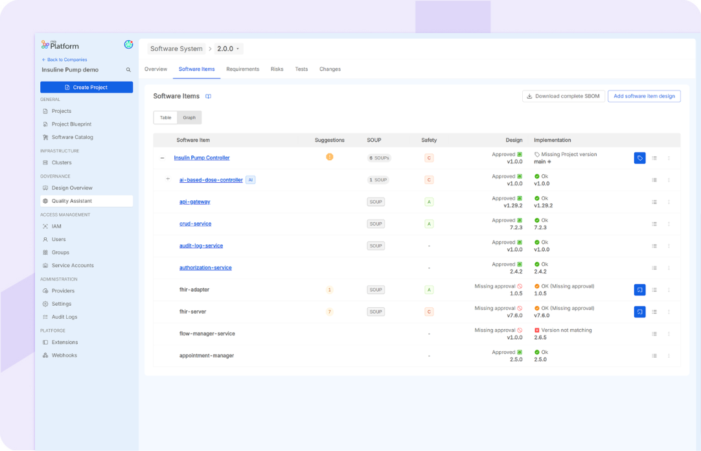
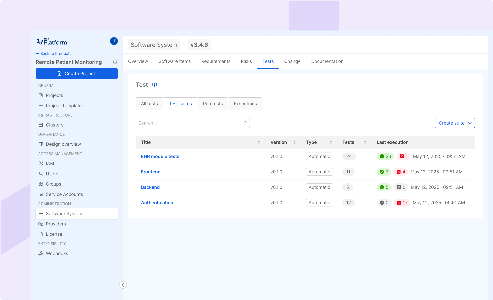
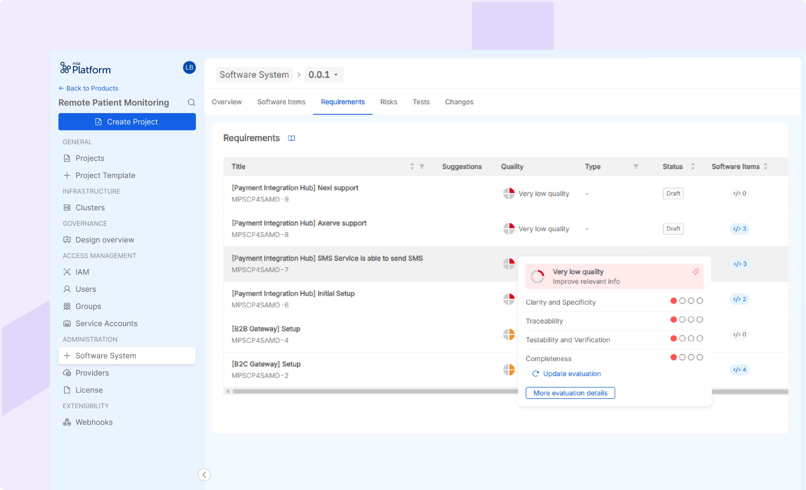

The **Quality Assistant** is an advanced software solution designed to support organizations in the complex process of developing quality software for highly regulated industries. It assists teams in managing the complete lifecycle of software products (SDLC), bridging the gap between cutting-edge software development practices and stringent regulatory requirements.

Quality Assistant is provided as an extension within the Mia-Platform Console, distributed as an application in the Marketplace, and extends the capabilities of the Mia-Platform Internal Developer Platform (IDP) to centralize and orchestrate all stages of the Software Development Lifecycle (SDLC). This facilitates collaboration, automates tasks, ensures consistency, and enhances traceability.

### SDLC Guidance

SDLC guidance is provided through insights and suggestions based on specific references, like standards or regulations. The development is guided through a preset path from design, through approval and implementation of Software Items. The whole SDLC is monitored by progress KPI on the software system. The SDLC is supported also with AI-powered evaluation of requirement and test quality and test coverage, aiming for superior quality and compliance.

It actively guides users towards reference standards and regulation compliance, by providing insights and suggestions based on the analysis of Software Items, Requirements, Risks, and Tests. Helps reduce the risk of non-compliance software development, addressing regulatory requirements in design and test management for specific software item components of the software system. It offers KPIs on project execution which support the monitoring of the building process.

### Traceability

Provides complete tracking of software specifications, from the design to the implementation and release. The end-to-end traceability is provided by links between Software Requirements, Software Items (SWIs) belonging to the Software System, verification and validation tasks such as tests, Risks affecting the system and the Changes. The tool maintains the real-time traceability matrix, that also ensures full traceability within and across software system versions.

### Design Control

Facilitates structured software system design by defining a hierarchy of the software components of the Software System: the Software Items (SWI) and linking architectural references. Enables comprehensive management of SWI, including specification and classification based on safety requirements and identification of Software of Unknown Provenance (SOUPs). Offers support for SWI design based on implementation and provides additional support for AI-based SWI, simplifying their management and assessment for usage.

### Software Development Management

Supports Software Item implementation, including shortcuts to ready-to-use modules and software components to be included in the Software System. Automatic controls guarantee constant checks of the implementation against the Software specifications, allowing early detection of anomalies. Furthermore, the Quality Assistant provides features for dependencies control, approval and documentation. It offers a standardized API definition and management tool, includes full lifecycle management for custom microservices and provides access to a marketplace of ready-to-use Platform Building Blocks (PBCs). Provides comprehensive management of different version releases. Offers support for SWI implementation based on design.

### Configuration Management

Quality Assistant, leveraging the Mia-Platform IDP capabilities, supports in configuration management simplifying the infrastructure setup, offering a comprehensive data store management (collections, views, encryption), and providing centralized management of software system configurations.

### Test & Verification

Provides a comprehensive overview of verification activities: actively help in the design verification management and enables automated verification of SWI implementation against the designed software system. Supports unit, integration, and system test management, allowing the management and execution of test suites.

### Automated Documentation

Streamlines compliance by automatically generating essential documentation using pre-set templates, release notes, risk reports, SOUP reports, S-BOM files, change reports and verification process reports (unit, integration and system test reports). This ensures comprehensive archiving and versioning, allowing audit-ready documentation.

### Risk Management

Provides integrated risk management support with full traceability on the software system; it helps in identifying, analyzing, and mitigating risks throughout the SDLC, keeping the traceability within the software system.

### Requirement Management

Supports requirement creation and classification, including functional, cybersecurity, privacy and other requirements. The requirement analysis is provided by the integration of ALM tools for specification definition.

### Change Management

Provides robust change control by assuring the link of impacted items through software system versions, ensuring full traceability across software system versions. 

### AI-Powered SDLC tool

Quality Assistant integrates AI-powered features to enhance quality and accelerate the development process. 

These features aim to improve the quality of design inputs and testing

- **AI-powered Quality Evaluation**: Provides AI-based evaluation and insights about requirement and test quality and suggests improvements and identifies missing or inconsistent mandatory data. The feature reduces the team effort and improving the overall quality of specifications. The context of the AI model is set for referencing the compliance with specific criteria of reference standards, that can be tuned with respect to the target industry (e.g., healthcare with IEC 62304).

- **Test Coverage estimation**: for each software requirement, the AI-powered tool calculates an estimation of the Test Coverage given by the verification tasks or tests that the user has associated to the requirement. The percentages of Test Coverage support the user in reaching the verification of the complete software system, ensuring the good manufacturing of the product.

- **AI-based SW Items Management**: the user is supported by configured fields that allow to evaluate and address all the newest regulatory requirements regarding the dealing with AI-based models and agent. This simplifies the software design, decreasing the cognitive load needed to include AI model while manufacturing a product (e.g., AI Act, AI-specific IMDRF guidelines and FDA directives are addressed by the tool).

## Comprehensive Validation for Regulatory Compliance

The Quality Assistant has undergone thorough validation in accordance with the GAMP5 guidelines and a comprehensive set of regulatory guidelines and standards. This validation process encompassed risk-based software lifecycle, documented processes for design and development, comprehensive testing, qualification of computerized systems, and adherence to good automated manufacturing practices. The successful completion of this validation provides assurance of the software's quality, reliability, data integrity, and compliance with applicable regulatory expectations.

:::info
**Note that Quality Assistant is not public available in Mia marketplace**. For more information on the product, license and more, please [**contact us**](mailto:info@mia-care.io?subject=Quality%20Assistant%20info%20and%20license).
:::

## Quality Assistant for Healthcare Industry: P4SaMD

P4SaMD is the first distributed configuration of Quality Assistant product, applied on Healthcare industry. It answers to the need for

- Facing Complex regulatory landscape of healthcare world
- Highest quality standard of the Software as a Medical Device, mandatory to ensure patient safety 
- Ensuring health data privacy and security and handling with interoperability of data
- Dealing with legacy stratification and tech debt
- Validation of software tools
- Audit-ready Evidences and Documentation

:::info
For more information, please visit [**Mia-Care documentation**](https://docs.mia-care.io/docs/p4samd/overview) and contact us for a demo [**here**](https://share.hsforms.com/17fAAgdtfR8m7oJ9ugj4sfw35s51).
:::
