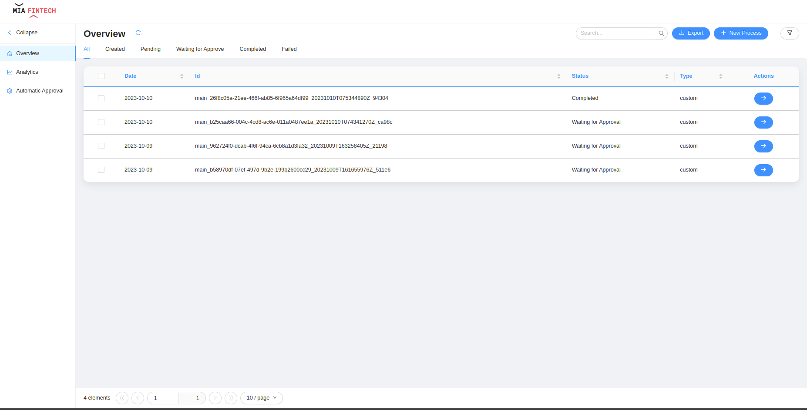
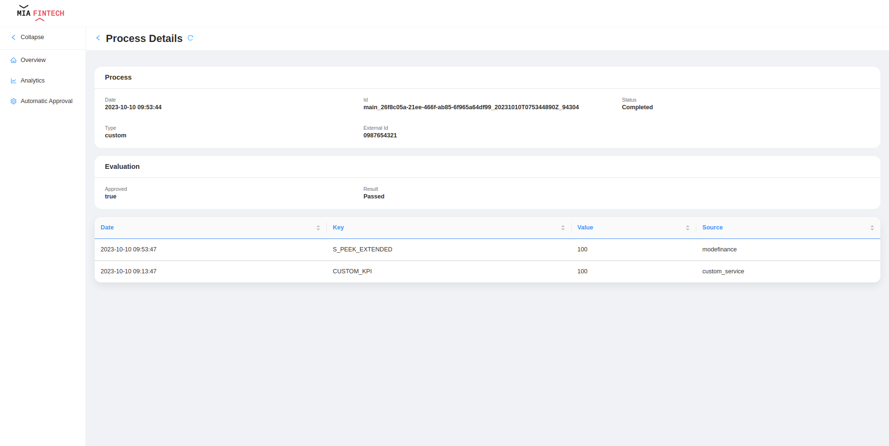
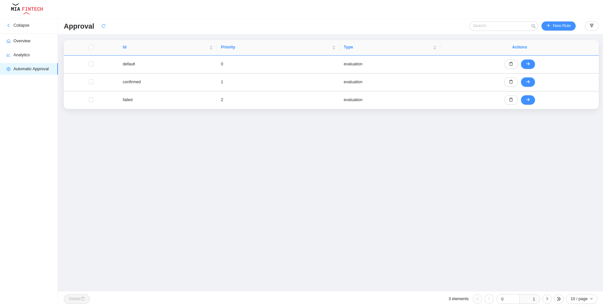
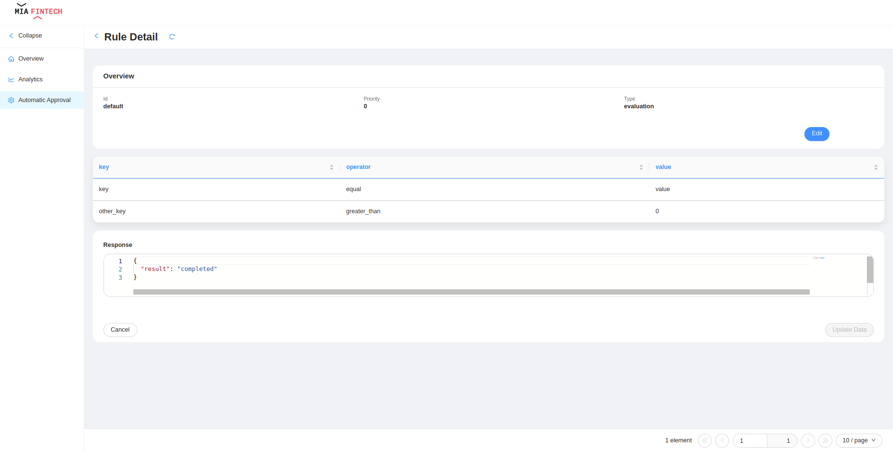

<!--
WARNING: this file was automatically generated by Mia-Platform Doc Aggregator.
DO NOT MODIFY IT BY HAND.
Instead, modify the source file and run the aggregator to regenerate this file.
-->

The Scoring Manager provides already configured pages that allow to perform actions on scoring processes and includes customizable dashboards to monitor custom KPIs.

The pages are fully customizable, and they can be modified to implement a new functionalities and adapt to specific needs; for more details on how to configure the pages you can refer to [backoffice documentation](/microfrontend-composer/overview).

The complete configuration of all pages is available on [GitHub](https://github.com/Mia-FinTech/payment-backoffice#--backoffice-templates---payment).
It is also possible to define them as templates in your own project following this [guide](/microfrontend-composer/composer/configurator_settings#template-sources), the URL to insert is `https://raw.githubusercontent.com/Mia-FinTech/scoring-backoffice/main/`.

:::note
The Backoffice is not included by default in the Scoring Manager Application.
:::

## Scoring Processes

### Overview

On the overview is shown a table with all the processes stored on the database. For each scoring process the following information are available by default:
- **Date**: creation date of the process
- **ID**: unique ID of the process
- **Status**: current status of the process
- **Type**: type of the process

In addition, it is possible to export processes information in CSV or Excel format.

### Process Detail

It is available a dedicated view for each process by clicking the dedicated button that redirects the user to a page with the following information:
- **Overview section**
    - Process ID
    - Process create date
    - Process status
    - Process type
    - External ID
- **Evaluation section**
    - Approval
    - Result
- **Scoring section**: there is a list of all the scores extracted by the process. For each score the following information are available:
    - Creation date of the score
    - Key: unique identifier for the score
    - Value: number defining the result of the score
    - Source: identifier of the source service of the score

## Adaptive Approval

### Overview

On the overview is shown a table with all the rules created and stored on the database. For each role the following information are available by default:
- **ID**: unique ID of the rule
- **priority**: number defining the priority of the rule
- **Type**: custom label defining type of the rule

From here the user can create new rules and delete the already existing ones.

### Payment Detail

It is available a dedicated view for each rule by clicking the dedicated button that redirects the user to a page with the following information:
- **Overview section**
    - Rule ID
    - Rule type
    - Rule priority
- **Conditions section**: a list of conditions related to the current rule
- **Response section**: the JSON object returned as a result whether the rule is matched.

From here the user can update the rule.
