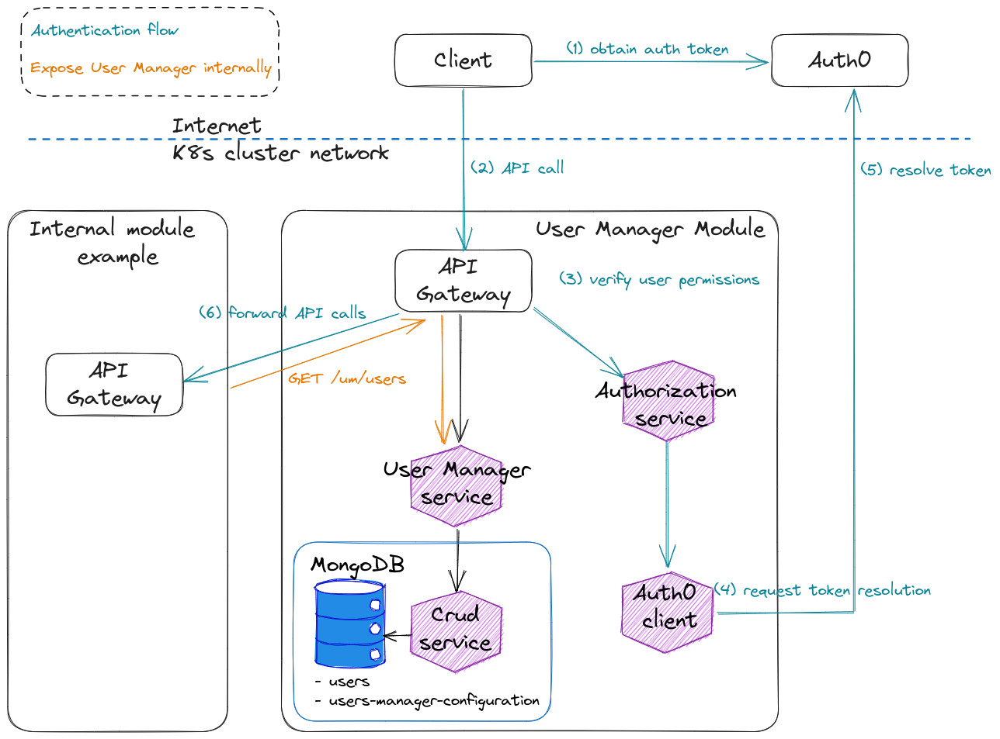

The **User Manager Module** provides a ready-to-use solution for managing and authenticating users. It exposes basic functions for account creation, update and deletion and it regulates permissions and access of users to the other modules inside the Health Composable Platform.

The module is packaged as a Mia-Platform Application, enabling developers to configure everything in just a few steps and have all the services up and running.

It installs the [User Manager][mia-user-manager-service] and the [Auth0 CLient][mia-auth0-client] services, to handle users and authentication. This is the list of the installed microservices:

- [User Manager Service][mia-user-manager-service];
- [Auth0 Client][mia-auth0-client];
- [Oauth login site][oauth-login-site];
- [Authorization Service][mia-authorization-service];
- [API Gateway][mia-api-gateway];
- [CRUD Service][mia-crud-service].

This is the list of database collections handled by the Crud Service inside the UMM:

- [users][mia-users-collection];
- [users-manager-configurations][mia-users-manager-configurations].

## Module Architecture

The module exposes a synchronous HTTP REST interface, and also the internal communication between different microservices is implemented with synchronous HTTP REST interfaces.

The UMM, acts as the “Gateway module“ for the Health Composable Platform (HCP). The authentication flow is centralized in this module, and valid requests are forwarded to the other modules of the platform.

This is an high level overview of the User Manager module:

*Overview of User Manager Module architecture, based on an Http REST interface to handle users and authentication. The module acts as an "Edge Gateway" for other modules.*

[mia-application]: /marketplace/applications/mia_applications.md
[mia-user-manager-service]: /runtime_suite/user-manager-service/10_overview.md
[mia-auth0-client]: /runtime_suite/auth0-client/10_overview.md
[mia-authorization-service]: /runtime_suite/authorization-service/10_overview.md
[mia-api-gateway]: /runtime_suite/api-gateway/10_overview.md
[mia-crud-service]: /runtime_suite/crud-service/10_overview_and_usage.md
[oauth-login-site]: /runtime_suite_applications/secure-api-gateway/10_overview.md#oauth-login-site

[mia-users-collection]: /runtime_suite/user-manager-service/20_configuration.md#user-crud-collection 
[mia-users-manager-configurations]: /runtime_suite/user-manager-service/20_configuration.md#user-manager-configuration-crud-collection
