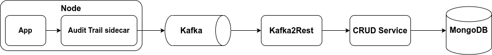

<!--
WARNING: this file was automatically generated by Mia-Platform Doc Aggregator.
DO NOT MODIFY IT BY HAND.
Instead, modify the source file and run the aggregator to regenerate this file.
-->

Audit trail collects events happening in the systems inside your environment to provide observability and accountability.

Each audit log represents an event happened within a system and should include the following information, to answer the five Ws:

- **who** did it: the user or system who performed the operation and other users involved;
- **what** happened: which operation was performed (data is accessed or changed, etc.) and which resources were affected (a record was created, read, updated or deleted, etc.);
- **why** it happened: the operation scope (creation, deletion, consultation, aggregation, etc.);
- **where** it happened: which service triggered the event and generated the audit log and which one, if different, carried out the operation;
- **when** it happened: when the operation was performed (a timestamp).

For example, if a doctor creates an appointment with a patient using the [Calendar component][am-calendar] and the [Appointment Manager][appointment-manager], the audit log should include at least:

- **who**: the account ID of the doctor;
- **what**: the details about the insert operation performed on the [CRUD Service][crud-service], including:
  - an identifier of the [CRUD Service][crud-service] instance called by the [Appointment Manager][appointment-manager];
  - the name of the collection where the appointment was created;
  - the unique id of the appointment record created in the CRUD collection;
  - the unique id of the patient involved in the appointment;
- **why**: the creation of an appointment;
- **where**: the services involved in the operation, including:
  - the [Calendar component][am-calendar], used by the doctor to create the appointment;
  - the [Appointment Manager][appointment-manager], called by the component;
  - the [CRUD Service][crud-service], called by the Appointment Manager to create the appointment record.

The audit trail is meant to provide enough information to answer common questions like:

- who accessed the medical records of a given patient in the last month;
- who changed a system configuration in the last 24 hours;
- which medical records were accessed or modified by a doctor in the last week;
- etc.

The following table provides a glossary for the most common terms and expressions used throughout this page.
Unless stated otherwise, when you encounter any of these terms or expressions you should assume they have the stated meaning.

| Term          | Definition                                                                                                     |
|---------------|----------------------------------------------------------------------------------------------------------------|
| *Audit Trail* | The entire collection of audit logs.                                                                           |
| *Data Store*  | The system where the audit logs are stored (database, message queue, etc.).                                    |
| *Id*          | Unique identifier, globally or within a given *namespace*.                                                     |
| *GCP*         | Acronym of Google Cloud Platform.                                                                              |
| *Namespace*   | One or more fields identifying a subsystem of the infrastructure (service, database, table, collection, etc.). |
| *Operation*   | An activity performed on a system, by a user or another system acting as clients.                              |
| *Resource*    | A database record or system component accessed or modified by an operation.                                    |
| *Source*      | The system where the event happens and is recorded in the audit trail.                                         |
| *System*      | A software service running in your cluster.                                                                    |
| *User*        | A physical person interacting with a software system.                                                          |

## Architecture



Here's what happens when an audit log is generated by your microservice:

1. the Audit Trail sidecar collects the audit logs generated by your application through a shared volume, enrich them and sends them to a Kafka topic;
2. the [Kafka2Rest][kafka2rest] service processes the logs from the Kafka topic and sends a `POST` request to the [CRUD Service][crud-service];
3. the [CRUD Service][crud-service] saves the audit log in a [MongoDB][mongodb] collection.

From here, you can easily query the audit logs according to your needs, for example building a frontend application using the [Microfrontend composer][microfrontend-composer].

### Monitoring and alerting

Under certain conditions, especially where a lot of logs are generated, some logs may be lost (including audit logs).

Since the log file is stored on an ephemeral volume, if the pod is restarted the log file could be lost before the sidecar is able to finish processing its content.
The sidecar is designed to automatically resume watching the application log from the beginning after is restarted, so it should collect correctly any log generated by the main application container while it was not available.

To avoid logs file becoming too large, the sidecar rotate logs automatically every day and keeps only the last five. Each time, the original log file is truncated in place after creating a copy, to minimize the risk of incoming logs not written to the file. There is still a chance that logs are written to the original file during the few milliseconds between the creation of the copy and the truncation of the original one.

Therefore, we recommend setting up proper alarms on your infrastructure to ensure the health of all the architecture components.
If you are using the PaaS, you can leverage [Grafana Alerting][paas-grafana-alerting] to monitor the health of the logging stack, the sidecars, [Kafka2Rest][kafka2rest] and the [CRUD Service][crud-service].

For additional performance considerations, please take a look at the [*Performance tuning*][performance] section.

## Data model

The audit logs are enriched with metadata and normalized by the sidecar. This section provides an overview of its data model, which is inspired by the following standards and solutions:

- [RFC 3881][rfc-3881]
- [FHIR AuditEvent][fhir-audit-event]
- [OpenTelemetry Logs][open-telemetry-logs-data-model]
- [GCP Cloud Logging][gcp-cloud-logging-data-model]

To ensure semantical consistency across the logs generated by the different services running inside your projects and make it easier to query and aggregate logs from different sources, we provide a reference data model that you can use as starting point when passing structured data to your logs.

The main goal of having a shared data model is to enable aggregating and querying audit logs generated by heterogenous systems through a unified interface.

We encourage you to customize the data model to suit your specific needs while ensuring it includes enough information to be able to answer quickly and effectively to the most common questions mentioned at the beginning of this page.

### Version

| Field name | Type   | Required | RFC 3881 | FHIR | OpenTelemetry | GCP |
|------------|--------|----------|----------|------|---------------|-----|
| `version`  | String | Yes      | -        | -    | -             | -   |

The version of the audit log data model, to ensure backward and forward compatibility.

The value should adhere to [semantic versioning][semantic-versioning].

```json
{
  "version": "1.0.0"
}
```

### Timestamp

| Field name  | Type   | Required | RFC 3881                                   | FHIR                                  | OpenTelemetry                              | GCP                                       |
|-------------|--------|----------|--------------------------------------------|---------------------------------------|--------------------------------------------|-------------------------------------------|
| `timestamp` | String | Yes      | [Event Date/Time][rfc-3881-event-datetime] | [recorded][fhir-audit-event-recorded] | [Timestamp][open-telemetry-logs-timestamp] | [timestamp][gcp-cloud-logging-data-model] |

A timestamp indicating when the event happened.

```json
{
  "timestamp": "2023-12-01T09:34:56.789Z"
}
```

### Checksum

| Field name           | Type   | Required | RFC 3881 | FHIR | OpenTelemetry | GCP |
|----------------------|--------|----------|----------|------|---------------|-----|
| `checksum`           | Object | Yes      | -        | -    | -             | -   |
| `checksum.algorithm` | String | Yes      | -        | -    | -             | -   |
| `checksum.value`     | String | Yes      | -        | -    | -             | -   |

An integrity checksum (`checksum.value`) computed using preferably the SHA-512 algorithm (`checksum.algorithm`) on the other log fields.

```json
{
  "checksum": {
    "algorithm": "sha512",
    "value": "b1f4aaa6b51c19ffbe4b1b6fa107be09c8acafd7c768106a3faf475b1e27a940d3c075fda671eadf46c68f93d7eabcf604bcbf7055da0dc4eae6743607a2fc3f"
  }
}
```

### Message

| Field name | Type   | Required | RFC 3881 | FHIR | OpenTelemetry | GCP |
|------------|--------|----------|----------|------|---------------|-----|
| `message`  | String | No       | -        | -    | -             | -   |

The log message.

```json
{
  "message": "A log message"
}
```

### Metadata

| Field name           | Type   | Required | RFC 3881                                                                            | FHIR                                  | OpenTelemetry                                     | GCP                                           |
|----------------------|--------|----------|-------------------------------------------------------------------------------------|---------------------------------------|---------------------------------------------------|-----------------------------------------------|
| `metadata`           | Object | Yes      | -                                                                                   | -                                     | [Attributes][open-telemetry-logs-attributes]      | -                                             |
| `metadata.event`     | String | No       | [Event ID][rfc-3881-event-id]                                                       | [code][fhir-audit-event-code]         | [Attributes][open-telemetry-logs-attributes]      | -                                             |
| `metadata.severity`  | String | No       | -                                                                                   | [severity][fhir-audit-event-severity] | [SeverityText][open-telemetry-logs-severity-text] | [severity][gcp-cloud-logging-log-severity]    |
| `metadata.operation` | String | No       | [Event Action Code][rfc-3881-event-action-code]                                     | [action][fhir-audit-event-action]     | [Attributes][open-telemetry-logs-attributes]      | -                                             |
| `metadata.request`   | String | No       | [Network Access Point Identification][rfc-3881-network-access-point-identification] | -                                     | [Attributes][open-telemetry-logs-attributes]      | [HttpRequest][gcp-cloud-logging-http-request] |
| `metadata.resource`  | String | No       | -                                                                                   | -                                     | [Attributes][open-telemetry-logs-attributes]      | -                                             |
| `metadata.source`    | String | Yes      | [Audit Source ID][rfc-3881-audit-source-id]                                         | -                                     | [Attributes][open-telemetry-logs-attributes]      | -                                             |
| `metadata.user`      | String | No       | [User ID][rfc-3881-user-id]                                                         | -                                     | [Attributes][open-telemetry-logs-attributes]      | -                                             |

The `metadata` field is design to contain structured data passed to the logger and representing event metadata you can later query on MongoDB, like:

```js
logger.audit({
  event: 'AM/AppointmentCreated',
  severity: 'info',
  source: 'appointment-manager',
  resource: 'AM/Appointment/appointment-12345',
  user: 'dr.john.watson'
}, 'Appointment created')
```

which would be stored as:

```json
{
  "metadata": {
    "event": "AM/AppointmentCreated",
    "severity": "info",
    "source": "appointment-manager",
    "resource": "AM/Appointment/appointment-12345",
    "user": "dr.john.watson",
  },
  "message": "Appointment created"
}
```

We recommend enforcing a common data model, to ensure you can correlate events and metadata originating from different sources.
Each service can then add custom fields to provide context specific details.

In our plugins, we try to follow the common data schema specified in the table, with the following semantics:

- `event`: type of event (API called, job executed, medical record updated, etc.);
- `severity`: the log level associated to the event, like `debug`, `info`, `warning`, `error` and so on;
- `operation`: type of operation performed (record created, read, accessed or deleted, etc.);
- `request`: the ID of the request triggering or originating the event;
- `resource`: unique identifier of the main resource affected by the operation (medical record ID, etc.);
- `source`: unique identifier of the application or system where the event occurs and the audit log is generated;
- `user`: unique identifier of the user who triggered the request.


[performance]: 20_configuration.md#performance-tuning

[am-calendar]: /runtime_suite/care-kit/20_components/10_am-calendar.md
[appointment-manager]: /runtime_suite/appointment-manager/10_overview.md
[paas-grafana-alerting]: /infrastructure/paas/tools/grafana.md#alerting
[crud-service]: /runtime_suite/crud-service/10_overview_and_usage.md
[kafka2rest]: /runtime_suite/crud-service/10_overview_and_usage.md
[microfrontend-composer]: /microfrontend-composer/overview.md

[fhir-audit-event]: https://www.hl7.org/fhir/auditevent.html "AuditEvent | FHIR"
[fhir-audit-event-action]: https://www.hl7.org/fhir/auditevent-definitions.html#AuditEvent.action
[fhir-audit-event-agent]: https://www.hl7.org/fhir/auditevent-definitions.html#AuditEvent.agent
[fhir-audit-event-code]: https://www.hl7.org/fhir/auditevent-definitions.html#AuditEvent.code
[fhir-audit-event-entity]: https://www.hl7.org/fhir/auditevent-definitions.html#AuditEvent.entity 
[fhir-audit-event-recorded]: https://www.hl7.org/fhir/auditevent-definitions.html#AuditEvent.recorded
[fhir-audit-event-severity]: https://www.hl7.org/fhir/auditevent-definitions.html#AuditEvent.severity
[fhir-audit-event-source]: https://www.hl7.org/fhir/auditevent-definitions.html#AuditEvent.source

[gcp-cloud-logging-data-model]: https://cloud.google.com/logging/docs/reference/v2/rest/v2/LogEntry "Log Entry | Cloud Logging | Google Cloud"
[gcp-cloud-logging-http-request]: https://cloud.google.com/logging/docs/reference/v2/rest/v2/LogEntry#HttpRequest
[gcp-cloud-logging-log-severity]: https://cloud.google.com/logging/docs/reference/v2/rest/v2/LogEntry#logseverity

[open-telemetry-logs-data-model]: https://opentelemetry.io/docs/specs/otel/logs/data-model/ "Logs Data Model | OpenTelemetry"
[open-telemetry-logs-attributes]: https://opentelemetry.io/docs/specs/otel/logs/data-model/#field-attributes
[open-telemetry-logs-body]: https://opentelemetry.io/docs/specs/otel/logs/data-model/#field-body
[open-telemetry-logs-resource]: https://opentelemetry.io/docs/specs/otel/logs/data-model/#field-resource
[open-telemetry-logs-severity-text]: https://opentelemetry.io/docs/specs/otel/logs/data-model/#field-severitytext
[open-telemetry-logs-timestamp]: https://opentelemetry.io/docs/specs/otel/logs/data-model/#field-timestamp

[rfc-3881]: https://www.rfc-editor.org/rfc/rfc3881 "Security Audit and Access Accountability Message XML Data Definitions for Healthcare Applications"
[rfc-3881-audit-source-id]: https://datatracker.ietf.org/doc/html/rfc3881#section-5.4.2
[rfc-3881-event-datetime]: https://datatracker.ietf.org/doc/html/rfc3881#section-5.1.3
[rfc-3881-event-action-code]: https://datatracker.ietf.org/doc/html/rfc3881#section-5.1.2
[rfc-3881-event-outcome-indicator]: https://datatracker.ietf.org/doc/html/rfc3881#section-5.1.4
[rfc-3881-event-id]: https://datatracker.ietf.org/doc/html/rfc3881#section-5.1.1
[rfc-3881-network-access-point-identification]: https://datatracker.ietf.org/doc/html/rfc3881#section-5.3
[rfc-3881-participant-object-data-life-cycle]: https://datatracker.ietf.org/doc/html/rfc3881#section-5.5.3
[rfc-3881-participant-object-detail]: https://datatracker.ietf.org/doc/html/rfc3881#section-5.5.9
[rfc-3881-participant-object-id]: https://datatracker.ietf.org/doc/html/rfc3881#section-5.5.6
[rfc-3881-participant-object-id-type-code]: https://datatracker.ietf.org/doc/html/rfc3881#section-5.5.4
[rfc-3881-participant-object-identification]: https://datatracker.ietf.org/doc/html/rfc3881#section-5.5
[rfc-3881-participant-object-query]: https://datatracker.ietf.org/doc/html/rfc3881#section-5.5.8
[rfc-3881-participant-object-type-code]: https://datatracker.ietf.org/doc/html/rfc3881#section-5.5.1
[rfc-3881-participant-object-type-code-role]: https://datatracker.ietf.org/doc/html/rfc3881#section-5.5.2
[rfc-3881-user-id]: https://datatracker.ietf.org/doc/html/rfc3881#section-5.2.1
[rfc-3881-active-participant-identification]: https://datatracker.ietf.org/doc/html/rfc3881#section-5.2
[rfc-3881-participant-object-detail]: https://datatracker.ietf.org/doc/html/rfc3881#section-5.5.9
[rfc-3881-participant-object-query]: https://datatracker.ietf.org/doc/html/rfc3881#section-5.5.8

[mongodb]: https://www.mongodb.com
[semantic-versioning]: https://semver.org/spec/v2.0.0.html
