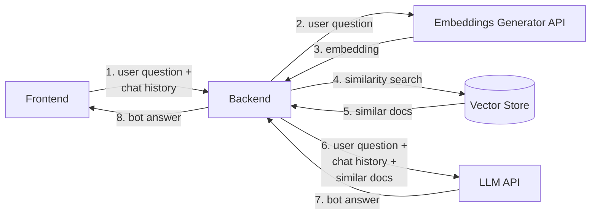

<!--
WARNING: this file was automatically generated by Mia-Platform Doc Aggregator.
DO NOT MODIFY IT BY HAND.
Instead, modify the source file and run the aggregator to regenerate this file.
-->

The _AI RAG Template_ is a template to build and run your own RAG application and build a Chatbot that is capable to perform a conversation with a user.

The service is developed using the [LangChain](https://python.langchain.com/docs/get_started/introduction/) framework, which enables creating sequences of complex interactions using Large Language Models. The web server is implemented using the [FastAPI](https://fastapi.tiangolo.com/) framework.

In order to work, it is required to have a MongoDB instance to be used as Vector Store and that supports [MongoDB Vector Search indexes](https://www.mongodb.com/docs/atlas/atlas-vector-search/tutorials/vector-search-quick-start/), which means an Atlas instance with version 6 or above.

## Overview

The following is the high-level architecture of the template.



### Embeddings

Please mind that the template does not include embeddings or any logic to create them. It is intended that the Vector Store will include the embeddings (or these are generated separately). In any case, please ensure that the embedding model used the populate the Vector Store is the same embedding model used when running the service, otherwise the service will generate answers only based on its own knowledge, without being able to use the Vector Store, with the risk of hallucinations when chatting with the user.

### API

When running the service, the application exposes a Swagger UI at the `/docs` endpoint.

### Chat Endpoint (`/chat/completions`)

The `/chat/completions` endpoint generates responses to user queries based on provided context and chat history. It leverages information from the configured Vector Store to formulate relevant responses, enhancing the conversational experience.

***Example***:

<details>
<summary>Request</summary>

```curl
curl 'http://localhost:3000/chat/completions' \
  -H 'content-type: application/json' \
  --data-raw '{"chat_query":"Design a CRUD schema for an online store selling merchandise items","chat_history":[]}'
```

</details>

<details>
<summary>Response</summary>

```json
{
    "message": "For an online store selling merchandise items, we can design a CRUD schema for a `Product` entity with the following properties:\n\n- `name`: A mandatory string.\n- `description`: An optional string.\n- `price`: A mandatory number.\n\nThe CRUD schema, excluding the default attributes, would look like this:\n\n```json\n[\n  {\n    \"name\": \"name\",\n    \"type\": \"string\",\n    \"required\": true,\n    \"nullable\": false,\n    \"encryptionEnabled\": false,\n    \"encryptionSearchable\": false,\n    \"sensitivityValue\": 0\n  },\n  {\n    \"name\": \"price\",\n    \"type\": \"number\",\n    \"required\": true,\n    \"nullable\": false,\n    \"encryptionEnabled\": false,\n    \"encryptionSearchable\": false,\n    \"sensitivityValue\": 0\n  },\n  {\n    \"name\": \"description\",\n    \"type\": \"string\",\n    \"required\": false,\n    \"nullable\": false,\n    \"encryptionEnabled\": false,\n    \"encryptionSearchable\": false,\n    \"sensitivityValue\": 0\n  }\n]\n```\n\nThis schema defines the structure of the `Product` entity with the necessary properties for managing merchandise items in the online store.",
    "references": [
        {
            "content": "### Create CRUD to Read and Write Table Data  \nTo evaluate the new page, it's essential to create a CRUD microservice and expose the relevant data through an endpoint, facilitating reading and writing operations on our table.  \n:::warning\nIf you're unfamiliar with CRUD microservices, consider consulting the [CRUD Tutorial](/console/tutorials/configure-marketplace-components/rest-api-for-crud-on-data.mdx).\n:::  \nFor our example, let's employ a basic CRUD microservice featuring a `Product` entity endowed with the subsequent properties:\n* `name`: A mandatory string.\n* `description`: An optional string.\n* `price`: A mandatory number.  \nThe data CRUD will be exposed via an endpoint named `products`.  \nBelow is the CRUD schema, excluding the default CRUD attributes (_id, creatorId, createdAt, updaterId, updatedAt, and \\_\\_STATE\\_\\_):  \n```json\n[\n{\n\"name\":\"name\",\n\"type\":\"string\",\n\"required\":true,\n\"nullable\":false,\n\"encryptionEnabled\":false,\n\"encryptionSearchable\":false,\n\"sensitivityValue\":0\n},\n{\n\"name\":\"price\",\n\"type\":\"number\",\n\"required\":true,\n\"nullable\":false,\n\"encryptionEnabled\":false,\n\"encryptionSearchable\":false,\n\"sensitivityValue\":0\n},\n{\n\"name\":\"description\",\n\"type\":\"string\",\n\"required\":false,\n\"nullable\":false,\n\"encryptionEnabled\":false,\n\"encryptionSearchable\":false,\n\"sensitivityValue\":0\n}\n]\n```\nNow, the CRUD data can be exposed using an endpoint named `products`.",
            "url": "../../microfrontend-composer/tutorials/basics"
        },
        {
            "content": "### Create CRUD to Read and Write Table Data  \nTo evaluate the new page, it's essential to create a CRUD microservice and expose the relevant data through an endpoint, facilitating reading and writing operations on our table.  \n:::warning\nIf you're unfamiliar with CRUD microservices, consider consulting the [CRUD Tutorial](/console/tutorials/configure-marketplace-components/rest-api-for-crud-on-data.mdx).\n:::  \nFor our example, let's employ a basic CRUD microservice featuring a `Product` entity endowed with the subsequent properties:\n* `name`: A mandatory string.\n* `description`: An optional string.\n* `price`: A mandatory number.  \nThe data CRUD will be exposed via an endpoint named `products`.  \nBelow is the CRUD schema, excluding the default CRUD attributes (_id, creatorId, createdAt, updaterId, updatedAt, and \\_\\_STATE\\_\\_):  \n```json\n[\n{\n\"name\":\"name\",\n\"type\":\"string\",\n\"required\":true,\n\"nullable\":false,\n\"encryptionEnabled\":false,\n\"encryptionSearchable\":false,\n\"sensitivityValue\":0\n},\n{\n\"name\":\"price\",\n\"type\":\"number\",\n\"required\":true,\n\"nullable\":false,\n\"encryptionEnabled\":false,\n\"encryptionSearchable\":false,\n\"sensitivityValue\":0\n},\n{\n\"name\":\"description\",\n\"type\":\"string\",\n\"required\":false,\n\"nullable\":false,\n\"encryptionEnabled\":false,\n\"encryptionSearchable\":false,\n\"sensitivityValue\":0\n}\n]\n```\nNow, the CRUD data can be exposed using an endpoint named `products`.",
            "url": "../../microfrontend-composer/tutorials/basics"
        },
        {
            "content": "### Create a CRUD for persistency  \nTo create a CRUD service you can follow [this](/console/tutorials/configure-marketplace-components/rest-api-for-crud-on-data.mdx) tutorial.\nAs data schema please import this <a download target=\"_blank\" href=\"/docs_files_to_download/ai-rag-template/flow-manager-service/saga-collection.json\">schema</a>.  \nRemember to create a **unique index** for the collection on the `sagaId` field and to set the **default state** for new documents to `PUBLIC`.  \nTo do this follow these steps:\n1. Open the _Design_ section of the Console.\n1. On the left panel, in the _Data Models_ group, click on _MongoDB CRUD_ section.\n1. Click on the CRUD you created.\n1. In the _Indexes_ section click _Add index_.\n1. Enter these values:\n- **Name**: `sagaIdIndex`\n- **Type**: `Normal`\n- **Field**: `sagaId`  \n<div style={{display: 'flex', justifyContent: 'center'}}>\n<div style={{display: 'flex', width: '600px'}}>  \n  \n</div>\n</div>  \n1. Click _Create_. The new index will be shown.\n1. Set the `unique` checkbox for the `sagaIdIndex` index.\n1. In the _Internal Endpoints_ section make sure that `Default state` is set to `PUBLIC`.  \n<div style={{display: 'flex', justifyContent: 'center'}}>\n<div style={{display: 'flex', width: '600px'}}>  \n  \n</div>\n</div>  \nYou can find more information on CRUD Persistency Manager in the [dedicated](/runtime_suite/flow-manager-service/30_configuration.md#crud-persistency-manager) page.",
            "url": "../../console/tutorials/configure-marketplace-components/flow-manager"
        },
        {
            "content": "### Create a CRUD for persistency  \nTo create a CRUD service you can follow [this](/console/tutorials/configure-marketplace-components/rest-api-for-crud-on-data.mdx) tutorial.\nAs data schema please import this <a download target=\"_blank\" href=\"/docs_files_to_download/ai-rag-template/flow-manager-service/saga-collection.json\">schema</a>.  \nRemember to create a **unique index** for the collection on the `sagaId` field and to set the **default state** for new documents to `PUBLIC`.  \nTo do this follow these steps:\n1. Open the _Design_ section of the Console.\n1. On the left panel, in the _Data Models_ group, click on _MongoDB CRUD_ section.\n1. Click on the CRUD you created.\n1. In the _Indexes_ section click _Add index_.\n1. Enter these values:\n- **Name**: `sagaIdIndex`\n- **Type**: `Normal`\n- **Field**: `sagaId`  \n<div style={{display: 'flex', justifyContent: 'center'}}>\n<div style={{display: 'flex', width: '600px'}}>  \n  \n</div>\n</div>  \n1. Click _Create_. The new index will be shown.\n1. Set the `unique` checkbox for the `sagaIdIndex` index.\n1. In the _Internal Endpoints_ section make sure that `Default state` is set to `PUBLIC`.  \n<div style={{display: 'flex', justifyContent: 'center'}}>\n<div style={{display: 'flex', width: '600px'}}>  \n  \n</div>\n</div>  \nYou can find more information on CRUD Persistency Manager in the [dedicated](/runtime_suite/flow-manager-service/30_configuration.md#crud-persistency-manager) page.",
            "url": "../../console/tutorials/configure-marketplace-components/flow-manager"
        }
    ]
}
```

</details>

### Metrics Endpoint (`/-/metrics`)

The `/-/metrics` endpoint exposes useful metrics to be collected by Prometheus.

## Environment Variables

The following environment variables are required for the service to work:

- **PORT**: the port used to expose the API (default: _3000_)
- **LOG_LEVEL**: the level of the logger (default: _INFO_)
- **CONFIGURATION_PATH**: the path that contains the [JSON configuration file](#configuration)
- **MONGODB_CLUSTER_URI**: the MongoDB connectio string
- **LLM_API_KEY**: the API Key of the LLM (_NOTE_: currently, we support only the OpenAI models, thus the API Key is the same as the OpenAI API Key)
- **EMBEDDINGS_API_KEY**: the API Key of the embeddings model (_NOTE_: currently, we support only the OpenAI models, thus the API Key is the same as the OpenAI API Key)

It is suggested to save the environment variables in a `.env` file.

## Configuration

The service requires several configuration parameters for execution. Below is an example configuration:

```json
{
  "llm": {
    "name": "gpt-3.5-turbo"
  },
  "embeddings": {
    "name": "text-embedding-3-small"
  },
  "vectorStore": {
    "dbName": "database-test",
    "collectionName": "assistant-documents",
    "indexName": "vector_index",
    "relevanceScoreFn": "euclidean",
    "embeddingKey": "embedding",
    "textKey": "text",
    "maxDocumentsToRetrieve": 4,
    "minScoreDistance": 0.5
  },
  "chain": {
    "aggregateMaxTokenNumber": 2000,
    "rag": {
      "promptsFilePath": {
        "system": "/path/to/system-prompt.txt",
        "user": "/path/to/user-prompt.txt"
      }
    }
  }
}
```

Description of configuration parameters:

| Name | Key | Description |
|------|-----|-------------|
| LLM Name | `llm.name` | Name of the chat model to use. We currently support only [OpenAI models](https://platform.openai.com/docs/models). |
| Embeddings Name | `embeddings.name` | Name of the encoder to use. We currently support only [OpenAI embeddings models](https://platform.openai.com/docs/guides/embeddings/what-are-embeddings). |
| Vector Store DB Name | `vectorStore.dbName` | Name of the MongoDB database to use as a knowledge base and that contains the collection with the embeddings. |
| Vector Store Collection Name | `vectorStore.collectionName` | Name of the MongoDB collection to use for storing documents and document embeddings. |
| Vector Store Index Name | `vectorStore.indexName` | Name of the vector index to use for retrieving documents related to the user's query. For more info, refer to the [Create a Vector index](#create-a-vector-index) paragraph. |
| Vector Store Relevance Score Function | `vectorStore.relevanceScoreFn` | Name of the similarity function used for extracting similar documents using the created vector index. For more info, refer to the [Create a Vector index](#create-a-vector-index) paragraph. |
| Vector Store Embeddings Key | `vectorStore.embeddingsKey` | Name of the field used to save the semantic encoding of documents. The question received will be compared to the vector in this field with the Vector Index. For more info, refer to the [Create a Vector index](#create-a-vector-index) paragraph. |
| Vector Store Text Key | `vectorStore.textKey` | Name of the field used to save the raw document (or chunk of document). The content of this field will be included in the prompt. |
| Vector Store Max. Documents To Retrieve | `vectorStore.maxDocumentsToRetrieve` | Maximum number of documents retrieved from the Vector Store. |
| Vector Store Min. Score Distance | `vectorStore.minScoreDistance` | Minimum score required for the extracted document to be used in the prompt. Any document with a score below this value will be discarded. |
| Chain RAG System Prompts File Path | `vectorStore.textKey` | Path to the file containing system prompts for the RAG model. |
| Chain RAG User Prompts File Path | `vectorStore.textKey` | Path to the file containing user prompts for the RAG model. |

### Create a Vector Index

This template requires a [MongoDB Vector Search Index](https://www.mongodb.com/docs/atlas/atlas-vector-search/vector-search-type/) to function correctly, and requires a MongoDB Atlas instance version 6 or above to work.

You can create a new Vector Search Index with the following structure:

```json
{
    "fields": [
        {
            "type": "vector",
            "path": "<<embeddingsKey>>",
            "numDimensions": 768,
            "similarity": "<<relevanceScoreFn>>"
        }
    ]
}
```

You should remember to:

- to have as `path` the same value of the `vectorStore.embeddingsKey` configuration parameter
- to have as `similarity` the same value of the `vectorStore.relevanceScoreFn` configuration parameter
- to have as `numDimensions` to appropriate value based on the [embeddings model used](https://platform.openai.com/docs/guides/embeddings/how-to-get-embeddings)
