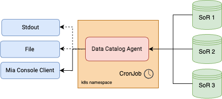

<!--
WARNING: this file was automatically generated by Mia-Platform Doc Aggregator.
DO NOT MODIFY IT BY HAND.
Instead, modify the source file and run the aggregator to regenerate this file.
-->

_Data Catalog Agent_ is command line interface binary that queries datasources for the data schemas of the resources they own and sends them to a target. In the context of databases, it provides facilities to:

1. query tables schemas
2. aggregate them in a unique asset (JSON format)
3. send it to an HTTP server or store it locally on file

_Data Catalog Agent_ serves as a driver for collecting and browsing, in a unified view, tables/collections persisted in different sources (System of Record, a.k.a SoR).

_Mia Console_ allows to intercept the _Data Catalog Agent_ output assets and visualize them in a dedicated web view. _Mia Console_ is one of the configurable targets of _Data Catalog Agent_.

_Data Catalog Agent_ is well suited for running locally or configured in _Mia Console_ as a [CronJob](/development_suite/api-console/api-design/jobs-cronjob.md).
