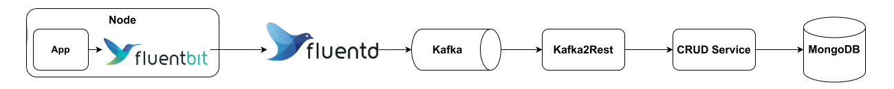

<!--
WARNING: this file was automatically generated by Mia-Platform Doc Aggregator.
DO NOT MODIFY IT BY HAND.
Instead, modify the source file and run the aggregator to regenerate this file.
-->

Audit trail collects events happening in the systems inside your environment to provide observability and accountability.

Each audit log represents an event happened within a system and should include the following information, to answer the five Ws:

- **who** did it: the user or system who performed the operation and other users involved;
- **what** happened: which operation was performed (data is accessed or changed, etc.) and which resources were affected (a record was created, read, updated or deleted, etc.);
- **why** it happened: the operation scope (creation, deletion, consultation, aggregation, etc.);
- **where** it happened: which service triggered the event and generated the audit log and which one, if different, carried out the operation;
- **when** it happened: when the operation was performed (a timestamp).

For example, if a doctor creates an appointment with a patient using the [Calendar component][am-calendar] and the [Appointment Manager][appointment-manager], the audit log should include at least:

- **who**: the account ID of the doctor;
- **what**: the details about the insert operation performed on the [CRUD Service][crud-service], including:
  - an identifier of the [CRUD Service][crud-service] instance called by the [Appointment Manager][appointment-manager];
  - the name of the collection where the appointment was created;
  - the unique id of the appointment record created in the CRUD collection;
  - the unique id of the patient involved in the appointment;
- **why**: the creation of an appointment;
- **where**: the services involved in the operation, including:
  - the [Calendar component][am-calendar], used by the doctor to create the appointment;
  - the [Appointment Manager][appointment-manager], called by the component;
  - the [CRUD Service][crud-service], called by the Appointment Manager to create the appointment record.

The audit trail is meant to provide enough information to answer common questions like:

- who accessed the medical records of a given patient in the last month;
- who changed a system configuration in the last 24 hours;
- which medical records were accessed or modified by a doctor in the last week;
- etc.

The following table provides a glossary for the most common terms and expressions used throughout this page.
Unless stated otherwise, when you encounter any of these terms or expressions you should assume they have the stated meaning.

| Term          | Definition                                                                                                     |
|---------------|----------------------------------------------------------------------------------------------------------------|
| *Audit Trail* | The entire collection of audit logs.                                                                           |
| *Data Store*  | The system where the audit logs are stored (database, message queue, etc.).                                    |
| *Id*          | Unique identifier, globally or within a given *namespace*.                                                     |
| *GCP*         | Acronym of Google Cloud Platform.                                                                              |
| *Namespace*   | One or more fields identifying a subsystem of the infrastructure (service, database, table, collection, etc.). |
| *Operation*   | An activity performed on a system, by a user or another system acting as clients.                              |
| *Resource*    | A database record or system component accessed or modified by an operation.                                    |
| *Source*      | The system where the event happens and is recorded in the audit trail.                                         |
| *System*      | A software service running in your cluster.                                                                    |
| *User*        | A physical person interacting with a software system.                                                          |

## Architecture



Here's what happens when an audit log is generated by your microservice:

1. the [Fluent Bit][fluentbit] agent collects the logs generated by your application in the Kubernetes node and sends them to [Fluentd][fluentd], the logger forwarder;
2. the [Fluentd][fluentd] agent collects all the logs coming from the nodes inside the Kubernetes cluster and forwards the logs coming from microservices with the audit trail enabled (having an agreed label, like `mia-care.io/audit-trail`, with value `true`), and forwards them to a Kafka topic using the [Kafka output plugin for Fluentd][kafka-output-plugin-fluentd];
3. the [Kafka2Rest][kafka2rest] service consumes the application logs from the Kafka topic, filtering the audit logs according to their log level (it must be strictly greater than 1000);
4. for each audit log, the [Kafka2Rest][kafka2rest] service sends a `POST` request to the [CRUD Service][crud-service] with the `auditLog` payload of the log;
5. the [CRUD Service][crud-service] saves the audit log in a [MongoDB][mongodb] collection.

From here, you can easily query the audit logs according to your needs, for example building a frontend application using the [Microfrontend composer][microfrontend-composer].

:::danger

Under certain conditions where a lot of logs are produced, logs may be lost (including audit logs).
You should perform some load tests to scale appropriately the [Fluentd][fluentd] and [Fluent Bit][fluentbit] components and fine-tune the buffer configuration of the [Kafka output plugin for Fluentd][kafka-output-plugin-fluentd].
It’s up to the user to set up proper alarms both on the log infrastructure and on Kafka to detect potential loss of audit logs.

:::

## Security

Audit logs may contain sensitive information that are not encrypted until they are stored into Mongo, so you must ensure that:

1. Data in transit is always encrypted, by using secure connections between [Kafka][kafka], [Kafka2Rest][kafka2rest], the [CRUD Service][crud-service] and [MongoDB][mongodb]
2. Only these service can access the audit trail, by using dedicated credentials with exclusive access to the [Kafka][kafka] topic, [MongoDB][mongodb] collection, etc.
3. Audit trail cannot be altered, deleted or tampered with after being stored into [MongoDB][mongodb]

The following sections illustrate the technical measures you should implement to satisfy these requirements. 

### Encryption of data in transit

The [Kafka2Rest][kafka2rest] service and the [Fluentd][fluentd] agent should authenticate with Kafka using [SASL/SCRAM][kafka-sasl-scram] with Transport Layer Security (TLS) and use dedicated credentials, granting only to these services access to the topic and ensuring no other system can read the logs in the Kafka topic.

For additional information on how to configure a Kafka cluster to encrypt data in transit, please take a look at Confluent [official documentation][kafka-encryption] and [security course][kafka-security-course].

All HTTP services should communicate with each other only using HTTPS connection with Transport Layer Security (TLS), unless internal endpoints are used.

### Encryption of data at rest

Kafka does not natively support data encryption at rest, so you may need to perform client-side encryption on sensitive information before including them in the log.

To ensure audit logs cannot be altered, deleted and tampered with once they have been stored inside a MongoDB collection, you should:

- Use a dedicated MongoDB database, where only audit logs are stored
- Create a user with [custom roles][mongodb-user-roles], allowing only insert or read operations (update or delete operations must be forbidden)
- Review roles and permissions of default users to prevent them from accessing, updating or deleting audit logs or altering or deleting the collection
- Enable [Client-side field level encryption (CSFLE)][mongodb-csfle] on the fields which may contain sensitive information

### Client-side encryption

The [CRUD Service][crud-service] should use [client-side encryption][crud-service-csfle] to encrypt all fields that may contain sensitive or personal information and use [Google Key Management Service][crud-google-kms] to safely store the master encryption key.

:::note

Client-side encryption requires an enterprise version of MongoDB supporting [Client-side field level encryption (CSFLE)][mongodb-csfle] (v4.2 or later).

:::

## Configuration

To setup the architecture described previously, you need to configure the following components:

- the [Logging operator][logging-operator], including [Fluent Bit][fluentbit] and [Fluentd][fluentd];
- a [Kafka][kafka] cluster;
- the [Kafka2Rest][kafka2rest] service;
- the [CRUD Service][crud-service];
- a [MongoDB][mongodb] server.

### Fluent Bit and Fluentd

To configure from scratch your logging stack, we recommend using [Logging operator][logging-operator], that simplifies the deployment and configuration of a Kubernetes logging pipeline, in particular the log collector ([Fluent Bit][fluentbit]) and forwarder ([Fluentd][fluentd]). We recommend looking at the [official documentation][logging-operator-install] for instructions on how to configure these components inside your Kubernetes cluster.

Once the logging stack is set up, you should create a [FluentD Flow][logging-operator-fluentd-flow] to forward the logs generated by pods in a certain namespace to the [Kafka output][logging-operator-fluentd-kafka-output].

### Kafka

To collect the logs from [Fluentd][fluentd], you need to create a dedicated topic in a Kafka cluster and configure the [Logging Operator][logging-operator] to use the [Fluentd Kafka output][logging-operator-fluentd-kafka-output] to forward the logs. You can do so by defining a Kubernetes flow

After creating a new topic, you should configure at least the retention period, taking into account the amount of application logs generated by the systems, which can easily be in the order of several GBs a day. When choosing the retention period, you need to find a balance between the availability of logs for later processing, accounting for the unavailability of the downstream services ([Kafka2Rest][kafka2rest] and the [CRUD Service][crud-service]), and the amount of logs generated by your services, which can vary between environments depending on the level of traffic and the configured log level.

In our development and testing environment, where we set the log level to `DEBUG` or even `TRACE`, we opted for a retention period of a single day, while we increased it in the production environments, where the log levels is usually set to `INFO`.

A log will appear in Kafka as a message with a payload resembling this:

```json
{
  "stream": "stdout",
  "logtag": "F",
  "message": "{\"level\": 1100,\"time\":1709145271519,\"pid\":18,\"hostname\":\"your-service\",\"auditLog\":{},\"msg\":\"Audit log message\"}",
}
```

The `message` field contains our log, that, once parsed to JSON, has a `level` field, to allow us filtering the audit logs, and the `auditLog` field, which contains the actual event details that are stored in the [MongoDB][mongodb] collection.

### Kafka2Rest

The [Kafka2Rest][kafka2rest] service should authenticate with Kafka using [SASL/SCRAM][kafka-sasl-scram] with Transport Layer Security (TLS) in combination with dedicated credentials, that have exclusive access to the topic.

You then need to configure the following processors:

- a [validator processor][kafka2rest-validator-processor] that filters the audit logs according to their log level (it must be strictly greater than 1000);
- a [body processor][kafka2rest-body-processor] that extracts the `auditLog` field from the audit log payload and sends it in the body of the POST to the [CRUD Service][crud-service].

### CRUD Service

The [CRUD Service][crud-service] should connect to MongoDB using dedicated credentials, which only allow insert or read operations.

If you configure an endpoint for the CRUD collection, you should disable all endpoints except for `POST /` and `GET /`, to insert and query audit logs respectively.

You must create a CRUD collection with the custom fields described in the following table or you can easily import the fields from <a download target="_blank" href="/docs_files_to_download/node.js-mia-care-samd-template/audit_logs.json">this JSON file</a>

| Name        | Type      | Required | Nullable |
|-------------|-----------|----------|----------|
| `version`   | String    | No       | No       |
| `timestamp` | Date      | No       | No       |
| `severity`  | String    | No       | No       |
| `metadata`  | RawObject | No       | No       |
| `checksum`  | RawObject | No       | No       |
| `message`   | String    | No       | No       |

## Performance

After you have setup the architecture as illustrated in the previous section, you need to estimate the amount of logs generated by your microservices and appropriately scale your infrastructure.

You should start focusing your attention to the [Fluentd][fluentd] log forwarder, which receives all the logs from every Kubernetes cluster node and forwards them to Kafka.
Since the [Kafka output][logging-operator-fluentd-kafka-output] uses an internal buffer to store the incoming logs, you need to find the appropriate balance between the size and flushing interval to avoid the buffer filling up faster than [Fluentd][fluentd] can process and forward the incoming logs, which may cause the logs to get lost.

After you have established you performance requirements, you should perform a load test to correctly configure the [Kafka output][logging-operator-fluentd-kafka-output] and scale the [Fluentd][fluentd] service.
We recommend starting with vertical scaling, trying to assign more CPU resources to process incoming logs faster, and eventually resolve to scale horizontally with multiple replicas.

Then you can focus on scaling appropriately the [Kafka2Rest][kafka2rest] and [CRUD Service][crud-service] services.

Starting with [Kafka2Rest][kafka2rest], you can use a conservative configuration, since logs forwarded to the Kafka topic can be processed asynchronously. If you opt for multiple replicas, for optimal performance you should configure the topic to have the same number of partitions, so each [Kafka2Rest][kafka2rest] replica can parallelize work processing logs from different partitions. 

Finally, you can look at the [CRUD Service][crud-service] and scale it to "match" the amount of requests generated by [Kafka2Rest][kafka2rest].
We expect that, in most cases, the default configuration will work fine.
For additional information and guidance, take a look at the [CRUD Service performance documentation][crud-service-performance].

## Data model

:::info

This data model applies to the `auditLog` field mentioned in the [Walkthrough documentation][walkthrough-audit-trail].
The `metadata` field schema applies specifically to the object passed as first argument to the audit logging method.

:::

This section provides a detailed overview of the recommended audit logs data model, including references to the following standards and examples:

- [RFC 3881][rfc-3881]
- [FHIR AuditEvent][fhir-audit-event]
- [OpenTelemetry Logs][open-telemetry-logs-data-model]
- [GCP Cloud Logging][gcp-cloud-logging-data-model]

The main goal of having a shared data model is to enable aggregating and querying audit logs generated by multiple systems from a single interface.
We encourage you to customize the data model to suit your specific needs, but try to be consistent and follow the fields semantic illustrated below to be able to run queries effectively and efficiently.
The audit logs should include enough metadata to quickly search and filter the logs and answer the most common questions, as mentioned at the beginning of this page.

### Version

| Field name | Type   | Required | RFC 3881 | FHIR | OpenTelemetry | GCP |
|------------|--------|----------|----------|------|---------------|-----|
| `version`  | String | Yes      | -        | -    | -             | -   |

The version of the audit log data model, to ensure backward and forward compatibility.

The value should adhere to [semantic versioning][semantic-versioning].

```json
{
  "version": "1.0.0"
}
```

### Timestamp

| Field name  | Type   | Required | RFC 3881                                   | FHIR                                  | OpenTelemetry                              | GCP                                       |
|-------------|--------|----------|--------------------------------------------|---------------------------------------|--------------------------------------------|-------------------------------------------|
| `timestamp` | String | Yes      | [Event Date/Time][rfc-3881-event-datetime] | [recorded][fhir-audit-event-recorded] | [Timestamp][open-telemetry-logs-timestamp] | [timestamp][gcp-cloud-logging-data-model] |

A timestamp indicating when the event happened.

```json
{
  "timestamp": "2023-12-01T09:34:56.789Z"
}
```

### Checksum

| Field name           | Type   | Required | RFC 3881 | FHIR | OpenTelemetry | GCP |
|----------------------|--------|----------|----------|------|---------------|-----|
| `checksum`           | Object | Yes      | -        | -    | -             | -   |
| `checksum.algorithm` | String | Yes      | -        | -    | -             | -   |
| `checksum.value`     | String | Yes      | -        | -    | -             | -   |

An integrity checksum (`checksum.value`) computed using preferably the SHA-512 algorithm (`checksum.algorithm`) on the other log fields.

```json
{
  "checksum": {
    "algorithm": "sha512",
    "value": "b1f4aaa6b51c19ffbe4b1b6fa107be09c8acafd7c768106a3faf475b1e27a940d3c075fda671eadf46c68f93d7eabcf604bcbf7055da0dc4eae6743607a2fc3f"
  }
}
```

### Message

| Field name | Type   | Required | RFC 3881 | FHIR | OpenTelemetry | GCP |
|------------|--------|----------|----------|------|---------------|-----|
| `message`  | String | No       | -        | -    | -             | -   |

The log message.

```json
{
  "message": "A log message"
}
```

### Metadata

| Field name           | Type   | Required | RFC 3881                                                                            | FHIR                                  | OpenTelemetry                                     | GCP                                           |
|----------------------|--------|----------|-------------------------------------------------------------------------------------|---------------------------------------|---------------------------------------------------|-----------------------------------------------|
| `metadata`           | Object | Yes      | -                                                                                   | -                                     | [Attributes][open-telemetry-logs-attributes]      | -                                             |
| `metadata.event`     | String | Yes      | [Event ID][rfc-3881-event-id]                                                       | [code][fhir-audit-event-code]         | [Attributes][open-telemetry-logs-attributes]      | -                                             |
| `metadata.severity`  | String | Yes      | -                                                                                   | [severity][fhir-audit-event-severity] | [SeverityText][open-telemetry-logs-severity-text] | [severity][gcp-cloud-logging-log-severity]    |
| `metadata.operation` | String | No       | [Event Action Code][rfc-3881-event-action-code]                                     | [action][fhir-audit-event-action]     | [Attributes][open-telemetry-logs-attributes]      | -                                             |
| `metadata.request`   | String | No       | [Network Access Point Identification][rfc-3881-network-access-point-identification] | -                                     | [Attributes][open-telemetry-logs-attributes]      | [HttpRequest][gcp-cloud-logging-http-request] |
| `metadata.resource`  | String | No       | -                                                                                   | -                                     | [Attributes][open-telemetry-logs-attributes]      | -                                             |
| `metadata.source`    | String | Yes      | [Audit Source ID][rfc-3881-audit-source-id]                                         | -                                     | [Attributes][open-telemetry-logs-attributes]      | -                                             |
| `metadata.user`      | String | No       | [User ID][rfc-3881-user-id]                                                         | -                                     | [Attributes][open-telemetry-logs-attributes]      | -                                             |

Event metadata that provides context information for quick browsing and searching:

- `event`: type of event (API called, job executed, medical record updated, etc.);
- `severity`: the log level associated to the event, shall have any of the values listed in the table below;
- `operation`: type of operation performed (record created, read, accessed or deleted, etc.);
- `request`: the ID of the request triggering or originating the event;
- `resource`: unique identifier of the main resource affected by the operation (medical record ID, etc.);
- `source`: unique identifier of the application or system where the event occurs and the audit log is generated;
- `user`: unique identifier of the user who triggered the request.

| Value       | Meaning                                                                                |
|-------------|----------------------------------------------------------------------------------------|
| `DEBUG`     | Debug or trace information.                                                            |
| `INFO`      | Routine information, such as ongoing status or performance.                            |
| `NOTICE`    | Normal but significant events, such as start up, shut down, or a configuration change. |
| `WARNING`   | Warning events might cause problems.                                                   |
| `ERROR`     | Error events are likely to cause problems.                                             |
| `CRITICAL`  | Critical events cause more severe problems or outages.                                 |
| `ALERT`     | A person must take an action immediately.                                              |
| `EMERGENCY` | One or more systems are unusable.                                                      |

This field should follow these naming conventions for the most common information, but the client can enrich it with additional fields tailored to its needs.

```json
{
  "metadata": {
    "event": "AM/AppointmentCreated",
    "operation": "FHIR/Appointment/Create",
    "resource": "AM/Appointment/appointment-12345",
    "severity": "INFO",
    "source": "appointment-manager",
    "user": "auth0|dr.john.doe",
  }
}
```


[fluentbit]: https://fluentbit.io/
[fluentd]: https://www.fluentd.org/
[kafka]: https://kafka.apache.org/
[kafka-encryption]: https://docs.confluent.io/platform/current/kafka/encryption.html
[kafka-output-plugin-fluentd]: https://kube-logging.dev/docs/configuration/plugins/outputs/kafka/
[kafka-sasl-scram]: https://docs.confluent.io/platform/current/kafka/authentication_sasl/authentication_sasl_scram.html
[kafka-security-course]: https://developer.confluent.io/courses/security/intro/
[logging-operator]: https://kube-logging.dev/
[logging-operator-install]: https://kube-logging.dev/docs/install/
[logging-operator-fluentd-flow]: https://kube-logging.dev/docs/configuration/flow/#fluentd-flows
[logging-operator-fluentd-kafka-output]: https://kube-logging.dev/docs/configuration/plugins/outputs/kafka/
[nmp-lc39]: https://www.npmjs.com/package/@mia-platform/lc39
[npm-custom-plugin-lib]: https://www.npmjs.com/package/@mia-platform/custom-plugin-lib
[semantic-versioning]: https://semver.org/spec/v2.0.0.html

[am-calendar]: /runtime_suite/care-kit/20_components/10_am-calendar.md
[appointment-manager]: /runtime_suite/appointment-manager/10_overview.md
[crud-service]: /runtime_suite/crud-service/10_overview_and_usage.md
[crud-service-performance]: /runtime_suite/crud-service/40_performance_overview.md
[crud-service-csfle]: /development_suite/api-console/api-design/gdpr.md#client-side-encryption
[crud-service-google-kms]: /runtime_suite/crud-service/30_encryption_configuration.md#configure-csfle-with-the-google-cloud-platform-gcp
[kafka2rest]: /runtime_suite/crud-service/10_overview_and_usage.md
[kafka2rest-body-processor]: /runtime_suite/kafka2rest-service/02_configuration.md#body-processors
[kafka2rest-validator-processor]: /runtime_suite/kafka2rest-service/02_configuration.md#validator-processors
[microfrontend-composer]: /microfrontend-composer/overview.md

[data-model]: #data-model

[fhir-audit-event]: https://www.hl7.org/fhir/auditevent.html "AuditEvent | FHIR"
[fhir-audit-event-action]: https://www.hl7.org/fhir/auditevent-definitions.html#AuditEvent.action
[fhir-audit-event-agent]: https://www.hl7.org/fhir/auditevent-definitions.html#AuditEvent.agent
[fhir-audit-event-code]: https://www.hl7.org/fhir/auditevent-definitions.html#AuditEvent.code
[fhir-audit-event-entity]: https://www.hl7.org/fhir/auditevent-definitions.html#AuditEvent.entity 
[fhir-audit-event-recorded]: https://www.hl7.org/fhir/auditevent-definitions.html#AuditEvent.recorded
[fhir-audit-event-severity]: https://www.hl7.org/fhir/auditevent-definitions.html#AuditEvent.severity
[fhir-audit-event-source]: https://www.hl7.org/fhir/auditevent-definitions.html#AuditEvent.source

[gcp-cloud-logging-data-model]: https://cloud.google.com/logging/docs/reference/v2/rest/v2/LogEntry "Log Entry | Cloud Logging | Google Cloud"
[gcp-cloud-logging-http-request]: https://cloud.google.com/logging/docs/reference/v2/rest/v2/LogEntry#HttpRequest
[gcp-cloud-logging-log-severity]: https://cloud.google.com/logging/docs/reference/v2/rest/v2/LogEntry#logseverity
[gcp-cloud-logging-monitored-resource]: https://cloud.google.com/logging/docs/reference/v2/rest/v2/MonitoredResource

[mongodb]: https://www.mongodb.com
[mongodb-change-streams]: https://www.mongodb.com/docs/v5.0/changeStreams/
[mongodb-csfle]: https://www.mongodb.com/docs/v7.0/core/csfle/
[mongodb-user-roles]: https://www.mongodb.com/docs/manual/core/security-user-defined-roles/

[open-telemetry-logs-data-model]: https://opentelemetry.io/docs/specs/otel/logs/data-model/ "Logs Data Model | OpenTelemetry"
[open-telemetry-logs-attributes]: https://opentelemetry.io/docs/specs/otel/logs/data-model/#field-attributes
[open-telemetry-logs-body]: https://opentelemetry.io/docs/specs/otel/logs/data-model/#field-body
[open-telemetry-logs-resource]: https://opentelemetry.io/docs/specs/otel/logs/data-model/#field-resource
[open-telemetry-logs-severity-text]: https://opentelemetry.io/docs/specs/otel/logs/data-model/#field-severitytext
[open-telemetry-logs-timestamp]: https://opentelemetry.io/docs/specs/otel/logs/data-model/#field-timestamp

[rfc-3881]: https://www.rfc-editor.org/rfc/rfc3881 "Security Audit and Access Accountability Message XML Data Definitions for Healthcare Applications"
[rfc-3881-audit-source-id]: https://datatracker.ietf.org/doc/html/rfc3881#section-5.4.2
[rfc-3881-event-datetime]: https://datatracker.ietf.org/doc/html/rfc3881#section-5.1.3
[rfc-3881-event-action-code]: https://datatracker.ietf.org/doc/html/rfc3881#section-5.1.2
[rfc-3881-event-outcome-indicator]: https://datatracker.ietf.org/doc/html/rfc3881#section-5.1.4
[rfc-3881-event-id]: https://datatracker.ietf.org/doc/html/rfc3881#section-5.1.1
[rfc-3881-network-access-point-identification]: https://datatracker.ietf.org/doc/html/rfc3881#section-5.3
[rfc-3881-participant-object-data-life-cycle]: https://datatracker.ietf.org/doc/html/rfc3881#section-5.5.3
[rfc-3881-participant-object-detail]: https://datatracker.ietf.org/doc/html/rfc3881#section-5.5.9
[rfc-3881-participant-object-id]: https://datatracker.ietf.org/doc/html/rfc3881#section-5.5.6
[rfc-3881-participant-object-id-type-code]: https://datatracker.ietf.org/doc/html/rfc3881#section-5.5.4
[rfc-3881-participant-object-identification]: https://datatracker.ietf.org/doc/html/rfc3881#section-5.5
[rfc-3881-participant-object-query]: https://datatracker.ietf.org/doc/html/rfc3881#section-5.5.8
[rfc-3881-participant-object-type-code]: https://datatracker.ietf.org/doc/html/rfc3881#section-5.5.1
[rfc-3881-participant-object-type-code-role]: https://datatracker.ietf.org/doc/html/rfc3881#section-5.5.2
[rfc-3881-user-id]: https://datatracker.ietf.org/doc/html/rfc3881#section-5.2.1
[rfc-3881-active-participant-identification]: https://datatracker.ietf.org/doc/html/rfc3881#section-5.2
[rfc-3881-participant-object-detail]: https://datatracker.ietf.org/doc/html/rfc3881#section-5.5.9
[rfc-3881-participant-object-query]: https://datatracker.ietf.org/doc/html/rfc3881#section-5.5.8

[walkthrough-audit-trail]: 20_walkthrough.md#audit-trail
