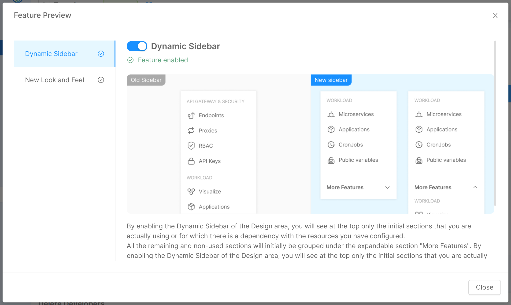
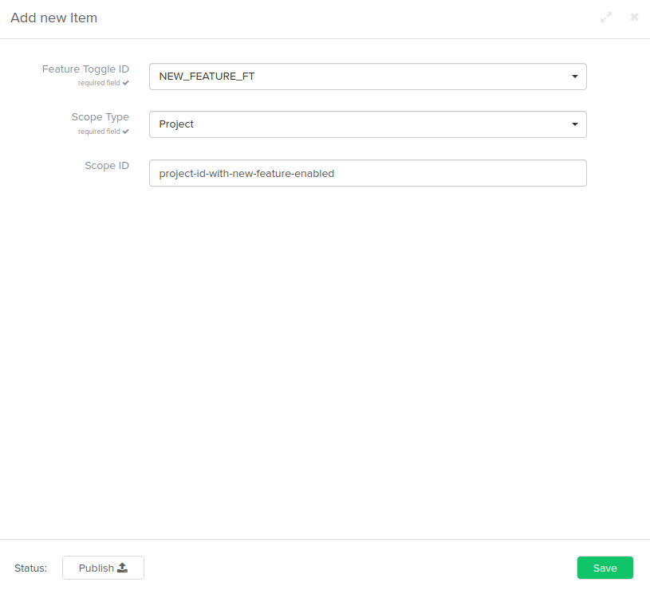

The console offers a section called [Feature Preview](/development_suite/user-settings/feature-preview.md) in the Project Settings and User section. These sections allow to activate features that are still in preview by enabling a toggle.

## List of features preview
In the CMS, inside the Feature table under the Configuration group, are listed all the available features that can be bound to a scope.
Each element has:
- a description,
- a field `Release Stage` that if evaluated to `preview`, the feature will be available in the user [Feature Preview](/development_suite/user-settings/feature-preview.md) section.
- a list of scopes which the feature could be bound with.

In the Scope field it is possible to choose between these values:
- `User` the feature will be activated for the user
- `Company` the feature will be activated for the company
- `Project` the feature will be activated only for the project
- `Console` the feature will be activated for the console

## Activate new feature
:::info
Feature toggle bindings can only be created and managed by people with access to the Mia-Platform Console CMS.
:::

Inside the Feature Activation section under the Configuration group, it is possible to bind a feature preview with a scope.

Press on "Add new" to insert a new activation rule by filling in the following fields:
- `Feature Toggle ID` (required) indicates the feature toggle to activate and therefore must coincide with the same value defined in the Toggle ID item found in the `Feature` table.
- `Scope Type` (required) which indicates the scope on which we want to activate the toggle. At the moment the toggle can be activated for anyone on the entire console by selecting the Console scope (Instance activation) or on specific scopes which are Company, Project and User and in this case it is also required to define the ID (in the field Scope ID).
- `Scope ID` required for all scope types (except for Console); it must contain the id used to identify the scope (e.g. the `_id` of a user or a project; the `tenantId` of a Company)

