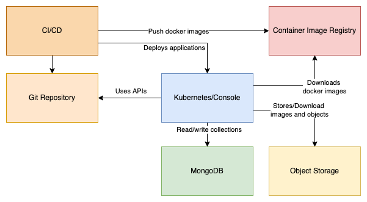

Mia-Platform Console Self Hosted installation implies that the customer has already installed in its systems all the required software and tools.

### Self-Hosted installation architecture

The following picture shows the high-level architecture for a Self-Hosted Mia-Platform Console installation. The communication between the components must be allowed as shown in the architecture.

The following software and hardware recommendations are for installing Mia-Platform Console On-Premises.

### Software and Hardware prerequisites  

<table>
   <thead>
      <tr>
         <th></th>
         <th><strong>Tool</strong></th>
         <th><strong>Version</strong></th>
         <th><strong>Minimum CPU</strong></th>
         <th><strong>Minimum RAM</strong></th>
      </tr>
   </thead>
   <tbody>
      <tr>
         <td rowspan="3"><strong>Auth Provider</strong></td>
         <td>Okta</td>
         <td>N/A</td>
         <td>N/A</td>
         <td>N/A</td>
      </tr>
      <tr>
         <td>GitLab</td>
         <td>> 14.x</td>
         <td>N/A</td>
         <td>N/A</td>
      </tr>
      <tr>
         <td>GitHub</td>
         <td>> 3.x</td>
         <td>N/A</td>
         <td>N/A</td>
      </tr>
      <tr>
         <td rowspan="2"><strong>Git provider</strong></td>
         <td>GitLab</td>
         <td>&gt; 14.x</td>
         <td>4 core</td>
         <td>4 GB</td>
      </tr>
      <tr>
         <td>GitHub</td>
         <td>&gt; 3.x</td>
         <td>4 core</td>
         <td>32 GB</td>
      </tr>
      <tr>
         <td><strong>CI/CD</strong></td>
         <td>GitLab CI Runners</td>
         <td>&gt; 14.x</td>
         <td>1 core</td>
         <td>2 GB</td>
      </tr>
      <tr>
         <td><strong>NoSQL database</strong></td>
         <td>MongoDB</td>
         <td>&gt; 4.2</td>
         <td>2 core</td>
         <td>2 GB</td>
      </tr>
      <tr>
         <td><strong>Runtime</strong></td>
         <td>Kubernetes</td>
         <td>&gt; 1.19 &lt;= 1.21</td>
         <td>2 CPU requests</td>
         <td>4 GiB Memory requests</td>
      </tr>
      <tr>
         <td><strong>Container image registry</strong></td>
         <td>Any container image registry</td>
         <td>N/A</td>
         <td>N/A</td>
         <td>N/A</td>
      </tr>
      <tr>
         <td rowspan="3"><strong>Object Storage</strong></td>
         <td>Google Cloud Storage</td>
         <td>N/A</td>
         <td>N/A</td>
         <td>N/A</td>
      </tr>
      <tr>
        <td>S3-Compatible Object Storages</td>
        <td>N/A</td>
        <td>N/A</td>
        <td>N/A</td>
      </tr>
      <tr>
        <td>MongoDB</td>
        <td>N/A</td>
        <td>N/A</td>
        <td>N/A</td>
      </tr>
      <tr>
         <td rowspan="2"><strong>Key Management Service</strong></td>
         <td>Google Cloud Platform</td>
         <td>N/A</td>
         <td>N/A</td>
         <td>N/A</td>
      </tr>
      <tr>
         <td>Local Key</td>
         <td>N/A</td>
         <td>N/A</td>
         <td>N/A</td>
      </tr>
   </tbody>
</table>

### Reference Architecture

The following is an example architecture for the installation of the Mia-Platform Console supporting ~500 users and ~200 projects:

| **Tool**                  | **Version** | **Nodes**      | **CPU** | **RAM** | **Storage** |
|---------------------------|-------------|----------------|---------|---------|-------------|
| Okta                      | N/A         | N/A            | N/A     | N/A     | N/A         |
| GitLab                    | 14          | 1              | 8 core  | 32 GB   | 200 GB      |
| GitLab CI Runners         | 14          | 2              | 1 core  | 2 GB    | 25 GB       |
| MongoDB                   | 5           | 3              | 2 core  | 8 GB    | 20 GB       |
| Google Kubernetes Engine  | 1.21        | 2 worker nodes | 4 core  | 8 GB    | N/A         |
| Google Container Registry | N/A         | N/A            | N/A     | N/A     | N/A         |
| Google Cloud Storage      | N/A         | N/A            | N/A     | N/A     | N/A         |
| Google Cloud Platform KMS | N/A         | N/A            | N/A     | N/A     | N/A         |
