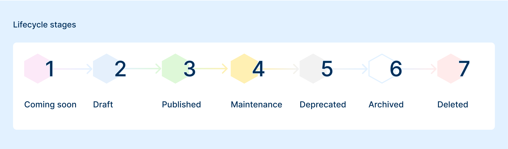

Each item has a predetermined **lifecycle status**:

The following are the various **lifecycle status** an item can go through.

* **Coming Soon**: this state indicates that the item is in its early stages of development. Implementation has just begun, and the component is not yet ready for use by the public. However, users can be informed about its upcoming availability. It serves as a teaser or preview, giving users an idea of new features that are being worked on, but without offering any functionality yet.

* **Draft**: in the "Draft" state, the item is available for internal use or testing but is not yet finalized. This release is still subject to change, and both its metadata and assets are open to modification. The item can be instantiated from the marketplace, allowing it to be tested in real-world scenarios. However, it is not considered a stable release and should not be used in production environments.

* **Published**: this release of an item is immutable. If changes are needed, a new version must be created. It can be instantiated from the marketplace and is considered stable, suitable for production environments. This phase includes regular updates and the development of new features.

* **Maintenance**: in Maintenance, the item is still available, but will not receive any new features or major improvements. It is only supported by bug fixes and critical security patches. This phase has a defined duration, typically 1 year. At the end of the maintenance period, the item may be deprecated or removed from the marketplace.

* **Deprecated**: an item in the "Deprecated" state is no longer supported with bug fixes, new features, or updates. It is a signal that the item is being phased out, and a plan for its removal from the marketplace is in place. The deprecation phase typically precedes an item's removal, which occurs during a future major release of the console or platform. Users are encouraged to migrate to a newer version or alternative.

* **Archived**: when an item enters the archived phase, it is no longer available for use and has been completely removed from the marketplace. The item is retained for historical or record-keeping purposes, but is no longer accessible to users for instantiation or use. 

* **Deleted**: the Deleted state represents the permanent removal of the item from the system. It is completely deleted, including any associated data, and is no longer available in any form. This action is typically taken by a curator and is irreversible.

### Deprecated Items

Sometimes, a Marketplace item may become deprecated. This typically occurs when a newer item replaces it with enhanced features, or when a better solution is provided by a new application. 

<!--  -->

In such cases, the maintainer may decide not to longer support the older item, meaning it will not receive any future updates.

The item will be marked as **Deprecated**. While you can still use it if necessary, its functionality may be limited or outdated compared to current standards. The suggested alternative will be published in the deprecated item documentation.

:::caution
It's important to consider the alternatives to a deprecated item. Using updated and supported items ensures better performance, security, and compatibility.
:::

