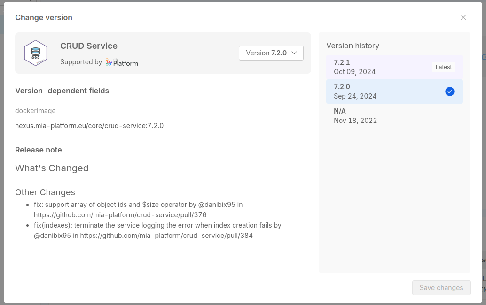

To create a versioned resource, you need to set a specific value for the `name` property of the `version` object to the resource definition, as explained in the ["How to configure a new item" section](#how-to-configure-a-new-item).

Also, to provide continuity to the definition of the other versions of the same resource, the `tenantId` and the `itemId` properties must be the same for all the versions of the same resource.

You can create a new version of an item even if that resource already exists without a version. In that case the non-versioned item will still be available in the Console, where it will be shown with a *N/A* value for version.

If there are multiple version of the same item, one of these versions will be used as *latest version*.
This is the version that will be used as a reference when you will create a new microservice or a new resource choosing the item from the Marketplace.

The latest version is going to be the one with the highest version, according to the [Semantic Versioning rules](https://semver.org/).
We suggest to follow these guidelines when assigning a version to your item, in order to easily determine which one is the latest.

 

:::info
Also you will be informed if one or more of your resources attached to an item have updates.

You can find a list of all the updates at the bottom of the sidebar menu with the list of all your services, as well as inside the detail page of the service that can be updated.

 
:::

#### Editing a versioned resource

Versioned resources are defined to be immutable, to avoid that updates might overwrite previous configurations. However, they can still be edited if there is a need to update their metadata (e.g. the release note or the description of the  item due to typos or other reasons).

The following fields, however, cannot be edited:

- `itemId`
- `tenantId`
- the `name` property inside `version` object
- the `resources` property, that includes the specific resource definition

Since items are defined by the `itemId`, the `tenantId` and the `version` name, attempting to modify one of these three properties will cause the creation of a new item, completely separated from the previous one.

Attemping to modify the `resources` property will cause an error, and the item will not be updated. In this case, you need to create a new version of the item.

Additionally, the following fields can only be edited if the `marketplace.root.manage` permission has been granted to the user:

- `supportedBy`
- `supportedByImage`
- `publishOnMiaDocumentation`
- `visibility`

More information about these permissions are available in the [permissions documentation](/development_suite/identity-and-access-management/console-levels-and-permission-management.md#console-root-level-permissions).

#### Version dependent properties

Versioning of resources means that resources under version control consist of specific *dependent fields* that define the version. These fields cannot be modified directly by the user, they can only be updated by creating a new version of the resource.

For instance:

- a version of a Microservice Plugin is defined by its `dockerImage`. By following the resource versioning management, a change in this field will require the creation of a new version for such Plugin
- for Infrastructure Resources of type K8s the governance is quite similar: since Infrastructure Resources of type K8s are defined by their `apiVersion` and `kind`, in this scenario, the only way to be able to change them will be through the creation of a new version.

By defining these fields as *version dependent*, we ensure that they cannot be modified by the user when adding a marketplace item to their project. Whenever a new Microservice is created from a Marketplace plugin with a specific version, the `dockerImage` field will automatically be shown as read-only, and the user will only be able to modify it by actually checking for other versions of the plugin.