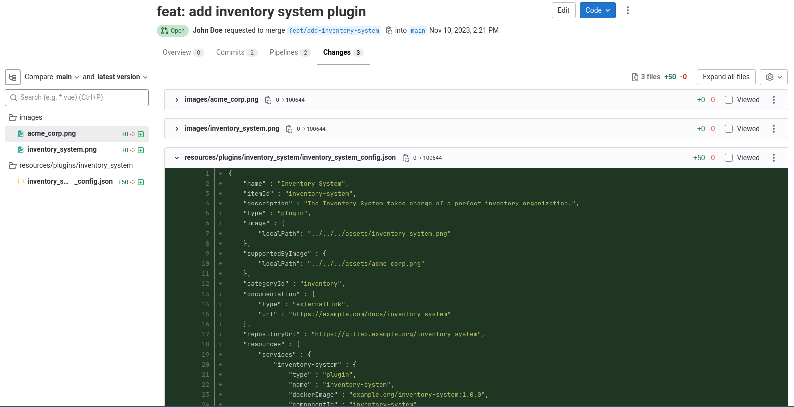
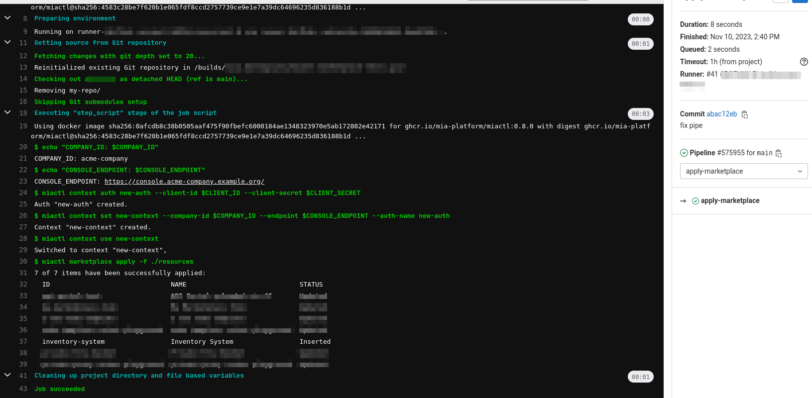
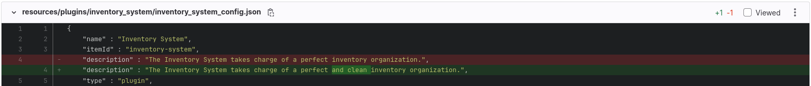
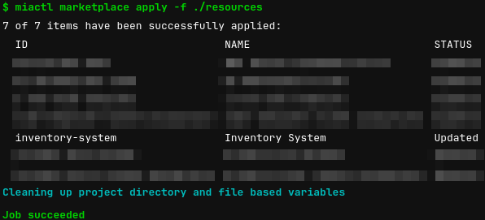
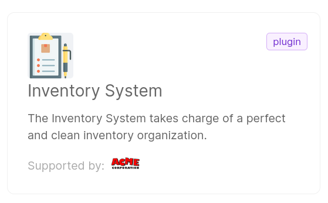
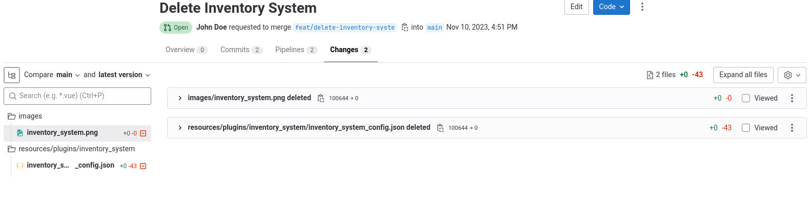

:::info
You need to have *Company Owner* or *Project Administrator* role at Company level to perform the following actions
:::

## List item

...

## Create item

Imagine you are a software developer, working for the Company "Acme Corporation".

You have developed a new service (for example a NodeJS service) called "My Awesome Service". The service is a plugin, i.e. users are only required to configure it and deploy it in their project.
You now want it to be available in the Marketplace of your Company.

First, create a JSON file that defines your service. The structure of this file depends on the type of item you're adding. For guidance, refer to [this guide](/old_software-catalog/manage-items/overview.md#how-to-configure-a-new-item).
Save the file, for example, as: `myAwesomeService.json` file.

To create the item on the Marketplace, open a terminal in the directory where the JSON file is saved, and run the following command:

```sh
miactl marketplace apply -f myAwesomeService.json
```
:::tip

Further information about the `apply` command can be found in the [dedicated doc](/cli/miactl/30_commands.md#apply).

:::

:::caution
Ensure that the `image` and `supportedByImage` objects are populated with local paths to images: make sure the images exist and that their path is correct.
:::

Running this command will create the Marketplace item and upload the associated images.

Upon success, you'll receive a confirmation message similar to the one below:

```sh
1 of 1 items have been successfully applied:

  ID                        ITEM ID             NAME                 STATUS   

  65368hf0c91d871a87afbcbf  my-awesome-service   My Awesome Service   Inserted  
```

After the upload, image references in the JSON will be replaced by hosted URLs (`imageUrl` and `supportedByImageUrl`). To fetch the updated version of your item, use the `get` command:

```sh
miactl marketplace get 65368hf0c91d871a87afbcbf > myAwesomeService.json
```

:::tip
Local file paths will not be updated automatically after item creation.
To keep your local configuration in sync, we recommend downloading a fresh copy of the JSON file after every update.
:::

What’s Next? Once published, your service will appear as a clickable card in the Internal Company Marketplace section of the Console, making it easy for others in your organization to discover and use it.

## Edit item

Imagine now that you noticed that the description of "My Awesome Service" is not correct and you want to change it.

Start by downloading the most recent version of the item's configuration file:

```sh
miactl marketplace get ITEM_ID > myAwesomeService.json
```
Replace `ITEM_ID` with the alphanumeric ID of your Marketplace item.
If you're unsure of the item ID, you can list all Marketplace items using `miactl marketplace list` command.

:::tip

It is suggested to always download the Marketplace item just before updating it to make sure it works on the latest version.

:::

Edit your file following the steps described in the [Modifying the Marketplace Item](??).
Once you're satisfied with your changes, save the file and apply it to the Marketplace:

```sh
miactl marketplace apply -f myAwesomeService.json
```

You should see a success message confirming the update:

```sh
1 of 1 items have been successfully applied:

  ID                        ITEM ID             NAME                 STATUS   

  65368hf0c91d871a87afbcbf  my-awesome-service  My Awesome Service   Updated
```

The changes will now be visible in the Console Marketplace.

### Update of versioned items

If the Marketplace item is versioned, updates can only be made under certain conditions.

- You may directly update base fields (e.g., metadata like the description or tags) using the same [`apply`](/cli/miactl/30_commands.md#apply) command.
- For other updates, such as changes to the resource configuration or behavior, you’ll need to create a new version of the item.

To create a new version:

1. Ensure the `itemId` and `tenantId` remain the same.
2. Update the version field following [Semantic Versioning](https://semver.org/).
3. Modify the `resource` object with your changes.
4. Apply the new version using the same command:

```sh
miactl marketplace apply -f myAwesomeService.json
```
For more guidance, refer to the [Create your Company Marketplace](/old_software-catalog/manage-items/overview.md).

Following [Semantic Versioning](https://semver.org/) helps track changes over time and ensures your users can select the appropriate version for their needs.

## Delete item

Let’s say you’ve determined that My Awesome Service is no longer needed within your company. You can remove it from the Marketplace using the `delete` command.

Use the following command in your terminal:

```sh
miactl marketplace delete --object-id=<objectId>
```

> The `object-id` refers to the `ID` returned when you originally applied the item to the Marketplace. It is not the same as the `itemId`.

Once executed, the item will be permanently removed from the Marketplace. 
However, this action does not delete the local JSON file on your machine. If needed, you can easily recreate the Marketplace item by simply reapplying the original JSON file:

```sh
miactl marketplace apply -f myAwesomeService.json
```

## Declarative approach

In addition to the basic use of the tool through individual application commands, such as list, get, and resource deletion, a *declarative* approach is recommended. This approach is based on the use of [miactl](/cli/miactl/10_overview.md) in combination with a [Git Provider and a CI/CD system](/console/company-configuration/providers/overview.md).

This usage allows for centralized management of your Marketplace, enabling supervised control of the state of your resources. It also extends the possibility of contribution to users without the necessary permissions (e.g., the use of Pull Requests/Merge Requests supervised by a maintainer).

### Setup a Custom Declarative Journey

Here we explain how you can implement a Custom Declarative Journey.

#### Requirements

1. Git Provider
2. CI/CD Tool
3. a [Service Account](/development_suite/identity-and-access-management/manage-service-accounts.md)

:::info

For a thorough explanation on supported Providers and how to configure them in the Console, [consult this guide](/console/company-configuration/providers/configure-provider.mdx)

:::

#### Creation of the repository

Imagine you already have some Marketplace items and their related file manifests, ready to be deployed to the Console.

Create a repository on your Git Provider, and add the item files following this structure:

```
Root
│
├── 📁 images
│   ├── 🖼️ product_service.png
│   ├── 🖼️ user_management.png
│   ├── 🖼️ payment_gateway.png
│   ├── 🖼️ recommendation_engine.png
│   ├── 🖼️ analytics_service.png
│   ├── 🖼️ nodejs_template.png
│   ├── 🖼️ python_flask_template.png
│   ├── 🖼️ java_springboot_template.png
│   ├── 🖼️ user_management_example.png
│   ├── 🖼️ ecommerce_application.png
│   ├── 🖼️ inventory_system.png
│   ├── 🖼️ user_authentication.png
│   ├── 🖼️ order_processing.png
│   ├── 🖼️ notification_service.png
│   ├── 🖼️ logging_system.png
|   ├── 🖼️ user_management_example.png
│   ├── 🖼️ ecommerce_application.png
│   ├── 🖼️ acme_company.png
│
├── 📁 resources
│   ├── 📁 plugins
│   │   ├── 📁 inventory_system
│   │   │   ├── 📄 inventory_system_config.json
│   │   ├── 📁 user_authentication
│   │   │   ├── 📄 user_authentication_config.json
│   │   ├── 📁 order_processing
│   │   │   ├── 📄 order_processing_config.yml
│   │   ├── 📁 notification_service
│   │   │   ├── 📄 notification_service_config.yml
│   │   ├── 📁 logging_system
│   │   │   ├── 📄 logging_system_config.json
├── 📁 templates
│   ├── 📁 nodejs_template
│   │   ├── 📄 nodejs_template_config.json
│   ├── 📁 python_flask_template
│   │   ├── 📄 python_flask_template_config.json
│   ├── 📁 java_springboot_template
│   │   ├── 📄 java_springboot_template_config.json
├── 📁 examples
│   ├── 📁 user_management_example
│   │   ├── 📄 user_management_example_config.yml
├── 📁 applications
│   ├── 📁 ecommerce_application
│   │   ├── 📄 ecommerce_application_config.yml
```

The item names are purely indicative, this example is only to explain a potential use-case.

The JSON and YAML files above follow the structure explained [in the related documentation](/old_software-catalog/manage-items/overview.md#how-to-configure-a-new-item).

Here is an example of the Inventory System plugin config file:

```json
{
    "name" : "Inventory System",
    "itemId" : "inventory-system",
    "description" : "The Inventory System takes charge of a perfect inventory organization.",
    "type" : "plugin",
    "categoryId": "extracategory",
    "image" : {
        "localPath": "../../../images/inventory_system.png"
    },
    "supportedByImage" : {
        "localPath": "../../../images/acme_company.png"
    },
    "categoryId" : "inventory",
    "documentation" : {
        "type" : "externalLink",
        "url" : "https://example.com/docs/inventory-system"
    },
    "repositoryUrl" : "https://gitlab.example.org/inventory-system",
    "resources" : {
        "services" : {
            "inventory-system" : {
                "type" : "plugin",
                "name" : "inventory-system",
                "dockerImage" : "example.org/inventory-system:1.0.0",
                "componentId" : "inventory-system",
                "defaultDocumentationPath" : "/documentation/json",
                "containerPorts" : [
                    {
                        "name" : "http",
                        "from" : 80,
                        "to" : 3000,
                        "protocol" : "TCP"
                    }
                ],
                "defaultLogParser": "mia-json"
            }
        }
    },
    "tenantId" : "acme-company"
}
```

You can similarly configure all the items you need.

#### CI/CD Pipeline - An example with Gitlab

You can use any CI/CD Tool; in this example, we provide you an example of Gitlab pipeline.

##### Setup the environment

First of all, you need to create a Service Account on the Console. In this example, we use a [Client Secret Basic authentication](/development_suite/identity-and-access-management/manage-service-accounts.md#adding-a-service-account). 

Create a `CLIENT_ID` and a `CLIENT_SECRET` [Gitlab CI/CD Variable](https://docs.gitlab.com/ee/ci/variables/) in your project and set the respective `client-id` and `client-secret` values you obtained during the setup of the service account.

:::tip

We suggest to mask the variable and to protect it, as suggested in [Gitlab documentation](https://docs.gitlab.com/ee/ci/variables/#cicd-variable-security).

:::

##### Setup the pipeline file

Create a `.gitlab-ci.yml` file with the following contents:

```yaml
stages:
  - preparation
  - apply-marketplace

variables:
  # make sure to use the latest miactl version available https://github.com/mia-platform/miactl/releases
  MIACTL_VERSION: "0.8.0"  

preparation:
  stage: preparation
  image: alpine:latest
  script:
    - apk add --no-cache git
    - git clone $CI_REPOSITORY_URL ./my-repo
    - cd ./my-repo

apply-marketplace:
  stage: apply-marketplace
  image: ghcr.io/mia-platform/miactl:$MIACTL_VERSION
  script:
    - 'echo "COMPANY_ID: $COMPANY_ID"'
    - 'echo "CONSOLE_ENDPOINT: $CONSOLE_ENDPOINT"'
    - miactl context auth new-auth --client-id $CLIENT_ID --client-secret $CLIENT_SECRET
    - miactl context set new-context --company-id $COMPANY_ID --endpoint $CONSOLE_ENDPOINT --auth-name new-auth
    - miactl context use new-context
    - miactl marketplace apply -f ./resources

  rules:
    - if: $CI_COMMIT_BRANCH == $CI_DEFAULT_BRANCH
```

:::caution

This pipeline is just an example. You may need to implement additional checks and use different images.

:::

Here is an explanation of the environment variables needed in the pipeline:

- `MIACTL_VERSION`: the version of miactl, make sure to always use the latest version in order to benefit the latest features and bug fixes.
- `CLIENT_ID`: a secret env containing the Service Account Client ID.
- `CLIENT_SECRET`: a secret env containing the Service Account Client Secret.
- `CONSOLE_ENDPOINT`: the base url of your Console installation.
- `COMPANY_ID`: the Company ID where you want the Marketplace Items to be created in.

### An example of interaction with the repository

Acme Corporation uses the Console as its Internal Development Platform.

Developers of the Company can open Merge Requests to the Marketplace Git repository created above, and Maintainers can approve and merge the MRs.

Imagine that a developer of Acme Corporation creates the Inventory System plugin, as in the example above.
They now want to add this plugin to their company. 

#### The Merge Request process

In order to do so, they can open a Merge Request to the Gitlab Repository created above: 



Once the MR is merged, the pipeline start applying the items in the repository; among them we can see that the Inventory System has been inserted successfully:




Let's now assume that a developer spots a mistake in the plugin description. Similarly, they can open a Merge Request that addresses the error:



After a maintainer merges the changes, a new pipeline is triggered, leading to an update of the item.



#### Verify the item on the Marketplace

From now on, the Marketplace item will be available in the Console:



Console users can create and add this plugin to their Console projects.

#### Item Deletion

Imagine now that for some reason you want to delete the item.

First of all, the item needs to be deleted from the repository.
A developer can open an MR to do so.



After merging this Merge Request, the pipeline won't delete the item from the Marketplace: a user with the needed permission needs to do so by using `miactl`.

First of all, list the marketplace items:

```bash
miactl markteplace list
```

A list of items is returned:
```
  ID                        ITEM ID                          NAME                            TYPE         
  ...
  654e32c6f6c6406e4f470b1e  inventory-system                 Inventory System                plugin       
  ...
```
Copy the ID of the Inventory System, and run the following command:

```bash
miactl marketplace delete 654e32c6f6c6406e4f470b1e
```

This will delete the item from the Marketplace, and the associated images.
