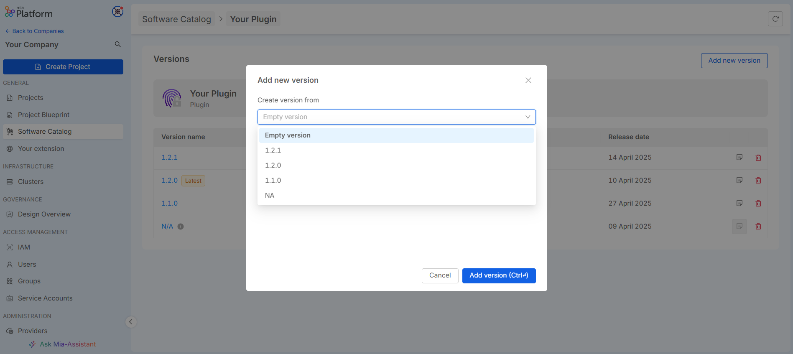

There are three main methods to create, edit and delete items:

- Software Catalog UI
- [`miactl`](/cli/miactl/10_overview.md), the Mia-Platform command line interface tool.
- Open an issue on Mia-Platform [Github community page](https://github.com/mia-platform/community). (?)

- (API?)

## Create item

:::info

You need to have *Company Owner* or *Project Administrator* role at Company level to perform this action

:::

### UI

To create a new item in the catalog, click on the "Add Item" button. This will open a user interface (UI) that guides you through the item creation process. The process is divided into the following steps:

1. **Select the Item Type**: choose the type of item you want to create from the available options. This will determine the set of fields and attributes you need to provide during the creation process.

2. **Enter Metadata**: fill in the necessary metadata for the item. This typically includes basic information such as the name, description, category, and any other required attributes. 

3. **Enter Assets**: after entering the metadata, you will need to specify additional details for the item. A default schema of resources will be provided to assist you in adding the relevant specifics. This schema serves as a template to help ensure all necessary information is included and formatted correctly.

Follow the on-screen instructions to complete the item creation process. Once all steps are completed, you can save and submit the item to be added to the catalog.


#### Create a New Version

Create a new version is available only for items that support versioning. You can start the creation of a new version from either of the following options:

##### From the Version Overview Page
On the item’s overview page, you can create a new version by selecting the "Add new version" option. Here, you can choose whether to start from an existing version or create the new version from scratch.



##### From the Version Detail Page
You can also create a new version directly from the version detail page. Click on the button with the three dots to open the option to create a new version based on the version you are currently viewing.


### miactl

Imagine you are a software developer, working for the Company "Acme Corporation".

You have developed a new service (for example a NodeJS service) 
called "My Awesome Service". The service is a plugin, i.e. users are only required to configure it and deploy it in their project.
You now want it to be available in the Marketplace of your Company.

First of all, you need to create a JSON file as explained in [this guide](/old_software-catalog/manage-items/overview.md#how-to-configure-a-new-item).
Save the file, for example as `myAwesomeService.json` file.

The file contents will look like this:
<details>
<summary>Click to expand <code>myAwesomeService.json</code></summary>

```json
{
  "description": "My Awesome Service allows your project to do amazing stuff!",
  "documentation": {
    "type": "externalLink",
    "url": "https://docs.example.org/AwesomeService"
  },
  "image": {
    "localPath": "./awesomeService.png"
  },
  "name": "My Awesome Service",
  "itemId": "my-awesome-service",
  "repositoryUrl": "https://git.example.org/awesome-service",
  "resources": {
    "services": {
      "api-portal": {
        "componentId": "my-awesome-service",
        "containerPorts": [
          {
            "from": 80,
            "name": "http",
            "protocol": "TCP",
            "to": 8080
          }
        ],
        "defaultEnvironmentVariables": [
          {
            "name": "HTTP_PORT",
            "value": "8080",
            "valueType": "plain"
          }
        ],
        "defaultLogParser": "mia-nginx",
        "defaultProbes": {
          "liveness": {
            "path": "/index.html"
          },
          "readiness": {
            "path": "/index.html"
          }
        },
        "defaultResources": {
          "memoryLimits": {
            "max": "25Mi",
            "min": "5Mi"
          }
        },
        "description": "My Awesome Service allows your project to do amazing stuff!",
        "dockerImage": "docker.example.org/awesome-service:1.0",
        "name": "awesome-service",
        "repositoryUrl": "https://git.example.org/awesome-service",
        "type": "plugin"
      }
    }
  },
  "supportedBy": "Acme Corporation Inc.",
  "supportedByImage": {
    "localPath": "./acmeCorporation.png"
  },
  "tenantId": "acme-corporation",
  "type": "plugin"
}
```

</details>

You also want users to write services in your brand new programming language, `Acme.Js`.

To do this, you need to create a [Template](/marketplace/templates/mia_templates.md), which is a skeleton with a minimal setup: your users are required to write business code from scratch.

<details>
<summary>Click to expand <code>myAcmeJsTemplate.json</code></summary>

```json
{
  "categoryId": "acmejs",
  "description": "This template allows you to start setting up a service written in Acme.Js",
  "documentation": {
    "type": "markdown",
    "url": "https://raw.githubusercontent.com/acme-corporation/Acme-Js-template/master/README.md"
  },
  "image": {
    "localPath": "./acmeJsTemplate.png"
  },  
  "itemId": "acmejs-template",
  "name": "Acme.Js Template",
  "releaseStage": "",
  "resources": {
    "services": {
      "acmejs-template": {
        "archiveUrl": "https://github.com/acme-corporation/Acme-Js-template/archive/master.tar.gz",
        "containerPorts": [
          {
            "from": 80,
            "name": "http",
            "protocol": "TCP",
            "to": 8080
          }
        ],
        "defaultEnvironmentVariables": [
          {
            "name": "HTTP_PORT",
            "value": "8080",
            "valueType": "plain"
          }
        ],
        "defaultLogParser": "mia-nginx",
        "description": "This template allows you to start setting up a service written in Acme.Js",
        "name": "acmejs-template",
        "type": "template"
      }
    }
  },
  "supportedBy": "Acme Corporation Inc.",
  "supportedByImage": {
    "localPath": "./acmeCorporation.png"
  },
  "tenantId": "acme-corporation",
  "type": "example",
  "visibility": {
    "allTenants": false,
    "public": true
  }
}
```

</details>

To highlight the potentialities of `Acme.Js` and introduce your users to the new programming language, you also decide to provide a working [Example](/marketplace/examples/mia_examples.md) with minimal business code.

<details>
<summary>Click to expand <code>myAcmeJsExample.json</code></summary>

```json
{
  "categoryId": "acmejs",
  "description": "A simple Hello World example based on Acme Corporation Acme.Js Template.",
  "documentation": {
    "type": "markdown",
    "url": "https://raw.githubusercontent.com/acme-corporation/Acme-Js-example/master/README.md"
  },
  "image": {
    "localPath": "./acmeJsExample.png"
  },
  "itemId": "acme-js-example",
  "name": "TypeScript Hello World Example",
  "resources": {
    "services": {
      "acme-js-example": {
        "archiveUrl": "https://github.com/acme-corporation/Acme-Js-example/archive/master.tar.gz",
        "containerPorts": [
          {
            "from": 80,
            "name": "http",
            "protocol": "TCP",
            "to": 3000
          }
        ],
        "name": "acme-js-example",
        "type": "example"
      }
    }
  },
  "supportedBy": "Acme Corporation Inc.",
  "supportedByImage": {
    "localPath": "./acmeCorporation.png"
  },
  "tenantId": "mia-platform",
  "type": "example",
  "visibility": {
    "allTenants": false,
    "public": true
  }
}
```

</details>

Notice that the `image` and `supportedByImage` objects are populated with local paths to images: make sure the images exist and that their path is correct.

To create the items on the Marketplace, open up a terminal in directory where the files are placed and run this command:

```sh
miactl marketplace apply -f myAwesomeService.json -f myAcmeJsTemplate.json -f myAcmeJsExample.json
```

This command will create the Marketplace items and upload the images along with them.

A message will confirm the operation, returning some information as shown here below:

```sh
3 of 3 items have been successfully applied:

  ID                        ITEM ID             NAME                 STATUS   

  65368hf0c91d871a87afbcbf  my-awesome-service   My Awesome Service   Inserted  
  65368hf0c91d871a87afvedc  acme-js-template     Acme.Js Template     Inserted  
  65368hf0c91d871a87afdase  acme-js-example      Acme.Js Example      Inserted  
```

After the upload, the image keys will be replaced with the `imageUrl` and the `supportedByImageUrl`; to obtain the updated version of an item, use the `get` command:

```sh
miactl marketplace get 65368hf0c91d871a87afbcbf > myAwesomeService.json

miactl marketplace get 65368hf0c91d871a87afvedc > myAcmeJsTemplate.json

miactl marketplace get 65368hf0c91d871a87afdase > myAcmeJsExample.json
```

:::tip
The local file fields won't be updated after the item creation.
We recommend to always download a new copy afterwards to keep your local copy up to date.
:::

From now on, the items you created will be visible as a clickable card inside the Internal Company Marketplace section of the Console.

For example, here is "My Awesome Service"'s card:


:::tip

Further information about the `apply` command can be found in the [dedicated doc](/cli/miactl/30_commands.md#apply).

:::

## Edit item

:::info
You need to have *Company Owner* or *Project Administrator* role at Company level to perform this action
:::

### UI

The ability to edit items in the Software Catalog depends on whether the item supports versioning:

- **Item without versioning support**: If an item does not support versioning, you can edit all fields, including the technical details (assets), without any restrictions.

- **Item with versioning support**: If an item supports versioning, editing capabilities are more restricted. Specifically, only the `metadata` of the item can be edited. `Assets` cannot be edited in these versions.
In the case of the N/A version, it is treated like any other version. Therefore, only the metadata can be edited, and assets cannot be modified.
If you need to modify the `assets` of an item that supports versioning, you must create a **new version** of the item. This allows you to update the assets and keep track of changes in the version history.

To edit an item, an `Edit` button is available in the relevant tab (e.g., metadata or resources). The availability of this button depends on whether the item is versionable and the specific section you are attempting to edit.


### miactl

Imagine now that you noticed that the description of "My Awesome Service" is not correct and you want to change it.

First of all, download and save the latest version of the item configuration:

```sh
miactl marketplace get ITEM_ID > myAwesomeService.json
```

where `ITEM_ID` is an alphanumerical id of the Marketplace item.  
If you don't know the item id, use the `miactl marketplace list` command to list all the Marketplace Items. You can easily locate the one of interest by looking for its name.

:::tip

It is suggested to always download the Marketplace item just before updating it to make sure it works on the latest version.

:::

Edit your file following the steps described in the [Modifying the Marketplace Item](#enabling-the-visibility-to-all-companies);
once you are happy with the changes, save the file and apply it to the Marketplace:

```sh
miactl marketplace apply -f myAwesomeService.json
```

You will see the outcome of the operation in the command output:

```sh
1 of 1 items have been successfully applied:

  ID                        ITEM ID             NAME                 STATUS   

  65368hf0c91d871a87afbcbf  my-awesome-service  My Awesome Service   Updated
```

The changes are now reflected to the Console.

#### Update of versioned items

You can update a versioned item only if you need to change some base fields (more details on the [Create your Company Marketplace](/old_software-catalog/manage-items/overview.md) page), otherwise you can do so by creating a new version.

You can create a new version of the plugin via [miactl](/cli/miactl/10_overview.md) by simply executing the [`apply`](/cli/miactl/30_commands.md#apply) command, in the same way as explained above, ensuring that the `itemId` and `tenantId` are the same but with a new version, and of course the `resource` object updated.

As explained in the [Create your Company Marketplace](/old_software-catalog/manage-items/overview.md) page, you must follow the [Semantic Versioning](https://semver.org/) convention when defining the version of your item.
This will help you to keep track of the changes you made to the item over time, and help you understand the best version to use when configuring your project.

## Delete item

:::info
You need either the *Company Owner* or *Project Administrator* role at Company level to perform this action
:::

### UI

If an item is versionable, you can delete any specific version of the item by using the dedicated `Delete` button available for each version. This allows you to remove individual versions without affecting the entire item or other versions.


For items that are not versionable, you can delete the entire item by using the `Delete Item` button. This will permanently remove the item from the catalog.

Both actions are irreversible, so be sure to confirm your decision before proceeding with deletion.

### miactl

Imagine you notice that the service "My Awesome Service" is no longer useful for your Company and so you want to delete it.

You can delete an item from the Marketplace by means of the `delete` command:

```sh
miactl marketplace delete --object-id=<objectId>
```

> The `object-id` is the `ID` you get when you apply the template, it is not the `itemId`

The item is then deleted from the Marketplace.

The deletion is permanent, but the file on your machine will not be deleted.
If you want, you can recreate the item on the Marketplace again by applying the file.
