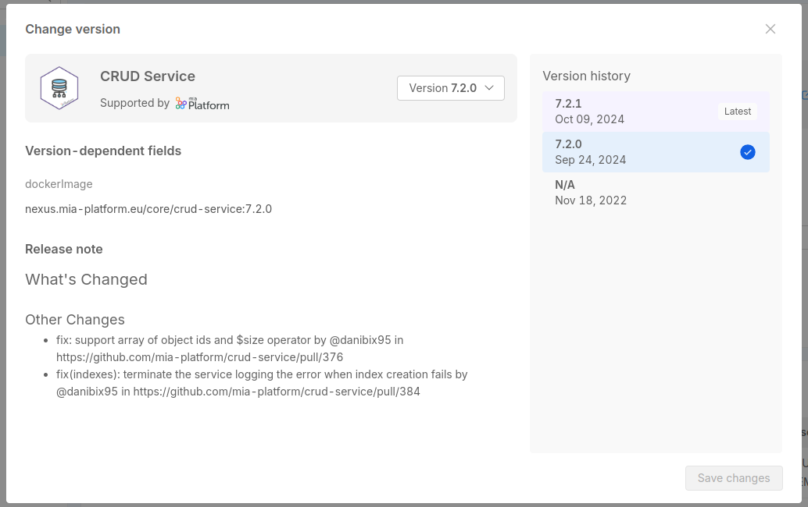

There are three main methods to create, edit and delete items:

- (recommended) Directly from the Software Catalog, following the 
- Use [`miactl`](/cli/miactl/10_overview.md), the Mia-Platform command line interface tool.
- Open an issue on Mia-Platform [Github community page](https://github.com/mia-platform/community).

## Open an issue on Mia-Platform Github community page

To contribute to the Mia-Platform Marketplace using this method, start by opening an issue [here](https://github.com/mia-platform/community/issues/new?assignees=%40mia-platform%2Fsig-marketplace&labels=marketplace&projects=&template=marketplace-contribution.yaml&title=%5BNew+marketplace+item%5D%3A+). This issue will outline the necessary information for your request.
Subsequently, a Mia-Platform representative will take over the issue and contact you to collaboratively plan the addition of the component to the Mia-Platform Marketplace, following the guidelines described on [this documentation page](/software-catalog/manage-items/overview.md).

### Item visibility and the `tenantId` field

When creating a new item, you always need to set the `tenantId` related to the Company you are creating the item in.

You can also contribute to the **Mia-Platform Marketplace** by making your item accessible to other Companies: visit [this page](/software-catalog/catalog-and-marketplace/overview.md) for further information on this point.

:::caution
Not setting the `tenantId` is no longer supported and deprecated.
Elements without `tenantId` will be public even if the `visibility.public` field is not set.

This behavior might change in the next Console releases.

If you have any item without the `tenantId` property set, we recommend to do the following:

- set the `tenantId` to any of your companies;
- set the `visibility` field according to your needs. See the [related doc](/software-catalog/catalog-and-marketplace/overview.md) for more information on this point.

:::

:::info
If you want to make your item accessible to other Companies, you can visit [this page](/software-catalog/catalog-and-marketplace/overview.md#enabling-the-visibility-to-all-companies).

Also, to learn how to migrate an item from the public to private internal catalog and vice versa, please refer to the [dedicated page](/software-catalog/catalog-and-marketplace/overview.md#public-visibility).
:::

## Software Catalog Items

A Marketplace **Item** (also referred to as **Component**) is the basic unit of the Marketplace and represents a software resource available for use within Mia-Platform Projects.

These components provide various functionalities and can be integrated into Mia-Platform Projects to streamline development and configuration processes.

The Mia-Platform Marketplace contains items belonging to many types, with different use cases.

To use a Marketplace item in a Project, a user have to **create** it; depending on the type, the creation of an element has different consequences on the Project.

### Item Types

The Marketplace is composed of items with the following types.

- **Plugins**: items for which users have no access to the actual code. Users will still be able to download their Docker image, in order to configure and use them within their Projects.
- **Templates** and **Examples**: archives for which a new repository is generated. The developer will have direct access to the new repository (created in their Project scope) and will be able to evolve its code at will. A template is a repository that, net of the development environment and framework setup, is empty; an example, instead, also implements some features tailored to help the user better familiarize with the development environment.  
- **Applications**: bundles of resources that can be created and configured in the Mia-Platform Console within a few clicks. [Applications](/marketplace/applications/mia_applications.md) are composed of microservices (Plugins, Examples, and Templates), endpoints, CRUD collections, and public variables. Users can monitor if all the resources composing an application have been correctly set up inside the project, as well as access their corresponding repository or configuration.  
- **Proxies**: specific configurations used to invoke APIs that are not part of the current project but may be exposed by an external provider or another project. You can find more information about proxies in [this section](/development_suite/api-console/api-design/proxy.md).
- **Sidecars**: secondary utility containers running side by side with the main container in the same host. Find more [here](/software-catalog/manage-items/mia-ctl/create/create-item-by-type/create_sidecar.md)
- **Infrastructure Resources**: custom objects that are not part of the standard Console supported resources. For more information, go to [this section](/software-catalog/manage-items/mia-ctl/create/create-item-by-type/create_infrastructure_resource.md)

:::note
Marketplace items are identified by a **Category** (e.g. Data Stream, Data Visualization, Insurance, Healthcare... ).
:::

## How to configure a new item

In the following section we'll explore the common fields shared by all item types.

Refer to the [detailed explanation by type](#marketplace-items-example-and-explanation) for the type-specific fields and examples of working JSON marketplace items entities.

Here below are listed all the properties that must be provided for each type of item:

The service documentation of your plugin will be accessible from a specific link in the Marketplace, you also need to provide the documentation URL of your plugin and this must be inserted in the `documentation` field:

- **`name`** (required): the item name appearing in the Marketplace card
- **`tenantId`** (required): the ID of the Company the item belongs to
- **`itemId`** (required): the ID identifying the item in the Marketplace
- **`description`**: a brief description (10 to 20 words) regarding the service functionalities
- **`type`**: the type of your item (plugin, template, example, application, proxy, etc...)
- **`documentation`**: information about the documentation of your item. It is an object composed by:
  - **`type`**: the type of documentation. It can be `externalLink` or `markdown`
  - **`url`**: the URL of the documentation. It can be an external URL or an internal one
- **`comingSoon`** and **`releaseStage`**: properties to identify the maturity of the item (learn how to configure them in a [dedicated section](/software-catalog/manage-items/overview.md#the-release-stage-of-a-new-item) later on this page)
- **`categoryId`**: a label to help categorize items by their purpose or use case. As specified before, categories are only created internally at Mia-Platform. The `categoryId` of a item uniquely specifies both the specific category and sub-category (e.g. Start from Code (category) - Node.js (subcategory) will be identified by the `categoryId` "nodejs"). The [available category IDs](/software-catalog/manage-items/overview.md#category-list) are listed below.
- **`supportedBy`**: a label to identify the company that has produced the item (only used if `supportedByImage` is not provided)
- **`imageUrl`** and **`supportedByImageUrl`**: respectively the image that will be associated with the item and the image that will be associated with the company that has produced it.
- **`version`**: the version of the item. It is an object composed by the following properties:
  - **`name`** (required): the actual version of the item. We suggest to use the [Semantic Versioning](https://semver.org/) format.
  - **`releaseNote`**: a release note that will be displayed to the user when selecting the item during creation or updates based on Marketplace items in a Console project; includes information about the changes introduced by the new version.
  - **`security`**: a boolean to indicate if the item is security-related

Each item is identified by the values of the **`tenantId`**, the **`itemId`** and the **`version`** name properties. So, when you need to create a new Marketplace item, be sure to provide unique values for these properties.

:::info
To upload the *image* and *supportedByImage*, you can use the `miactl marketplace apply` command adding the respective `image` and `supportedByImage` keys to the object.

Refer to the [related miactl documentation](/cli/miactl/30_commands.md#apply) to know the exact specifications of such object.
:::

### Set controlled versions for your Marketplace resources and make them available to users

:::info
This feature is currently available for the [Plugin](/software-catalog/manage-items/mia-ctl/create/create-item-by-type/create_plugin.md) and [Infrastructure Resource](/software-catalog/manage-items/mia-ctl/create/create-item-by-type/create_infrastructure_resource.md) types.
:::

Marketplace creators have now the possibility to manage some types of resources (at the moment, Plugins and Infrastructure Resources of type k8s) through a governance based on a versioning system.

This means that, for these types of resources, it is possible to establish a more structured and transparent lifecycle management system, providing users access to all the versions of a resource and allowing them to see the release notes of each version and select and instantiate the version that best suits their configuration needs among the ones made available by the Marketplace creator.

This versioning system also provides significant advantages in a feature-branch design workflow, effectively leveraging different versions of the same Marketplace item across various branches of a project.

For instance, we imagine to have a project with three different revisions: *dev*, *stage* and *main*, with the latter being the branch with the official configuration. Let's also imagine to have installed in all the three revisions the *CRUD Service* plugin, which includes different versions.

In this scenario we can have:

- the `main` branch with the `6.6.0` version, which is the supported version in our project
- we can use the the version `6.10.0` in the `stage` branch where the latest manual tests and verifications are performed before to be included in the `main` branch
- at the same time we can experiment and test features using the version `7.0.0` in your `dev` branch without affecting the other branches and the existing configurations

This approach facilitates a smooth upgrade process, enables thorough testing of new features, and ensures compatibility across different stages of your project lifecycle. This flexibility allows for testing new versions in development environments while maintaining stable versions in production.
Such a structured approach will streamline resource management and ensure compatibility and stability across different use cases.

#### How to create a new version for your resource

To create a versioned resource, you need to set a specific value for the `name` property of the `version` object to the resource definition, as explained in the ["How to configure a new item" section](#how-to-configure-a-new-item).

Also, to provide continuity to the definition of the other versions of the same resource, the `tenantId` and the `itemId` properties must be the same for all the versions of the same resource.

You can create a new version of a Marketplace item either if there is already that resource on the Marketplace without a version. In that case the non-versioned item will be still available in the Console, where will be shown with a *N/A* value for the version.

If there are multiple version of the same item, one of these versions will be used as *latest version*.
This is the version that will be used as a reference when you will create a new microservice or a new resource choosing the item from the Marketplace.

The latest version is going to be the one with the highest version, according to the [Semantic Versioning rules](https://semver.org/).
We suggest to follow these guidelines when assigning a version to your item, in order to easily determine which one is the latest.

 

:::info
Also you will be informed if one or more of your resources attached to a Marketplace item have updates.

You can find a list of all the updates at the bottom of the sidebar menu with the list of all your services, as well as inside the detail page of the service that can be updated.

 
:::

#### Editing a versioned resource

Versioned resources are defined to be immutable, to avoid that updates might overwrite the previous configuration. However, it is possible to edit in case we need to update changes to their metadata (e.g. the release note or the description of the marketplace item - because of typos or other reasons).

Editing a versioned resource is possible via `miactl`, however the following fields cannot be edited:

- `itemId`
- `tenantId`
- the `name` property inside `version` object
- the `resources` property, that includes the specific resource definition

Since marketplace items are defined by the `itemId`, the `tenantId` and the `version` name, attempt to modifying one of these three properties will cause the creation of a new marketplace item, completely separated from the previous one.

Attemping to modify the `resources` property will cause an error, and the item will not be updated. In that case, you need to create a new version of the item.

Also, the following fields are editable only in case the permission `marketplace.root.manage` has been granted to the user:

- `supportedBy`
- `supportedByImage`
- `publishOnMiaDocumentation`
- `visibility`

More information about these permissions are available in the [permissions documentation](/development_suite/identity-and-access-management/console-levels-and-permission-management.md#console-root-level-permissions).

#### Version dependent properties

Versioning of Marketplace resources implies that those resources under versioning governance are composed by some *dependent fields* that contribute to the definition of the version and which, therefore, cannot be changed “in place” by the user, but only through the creation of a new version of the resource.

For instance:

- a version of a Microservice Plugin is defined by its `dockerImage`. By following the resource versioning management, a change in this field will require the creation of a new version for such Plugin
- for Infrastructure Resources of type K8s the governance is quite similar: since Infrastructure Resources of type K8s are defined by their `apiVersion` and `kind`, in this scenario, the only way to be able to change them will be through the creation of a new version.

By defining these fields as *version dependent*, we ensure that these are not editable by the user when they add a marketplace item to their project: whenever a new Microservice is created starting from a versioned Marketplace plugin, the `dockerImage` field will be automatically shown as read-only, and the user will be able to change it only by actually checking for other versions of the plugin.

### The Release Stage of a Marketplace Item

When creating or updating a Marketplace item, the user can add information to help users identifying the maturity of the item.

There are 2 fields that define the release stage of an item:

- the `comingSoon` field is boolean, setting it to true will show the *Coming Soon* label and will prevent users to use the item
- the `releaseStage` field can have the following values:
  - *preview*
  - *beta*
  - *stable* (default)
  - *deprecated*
  a label will shown on the item according to the value of the field, except for the *stable* stage

:::info
Setting both the `releaseStage` and the `comingSoon` fields is not permitted and would lead to inconsistencies; please set either field or none according to the item lifecycle status.
:::

Refer to the [Items Lifecycle](/marketplace/overview_marketplace.md#marketplace-item-lifecycle) section for details about each specific release stage.

## Marketplace Items example and explanation

Refer to the detailed explanations and examples for each item type:

- [Plugins](/software-catalog/manage-items/mia-ctl/create/create-item-by-type/create_plugin.md)
- [Templates and Examples](/software-catalog/manage-items/mia-ctl/create/create-item-by-type/create_template_or_example.md)
- [Applications](/software-catalog/manage-items/mia-ctl/create/create-item-by-type/create_application.md)
- [Sidecars](/software-catalog/manage-items/mia-ctl/create/create-item-by-type/create_sidecar.md)
- [Infrastructure Resources](/software-catalog/manage-items/mia-ctl/create/create-item-by-type/create_infrastructure_resource.md)