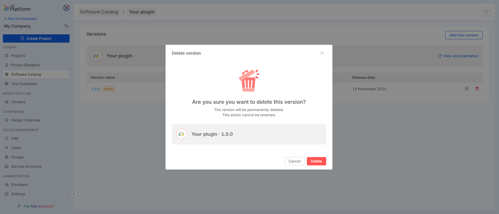

If an item is versionable, you can delete any specific version of the item by using the dedicated Delete button available for each version. This allows you to remove individual versions without affecting the entire item or other versions.

For items that are not versionable, you can delete the entire item by using the `Delete Item` button. This will permanently remove the item from the catalog.

Both actions are irreversible, so be sure to confirm your decision before proceeding with deletion.